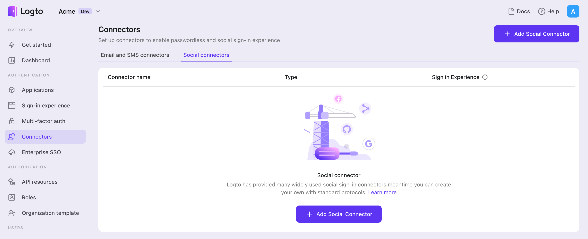

Pour activer une connexion rapide et améliorer la conversion des utilisateurs, connectez-vous avec {props.framework} en tant que fournisseur d’identité (IdP). Le connecteur social Logto vous aide à établir cette connexion en quelques minutes en permettant l'entrée de plusieurs paramètres.

Pour ajouter un connecteur social, suivez simplement ces étapes :

1. Accédez à [Console > Connectors > Social Connectors](https://cloud.logto.io/to/connectors/social).
2. Cliquez sur "Add social connector" et sélectionnez "{props.connector}".
3. Suivez le guide README et complétez les champs requis et personnalisez les paramètres.

:::note
Si vous suivez le guide du Connecteur sur place, vous pouvez passer à la section suivante.
:::
