import TabItem from '@theme/TabItem';
import Tabs from '@theme/Tabs';

import illustration from '@site/docs/authorization/assets/rbac-global-api-resources.png';
import AuthorizationRequestExample from '@site/docs/authorization/fragments/AuthorizationRequestExample';
import ClientCredentialsRequestExample from '@site/docs/authorization/fragments/ClientCredentialsRequestExample';
import TokenRequestExample from '@site/docs/authorization/fragments/TokenRequestExample';

Protéger les ressources API globales

export const resource = 'https://api.your-app.com';

Protégez les API à l’échelle du produit en utilisant le contrôle d’accès basé sur les rôles (RBAC) dans Logto. Attribuez des rôles et des permissions globales pour contrôler l’accès de tous les utilisateurs et clients à travers votre application.

## Qu’est-ce qu’une ressource API globale ? \{#what-are-global-api-resources}

Les ressources API globales sont des points de terminaison ou des services dans votre application accessibles à tous les utilisateurs, quel que soit l’organisation ou le locataire. Il s’agit généralement d’API publiques, de services cœur du produit ou de tout point de terminaison qui n’est pas limité à une organisation spécifique.

**Cas d’utilisation courants**

- API publiques ou points de terminaison partagés entre tous vos utilisateurs.
- Microservices non liés à la multi-location.
- API principales de l’application (par exemple, `/api/users`, `/api/products`) utilisées par tous les clients.

Logto vous permet de sécuriser ces API en utilisant OAuth 2.1, combiné à un contrôle d’accès flexible basé sur les rôles.

## Fonctionnement dans Logto \{#how-it-works-in-logto}

- **Les ressources API et les permissions sont enregistrées globalement :** Chaque API que vous souhaitez protéger est définie avec un indicateur de ressource unique (URI) et un ensemble de permissions (portées) qui contrôlent l’accès.
- **L’accès est contrôlé par des rôles globaux :** Vous pouvez attribuer des permissions à des rôles, qui sont ensuite attribués à des utilisateurs ou des clients.
- **Séparé des permissions au niveau de l’organisation :** Les ressources API globales n’ont pas de contexte d’organisation. Cependant, elles peuvent être utilisées en combinaison avec des rôles d’organisation pour fournir une couche de contexte supplémentaire si nécessaire. Pour protéger les API au niveau de l’organisation, voir [Protéger les ressources API au niveau de l’organisation](/authorization/organization-level-api-resources).

### Vue d’ensemble de l’implémentation \{#implementation-overview}

1. **Enregistrez votre ressource API** et définissez ses permissions dans Logto.
2. **Définissez des rôles** avec les permissions nécessaires pour accéder à l’API.
3. **Attribuez les rôles** aux utilisateurs ou clients.
4. **Utilisez les flux d’autorisation OAuth 2.0** pour obtenir des jetons d’accès pour l’API (le paramètre resource doit correspondre à l’identifiant API enregistré).
5. **Validez les jetons d’accès** dans votre API pour appliquer les permissions.

### Comprendre les indicateurs de ressource \{#understanding-resource-indicators}

Logto modélise les ressources API selon [RFC 8707 : Indicateurs de ressource pour OAuth 2.0](https://www.rfc-editor.org/rfc/rfc8707.html). Un **indicateur de ressource** est un URI qui identifie de façon unique l’API ou le service cible demandé.

**Points clés**

- Les indicateurs de ressource doivent être des URI absolus (par exemple, `https://api.example.com`)
- Pas de composant fragment ; évitez d’utiliser des chaînes de requête si possible.
- Les indicateurs de ressource permettent des jetons restreints à une audience et la prise en charge d’architectures multi-API.

**Exemple**

- Management API : `https://my-tenant.logto.app/api`
- API globale personnalisée : `https://api.yourapp.com`

### Flux d’autorisation : authentifier et sécuriser votre API \{#authorization-flow-authenticating-and-securing-your-api}

Le flux ci-dessous s’applique à la fois à l’authentification interactive des utilisateurs (navigateur / application) et aux scénarios backend machine à machine (M2M).

Veuillez noter que ce flux ne détaille pas tous les paramètres ou en-têtes requis, mais se concentre sur les étapes clés. Continuez à lire pour voir comment ce flux fonctionne en pratique.

```mermaid
sequenceDiagram
    participant Client
    participant Logto
    participant API as Ressource API

    alt Authentification utilisateur
        Client->>Logto: GET /oidc/auth
        Logto->>Logto: Redirige l’utilisateur vers la page de connexion
        Logto->>Client: Redirige avec `authorization_code`
        alt Utiliser le grant authorization_code
            Client->>Logto: POST /oidc/token avec `grant_type=authorization_code`<br/>et paramètre `resource`
        else Utiliser le grant refresh_token
            Client->>Logto: POST /oidc/token avec `grant_type=authorization_code`
            Logto->>Client: Retourne un jeton de rafraîchissement
            Client->>Logto: POST /oidc/token avec `grant_type=refresh_token`<br/>et paramètre `resource`
        end
    else Authentification client machine à machine (M2M)
        Client->>Logto: POST /oidc/token avec `grant_type=client_credentials`<br/>et paramètre `resource`
    end

    Logto->>Client: Retourne un jeton d’accès (JSON Web Token)
    Client->>API: Requête avec jeton Bearer
    API->>API: Valide le jeton d’accès

    alt Jeton valide
      API->>Client: Retourne les données de la ressource protégée
    else Jeton invalide
      API->>Client: 401 Non autorisé
    end
```

_Authentification utilisateur = navigateur / application. M2M = service backend ou script utilisant les identifiants client._

:::note
Le paramètre `resource` doit correspondre exactement à l’identifiant API (indicateur de ressource) que vous avez enregistré dans Logto.
:::

## Étapes d’implémentation \{#implementation-steps}

### Enregistrez vos ressources API \{#register-your-api-resources}

1. Allez dans <CloudLink to="/api-resources">Console → Ressources API</CloudLink>.
2. Créez une nouvelle ressource API (par exemple, `https://api.yourapp.com/org`) et définissez ses permissions (portées).

Pour toutes les étapes de configuration, voir [Définir des ressources API avec des permissions](/authorization/role-based-access-control#define-api-resources-with-permissions).

### Configurez les rôles globaux \{#set-up-global-roles}

1. Allez dans <CloudLink to="/roles">Console → Rôles</CloudLink>.
2. Créez des rôles correspondant à vos permissions API (par exemple, `read:products`, `write:products`).
3. Attribuez ces rôles aux utilisateurs ou clients qui ont besoin d’accéder à l’API.

Pour toutes les étapes de configuration, voir [Utiliser les rôles globaux](/authorization/role-based-access-control#configure-global-roles).

### Obtenez des jetons d’accès pour les ressources API globales \{#obtain-access-tokens-for-global-api-resources}

Avant d’accéder à une ressource API globale, votre client doit obtenir un jeton d’accès. Logto émet des [JSON Web Tokens (JWT)](https://auth.wiki/jwt) comme jetons d’accès pour les ressources API globales. Cela se fait généralement via le [flux d’autorisation OAuth 2.0 code](https://auth.wiki/authorization-code-flow), le [flux de jeton de rafraîchissement](https://auth.wiki/refresh-token), ou le [flux client credentials](https://auth.wiki/client-credentials-flow).

#### Flux authorization code ou refresh token \{#authorization-code-or-refresh-token-flow}

Tous les SDK officiels Logto prennent en charge l’obtention de jetons d’accès pour les ressources API globales via le flux de jeton de rafraîchissement par défaut. Une bibliothèque cliente OAuth 2.0 / OIDC standard peut également être utilisée pour implémenter ce flux.

<Tabs groupId="user-client">
<TabItem value="logto-sdk" label="Logto SDK">

Lors de l’initialisation du client Logto, ajoutez l’indicateur de ressource au paramètre `resources` (tableau), puis ajoutez les permissions souhaitées (portées) au paramètre `scopes`.

Une fois l’utilisateur authentifié, transmettez l’indicateur de ressource dans le paramètre `resource` ou un paramètre similaire lors de la demande du jeton d’accès (par exemple, en appelant `getAccessToken()`).

Pour plus de détails sur chaque SDK, voir les [Démarrages rapides](/quick-starts).

</TabItem>
<TabItem value="oauth-client" label="Bibliothèque cliente OAuth 2.0 / OIDC">

Lors de la configuration de votre client OAuth 2.0 ou de l’initialisation du flux authorization code, assurez-vous d’inclure le paramètre `resource` et les portées souhaitées dans la requête d’autorisation.

Certaines bibliothèques ne prennent pas en charge nativement le paramètre `resource`, mais permettent généralement de passer des paramètres supplémentaires dans la requête d’autorisation. Consultez la documentation de votre bibliothèque pour plus de détails.

Voici un exemple non normatif de requête d’autorisation avec les paramètres `resource` et `scope` :

<AuthorizationRequestExample resource={resource} scope="read:products write:products" />

Une fois l’utilisateur authentifié, vous recevrez un code d’autorisation. Échangez ce code contre un jeton d’accès en effectuant une requête POST vers le point de terminaison `/oidc/token` de Logto, en incluant le paramètre `resource` dans le corps de la requête.

Voici un exemple non normatif de requête de jeton utilisant le type de grant authorization_code :

<TokenRequestExample grantType="authorization_code" resource={resource} />

Vous pouvez également utiliser le type de grant `refresh_token` pour obtenir un nouveau jeton d’accès sans interaction utilisateur, tant que le paramètre `resource` est inclus dans la requête.

Voici un exemple non normatif de requête de jeton utilisant le type de grant refresh_token :

<TokenRequestExample grantType="refresh_token" resource={resource} />

</TabItem>
</Tabs>

#### Flux client credentials \{#client-credentials-flow}

Pour les scénarios machine à machine (M2M), vous pouvez utiliser le flux client credentials pour obtenir un jeton d’accès pour votre ressource API globale. En effectuant une requête POST vers le point de terminaison `/oidc/token` de Logto, vous pouvez demander un jeton d’accès en utilisant votre client ID et secret.

Deux paramètres clés doivent être inclus dans la requête :

- `resource` : L’URI indicateur de ressource de l’API à laquelle vous souhaitez accéder (par exemple, `https://api.yourapp.com`).
- `scope` : Les permissions que vous souhaitez demander pour l’API (par exemple, `read:products write:products`).

Voici un exemple non normatif de requête de jeton utilisant le type de grant client credentials :

<ClientCredentialsRequestExample
  resource="https://api.yourapp.com"
  scope="read:products write:products"
/>

### Validation des jetons d’accès JWT dans votre API \{#validating-jwt-access-tokens-in-your-api}

Les JWT émis par Logto contiennent des revendications que votre API peut utiliser pour appliquer l’autorisation.

Lorsque votre API reçoit une requête avec un jeton d’accès émis par Logto, vous devez :

- Vérifier la signature du jeton (en utilisant les JWKs de Logto).
- Confirmer que le jeton n’est pas expiré (revendication `exp`).
- Vérifier que le `iss` (émetteur) correspond à votre point de terminaison Logto.
- S’assurer que le `aud` (audience) correspond à l’identifiant de la ressource API que vous avez enregistrée (par exemple, `https://api.yourapp.com`).
- Séparer la revendication `scope` (séparée par des espaces) et vérifier les permissions requises.

Pour des guides étape par étape et spécifiques à chaque langage, voir [Comment valider les jetons d’accès](/authorization/validate-access-tokens).

### Optionnel : Gérer le changement de permission utilisateur \{#optional-handle-user-permission-change}

:::info
👷 Travail en cours. 🚧
:::

## Bonnes pratiques et conseils de sécurité \{#best-practices-and-security-tips}

- **Gardez les permissions orientées métier :** Utilisez des noms clairs correspondant à des actions réelles.
- **Gardez une expiration de jeton courte :** Réduit le risque en cas de fuite d’un jeton.
- **Limitez les portées accordées :** Donnez uniquement aux jetons les permissions réellement nécessaires.
- **Utilisez la restriction d’audience :** Vérifiez toujours la revendication `aud` pour éviter les abus.

## FAQ \{#faqs}

### Que faire si mon client ne prend pas en charge le paramètre resource ? \{#what-if-my-client-doesn-t-support-the-resource-parameter}

Définissez une ressource API par défaut dans la Console Logto. Les jetons utiliseront cette audience par défaut si aucun paramètre resource n’est spécifié dans la requête de jeton.

### Pourquoi mon API retourne-t-elle 401 Non autorisé ? \{#why-do-i-get-401-unauthorized-from-my-api}

Vérifiez les problèmes courants suivants :

- **Signature du jeton** : Vérifiez que votre backend récupère les bons JWKs depuis Logto
- **Expiration du jeton** : Assurez-vous que le jeton n’a pas expiré (revendication `exp`)
- **Audience** : Vérifiez que la revendication `aud` correspond à l’indicateur de ressource API enregistré
- **Portées requises** : Vérifiez que le jeton contient les permissions nécessaires dans la revendication `scope`

### Comment tester sans client complet ? \{#how-do-i-test-without-a-full-client}

Utilisez un [jeton d’accès personnel](/user-management/personal-access-token) pour simuler des appels authentifiés. Cela vous permet de tester vos points de terminaison API sans implémenter un flux OAuth complet dans votre application cliente.

## Pour aller plus loin \{#further-reading}

<Url href="/authorization/validate-access-tokens">Comment valider les jetons d’accès</Url>
<Url href="/use-cases/authorization/rbac-in-practice">
  RBAC en pratique : Implémenter une autorisation sécurisée pour votre application
</Url>
<Url href="/developers/custom-token-claims">Personnalisation des revendications de jeton</Url>
<Url href="https://www.rfc-editor.org/rfc/rfc8707.html">RFC 8707 : Indicateurs de ressource</Url>
