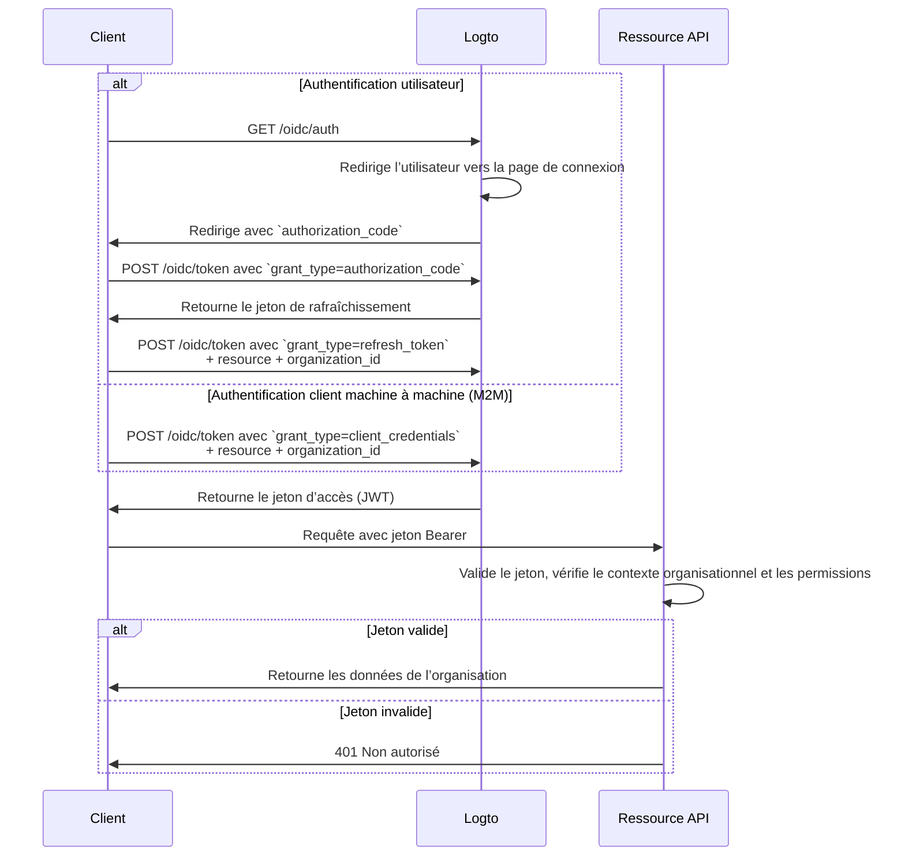

import illustration from '@site/docs/authorization/assets/rbac-organization-level-api-resources.png';
import AuthorizationRequestExample from '@site/docs/authorization/fragments/AuthorizationRequestExample';
import ClientCredentialsRequestExample from '@site/docs/authorization/fragments/ClientCredentialsRequestExample';
import TokenRequestExample from '@site/docs/authorization/fragments/TokenRequestExample';
import TabItem from '@theme/TabItem';
import Tabs from '@theme/Tabs';

import InspectOrganizationClaim from './fragments/_inspect-organization-claim.md';
import OrganizationTokenWarning from './fragments/_organization-token-warning.md';

# Protéger les ressources API au niveau de l’organisation

export const resource = 'https://api.your-app.com/organizations';

Combinez les ressources API avec le modèle d’organisation pour restreindre l’accès aux API et aux données au sein de chaque organisation, garantissant ainsi une isolation au niveau du locataire dans votre SaaS.

## Que sont les ressources API au niveau de l’organisation ? \{#what-are-organization-level-api-resources}

Les ressources API au niveau de l’organisation sont des points de terminaison ou des services dans votre application qui sont **limités à une organisation spécifique**. Ces API appliquent l’autorisation et l’accès en fonction du contexte organisationnel, garantissant que les utilisateurs ou clients n’accèdent qu’aux données et actions pertinentes pour leur organisation.

**Exemples d’utilisation**

- API pour gérer les membres, rôles ou paramètres d’une organisation (par exemple, `/organizations/{organizationId}/members`)
- Tableaux de bord, analyses ou rapports limités à l’organisation
- Points de terminaison de facturation, d’abonnement ou d’audit liés à une organisation
- Toute API où les actions et les données sont isolées par locataire

Logto vous permet de sécuriser ces API d’organisation en utilisant OAuth 2.1 et le contrôle d’accès basé sur les rôles (RBAC), tout en prenant en charge les architectures SaaS multi-locataires.

Ces permissions sont gérées via les **rôles d’organisation** définis dans le [modèle d’organisation](/authorization/organization-template). Chaque organisation utilise le même modèle, garantissant un modèle de permission cohérent pour toutes les organisations.

## Fonctionnement dans Logto \{#how-it-works-in-logto}

- **Les ressources API et les permissions sont enregistrées globalement :** Chaque ressource API est définie avec un indicateur de ressource unique (URI) et un ensemble de permissions (portées) dans Logto.
- **Rôles au niveau de l’organisation :** Les rôles d’organisation sont définis dans le modèle d’organisation. Les permissions (portées) des ressources API sont attribuées aux rôles d’organisation, qui sont ensuite attribués aux utilisateurs ou clients **au sein de chaque organisation**.
- **Autorisation contextuelle :** Lorsqu’un client demande un jeton d’accès avec à la fois une ressource API et un `organization_id`, Logto émet un jeton qui inclut à la fois le contexte organisationnel et l’audience API. Les permissions (portées) du jeton sont déterminées par les rôles d’organisation de l’utilisateur pour l’organisation spécifiée.
- **Séparation des ressources globales :** Les ressources API peuvent être accessibles avec ou sans contexte organisationnel. Le RBAC d’organisation n’est appliqué que si un `organization_id` est inclus dans la requête. Pour les API partagées entre tous les utilisateurs, voir [Protéger les ressources API globales](/authorization/global-api-resources).

### Vue d’ensemble de la mise en œuvre \{#implementation-overview}

1. **Enregistrez votre ressource API** et définissez ses permissions (portées) dans Logto.
2. **Définissez les rôles d’organisation** dans le modèle d’organisation et attribuez les permissions API pertinentes.
3. **Attribuez des rôles** aux utilisateurs ou clients au sein de chaque organisation.
4. **Demandez un jeton d’accès** pour l’API avec un `organization_id` pour inclure le contexte organisationnel.
5. **Validez les jetons d’accès** dans votre API, en appliquant à la fois le contexte organisationnel et les permissions.

### Comment Logto applique le RBAC d’organisation \{#how-logto-applies-organization-rbac}

- Si vous demandez un jeton d’accès **sans** `organization_id`, seuls les rôles / permissions globaux sont pris en compte.
- Si vous demandez un jeton d’accès **avec** un `organization_id`, Logto évalue les rôles d’organisation de l’utilisateur et leurs permissions associées pour cette organisation.
- Le JWT résultant contiendra à la fois l’audience API (`aud` revendication) et le contexte organisationnel (`organization_id` revendication), avec des portées filtrées selon celles accordées par les rôles d’organisation de l’utilisateur.

### Flux d’autorisation : authentifier et sécuriser les API avec le contexte organisationnel \{#authorization-flow-authenticating-and-securing-apis-with-organization-context}

Le flux suivant montre comment un client (web, mobile ou backend) obtient et utilise des jetons d’organisation pour accéder aux ressources API au niveau de l’organisation.

Veuillez noter que ce flux ne détaille pas tous les paramètres ou en-têtes requis, mais se concentre sur les étapes clés. Continuez à lire pour voir comment le flux fonctionne en pratique.

_Authentification utilisateur = navigateur / application. M2M = service backend ou script utilisant les identifiants client + contexte organisationnel._

## Étapes de mise en œuvre \{#implementation-steps}

### Enregistrez votre ressource API \{#register-your-api-resource}

1. Allez dans <CloudLink to="/api-resources">Console → Ressources API</CloudLink>.
2. Créez une nouvelle ressource API (par exemple, `https://api.yourapp.com/org`) et définissez ses permissions (portées).

Pour les étapes complètes de configuration, voir [Définir des ressources API avec des permissions](/authorization/role-based-access-control#define-api-resources-with-permissions).

### Configurez les rôles d’organisation \{#set-up-organization-roles}

1. Allez dans <CloudLink to="/organization-template/organization-roles">Console → Modèle d’organisation → Rôles d’organisation</CloudLink>.
2. Créez des rôles d’organisation (par exemple, `admin`, `member`) et attribuez des permissions API à chaque rôle.
3. Attribuez des rôles aux utilisateurs ou clients au sein de chaque organisation. S’ils ne sont pas encore membres, invitez-les ou ajoutez-les d’abord.

Pour les étapes complètes de configuration, voir [Utiliser les rôles d’organisation](/authorization/role-based-access-control#configure-organization-roles).

### Obtenez des jetons d’organisation pour les ressources API \{#obtain-organization-tokens-for-api-resources}

Votre client / application doit demander un jeton avec à la fois `resource` et `organization_id` pour accéder aux API au niveau de l’organisation. Logto émet des jetons d’organisation sous forme de [JSON Web Tokens (JWTs)](https://auth.wiki/jwt). Vous pouvez les obtenir en utilisant soit le [flux de jeton de rafraîchissement](https://auth.wiki/refresh-token), soit le [flux client credentials](https://auth.wiki/client-credentials-flow).

#### Flux de jeton de rafraîchissement \{#refresh-token-flow}

Presque tous les SDK officiels Logto prennent en charge l’obtention de jetons d’organisation via le flux de jeton de rafraîchissement par défaut. Une bibliothèque cliente OAuth 2.0 / OIDC standard peut également être utilisée pour implémenter ce flux.

<Tabs groupId="user-client">
<TabItem value="logto-sdk" label="Logto SDK">

Lors de l’initialisation du SDK Logto, ajoutez `urn:logto:scope:organizations` et les permissions d’organisation souhaitées (portées) au paramètre `scopes`.

Certains SDK Logto disposent d’une portée prédéfinie pour les organisations, telle que `UserScope.Organizations` dans les SDK JavaScript.

<InspectOrganizationClaim />

Lors de l’appel de `getAccessToken()`, spécifiez à la fois la ressource API (`resource`) et l’ID de l’organisation (`organizationId`) pour obtenir un jeton d’organisation.

Pour plus de détails sur chaque SDK, voir [Démarrages rapides](/quick-starts).

</TabItem>
<TabItem value="oauth-client" label="Bibliothèque cliente OAuth 2.0 / OIDC">

Lors de la configuration de votre client OAuth 2.0 ou de l’initialisation du flux d’autorisation par code, assurez-vous d’inclure les paramètres suivants :

- `resource` : Défini sur l’identifiant de la ressource API enregistrée dans Logto (par exemple, `https://api.your-app.com/organizations`).
- `scope` : Incluez la portée prédéfinie d’organisation (`urn:logto:scope:organizations`), `offline_access` (pour obtenir des jetons de rafraîchissement), et toutes les permissions API spécifiques dont vous avez besoin (par exemple, `manage:members view:analytics`).

Certaines bibliothèques peuvent ne pas prendre en charge nativement le paramètre `resource`, mais permettent généralement de passer des paramètres supplémentaires dans la requête d’autorisation. Consultez la documentation de votre bibliothèque pour plus de détails.

Voici un exemple non normatif de requête d’autorisation :

<AuthorizationRequestExample
  resource={resource}
  scope="urn:logto:scope:organizations invite:member manage:billing"
/>

Une fois l’utilisateur authentifié, vous recevrez un code d’autorisation. Utilisez ce code en effectuant une requête POST vers le point de terminaison `/oidc/token` de Logto.

Voici un exemple non normatif de requête de jeton :

<TokenRequestExample grantType="authorization_code" />

<OrganizationTokenWarning />

Vous recevrez un jeton de rafraîchissement qui pourra être utilisé pour obtenir des jetons d’organisation.

<InspectOrganizationClaim />

Enfin, utilisez le jeton de rafraîchissement pour obtenir un jeton d’organisation en effectuant une requête POST vers le point de terminaison `/oidc/token` de Logto. N’oubliez pas d’inclure :

- Le paramètre `resource` défini sur l’identifiant de la ressource API (par exemple, `https://api.yourapp.com/org`).
- Le paramètre `organization_id` défini sur l’ID de l’organisation souhaitée.
- (Optionnel) Le paramètre `scope` pour restreindre davantage les permissions dont vous avez besoin (par exemple, `manage:members view:reports`).

Voici un exemple non normatif de requête de jeton :

<TokenRequestExample
  grantType="refresh_token"
  resource={resource}
  organizationId="your-organization-id"
/>

</TabItem>
</Tabs>

#### Flux client credentials \{#client-credentials-flow}

Pour les scénarios machine à machine (M2M), vous pouvez utiliser le flux client credentials pour obtenir un jeton d’accès avec des permissions de ressource API au niveau de l’organisation. En effectuant une requête POST vers le point de terminaison `/oidc/token` de Logto avec les paramètres d’organisation, vous pouvez demander un jeton d’organisation en utilisant votre client ID et secret.

Voici les paramètres clés à inclure dans la requête :

- `resource` : L’identifiant de la ressource API (par exemple, `https://api.yourapp.com/org`).
- `organization_id` : L’ID de l’organisation pour laquelle vous souhaitez le jeton.
- `scope` : Les permissions de ressource API au niveau de l’organisation que vous souhaitez demander (par exemple, `invite:member`, `manage:billing`).

Voici un exemple non normatif de requête de jeton utilisant le type de flux client credentials :

<ClientCredentialsRequestExample
  resource="https://api.yourapp.com/org"
  organizationId="your-organization-id"
  scope="invite:member manage:billing"
/>

### Validez les jetons d’organisation \{#validate-organization-tokens}

Les jetons d’organisation émis par Logto (JWTs) contiennent des revendications que votre API peut utiliser pour appliquer le contrôle d’accès au niveau de l’organisation.

Lorsque votre application reçoit un jeton d’organisation, vous devez :

- Vérifier la signature du jeton (en utilisant les JWKs de Logto).
- Confirmer que le jeton n’est pas expiré (`exp` revendication).
- Vérifier que le `iss` (émetteur) correspond à votre point de terminaison Logto.
- S’assurer que le `aud` (audience) correspond à l’identifiant de la ressource API que vous avez enregistrée (par exemple, `https://api.yourapp.com/org`).
- Valider la revendication `organization_id` pour s’assurer que le jeton est limité à la bonne organisation.
- Séparer la revendication `scope` (séparée par des espaces) et vérifier les permissions requises.
- Si le chemin de votre API inclut l’ID de l’organisation (par exemple, `/organizations/{organizationId}/members`), assurez-vous que la revendication `organization_id` correspond au paramètre du chemin.

Pour des guides étape par étape et spécifiques à chaque langage, voir [Comment valider les jetons d’accès](/authorization/validate-access-tokens).

## Bonnes pratiques et conseils de sécurité \{#best-practices-and-security-tips}

- **Validez toujours le contexte organisationnel :** Ne vous fiez pas uniquement au jeton ; vérifiez la revendication `organization_id` pour chaque appel d’API limité à l’organisation.
- **Utilisez les restrictions d’audience :** Vérifiez toujours la revendication `aud` pour vous assurer que le jeton est destiné à la bonne organisation.
- **Gardez les permissions orientées métier :** Utilisez des noms clairs correspondant à de vraies actions ; n’accordez que ce qui est nécessaire pour chaque rôle d’organisation.
- **Séparez les permissions API et non-API** lorsque c’est possible (mais les deux peuvent être dans un même rôle).
- **Gardez la durée de vie des jetons courte :** Réduit le risque en cas de fuite d’un jeton.
- **Révisez régulièrement votre modèle d’organisation :** Mettez à jour les rôles et permissions au fur et à mesure de l’évolution de votre produit.

## FAQ \{#faqs}

### Que se passe-t-il si je n’inclus pas `organization_id` dans ma requête de jeton ? \{#what-if-i-don-t-include-organization-id-in-my-token-request}

Seuls les rôles / permissions globaux seront évalués. Le RBAC d’organisation ne sera pas appliqué.

### Puis-je mélanger des permissions d’organisation et non-organisation dans un même rôle ? \{#can-i-mix-organization-and-non-organization-permissions-in-a-single-role}

Non, les permissions d’organisation (y compris les permissions API au niveau de l’organisation) sont définies par le modèle d’organisation et ne peuvent pas être mélangées avec des permissions API globales. Cependant, vous pouvez créer des rôles qui incluent à la fois des permissions d’organisation et des permissions API au niveau de l’organisation.

## Pour aller plus loin \{#further-reading}

<Url href="/authorization/validate-access-tokens">Comment valider les jetons d’accès</Url>
<Url href="/developers/custom-token-claims">Personnalisation des revendications de jeton</Url>
<Url href="/use-cases/multi-tenancy/build-multi-tenant-saas-application">
  Cas d’usage : Construire une application SaaS multi-locataire
</Url>
<Url href="https://www.rfc-editor.org/rfc/rfc8707.html">RFC 8707 : Indicateurs de ressource</Url>
