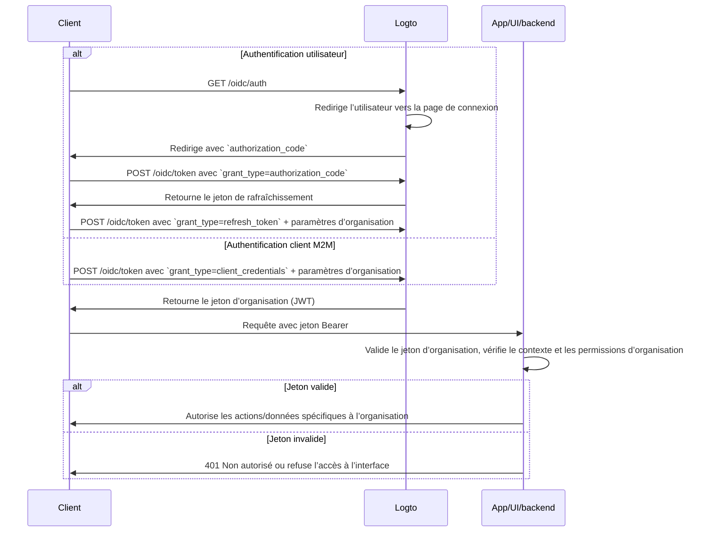

import TabItem from '@theme/TabItem';
import Tabs from '@theme/Tabs';

import illustration from '@site/docs/authorization/assets/rbac-organization-permissions.png';
import AuthorizationRequestExample from '@site/docs/authorization/fragments/AuthorizationRequestExample';
import ClientCredentialsRequestExample from '@site/docs/authorization/fragments/ClientCredentialsRequestExample';
import TokenRequestExample from '@site/docs/authorization/fragments/TokenRequestExample';
import InspectOrganizationClaim from './fragments/_inspect-organization-claim.md';
import OrganizationTokenWarning from './fragments/_organization-token-warning.md';

# Protéger les permissions d’organisation (hors API)

Utilisez le modèle d’organisation pour gérer et appliquer les rôles et permissions au niveau de l’organisation dans Logto, en contrôlant l’accès aux fonctionnalités et flux de travail internes à une organisation.

## Que sont les permissions d’organisation (hors API) ? \{#what-are-organization-non-api-permissions}

Les permissions d’organisation (hors API) contrôlent ce que les utilisateurs peuvent faire **dans le contexte d’une organisation**, mais ne sont **pas appliquées au niveau de l’API**. Elles régissent l’accès aux fonctionnalités de l’application, aux éléments d’interface, aux flux de travail ou aux actions métier, plutôt qu’aux API backend.

**Cas d’usage typiques**

- Inviter ou gérer des membres au sein d’une organisation
- Attribuer ou modifier des rôles d’organisation
- Gérer la facturation, les paramètres ou les fonctions administratives d’une organisation
- Accès à des tableaux de bord, des analyses ou des outils internes sans points de terminaison API

Logto vous permet de sécuriser ces permissions d’organisation à l’aide d’OAuth 2.1 et du contrôle d’accès basé sur les rôles (RBAC), tout en prenant en charge les architectures SaaS multi-locataires.

Ces permissions sont gérées via les **rôles d’organisation** définis dans le [modèle d’organisation](/authorization/organization-template). Chaque organisation utilise le même modèle, garantissant une cohérence du modèle de permissions entre toutes les organisations.

## Fonctionnement dans Logto \{#how-it-works-in-logto}

- **Contrôle d’accès basé sur les rôles au niveau organisation** : Les rôles et permissions sont définis dans le modèle d’organisation. Lorsqu’un utilisateur rejoint une organisation, un ou plusieurs rôles lui sont attribués, lui accordant des permissions spécifiques.
- **Application hors API** : Les permissions sont vérifiées et appliquées dans l’interface de votre application, les flux de travail ou la logique backend, pas nécessairement par une passerelle API.
- **Séparation de la protection API** : Les permissions d’organisation (hors API) sont distinctes des permissions des ressources API. Vous pouvez combiner les deux pour des scénarios avancés.

  

### Vue d’ensemble de l’implémentation \{#implementation-overview}

1. **Définissez les permissions d’organisation** dans Logto sous le modèle d’organisation.
2. **Créez des rôles d’organisation** qui regroupent les permissions nécessaires pour vos actions spécifiques à l’organisation.
3. **Attribuez les rôles** aux utilisateurs ou clients dans chaque organisation.
4. **Obtenez un jeton d’organisation (JWT)** pour l’organisation courante en utilisant le jeton de rafraîchissement ou le flux client credentials.
5. **Validez les jetons d’accès** dans l’interface ou le backend de votre application pour appliquer les permissions d’organisation.

### Flux d’autorisation : authentifier et sécuriser les permissions d’organisation \{#authorization-flow-authenticating-and-securing-organization-permissions}

Le flux suivant montre comment un client (web, mobile ou backend) obtient et utilise des jetons d’organisation pour l’application des permissions hors API.

Veuillez noter que ce flux ne détaille pas tous les paramètres ou en-têtes requis, mais se concentre sur les étapes clés. Continuez la lecture pour voir comment ce flux fonctionne en pratique.

_Authentification utilisateur = navigateur/application. M2M = service backend ou script utilisant client credentials + contexte d’organisation._

## Étapes d’implémentation \{#implementation-steps}

### Enregistrer les permissions d’organisation \{#register-organization-permissions}

1. Rendez-vous sur <CloudLink to="/organization-template/organization-permissions">Console → Modèle d’organisation → Permissions d’organisation</CloudLink>.
2. Définissez les permissions d’organisation nécessaires (ex : `invite:member`, `manage:billing`, `view:analytics`).

Pour la configuration complète, voir [Définir les permissions d’organisation](/authorization/role-based-access-control#define-organization-permissions).

### Configurer les rôles d’organisation \{#set-up-organization-roles}

1. Rendez-vous sur <CloudLink to="/organization-template/organization-roles">Console → Modèle d’organisation → Rôles d’organisation</CloudLink>.
2. Créez des rôles regroupant les permissions d’organisation définies précédemment (ex : `admin`, `member`, `billing`).
3. Attribuez ces rôles aux utilisateurs ou clients dans chaque organisation.

Pour la configuration complète, voir [Utiliser les rôles d’organisation](/authorization/role-based-access-control#configure-organization-roles).

### Obtenir des jetons d’organisation (hors API) \{#obtain-organization-tokens-non-api}

Votre client/application doit obtenir un jeton d’organisation (hors API) pour accéder aux permissions d’organisation. Logto émet des jetons d’organisation sous forme de [JSON Web Tokens (JWTs)](https://auth.wiki/jwt). Vous pouvez les obtenir via le [flux de jeton de rafraîchissement](https://auth.wiki/refresh-token) ou le [flux client credentials](https://auth.wiki/client-credentials-flow).

#### Flux de jeton de rafraîchissement \{#refresh-token-flow}

Presque tous les SDK officiels Logto prennent en charge l’obtention de jetons d’organisation via le flux de jeton de rafraîchissement. Une bibliothèque cliente OAuth 2.0 / OIDC standard peut également être utilisée pour ce flux.

<Tabs groupId="user-client">
<TabItem value="logto-sdk" label="Logto SDK">

Lors de l’initialisation du SDK Logto, ajoutez `urn:logto:scope:organizations` et les permissions d’organisation souhaitées (portées) au paramètre `scopes`.

Certains SDK Logto disposent d’une portée prédéfinie pour les organisations, telle que `UserScope.Organizations` dans les SDK JavaScript.

<InspectOrganizationClaim />

Utilisez `getOrganizationToken` ou une méthode similaire (comme `getAccessToken` avec un ID d’organisation) pour demander un jeton d’organisation pour une organisation spécifique.

Pour plus de détails sur chaque SDK, voir [Démarrages rapides](/quick-starts).

</TabItem>
<TabItem value="oauth-client" label="OAuth 2.0 / OIDC client library">

Lors de la configuration de votre client OAuth 2.0 ou de l’initialisation du flux d’autorisation, assurez-vous d’inclure les paramètres suivants :

- `resource` : Définir sur `urn:logto:resource:organizations` pour indiquer que vous souhaitez un jeton d’organisation.
- `scope` : Inclure la portée prédéfinie d’organisation (`urn:logto:scope:organizations`), `offline_access` (pour obtenir des jetons de rafraîchissement) et toute permission d’organisation spécifique nécessaire (ex : `invite:member`, `manage:billing`).

Certaines bibliothèques ne prennent pas en charge le paramètre `resource` nativement, mais permettent généralement de passer des paramètres supplémentaires dans la requête d’autorisation. Consultez la documentation de votre bibliothèque pour plus de détails.

Voici un exemple non normatif de requête d’autorisation :

<AuthorizationRequestExample
  scope="urn:logto:scope:organizations invite:member manage:billing"
  resource="urn:logto:resource:organizations"
/>

Une fois l’utilisateur authentifié, vous recevrez un code d’autorisation. Utilisez ce code en effectuant une requête POST vers le point de terminaison `/oidc/token` de Logto.

Voici un exemple non normatif de requête de jeton :

<TokenRequestExample grantType="authorization_code" />

<OrganizationTokenWarning />

Vous recevrez un jeton de rafraîchissement qui pourra être utilisé pour obtenir des jetons d’organisation.

<InspectOrganizationClaim />

Enfin, utilisez le jeton de rafraîchissement pour obtenir un jeton d’organisation en effectuant une requête POST vers le point de terminaison `/oidc/token` de Logto. N’oubliez pas d’inclure :

- Le paramètre `organization_id` défini sur l’ID de l’organisation souhaitée.
- (Optionnel) Le paramètre `scope` pour restreindre davantage les permissions nécessaires (ex : `manage:members view:reports`).

Voici un exemple non normatif de requête de jeton :

<TokenRequestExample grantType="refresh_token" organizationId="your-organization-id" />

</TabItem>
</Tabs>

#### Flux client credentials \{#client-credentials-flow}

Pour les scénarios machine à machine (M2M), vous pouvez utiliser le flux client credentials pour obtenir un jeton d’accès aux permissions d’organisation. En effectuant une requête POST vers le point de terminaison `/oidc/token` de Logto avec les paramètres d’organisation, vous pouvez demander un jeton d’organisation à l’aide de votre client ID et secret.

Voici les paramètres clés à inclure dans la requête :

- `organization_id` : L’ID de l’organisation pour laquelle vous souhaitez le jeton.
- `scope` : Les permissions d’organisation à demander (ex : `invite:member`, `manage:billing`).

Voici un exemple non normatif de requête de jeton utilisant le type de flux client credentials :

<ClientCredentialsRequestExample
  organizationId="your-organization-id"
  scope="invite:member manage:billing"
/>

### Valider les jetons d’organisation \{#validate-organization-tokens}

Les jetons d’organisation émis par Logto (JWTs) contiennent des revendications que votre application / interface / backend peut utiliser pour appliquer le contrôle d’accès au niveau organisation.

Lorsque votre application reçoit un jeton d’organisation, vous devez :

- Vérifier la signature du jeton (en utilisant les JWKs de Logto).
- Confirmer que le jeton n’est pas expiré (revendication `exp`).
- Vérifier que l’`iss` (émetteur) correspond à votre point de terminaison Logto.
- S’assurer que l’`aud` (audience) correspond à l’identifiant formaté de l’organisation (ex : `urn:logto:organization:{organization_id}`).
- Découper la revendication `scope` (séparée par des espaces) et vérifier les permissions requises.

Pour des guides détaillés et spécifiques à chaque langage, voir [Comment valider les jetons d’accès](/authorization/validate-access-tokens).

## Bonnes pratiques et conseils de sécurité \{#best-practices-and-security-tips}

- **Ne vous fiez jamais uniquement à l’interface** : Validez toujours les permissions côté backend pour les actions critiques.
- **Utilisez les restrictions d’audience** : Vérifiez toujours la revendication `aud` pour vous assurer que le jeton est destiné à la bonne organisation.
- **Gardez les permissions orientées métier** : Utilisez des noms clairs correspondant à de vraies actions ; n’accordez que ce qui est nécessaire pour chaque rôle d’organisation.
- **Séparez les permissions API et hors API** autant que possible (mais les deux peuvent être dans un même rôle).
- **Révisez régulièrement le modèle d’organisation** à mesure que votre produit évolue.

## FAQ \{#faqs}

### Puis-je mélanger des permissions d’organisation et hors organisation dans un même rôle ? \{#can-i-mix-organization-and-non-organization-permissions-in-a-single-role}

Non, les permissions d’organisation (y compris les permissions API au niveau organisation) sont définies par le modèle d’organisation et ne peuvent pas être mélangées avec des permissions API globales. Cependant, vous pouvez créer des rôles incluant à la fois des permissions d’organisation et des permissions API au niveau organisation.

### Où dois-je appliquer les permissions hors API ? \{#where-should-i-enforce-non-api-permissions}

Vérifiez les permissions hors API à la fois dans l’interface (pour le contrôle d’accès aux fonctionnalités) et dans votre logique côté serveur pour les actions sensibles.

## Pour aller plus loin \{#further-reading}

<Url href="/authorization/validate-access-tokens">Comment valider les jetons d’accès</Url>
<Url href="/developers/custom-token-claims">Personnaliser les revendications de jeton</Url>
<Url href="/use-cases/multi-tenancy/build-multi-tenant-saas-application">
  Cas d’usage : Construire une application SaaS multi-locataires
</Url>
