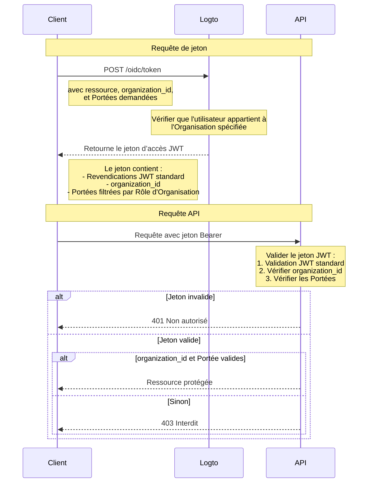

# Protéger la ressource API avec le modèle d'organisation

En plus de [Protéger votre API](/authorization/api-resources/protect-your-api) qui sécurise les ressources en s'assurant qu'un JWT valide est présent, les rôles d'Organisation peuvent également être appliqués pour filtrer les Portées. Dans cet article, nous nous concentrerons sur la façon dont le Rôle d'Organisation affecte la délégation et la validation des Portées dans votre flux d'Authentification.



## Le paramètre supplémentaire `organization_id` \{#the-additional-organization_id-parameter}

En plus de la requête de jeton d’accès normale, dans le diagramme, nous ajoutons un paramètre supplémentaire `organization_id`, cela indique à Logto de restreindre les Portées aux Rôles d'une Organisation spécifique.

## Configuration du client \{#client-setup}

Si vous utilisez le SDK de Logto, vous pouvez ajouter `organization_id` comme deuxième paramètre de la méthode `getAccessToken`.

```tsx
const accessToken = await logto.getAccessToken('https://my-resource.com/api', 'org_1');

// Ou obtenir directement les Revendications
const accessTokenClaims = await logto.getAccessTokenClaims('https://my-resource.com/api', 'org_1');
console.log(accessTokenClaims.organization_id); // 'org_1'
console.log(accessTokenClaims.aud); // 'https://my-resource.com/api'
```

Ensuite, seules les Portées héritées des Rôles de cette Organisation seront incluses dans le jeton d’accès, ainsi qu'une Revendication supplémentaire `organization_id`.

## Validation du serveur API \{#api-server-validation}

En plus de la validation normale du jeton d’accès JWT, vous devrez ajouter un niveau supplémentaire pour vérifier si `organization_id` est présent et valide.
