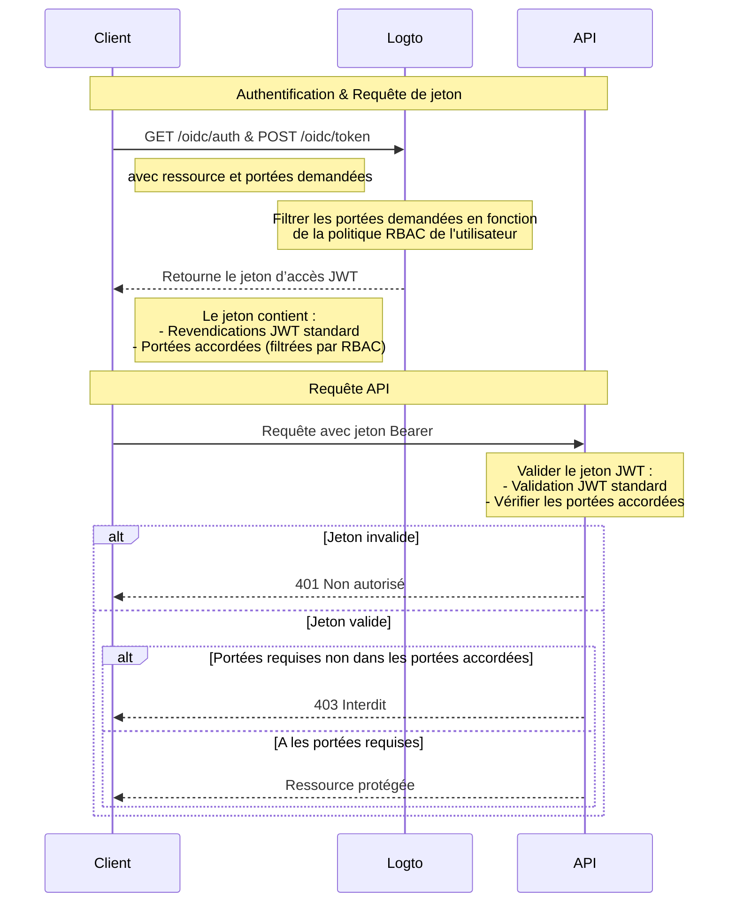

# Protéger les ressources API avec RBAC

En plus de [Protéger votre API](/authorization/api-resources/protect-your-api) qui sécurise les ressources en s'assurant qu'un JWT valide est présent, le contrôle d’accès basé sur les rôles (RBAC) peut également être appliqué.

Dans cet article, nous nous concentrerons sur la manière dont le RBAC affecte la délégation et la validation des portées dans votre flux d'authentification.

## Diagramme de flux d'autorisation



Comme vous pouvez le voir sur le diagramme, la principale différence par rapport à la protection API de base est la gestion des portées. Au lieu d'accorder directement toutes les portées demandées, Logto les filtre désormais en fonction de la politique RBAC de l'utilisateur. Le jeton JWT ne contiendra que les portées que l'utilisateur a obtenues grâce à ses rôles. Côté API, après avoir validé l'authenticité du jeton, il y a une vérification supplémentaire pour s'assurer que le jeton contient les portées requises pour la ressource demandée.

## Optionnel : Gérer le changement de permissions utilisateur

Les permissions utilisateur peuvent être modifiées pendant une session - par exemple, de nouveaux rôles peuvent leur être attribués ou les permissions de rôle existantes peuvent être modifiées. Dans ces scénarios, il peut être nécessaire de détecter ces changements et de mettre à jour l'interface utilisateur de l'application.

Que se passe-t-il lorsque les permissions d'un utilisateur changent ? Il y a deux cas.

### Aucune nouvelle permission introduite dans le système

Les jetons d’accès actuels resteront valides jusqu'à leur expiration, même après que les permissions d'un utilisateur aient été modifiées. Cependant, les nouvelles permissions seront reflétées dans les jetons d’accès suivants, et toutes les permissions révoquées seront omises.

Voici quelques **actions recommandées** :

**Option 1 : Utiliser des temps d'expiration de jeton d’accès courts**

Les jetons d’accès de courte durée garantissent des mises à jour plus fréquentes des permissions utilisateur. Configurez les paramètres d'expiration des jetons dans les paramètres de [Ressource API](/authorization/api-resources/#logto-api-resource-schema) de la Console. L'inconvénient est que cela augmentera votre utilisation de jetons.

**Option 2 : Vérifier dynamiquement les permissions**

Appelez périodiquement les points de terminaison de [Logto Management API](/integrate-logto/interact-with-management-api) (par exemple, SWR) ou utilisez des techniques telles que WebSocket pour implémenter des connexions de longue durée afin de récupérer dynamiquement les permissions utilisateur. Lors de la détection de changements, effacez le jeton d’accès existant et les nouveaux jetons émis refléteront automatiquement les changements de permissions. - API : User-role - API : Role-permission

    Lorsqu'un changement de permission est détecté, effacez d'abord le jeton d’accès du stockage, puis appelez la méthode SDK `getAccessToken()` pour en acquérir un nouveau. Le nouveau jeton d’accès émis devrait refléter les changements de permissions.

### Nouvelle permission introduite dans le système et attribuée à un utilisateur

Cela se produit lorsque de nouvelles permissions sont introduites dans votre système. Dans ce cas, vous devrez d'abord inclure les nouvelles portées de permission introduites lors de l'initialisation du client Logto. Par exemple :

```tsx
new LogtoClient({
  appId: 'your-app-id',
  redirectUrl: 'your-redirect-url',
  resources: ['your-api-resource'],
  scopes: [
    // ... vos portées de permission existantes,
    'new-scope',
  ],
});
```

Deuxièmement, chacune de vos applications clientes doit re-consentir ou reconnecter les utilisateurs afin de recevoir le changement de permission. Ensuite, la nouvelle portée de permission sera reflétée dans les nouveaux jetons d’accès.

Exemple de code pour re-consentir :

```tsx
signIn({ redirectUrl: 'your-redirect-url', prompt: 'consent' });
```

## Ressources connexes

<Url href="https://blog.logto.io/logto-x-cloudflare-workers">
  Logto x Cloudflare Workers : Comment sécuriser vos workers contre l'accès public ?
</Url>

<Url href="https://blog.logto.io/secure-api-for-machine-to-machine">
  Sécurisez vos ressources API pour la communication machine à machine
</Url>
