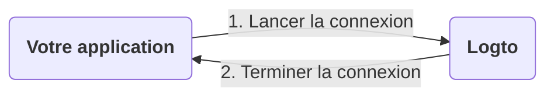
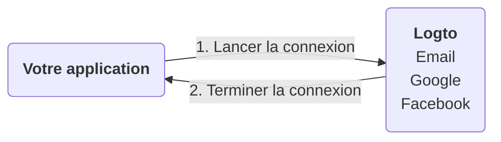
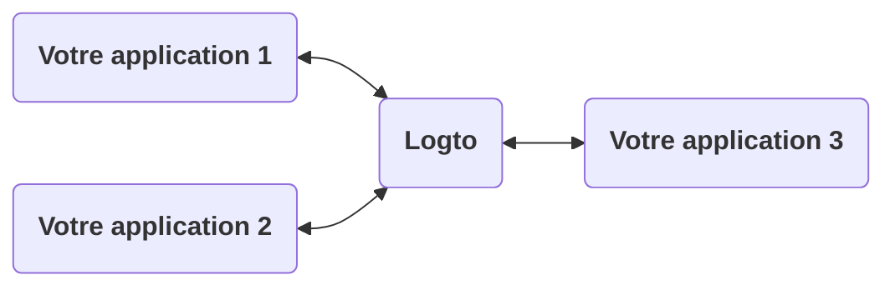
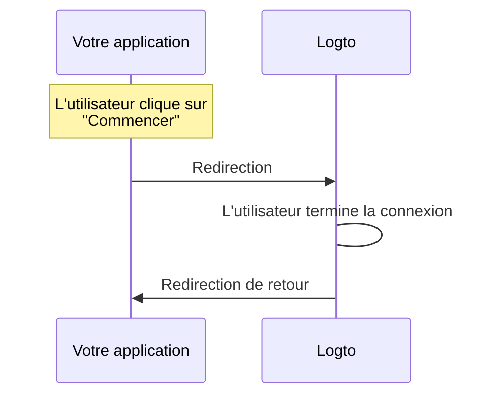
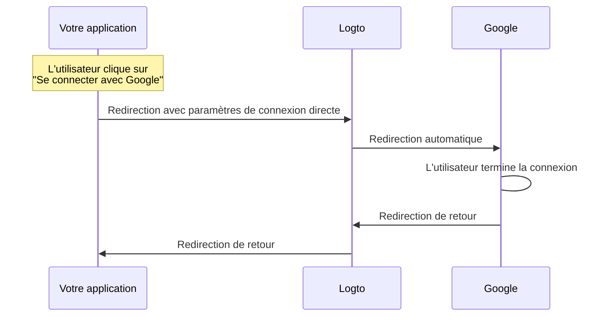

# Expérience de connexion expliquée

Cette page explique l'expérience de connexion dans Logto et pourquoi elle est conçue de cette manière.

## Introduction

L'expérience de connexion est le processus d'authentification des utilisateurs dans Logto. Le processus peut être simplifié comme suit :



1. Votre application lance la méthode de connexion.
2. L'utilisateur est redirigé vers la page de connexion de Logto. Pour les applications natives, le navigateur système est ouvert.
3. L'utilisateur se connecte et est redirigé vers votre application (configurée comme l' "URI de redirection" dans Logto).

Bien que le processus soit simple, la partie redirection peut parfois sembler excessive. Cependant, elle peut être bénéfique et sécurisée de plusieurs manières. Nous expliquerons les raisons dans les sections suivantes.

## Pourquoi rediriger ?

### Flexibilité

La redirection vous permet de découpler le processus d'authentification de votre application. À mesure que votre entreprise se développe, vous pouvez toujours conserver le même processus d'authentification sans modifier votre application. Par exemple, vous pouvez ajouter une authentification multi-facteurs (MFA) ou changer les méthodes de connexion sans toucher à votre application.



### Support multi-applications

Si vous avez plusieurs applications, vos utilisateurs peuvent se connecter une fois et accéder à toutes les applications sans se reconnecter. Cela est particulièrement utile pour les entreprises SaaS ou les entreprises avec plusieurs services.



### Applications natives

Pour les applications natives, la redirection vers le navigateur système est un moyen sécurisé d'authentifier les utilisateurs et dispose d'un support intégré pour iOS et Android.

- **iOS** : Apple propose [ASWebAuthenticationSession](https://developer.apple.com/documentation/authenticationservices/aswebauthenticationsession) pour une authentification sécurisée.
- **Android** : Google fournit [Custom Tabs](https://developer.chrome.com/docs/android/custom-tabs) pour une expérience fluide.

### Sécurité

Sous le capot, Logto est un fournisseur [OpenID Connect (OIDC)](https://openid.net/specs/openid-connect-core-1_0.html). OIDC est une norme largement adoptée pour l'authentification des utilisateurs.

Logto applique des mesures de sécurité strictes, telles que [PKCE](https://tools.ietf.org/html/rfc7636), et désactive les flux non sécurisés comme le flux implicite. La redirection est un moyen sécurisé d'authentifier les utilisateurs et peut prévenir de nombreuses attaques courantes.

## Que faire si je dois afficher certains composants de connexion dans mon application ?

Parfois, votre équipe peut vouloir afficher certains composants de connexion dans l'application, comme un bouton "Se connecter avec Google". Cela peut être réalisé en utilisant la fonctionnalité "Connexion directe" dans Logto.

### Comment ça fonctionne ?

Disons que vous avez deux boutons d'appel à l'action dans votre application : "Commencer" et "Se connecter avec Google". Ces boutons sont conçus pour :

- "Commencer" : Rediriger vers la page de connexion normale.
- "Se connecter avec Google" : Rediriger vers la page de connexion Google.

Les deux actions doivent compléter le processus de connexion et rediriger vers votre application.

---

#### Processus de clic sur "Commencer"

Dans ce cas, l'expérience de connexion est la même que par défaut. L'utilisateur est redirigé vers la page de connexion de Logto, puis vers votre application.



:::note
Si vous avez configuré des méthodes de connexion sociale (par exemple, Google, Facebook) dans Logto, l'utilisateur peut être redirigé vers la page de connexion correspondante. Dans l'illustration, nous montrons uniquement le flux général pour simplifier.
:::

---

#### Processus de clic sur "Se connecter avec Google"

Dans ce cas, l'utilisateur est redirigé automatiquement vers la page de connexion Google sans interagir avec la page de connexion de Logto. La vitesse de cette redirection automatique est presque instantanée, de sorte que les utilisateurs peuvent ne pas remarquer la redirection.



---

En résumé, la fonctionnalité de connexion directe est un moyen d'automatiser certaines interactions dans l'expérience de connexion sans changer le niveau de sécurité.

### Utiliser la connexion directe dans votre application

Pour utiliser la connexion directe, vous devez passer le paramètre `direct_sign_in` lors de l'appel de la méthode de connexion. La valeur doit être composée d'un certain format que Logto reconnaît. Par exemple, pour se connecter avec Google, la valeur doit être `social:google`.

Dans certains SDK officiels de Logto, il existe une option dédiée pour la connexion directe. Voici un exemple d'utilisation de la connexion directe dans le SDK JavaScript `@logto/client` :

```ts
client.signIn({
  redirectUri: 'https://some-redirect-uri',
  directSignIn: { method: 'social', target: 'google' },
});
```

Pour plus de détails, veuillez vous référer à [Connexion directe](/end-user-flows/authentication-parameters/direct-sign-in).

:::info
Nous déployons progressivement cette fonctionnalité dans tous les SDK officiels de Logto. Si vous ne la voyez pas dans votre SDK, n'hésitez pas à nous contacter.
:::

## J'ai besoin que mes utilisateurs saisissent leurs identifiants dans mon application

Si vous avez besoin que vos utilisateurs saisissent leurs identifiants (comme l'email et le mot de passe) directement dans votre application, plutôt que d'être redirigés vers Logto, nous ne pouvons pas vous aider pour le moment. Historiquement, il existait une subvention "Resource Owner Password Credentials", mais elle est maintenant considérée comme non sécurisée et a été [formellement dépréciée dans OAuth 2.1](https://datatracker.ietf.org/doc/html/draft-ietf-oauth-security-topics#name-resource-owner-password-cre).

Pour en savoir plus sur les risques de sécurité du type de subvention ROPC, consultez notre article de blog [Pourquoi vous devriez déprécier le type de subvention ROPC](https://blog.logto.io/deprecated-ropc-grant-type/).

## Ressources connexes :

<Url href="https://blog.logto.io/oauth-2-1/">OAuth 2.1 est là : Ce que vous devez savoir</Url>
