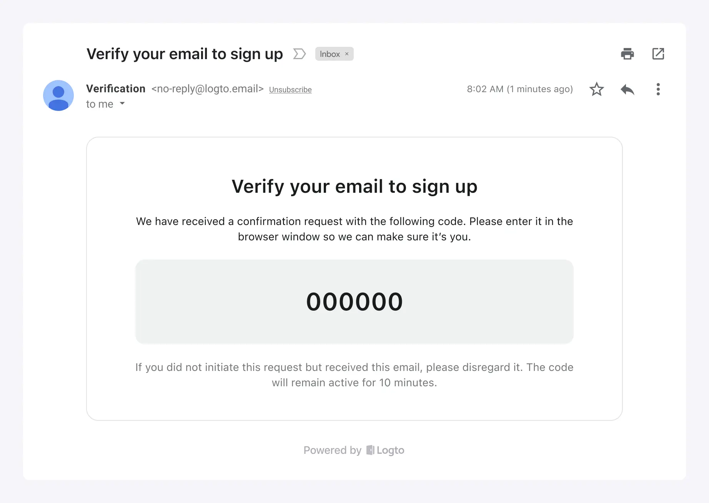

Logto fournit des services d'email intégrés pour votre commodité dans les scénarios suivants :

1. Explorer rapidement ou tester l'Authentification (Authentication) par email de Logto.
2. L'utiliser directement pour vos produits en ligne. Il est principalement destiné aux nouvelles startups qui sont à l'aise d'utiliser `logto.email` comme domaine d'email de l'expéditeur.

Les caractéristiques du service d'email de Logto :

- **Gratuit à utiliser :** Il est complètement gratuit sans aucune limite d'utilisation quotidienne des emails, ce qui vous permet d'économiser des coûts.
- **Sans effort :** Aucune configuration avec des fournisseurs de services d'email tiers n'est requise. Il suffit de personnaliser les informations de base de la marque pour votre modèle d'email. Si vous n'avez pas encore vos propres informations de marque, vous pouvez choisir de commencer à l'utiliser en quelques clics.
- **Livraison assurée :** Basé sur le service d'email de Logto, vous pouvez obtenir un service stable et une livraison d'email fiable, garantissant que les utilisateurs peuvent accéder à votre produit.

Cependant, bien que pratique, il y a certaines limitations à prendre en compte — vous ne pouvez pas personnaliser l'adresse email de l'expéditeur, le domaine ou le contenu spécifique de l'email.

En fonction de l'évolution de vos besoins commerciaux, vous pouvez choisir d'utiliser d'autres fournisseurs de services d'email plus tard. Nous offrons une gamme de connecteurs de services d'email prêts à l'emploi, et nous supportons également SMTP et WebHook pour l'envoi d'emails, vous trouverez donc toujours une solution qui vous convient.

:::note
Le service d'email gratuit intégré de Logto est actuellement disponible uniquement pour les utilisateurs Cloud. Pour les utilisateurs du service open-source, vous avez la flexibilité de configurer votre fournisseur de services d'email pour la connexion par email.
:::

## Étapes de configuration

Suivez ces étapes pour configurer le service d'email de Logto :

1. Allez sur <CloudLink to="/connectors/passwordless">Connecteur > Connecteurs Email et SMS</CloudLink>.
2. Pour ajouter un nouveau connecteur Email, cliquez sur le bouton "**Configurer**" et sélectionnez le connecteur "**Service d'email Logto**".
3. Une fois le connecteur "Service d'email Logto" créé avec succès, vous pouvez personnaliser les informations de base de la marque affichées dans les modèles d'email.
4. Après avoir effectué ces modifications, n'oubliez pas d'envoyer un modèle d'email de test à votre adresse email avant de sauvegarder les modifications.

Options de personnalisation :

- **Email de l'expéditeur :** L'email de l'expéditeur est défini sur `no-reply@logto.email` et ne peut pas être modifié.
- **Nom de l'expéditeur :** Définissez le nom de votre marque comme nom de l'expéditeur pour assurer la reconnaissance par l'utilisateur.
- **Informations sur l'entreprise :** Affichez le nom de votre entreprise, l'adresse ou le code postal pour renforcer la confiance des utilisateurs et répondre aux exigences de conformité. _Notez que les URLs ne sont pas autorisées._
- **Logo de l'application :** Téléchargez le logo de votre marque d'application afin que la valeur de la marque de l'application puisse être mise en avant dans les emails reçus par les utilisateurs.

## Modèles d'email unifiés

Le service d'email de Logto utilise des modèles d'email unifiés adaptés à des scénarios d'Authentification (Authentication) spécifiques :

| Utilisation                            | Scénario                                                                                                                                                                                                                                                                                                                                                                                                                                                                                                          |
| -------------------------------------- | ----------------------------------------------------------------------------------------------------------------------------------------------------------------------------------------------------------------------------------------------------------------------------------------------------------------------------------------------------------------------------------------------------------------------------------------------------------------------------------------------------------------- |
| Inscription                            | Les utilisateurs créent un compte en utilisant leur email et le vérifient en entrant un code de vérification envoyé par Logto à leur email.                                                                                                                                                                                                                                                                                                                                                                       |
| Connexion                              | Les utilisateurs se connectent en utilisant leur email et vérifient en entrant un code de vérification au lieu de saisir un mot de passe.                                                                                                                                                                                                                                                                                                                                                                         |
| Mot de passe oublié                    | Si les utilisateurs oublient leur mot de passe lors de la connexion, ils peuvent choisir de vérifier leur identité en utilisant l'email qu'ils ont déjà vérifié avec Logto.                                                                                                                                                                                                                                                                                                                                       |
| Générique                              | Ce modèle peut être utilisé comme option de secours générale pour divers scénarios, y compris les tests de configuration de connecteurs, etc.                                                                                                                                                                                                                                                                                                                                                                     |
| Invitation à l'organisation            | Utilisez ce modèle pour envoyer aux utilisateurs un lien d'invitation pour rejoindre l'Organisation (Organization).                                                                                                                                                                                                                                                                                                                                                                                               |
|                                        |                                                                                                                                                                                                                                                                                                                                                                                                                                                                                                                   |
| Validation des permissions utilisateur | Lors de l'utilisation de l'application, il peut y avoir certaines opérations à haut risque ou des opérations avec un niveau de risque relativement élevé qui nécessitent une vérification utilisateur supplémentaire, telles que les virements bancaires, la suppression de ressources en cours d'utilisation et l'annulation d'abonnements. Le modèle `UserPermissionValidation` peut être utilisé pour définir le contenu du code de vérification par email que les utilisateurs reçoivent dans ces situations. |
| Lier un nouvel identifiant             | Lorsqu'un utilisateur modifie son profil, il peut lier une adresse email à son compte actuel. Dans ce cas, le modèle `BindNewIdentifier` peut être utilisé pour personnaliser le contenu de l'email de vérification.                                                                                                                                                                                                                                                                                              |

Un exemple de modèles d'email pour le type d'utilisation "Inscription" avec des informations de marque personnalisées :

Si aucune information de marque personnalisée n'est fournie, le modèle d'email peut toujours être utilisé avec un affichage et une mise en page par défaut :

## FAQ

Est-il possible d'ajouter du CSS ou HTML personnalisé au service d'email de Logto ?

Le service d'email intégré de Logto ne supporte pas le CSS ou HTML personnalisé. Vous ne pouvez modifier que les éléments de marque génériques. Cette restriction est en place pour maintenir la stabilité du service d'email intégré, car tous les locataires partagent la même adresse IP et adresse de l'expéditeur. Pour plus de détails, veuillez vous référer à "[Facteurs pour améliorer la livraison des emails](https://blog.logto.io/verification-email-delivery#factors-to-improve-email-delivery)".

Pour personnaliser les modèles d'email, nous recommandons d'utiliser un autre connecteur d'email, tel que AWS Direct Mail, SendGrid, Mailgun, Postmark, ou SMTP.

