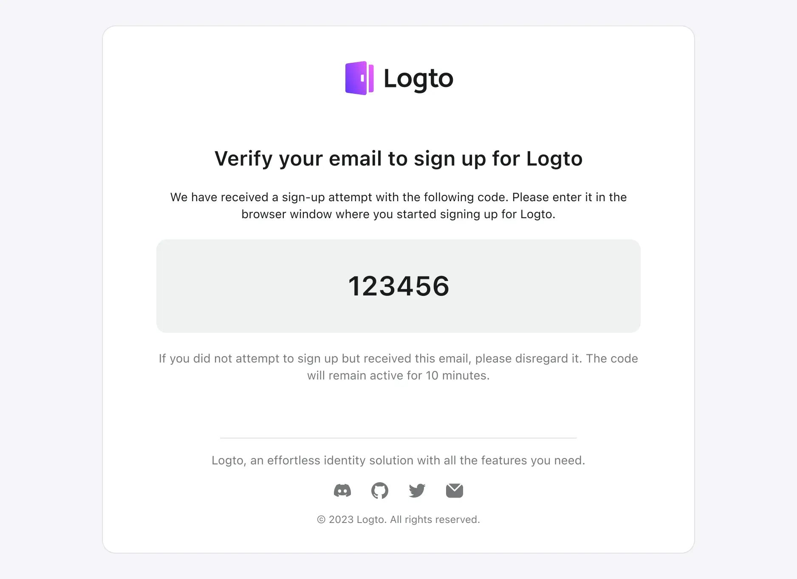

Logto fournit différents modèles pour personnaliser le contenu des emails, qui sont catégorisés en fonction de leurs cas d'utilisation.

Il est fortement recommandé d'utiliser différents modèles dans différents scénarios. Sinon, les utilisateurs peuvent recevoir un contenu d'email qui ne correspond pas à l'opération en cours, ce qui peut causer de la confusion. Si des modèles manquants ne sont pas configurés, cela peut entraîner des erreurs de flux qui dépendent de ce modèle et affecter le développement normal des affaires.

## Types de modèles d'email

| usageType                | Scénario                                                                                                                                                                                                                                                                                                                                                                                                                                                                                                        |
| ------------------------ | --------------------------------------------------------------------------------------------------------------------------------------------------------------------------------------------------------------------------------------------------------------------------------------------------------------------------------------------------------------------------------------------------------------------------------------------------------------------------------------------------------------- |
| SignIn                   | Les utilisateurs se connectent en utilisant leur email et vérifient en entrant un code de vérification au lieu de saisir un mot de passe.                                                                                                                                                                                                                                                                                                                                                                       |
| Register                 | Les utilisateurs créent un compte en utilisant leur email et le vérifient en entrant un code de vérification envoyé par Logto à leur email.                                                                                                                                                                                                                                                                                                                                                                     |
| ForgotPassword           | Si les utilisateurs oublient leur mot de passe lors de la connexion, ils peuvent choisir de vérifier leur identité en utilisant l'email qu'ils ont déjà vérifié avec Logto.                                                                                                                                                                                                                                                                                                                                     |
| Generic                  | Ce modèle peut être utilisé comme option de secours générale pour divers scénarios, y compris les tests de configurations de connecteurs, etc.                                                                                                                                                                                                                                                                                                                                                                  |
| OrganizationInvitation   | Utilisez ce modèle pour envoyer aux utilisateurs un lien d'invitation pour rejoindre l'Organisation (organisation).                                                                                                                                                                                                                                                                                                                                                                                             |
| UserPermissionValidation | Lors de l'utilisation de l'application, il peut y avoir certaines opérations à haut risque ou des opérations avec un niveau de risque relativement élevé qui nécessitent une vérification utilisateur supplémentaire, telles que les virements bancaires, la suppression de ressources en cours d'utilisation et l'annulation d'adhésions. Le modèle `UserPermissionValidation` peut être utilisé pour définir le contenu du code de vérification par email que les utilisateurs reçoivent dans ces situations. |
| BindNewIdentifier        | Lorsqu'un utilisateur modifie son profil, il peut lier une adresse email à son compte actuel. Dans ce cas, le modèle `BindNewIdentifier` peut être utilisé pour personnaliser le contenu de l'email de vérification.                                                                                                                                                                                                                                                                                            |

:::note
Les codes de vérification expirent dans 10 minutes. Nous ne supportons actuellement pas la personnalisation du temps d'expiration des codes de vérification.

Un espace réservé `{{code}}` doit être réservé dans le modèle. Lors de l'envoi d'un code de vérification, un code généré aléatoirement remplacera cet espace réservé avant que nous envoyions l'email aux utilisateurs.
:::

## Exemples de **modèles d'email**

Vous pouvez utiliser les exemples de code de modèle d'email fournis comme point de départ pour personnaliser votre interface utilisateur. Pour créer une interface utilisateur similaire à la suivante :



Étant donné que les modèles d'email utilisés dans différents scénarios de Logto sont très similaires, la seule différence étant la description du scénario et de l'opération en cours.

Nous ne montrons pas ici le code HTML de tous les modèles en détail. Au lieu de cela, nous prenons uniquement le scénario de **connexion** comme exemple. D'autres scénarios, tels que l'inscription et l'oubli de mot de passe, sont très similaires à l'exemple suivant.

Les utilisateurs peuvent se référer à ce modèle et l'ajuster en fonction de leur situation réelle.

```html
<!doctype html>
<html lang="fr">
  <head>
    <meta charset="UTF-8" />
    <meta name="viewport" content="width=device-width, initial-scale=1.0" />
    <title>Vérifiez votre email pour vous connecter</title>
    <style>
      .auth-service-by:hover .mini-logo {
        display: none !important;
      }
      .auth-service-by:hover .mini-logo-color {
        display: block !important;
      }
      body {
        font-family:
          'SF Pro Text',
          -apple-system,
          system-ui,
          BlinkMacSystemFont,
          'Segoe UI',
          Roboto,
          Arial,
          sans-serif;
        -webkit-font-smoothing: antialiased;
        -moz-osx-font-smoothing: grayscale;
        font-smooth: always;
        background-color: #fff;
        color: #191c1d;
        max-width: 640px;
        padding: 32px 0;
        font-size: 14px;
        font-weight: 400;
        line-height: 20px;
      }
      h1 {
        font-size: 24px;
        font-weight: 700;
        line-height: 32px;
        margin-top: 32px;
      }
      .verification-code {
        margin: 20px 0;
        background: #eff1f1;
        border-radius: 12px;
        padding: 36px;
        font-size: 32px;
        font-weight: 600;
        line-height: 40px;
      }
      .footer {
        text-align: center;
        color: #a9acac;
        margin-top: 48px;
      }
    </style>
  </head>
  <body>
    <div style="max-width: 698px; border-radius: 16px; border: 1px solid #E0E3E3;">
      <div style="padding: 0 24px;">
        <center>
          
          <h1>Vérifiez votre email pour vous connecter</h1>
          <p>
            Nous avons reçu une tentative de connexion avec le code suivant. Veuillez l'entrer dans
            la page que vous avez ouverte pour compléter le processus de connexion.
          </p>
          <div class="verification-code">000000</div>
          <p style="color: #747778;">
            Si vous n'avez pas tenté de vous connecter mais avez reçu cet email, veuillez l'ignorer.
            Le code restera actif pendant 10 minutes.
          </p>
          <hr style="margin: 64px 0 24px; max-width: 420px;" />
          <p style="color: #747778; margin: 16px 0 0;">{{companyInfo}}</p>
        </center>
      </div>
    </div>
    <div class="footer">
      <hr />
      <p style="font-size: 14px; line-height: 20px; margin: 20px 0;">
        <a href="https://logto.io" style="color: #A9ACAC; text-decoration: underline;">Logto</a> :
        La meilleure infrastructure d'identité pour les développeurs.
      </p>
      <table style="margin: 0 auto; width: auto; border-spacing: 0;">
        <tbody>
          <tr>
            <td style="vertical-align: middle;">
              <a href="{{discordServerUrl}}" style="display: block; margin: 0 12px;">
                
              </a>
            </td>
            <td style="vertical-align: middle;">
              <a href="{{githubUrl}}" style="display: block; margin: 0 12px;">
                
              </a>
            </td>
            <td style="vertical-align: middle;">
              <a href="{{twitterUrl}}" style="display: block; margin: 0 12px;">
                
              </a>
            </td>
            <td style="vertical-align: middle;">
              <a href="{{mailToUrl}}" style="display: block; margin: 0 12px;">
                
              </a>
            </td>
          </tr>
        </tbody>
      </table>
      <p style="font-size: 12px; line-height: 16px;">
        © Silverhand, Inc., 2810 North Church Street, Wilmington, DE 19802
      </p>
      <p style="color: #A9ACAC; font-size: 12px; line-height: 16px;">
        Vous avez des questions ou besoin d'aide ?
        <a href="{{mailToUrl}}" style="color: #A9ACAC; text-decoration: underline;"
          >Contactez-nous</a
        >
      </p>
    </div>
  </body>
</html>
```

Vous pouvez ensuite échapper le code HTML ci-dessus et l'ajouter au champ "Template" du connecteur dans les configurations comme suit (en supposant l'utilisation du connecteur SendGrid) :

```json
{
  "subject": "<sign-in-template-subject>",
  "content": "<table cellpadding=\"0\" cellspacing=\"0\" ...",
  "usageType": "SignIn",
  "type": "text/html"
}
```

## FAQs

<details>
<summary>Comment utiliser des services de modèles d'email tiers si les modèles ne sont pas configurés dans Logto ?</summary>

Vous pouvez ajouter un nouvel endpoint à votre propre service web pour envoyer des emails, puis utiliser [le connecteur d'email HTTP de Logto](/integrations/http-email) pour appeler l'endpoint que vous maintenez.

Cela vous permet de gérer la logique des modèles d'email sur votre propre serveur.

</details>

<details>
<summary>Y a-t-il un moyen d'utiliser l'email de Logto pour envoyer à nos utilisateurs un "email de bienvenue" personnalisé ? </summary>

Nous offrons la fonctionnalité Webhook. Vous pouvez implémenter votre propre endpoint API pour recevoir l'événement `User.Created` envoyé par le Webhook de Logto, et ajouter une logique pour envoyer un email de bienvenue personnalisé dans le gestionnaire de webhook.

Le connecteur d'email de Logto ne fournit que des notifications par email pour les événements liés au flux d'authentification. Les emails de bienvenue sont une exigence commerciale et ne sont pas pris en charge nativement par le connecteur d'email, mais cette fonctionnalité peut être réalisée via les Webhooks.

</details>
