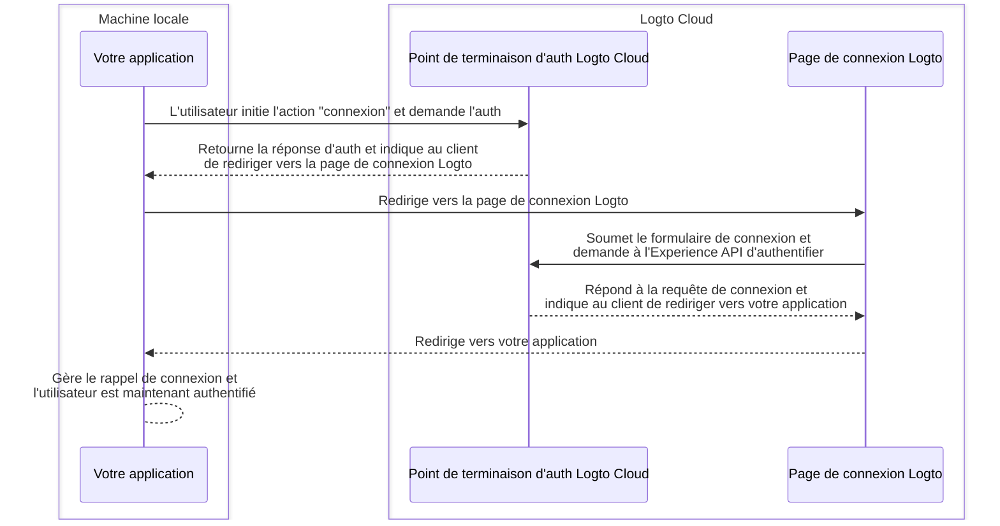
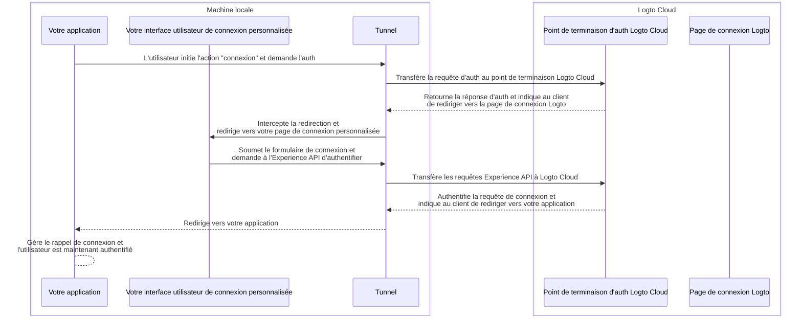

import TabItem from '@theme/TabItem';
import Tabs from '@theme/Tabs';

# Déboguer et tester votre interface utilisateur personnalisée localement

Pour les utilisateurs de Logto Cloud, nous avons simplifié l'intégration de votre propre interface utilisateur à Logto. Les utilisateurs de Cloud peuvent désormais télécharger un fichier zip contenant les ressources de l'interface utilisateur personnalisée dans <CloudLink to="/sign-in-experience/branding">Console > Expérience de connexion > Image de marque > Apportez votre interface utilisateur</CloudLink> (Consultez la page [Apportez votre interface utilisateur](/customization/bring-your-ui) pour plus de détails.)

Cependant, lors du développement de telles pages d'interface utilisateur personnalisées, les utilisateurs souhaitent tester et déboguer le code localement avant de le télécharger sur Logto Cloud. Cette commande CLI vous aide à configurer un tunnel local et à connecter ensemble les 3 entités suivantes : votre point de terminaison d'authentification Logto Cloud, votre application et votre interface utilisateur de connexion personnalisée.

## Pourquoi ai-je besoin de cela ?

Par défaut, lorsque vous cliquez sur le bouton "connexion" dans votre application, vous serez redirigé vers la page de connexion configurée au point de terminaison Logto. Un flux de connexion réussi peut être illustré comme suit :



Mais maintenant que vous développez votre propre interface utilisateur de connexion personnalisée, vous avez besoin d'un moyen de naviguer vers les pages d'interface utilisateur de connexion personnalisées exécutées sur votre machine locale à la place.
Cela nécessite un service de tunnel local pour intercepter les requêtes sortantes de votre application et les rediriger vers vos pages d'interface utilisateur de connexion personnalisées.

De plus, vous devez interagir avec l'Experience API de Logto pour authentifier les utilisateurs et gérer les sessions.
Ce service aidera également à transférer ces requêtes Experience API vers Logto Cloud afin d'éviter les problèmes de CORS.

Le diagramme de séquence ci-dessous illustre comment un flux de "connexion" réussi fonctionne avec votre interface utilisateur personnalisée et le service de tunnel en place :



Avec le service de tunnel en place, vous pouvez désormais développer et tester votre interface utilisateur de connexion personnalisée localement, sans avoir besoin de télécharger les ressources sur Logto Cloud à chaque modification.

## Instructions

### Étape 1 : Exécutez la commande

En supposant que votre ID de locataire Cloud est `foobar`, et que vous avez une page de connexion personnalisée exécutée sur votre serveur de développement local à `http://localhost:4000`, vous pouvez exécuter la commande de cette manière :

<Tabs groupId="cmd">

  <TabItem value="cli" label="CLI">

```bash
logto-tunnel -p 9000 --experience-uri http://localhost:4000/ --endpoint https://foobar.logto.app/
```

  </TabItem>
  <TabItem value="npx" label="npx">

```bash
npx @logto/tunnel -p 9000 --experience-uri http://localhost:4000/ --endpoint https://foobar.logto.app/
```

  </TabItem>

</Tabs>

Cela fonctionne également si vous avez un domaine personnalisé configuré dans Logto :

<Tabs groupId="cmd">

  <TabItem value="cli" label="CLI">

```bash
logto-tunnel -p 9000 --experience-uri http://localhost:4000/ --endpoint https://your.custom.domain/
```

  </TabItem>
  <TabItem value="npx" label="npx">

```bash
npx @logto/tunnel -p 9000 --experience-uri http://localhost:4000/ --endpoint https://your.custom.domain/
```

  </TabItem>

</Tabs>

Alternativement, la commande prend également en charge les ressources html statiques sans avoir besoin de les exécuter d'abord sur un serveur de développement. Assurez-vous simplement qu'il y a un `index.html` dans le chemin que vous avez spécifié.

<Tabs groupId="cmd">

  <TabItem value="cli" label="CLI">

```bash
logto-tunnel -p 9000 --experience-path /path/to/your/static/files --endpoint https://foobar.logto.app/
```

  </TabItem>
  <TabItem value="npx" label="npx">

```bash
npx @logto/tunnel -p 9000 --experience-path /path/to/your/static/files --endpoint https://foobar.logto.app/
```

  </TabItem>

</Tabs>

### Étape 2 : Mettez à jour l'URI du point de terminaison dans votre application

Enfin, exécutez votre application et définissez son point de terminaison Logto sur l'adresse du service de tunnel `http://localhost:9000/` à la place.

Prenons une application React comme exemple :

```tsx title=App.tsx
import { LogtoProvider, LogtoConfig } from '@logto/react';

const config: LogtoConfig = {
  // endpoint: 'https://foobar.logto.app/', // point de terminaison Logto Cloud original
  endpoint: 'http://localhost:9000/', // adresse du service de tunnel
  appId: '<your-application-id>',
};

const App = () => (
  <LogtoProvider config={config}>
    <YourAppContent />
  </LogtoProvider>
);
```

Si vous utilisez la connexion sociale, vous devez également mettre à jour l'URI de redirection dans les paramètres de votre fournisseur social vers l'adresse du service de tunnel.

```
http://localhost:9000/callback/<connector-id>
```

Si tout est correctement configuré, lorsque vous cliquez sur le bouton "connexion" dans votre application, vous devriez être redirigé vers votre page de connexion personnalisée au lieu de l'interface utilisateur intégrée de Logto, avec une session valide (cookies) qui vous permet d'interagir davantage avec l'Experience API de Logto.

Bon codage !
