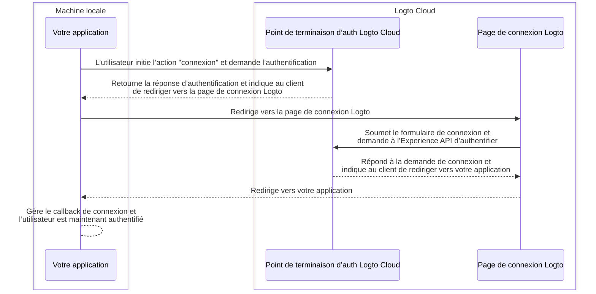
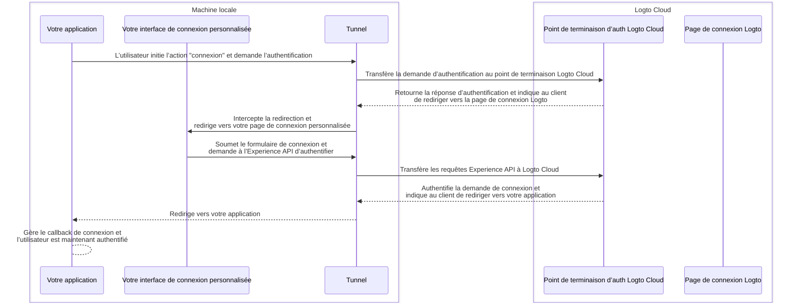

import TabItem from '@theme/TabItem';
import Tabs from '@theme/Tabs';

# Déboguer et tester votre interface personnalisée localement

Pour les utilisateurs de Logto Cloud, nous avons facilité la possibilité de "fournir votre propre interface" à Logto. Les utilisateurs Cloud peuvent désormais téléverser un fichier zip contenant les ressources de l’interface personnalisée dans <CloudLink to="/sign-in-experience/branding">Console > Connexion & compte > Personnalisation > Fournir votre interface</CloudLink> (Consultez la page [Fournir votre interface](/customization/bring-your-ui) pour plus de détails.)

Cependant, lors du développement de telles pages d’interface personnalisée, les utilisateurs souhaitent tester et déboguer le code localement avant de le téléverser sur Logto Cloud. Cette commande CLI vous aide à configurer un tunnel local et à connecter ensemble les 3 entités suivantes :
votre point de terminaison d’auth Logto Cloud, votre application et votre interface de connexion personnalisée.

## Pourquoi ai-je besoin de cela ? \{#why-do-i-need-this}

Par défaut, lorsque vous cliquez sur le bouton "connexion" dans votre application, vous serez redirigé vers la page de connexion configurée au point de terminaison Logto. Un flux de connexion réussi peut être illustré comme suit :


```mermaid
sequenceDiagram
    box Machine locale
    participant A as Votre application
    end
    box Logto Cloud
    participant B as Point de terminaison d’auth Logto Cloud
    participant C as Page de connexion Logto
    end
    A ->> B: L’utilisateur initie l’action "connexion" et demande l’authentification
    B -->> A: Retourne la réponse d’authentification et indique au client<br/>de rediriger vers la page de connexion Logto
    A ->> C: Redirige vers la page de connexion Logto
    C ->> B: Soumet le formulaire de connexion et<br/>demande à l’Experience API d’authentifier
    B -->> C: Répond à la demande de connexion et<br/>indique au client de rediriger vers votre application
    C -->> A: Redirige vers votre application
    A --> A: Gère le callback de connexion et<br/>l’utilisateur est maintenant authentifié
```

Mais maintenant, puisque vous développez votre propre interface de connexion personnalisée, vous avez besoin d’un moyen de naviguer vers les pages d’interface personnalisée exécutées sur votre machine locale à la place.
Cela nécessite un service de tunnel local pour intercepter les requêtes sortantes de votre application et les rediriger vers vos pages d’interface de connexion personnalisée.

De plus, vous devez interagir avec [l’Experience API de Logto](https://openapi.logto.io/group/endpoint-experience) pour authentifier les utilisateurs et gérer les sessions.
Ce service aidera également à transférer ces requêtes Experience API vers Logto Cloud afin d’éviter les problèmes CORS.

Le diagramme de séquence ci-dessous illustre comment un flux de "connexion" réussi fonctionne avec votre interface personnalisée et le service de tunnel en place :


```mermaid
sequenceDiagram
    box Machine locale
    participant A as Votre application
    participant B as Votre interface de connexion personnalisée
    participant C as Tunnel
    end
    box Logto Cloud
    participant D as Point de terminaison d’auth Logto Cloud
    participant E as Page de connexion Logto
    end
    A ->> C: L’utilisateur initie l’action "connexion" et demande l’authentification
    C ->> D: Transfère la demande d’authentification au point de terminaison Logto Cloud
    D -->> C: Retourne la réponse d’authentification et indique au client<br/>de rediriger vers la page de connexion Logto
    C ->> B: Intercepte la redirection et<br/>redirige vers votre page de connexion personnalisée
    B ->> C: Soumet le formulaire de connexion et<br/>demande à l’Experience API d’authentifier
    C ->> D: Transfère les requêtes Experience API à Logto Cloud
    D -->> C: Authentifie la demande de connexion et<br/>indique au client de rediriger vers votre application
    C -->> A: Redirige vers votre application
    A --> A: Gère le callback de connexion et<br/>l’utilisateur est maintenant authentifié
```

Avec le service de tunnel en place, vous pouvez désormais développer et tester votre interface de connexion personnalisée localement, sans avoir à téléverser les ressources sur Logto Cloud à chaque modification.

## Instructions \{#instructions}

### Étape 1 : Exécuter la commande \{#step-1-execute-the-command}

En supposant que votre tenant Cloud ait l’ID `foobar`, et que vous ayez une page de connexion personnalisée exécutée sur votre serveur de développement local à `http://localhost:4000`, vous pouvez alors exécuter la commande ainsi :

<Tabs groupId="cmd">

  <TabItem value="cli" label="CLI">

```bash
logto-tunnel -p 9000 --experience-uri http://localhost:4000/ --endpoint https://foobar.logto.app/
```

  </TabItem>
  <TabItem value="npx" label="npx">

```bash
npx @logto/tunnel -p 9000 --experience-uri http://localhost:4000/ --endpoint https://foobar.logto.app/
```

  </TabItem>

</Tabs>

Cela fonctionne également si vous avez un domaine personnalisé configuré dans Logto :

<Tabs groupId="cmd">

  <TabItem value="cli" label="CLI">

```bash
logto-tunnel -p 9000 --experience-uri http://localhost:4000/ --endpoint https://your.custom.domain/
```

  </TabItem>
  <TabItem value="npx" label="npx">

```bash
npx @logto/tunnel -p 9000 --experience-uri http://localhost:4000/ --endpoint https://your.custom.domain/
```

  </TabItem>

</Tabs>

Alternativement, la commande prend également en charge les ressources html statiques sans avoir besoin de les exécuter d’abord sur un serveur de développement. Assurez-vous simplement qu’il y a un `index.html` dans le chemin que vous avez spécifié.

<Tabs groupId="cmd">

  <TabItem value="cli" label="CLI">

```bash
logto-tunnel -p 9000 --experience-path /path/to/your/static/files --endpoint https://foobar.logto.app/
```

  </TabItem>
  <TabItem value="npx" label="npx">

```bash
npx @logto/tunnel -p 9000 --experience-path /path/to/your/static/files --endpoint https://foobar.logto.app/
```

  </TabItem>

</Tabs>

### Étape 2 : Mettre à jour l’URI du point de terminaison dans votre application \{#step-2-update-endpoint-uri-in-your-application}

Enfin, exécutez votre application et définissez son point de terminaison Logto sur l’adresse du service de tunnel `http://localhost:9000/` à la place.

Prenons l’exemple d’une application React :

```tsx title=App.tsx
import { LogtoProvider, LogtoConfig } from '@logto/react';

const config: LogtoConfig = {
  // endpoint: 'https://foobar.logto.app/', // point de terminaison Logto Cloud original
  endpoint: 'http://localhost:9000/', // adresse du service de tunnel
  appId: '<your-application-id>',
};

const App = () => (
  <LogtoProvider config={config}>
    <YourAppContent />
  </LogtoProvider>
);
```

Si vous utilisez la connexion sociale, vous devez également mettre à jour l’URI de redirection dans les paramètres de votre fournisseur social vers l’adresse du service de tunnel.

```
http://localhost:9000/callback/<connector-id>
```

Si tout est correctement configuré, lorsque vous cliquez sur le bouton "connexion" dans votre application, vous devriez être redirigé vers votre page de connexion personnalisée au lieu de l’interface intégrée de Logto, avec une session valide (cookies) qui vous permet d’interagir avec l’Experience API de Logto.

Bon codage !

## Ressources associées \{#related-resources}

<Url href="https://blog.logto.io/automate-custom-sign-in-ui-deployment-with-github-actions">
  Automatisez le déploiement de votre interface de connexion personnalisée avec le workflow GitHub
  Actions
</Url>
