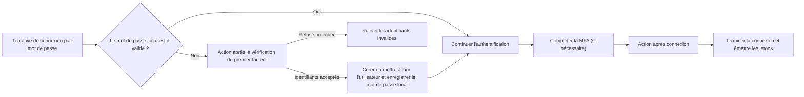

# Actions

Les Actions Logto vous permettent d'exécuter du JavaScript de confiance à des points spécifiques du flux d'authentification. Une action s'exécute de manière synchrone : la requête d'authentification attend le script, et le résultat du script peut mettre à jour l'utilisateur ou déterminer si le flux continue.

Les actions sont utiles lorsque la décision doit être prise à l'intérieur du flux d'authentification. Les cas d'utilisation courants incluent :

- La migration des utilisateurs et des mots de passe depuis un ancien système d'identité lors de leur première connexion.
- L'actualisation du profil utilisateur ou des données spécifiques à l'application avant que Logto ne termine une connexion.
- L'appel à un service externe et l'application de son résultat à l'utilisateur Logto.

:::note
Les actions sont disponibles dans les offres Logto Cloud Enterprise.
:::

:::warning
Les scripts d'action peuvent affecter l'authentification et modifier les données utilisateur. Seuls les administrateurs de confiance doivent être autorisés à les consulter, créer, modifier, tester, activer ou supprimer.

Dans les déploiements auto-hébergés, les scripts d'action s'exécutent dans une machine virtuelle à l'intérieur du processus Logto. Considérez-les comme du code serveur de confiance, et non comme une frontière de sécurité pour du code non fiable.
:::

## Comment les Actions s’intègrent dans la connexion \{#how-actions-fit-into-sign-in}

Logto propose actuellement deux types d'actions :



| Type d'action                                                                                  | Quand elle s'exécute                                                                                                                                                           | Ce qu'elle peut faire                                                                                                                                                          |
| ---------------------------------------------------------------------------------------------- | ------------------------------------------------------------------------------------------------------------------------------------------------------------------------------ | ------------------------------------------------------------------------------------------------------------------------------------------------------------------------------ |
| [Après la vérification du premier facteur](/developers/actions/post-first-factor-verification) | Lors d'une connexion par mot de passe, uniquement après l'échec de la vérification du mot de passe local par Logto. Elle ne s'exécute pas si le mot de passe local est valide. | Vérifier les identifiants soumis auprès d'un système hérité, puis créer un nouvel utilisateur Logto ou mettre à jour un utilisateur existant et migrer le mot de passe soumis. |
| [Après connexion](/developers/actions/post-sign-in)                                            | Après que l'utilisateur a complété tous les facteurs d'authentification, y compris la MFA si nécessaire, et avant que Logto ne termine la connexion et émette les jetons.      | Mettre à jour et enrichir l'utilisateur Logto existant en utilisant le contexte final de connexion.                                                                            |

Les deux types d'actions ne s'exécutent que pour les interactions `SignIn` dans l’Experience API. L'action après la vérification du premier facteur ne s'applique qu'à la connexion par mot de passe ; l'action après connexion est indépendante de la méthode d'authentification.

## Modèle de script \{#script-model}

Chaque type d'action possède une configuration et une fonction d'entrée JavaScript nommée `runAction` :

```js
const runAction = async ({ event, environmentVariables = {} }) => {
  // Inspecter l'événement, éventuellement récupérer des données externes, et retourner
  // un résultat pris en charge par ce type d'action.
};
```

Le payload contient :

- `event` : L'événement d'authentification en production. Sa structure dépend du type d'action.
- `environmentVariables` : Les valeurs de chaîne configurées pour cette action. Ces valeurs sont transmises via le payload de la fonction ; elles ne sont pas disponibles via `process.env`.

L'éditeur fournit des informations de type, mais le script enregistré est exécuté en tant que JavaScript. Le script peut être asynchrone et utiliser la fonction `fetch` injectée pour appeler des APIs HTTPS externes. Il ne peut pas importer de packages ni accéder aux objets globaux Node.js tels que `require` ou `process`.

Le résultat pris en charge est différent pour chaque type d'action ; consultez la page de référence correspondante avant d'activer une Action.

## Actions et Webhooks \{#actions-and-webhooks}

Les Actions et les [Webhooks](/developers/webhooks) ont des objectifs différents :

|                                                  | Actions                                                                        | Webhooks                                                                   |
| ------------------------------------------------ | ------------------------------------------------------------------------------ | -------------------------------------------------------------------------- |
| Exécution                                        | Synchrone et en ligne avec l'authentification                                  | Asynchrone et en dehors de la requête d'authentification                   |
| Peut affecter le flux d'authentification actuel  | Oui                                                                            | Non                                                                        |
| Peut modifier un utilisateur depuis son résultat | Oui, en utilisant le patch utilisateur pris en charge                          | Pas directement ; le récepteur peut appeler le Management API séparément   |
| Couverture des événements                        | Points d'authentification sélectionnés                                         | Un large ensemble d'événements d'interaction et de modification de données |
| Utilisation typique                              | Migration des identifiants, enrichissement du profil avant émission des jetons | Notifications, synchronisation descendante, analytique                     |

Gardez le travail asynchrone dans les Webhooks. Utilisez une Action uniquement lorsque Logto a besoin du résultat avant que l'authentification puisse continuer.

## Prochaines étapes \{#next-steps}

- [Configurer et tester les Actions](/developers/actions/configure-and-test-actions)
- [Migrer les utilisateurs lors de la connexion par mot de passe](/developers/actions/post-first-factor-verification)
- [Enrichir un utilisateur après la connexion](/developers/actions/post-sign-in)
