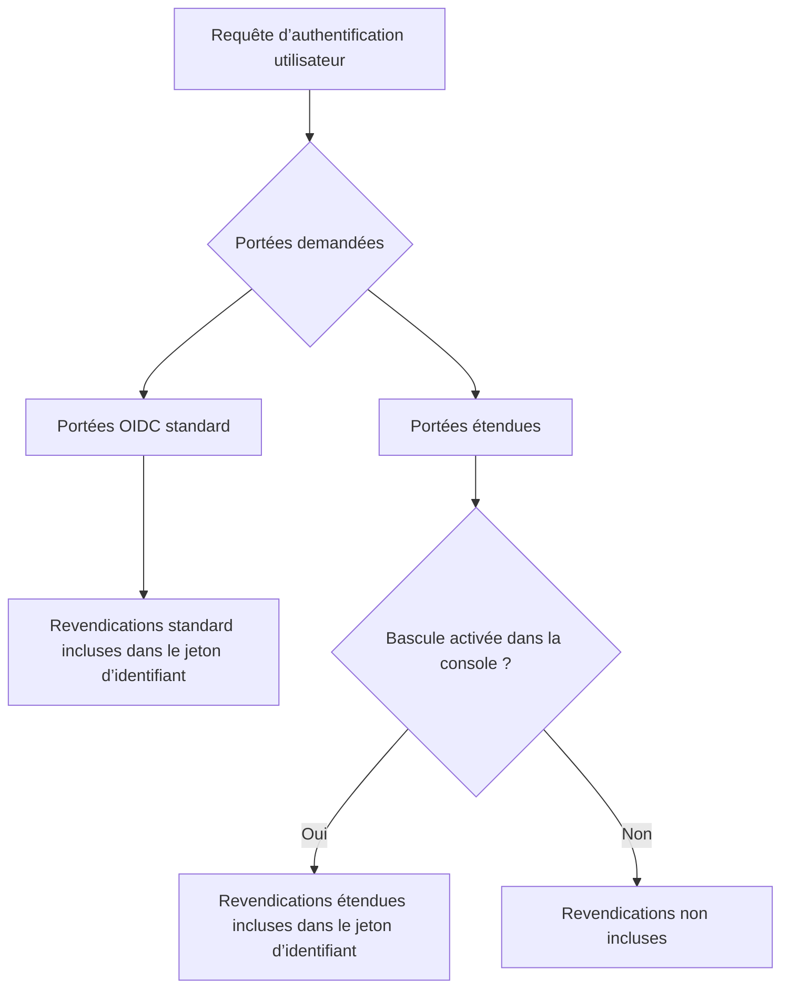

# Jeton d’identifiant personnalisé (Custom ID token)

## Introduction \{#introduction}

Le [jeton d’identifiant (ID token)](https://auth.wiki/id-token) est un type spécial de jeton défini par le protocole [OpenID Connect (OIDC)](https://auth.wiki/openid-connect). Il sert de preuve d'identité émise par le serveur d’autorisation (Logto) après qu’un utilisateur s’est authentifié avec succès, transportant des revendications concernant l'identité de l'utilisateur authentifié.

Contrairement aux [jetons d’accès](/developers/custom-token-claims) qui sont utilisés pour accéder à des ressources protégées, les jetons d’identifiant sont spécifiquement conçus pour transmettre l'identité de l'utilisateur authentifié aux applications clientes. Ce sont des [JSON Web Tokens (JWTs)](https://auth.wiki/jwt) qui contiennent des revendications sur l'événement d'authentification et l'utilisateur authentifié.

## Fonctionnement des revendications du jeton d’identifiant \{#how-id-token-claims-work}

Dans Logto, les revendications du jeton d’identifiant sont divisées en deux catégories :

1. **Revendications OIDC standard** : Définies par la spécification OIDC, ces revendications sont entièrement déterminées par les portées demandées lors de l’authentification.
2. **Revendications étendues** : Revendications étendues par Logto pour transporter des informations d'identité supplémentaires, contrôlées par un **modèle à double condition** (Portée + Bascule).

## Revendications OIDC standard \{#standard-oidc-claims}

Les revendications standard sont entièrement régies par la spécification OIDC. Leur inclusion dans le jeton d’identifiant dépend uniquement des portées que votre application demande lors de l’authentification. Logto ne propose aucune option pour désactiver ou exclure sélectivement des revendications standard individuelles.

Le tableau suivant montre la correspondance entre les portées standard et leurs revendications correspondantes :

| Portée    | Revendications                                                                                                                                                                   |
| --------- | -------------------------------------------------------------------------------------------------------------------------------------------------------------------------------- |
| `openid`  | `sub`                                                                                                                                                                            |
| `profile` | `name`, `family_name`, `given_name`, `middle_name`, `nickname`, `preferred_username`, `profile`, `picture`, `website`, `gender`, `birthdate`, `zoneinfo`, `locale`, `updated_at` |
| `email`   | `email`, `email_verified`                                                                                                                                                        |
| `phone`   | `phone_number`, `phone_number_verified`                                                                                                                                          |
| `address` | `address`                                                                                                                                                                        |

Par exemple, si votre application demande les portées `openid profile email`, le jeton d’identifiant inclura toutes les revendications des portées `openid`, `profile` et `email`.

## Revendications étendues \{#extended-claims}

Au-delà des revendications OIDC standard, Logto étend des revendications supplémentaires qui transportent des informations d'identité propres à l’écosystème Logto. Ces revendications étendues suivent un **modèle à double condition** pour être incluses dans le jeton d’identifiant :

1. **Condition de portée** : L’application doit demander la portée correspondante lors de l’authentification.
2. **Bascule dans la console** : L’administrateur doit activer l’inclusion de la revendication dans le jeton d’identifiant via la Console Logto.

Les deux conditions doivent être satisfaites simultanément. La portée sert de déclaration d’accès au niveau du protocole, tandis que la bascule sert de contrôle d’exposition au niveau du produit — leurs responsabilités sont claires et non substituables.

### Portées et revendications étendues disponibles \{#available-extended-scopes-and-claims}

| Portée                               | Revendications                 | Description                                           | Inclus par défaut |
| ------------------------------------ | ------------------------------ | ----------------------------------------------------- | ----------------- |
| `custom_data`                        | `custom_data`                  | Données personnalisées stockées sur l’utilisateur     |                   |
| `identities`                         | `identities`, `sso_identities` | Identités sociales et SSO liées de l’utilisateur      |                   |
| `roles`                              | `roles`                        | Rôles attribués à l’utilisateur                       | ✅                |
| `urn:logto:scope:organizations`      | `organizations`                | Identifiants des organisations de l’utilisateur       | ✅                |
| `urn:logto:scope:organizations`      | `organization_data`            | Données d’organisation de l’utilisateur               |                   |
| `urn:logto:scope:organization_roles` | `organization_roles`           | Affectations de rôles d’organisation de l’utilisateur | ✅                |

### Configuration dans la Console Logto \{#configure-in-logto-console}

Pour activer les revendications étendues dans le jeton d’identifiant :

1. Accédez à <CloudLink to="/customize-jwt">Console > JWT personnalisé</CloudLink>.
2. Activez les revendications que vous souhaitez inclure dans le jeton d’identifiant.
3. Assurez-vous que votre application demande les portées correspondantes lors de l’authentification.

## Ressources associées \{#related-resources}

<Url href="/developers/custom-token-claims">Jeton d’accès personnalisé</Url>

<Url href="https://openid.net/specs/openid-connect-core-1_0.html#IDToken">
  OpenID Connect Core - Jeton d’identifiant
</Url>
