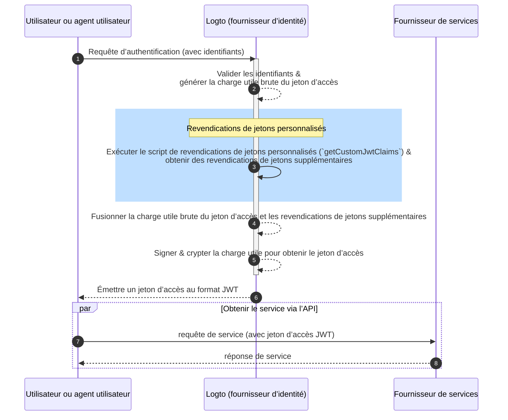

# Revendications de jetons personnalisés

## Introduction

Les jetons d’accès jouent un rôle crucial dans le processus d'authentification et d'Autorisation, transportant les informations d'identité et les Permissions du sujet, et sont transmis entre le serveur Logto (servant de serveur d'authentification ou de fournisseur d’identité, IdP), votre serveur de service web (fournisseur de ressources), et les applications clientes (clients).

Les revendications de jetons sont les paires clé-valeur qui fournissent des informations sur une entité ou le jeton lui-même. Les revendications peuvent inclure des informations sur l'utilisateur, le temps d'expiration du jeton, les Permissions, et d'autres métadonnées pertinentes pour le processus d'Authentification (lien vers auth.wiki) et d'Autorisation (lien vers auth.wiki).

Il existe deux types de jetons d’accès dans Logto :

- **JSON Web Token :** [JSON Web Token (JWT)](https://datatracker.ietf.org/doc/html/rfc7519) est un format populaire qui encode les revendications d'une manière à la fois sécurisée et lisible par les clients. Les revendications courantes comme `sub`, `iss`, `aud`, etc. sont utilisées conformément au protocole OAuth 2.0 (voir [ce lien](https://datatracker.ietf.org/doc/html/rfc7519#section-4) pour plus de détails). Les jetons JWT permettent aux consommateurs d'accéder directement aux revendications sans étapes de validation supplémentaires. Dans Logto, les jetons d’accès sont émis au format JWT par défaut lorsqu'un client initie des requêtes d’autorisation de ressources ou d'Organisations spécifiques.
- **Jeton opaque :** Un jeton opaque n'est pas autonome et nécessite toujours une étape de validation supplémentaire via le point de terminaison d'introspection de jeton. Malgré leur format non transparent, les jetons opaques peuvent aider à obtenir des revendications et être transmis en toute sécurité entre les parties. Les revendications de jetons sont stockées en toute sécurité dans le serveur Logto et accessibles par les applications clientes via le point de terminaison d'introspection de jeton. Les jetons d’accès sont émis au format opaque lorsqu'aucune ressource ou Organisation spécifique n'est incluse dans la requête d’Autorisation. Ces jetons sont principalement utilisés pour accéder au point de terminaison OIDC `userinfo` et à d'autres fins générales.

Dans de nombreux cas, les revendications standard ne suffisent pas à répondre aux besoins spécifiques de vos applications, que vous utilisiez des jetons JWT ou des jetons opaques. Pour répondre à cela, Logto offre la flexibilité d'ajouter des revendications personnalisées dans les jetons d’accès. Avec cette fonctionnalité, vous pouvez inclure des informations supplémentaires pour votre logique métier, toutes transmises en toute sécurité dans les jetons et récupérables via l'introspection dans le cas des jetons opaques.

## Comment fonctionnent les revendications de jetons personnalisés ?

Logto vous permet d'insérer des revendications personnalisées dans le `jeton d’accès` via une fonction de rappel `getCustomJwtClaims`. Vous pouvez fournir votre implémentation de la fonction `getCustomJwtClaims` pour retourner un objet de revendications personnalisées. La valeur de retour sera fusionnée avec la charge utile originale du jeton et signée pour générer le jeton d’accès final.

:::warning
Les revendications de jetons intégrées de Logto ne peuvent PAS être remplacées ou modifiées. Les revendications personnalisées seront ajoutées au jeton en tant que revendications supplémentaires. Si des revendications personnalisées entrent en conflit avec les revendications intégrées, ces revendications personnalisées seront ignorées.
:::
