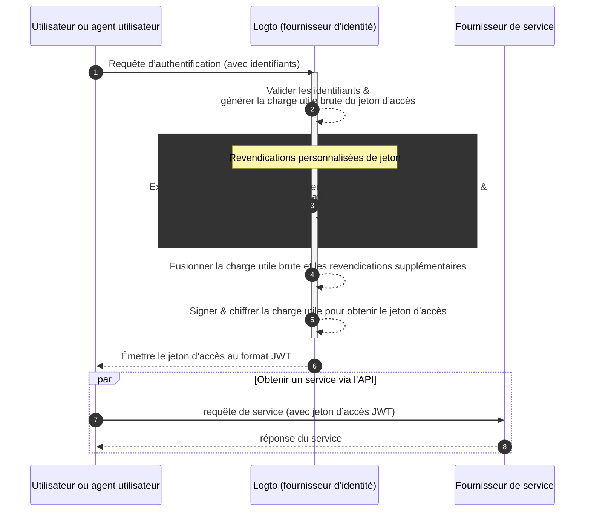

# Revendications personnalisées de jeton

Logto offre la flexibilité d’ajouter des revendications personnalisées dans les jetons d’accès (JWT / Jeton opaque). Grâce à cette fonctionnalité, vous pouvez inclure des informations supplémentaires pour votre logique métier, toutes transmises de manière sécurisée dans les jetons et récupérables via introspection dans le cas des jetons opaques.

## Introduction \{#introduction}

Les [Jetons d’accès (Access tokens)](https://auth.wiki/access-token) jouent un rôle essentiel dans le processus d’authentification (Authentication) et d’autorisation (Authorization), transportant les informations d’identité du sujet et les permissions, et sont transmis entre le [serveur Logto](/concepts/core-service) (servant de serveur d’authentification ou fournisseur d’identité, IdP), votre serveur de service web (fournisseur de ressources), et les applications clientes (clients).

Les [Revendications de jeton (Token claims)](https://auth.wiki/claim) sont les paires clé-valeur qui fournissent des informations sur une entité ou sur le jeton lui-même. Les revendications peuvent inclure des informations utilisateur, la date d’expiration du jeton, des permissions, et d’autres métadonnées pertinentes pour le processus d’authentification (Authentication) et d’autorisation (Authorization).

Il existe deux types de jetons d’accès dans Logto :

- **JSON Web Token :** [JSON Web Token (JWT)](https://auth.wiki/jwt) est un format populaire qui encode les revendications de manière sécurisée et lisible par les clients. Les revendications courantes comme `sub`, `iss`, `aud` etc. sont utilisées conformément au protocole OAuth 2.0 (Voir [ce lien](https://datatracker.ietf.org/doc/html/rfc7519#section-4) pour plus de détails). Les JWT permettent aux consommateurs d’accéder directement aux revendications sans étapes de validation supplémentaires. Dans Logto, les jetons d’accès sont émis au format JWT par défaut lorsqu’un client initie des requêtes d’autorisation de ressources ou d’organisations spécifiques.
- **Jeton opaque (Opaque token) :** Un [jeton opaque](http://localhost:3000/concepts/opaque-token) n’est pas autonome et nécessite toujours une étape de validation supplémentaire via le point de terminaison [introspection de jeton](https://auth.wiki/token-introspection). Malgré leur format non transparent, les jetons opaques permettent d’obtenir des revendications et d’être transmis de manière sécurisée entre les parties. Les revendications de jeton sont stockées en toute sécurité sur le serveur Logto et accessibles par les applications clientes via le point de terminaison d’introspection de jeton. Les jetons d’accès sont émis au format opaque lorsqu’aucune ressource ou organisation spécifique n’est incluse dans la requête d’autorisation. Ces jetons sont principalement utilisés pour accéder au point de terminaison OIDC `userinfo` et à d’autres usages généraux.

Dans de nombreux cas, les revendications standard ne suffisent pas à répondre aux besoins spécifiques de vos applications, que vous utilisiez des JWT ou des jetons opaques. Pour y remédier, Logto offre la flexibilité d’ajouter des revendications personnalisées dans les jetons d’accès. Grâce à cette fonctionnalité, vous pouvez inclure des informations supplémentaires pour votre logique métier, toutes transmises de manière sécurisée dans les jetons et récupérables via introspection dans le cas des jetons opaques.

## Comment fonctionnent les revendications personnalisées de jeton ? \{#how-do-custom-token-claims-work}

Logto vous permet d’insérer des revendications personnalisées dans le `jeton d’accès` via une fonction de rappel `getCustomJwtClaims`. Vous pouvez fournir votre propre implémentation de la fonction `getCustomJwtClaims` pour retourner un objet de revendications personnalisées. La valeur de retour sera fusionnée avec la charge utile originale du jeton et signée pour générer le jeton d’accès final.

:::warning
Les revendications intégrées de Logto ne peuvent PAS être remplacées ou modifiées. Les revendications personnalisées seront ajoutées au jeton en tant que revendications supplémentaires. Si des revendications personnalisées entrent en conflit avec les revendications intégrées, ces revendications personnalisées seront ignorées.
:::

## Ressources associées \{#related-resources}

<Url href="https://blog.logto.io/glance-on-custom-jwt-access-token-claims">
  Ajouter des revendications personnalisées pour les jetons d’accès JWT avec Logto pour renforcer
  votre autorisation (Authorization)
</Url>
