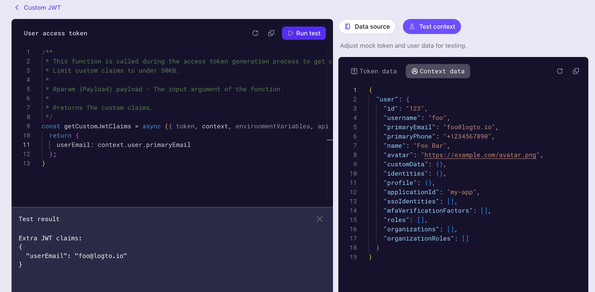

# Créer un script de revendications de jeton personnalisé

Pour ajouter des revendications personnalisées au jeton d’accès (Access token), vous devez fournir un script qui renvoie un objet contenant ces revendications. Le script doit être écrit comme une fonction `JavaScript` qui renvoie un objet avec les revendications personnalisées.

1. Accédez à <CloudLink to="/customize-jwt">Console > Custom JWT</CloudLink>.
2. Il existe deux types différents de jetons d’accès pour lesquels vous pouvez personnaliser les revendications du jeton d’accès :

   - **Jeton d’accès utilisateur** : Le jeton d’accès émis pour les utilisateurs finaux. Par exemple, pour les applications Web ou mobiles.
   - **Jeton d’accès Machine à Machine** : Le jeton d’accès émis pour les services ou applications. Par exemple, pour les applications machine à machine.

   Différents types de jetons d’accès peuvent avoir différents contextes de charge utile de jeton. Vous pouvez personnaliser les revendications de jeton pour chaque type de jeton d’accès séparément.

   Choisissez n'importe quel type de jeton d’accès pour lequel vous souhaitez personnaliser les revendications de jeton, et cliquez sur le bouton **Ajouter des revendications personnalisées** pour créer un nouveau script.

:::note
La fonctionnalité de revendications de jeton personnalisé est uniquement disponible pour :

- Utilisateurs OSS
- Locataires Dev
- Locataires payants (y compris les locataires Pro et Enterprise)
  :::

## Implémenter la fonction `getCustomJwtClaims()`

Dans la page de détails **Custom JWT**, vous pouvez trouver l'éditeur de script pour écrire votre script de revendications de jeton personnalisé. Le script doit être une fonction `JavaScript` qui renvoie un objet de revendications personnalisées.


## Étape 1 : Modifier le script

Utilisez l'éditeur de code sur le côté gauche pour modifier le script. Une valeur de retour d'objet vide par défaut `getCustomJwtClaims` est fournie pour que vous puissiez commencer. Vous pouvez modifier la fonction pour renvoyer un objet de vos propres revendications personnalisées.

```jsx
const getCustomJwtClaims = async ({ token, context, environmentVariables }) => {
  return {};
};
```

Cet éditeur utilise le serveur de langage JavaScript pour fournir une coloration syntaxique de base, une complétion de code et une vérification des erreurs. Le paramètre d'entrée est bien typé et documenté dans le style jsDoc. Vous pouvez utiliser l'IntelliSense de l'éditeur pour accéder correctement aux propriétés de l'objet d'entrée. Vous pouvez trouver les définitions détaillées des paramètres sur le côté droit de la page.

:::note
Cette fonction sera exportée en tant que module. Assurez-vous de conserver le nom de la fonction comme `getCustomJwtClaims` afin que le module puisse exporter la fonction correctement.
:::

## Étape 2 : Paramètres d'entrée

La fonction `getCustomJwtClaims` prend un objet comme paramètre d'entrée. L'objet d'entrée contient les propriétés suivantes :

### token

L'objet de charge utile du jeton. Cet objet contient les revendications de jeton originales et les métadonnées auxquelles vous pouvez avoir besoin d'accéder dans le script.

Vous pouvez trouver la définition de type détaillée de l'objet de charge utile du jeton et de l'objet de données utilisateur sur le côté droit de la page. L'IntelliSense de l'éditeur vous aidera également à accéder correctement à ces propriétés de l'objet d'entrée.

- Objet de données de jeton d’accès utilisateur
  | Propriété | Description | Type |
  | -------------------- | ------------------------------------------------ | ------------- |
  | `jti` | L'identifiant unique du JWT | `string` |
  | `aud` | L'audience du jeton | `string` |
  | `scope` | Les portées du jeton | `string` |
  | `clientId` | L'identifiant du client du jeton | `string` |
  | `accountId` | L'identifiant de l'utilisateur du jeton | `string` |
  | `expiresWithSession` | Si le jeton expirera avec la session | `boolean` |
  | `grantId` | L'identifiant de la requête d’authentification actuelle du jeton | `string` |
  | `gty` | Le type de requête du jeton | `string` |
  | `kind` | Le type de jeton | `AccessToken` |
- Objet de données de jeton d’accès machine à machine
  | Propriété | Description | Type |
  | ---------- | -------------------------- | ------------------- |
  | `jti` | L'identifiant unique du JWT | `string` |
  | `aud` | L'audience du jeton | `string` |
  | `scope` | Les portées du jeton | `string` |
  | `clientId` | L'identifiant du client du jeton | `string` |
  | `kind` | Le type de jeton | `ClientCredentials` |

### context (Disponible uniquement pour le jeton d’accès utilisateur)

L'objet de contexte contient les données utilisateur et les données de requête pertinentes pour le processus d’Autorisation actuel.

- **Objet de données utilisateur**
  Pour le jeton d’accès utilisateur, Logto fournit un contexte de données utilisateur supplémentaire auquel vous pouvez accéder. L'objet de données utilisateur contient toutes les données de profil utilisateur et les données d'appartenance à l’Organisation dont vous pourriez avoir besoin pour configurer les revendications personnalisées. Veuillez consulter [Utilisateurs](/user-management/user-data) et [Organisations](/organizations/organization-data) pour plus de détails.
- **Objet de données de requête**
  Pour le jeton d’accès utilisateur accordé par échange de jeton d’usurpation d’identité, Logto fournit un contexte de données de requête supplémentaire auquel vous pouvez accéder. L'objet de données de requête contient le contexte personnalisé du jeton de sujet. Veuillez consulter [Usurpation d’identité](/developers/user-impersonation) pour plus de détails.

### environmentVariables

Utilisez la section **Définir les variables d'environnement** sur la droite pour configurer les variables d'environnement pour votre script. Vous pouvez utiliser ces variables pour stocker des informations sensibles ou des données de configuration que vous ne souhaitez pas coder en dur dans le script. Par exemple, des clés API, des secrets ou des URLs.

Toutes les variables d'environnement que vous définissez ici seront disponibles dans le script. Utilisez l'objet `environmentVariables` dans le paramètre d'entrée pour accéder à ces variables.

### api

L'objet `api` fournit un ensemble de fonctions utilitaires que vous pouvez utiliser dans votre script pour un contrôle d'accès supplémentaire sur le processus d'émission de jeton. L'objet `api` contient les fonctions suivantes :

```jsx
api.denyAccess(message?: string): void
```

La fonction `api.denyAccess()` vous permet de refuser le processus d'émission de jeton avec un message personnalisé. Vous pouvez utiliser cette fonction pour appliquer une validation d'accès supplémentaire sur le processus d'émission de jeton.

## Étape 3 : Récupérer des données externes

Vous pouvez utiliser la fonction intégrée `fetch` de node pour récupérer des données externes dans votre script. La fonction `fetch` est une fonction basée sur des promesses qui vous permet de faire des requêtes HTTP vers des APIs externes.

```jsx
const getCustomJwtClaims = async ({ environmentVariables }) => {
  const response = await fetch('https://api.example.com/data', {
    headers: {
      Authorization: `Bearer ${environmentVariables.API_KEY}`,
    },
  });

  const data = await response.json();

  return {
    data,
  };
};
```

:::note
Soyez conscient que toute récupération de données externes peut introduire une latence dans le processus d'émission de jeton. Assurez-vous que l'API externe est fiable et suffisamment rapide pour répondre à vos exigences.

De plus :

- Gérez correctement les erreurs et les délais d'attente dans votre script pour éviter que le processus d'émission de jeton ne soit bloqué.
- Utilisez des en-têtes d'autorisation appropriés pour protéger votre API externe contre les accès non autorisés.
  :::

## Étape 4 : Tester le script

Assurez-vous de tester votre script avant de l'enregistrer. Cliquez sur l'onglet **Contexte de test** sur le côté droit de la page pour modifier la charge utile de jeton simulée et le contexte de données utilisateur pour les tests.

Cliquez sur **Exécuter le test** dans le coin supérieur droit de l'éditeur pour exécuter le script avec les données simulées. La sortie du script sera affichée dans le tiroir **Résultat du test**.



:::note
Le résultat du test est la sortie de la fonction `getCustomJwtClaims` avec les données simulées que vous avez définies ("revendications de jeton supplémentaires" obtenues après avoir terminé l'étape 3 dans [le diagramme de séquence](/developers/custom-token-claims/#how-do-custom-token-claims-work)). La charge utile réelle du jeton et le contexte de données utilisateur seront différents lorsque le script sera exécuté dans le processus d'émission de jeton.
:::

Cliquez sur le bouton **Créer** pour enregistrer le script. Le script de revendications de jeton personnalisé sera enregistré et appliqué au processus d'émission de jeton d’accès.
