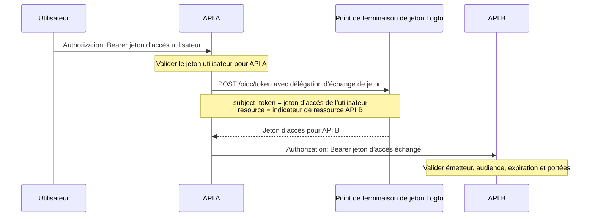

import TokenExchangePrerequisites from './fragments/_token-exchange-prerequisites.mdx';

# Délégation service à service

Dans certaines architectures d’API, un service backend reçoit une requête d’un utilisateur connecté et doit appeler un autre service backend tout en préservant l’identité de l’utilisateur.

Par exemple :

```text
Utilisateur -> API A -> API B
```

API B doit connaître deux choses :

1. L’appelant est un service de confiance, tel que API A.
2. L’opération est effectuée pour l’utilisateur d’origine.

Utilisez la délégation d’échange de jeton de Logto pour échanger le jeton d’accès de l’utilisateur contre un nouveau jeton d’accès dont l’audience est la ressource API en aval. Cela suit le modèle d’échange de jeton OAuth 2.0 et évite de transmettre le jeton utilisateur d’origine aux services en aval.

## Quand utiliser ce flux \{#when-to-use-this-flow}

Utilisez la délégation service à service lorsque :

- API A est un service backend qui peut s’authentifier de manière sécurisée auprès du point de terminaison de jeton de Logto.
- API A reçoit un jeton d’accès utilisateur émis par Logto.
- API A doit appeler API B au nom du même utilisateur.
- API B doit valider un jeton d’accès avec sa propre ressource API comme audience.

N’utilisez pas ce flux pour un accès purement machine à machine sans utilisateur. Dans ce cas, utilisez le [flux client credentials](/quick-starts/m2m). Pour les scénarios de support, d’administration ou d’agent où un utilisateur agit temporairement en tant qu’un autre utilisateur, utilisez [usurpation d’identité utilisateur](/developers/user-impersonation).

## Fonctionnement \{#how-it-works}



Le jeton d’accès échangé représente l’utilisateur d’origine (`sub`) et est lié à la ressource API en aval (`aud`). L’API en aval peut également inspecter la revendication `client_id` pour identifier l’application qui a initié l’échange.

## Prérequis \{#prerequisites}

1. Créez des ressources API pour les services concernés. Voir [Protéger les ressources API globales](/authorization/global-api-resources).
2. Configurez les permissions d’API B et assignez-les aux utilisateurs via des rôles ou des rôles d’organisation.
3. Utilisez une application côté serveur pour API A, telle qu’une application machine à machine ou une application web traditionnelle, afin qu’elle puisse s’authentifier de manière sécurisée avec un secret d’application.
4. Activez l’échange de jeton pour l’application d’API A.

<TokenExchangePrerequisites />

## Demander un jeton d’accès pour l’API en aval \{#request-an-access-token-for-the-downstream-api}

Lorsque API A doit appeler API B, effectuez une demande d’échange de jeton au [point de terminaison de jeton](/integrate-logto/application-data-structure#token-endpoint) de Logto.

Pour les applications web traditionnelles ou les applications machine à machine avec un secret d’application, incluez les identifiants dans l’en-tête `Authorization` :

```bash
POST /oidc/token HTTP/1.1
Host: tenant.logto.app
Content-Type: application/x-www-form-urlencoded
# highlight-next-line
Authorization: Basic <base64(api-a-app-id:api-a-app-secret)>

grant_type=urn:ietf:params:oauth:grant-type:token-exchange
&subject_token=<user_access_token_received_by_api_a>
&subject_token_type=urn:ietf:params:oauth:token-type:access_token
&resource=https://api-b.example.com
&scope=read:orders
```

Paramètres :

1. `grant_type` : Utilisez `urn:ietf:params:oauth:grant-type:token-exchange`.
2. `subject_token` : Le jeton d’accès utilisateur émis par Logto et reçu par API A.
3. `subject_token_type` : Utilisez `urn:ietf:params:oauth:token-type:access_token`.
4. `resource` : L’indicateur de ressource API de API B.
5. `scope` : Les permissions en aval qu’API A demande pour cet appel délégué. Logto n’émet que les portées demandées qui sont disponibles pour l’utilisateur d’origine pour cette ressource selon les paramètres RBAC.

Logto retourne un jeton d’accès pour API B :

```json
{
  "access_token": "eyJhbGci...<truncated>",
  "token_type": "Bearer",
  "expires_in": 3600,
  "scope": "read:orders"
}
```

Une fois décodé, le jeton d’accès inclut des revendications similaires à :

```json
{
  "sub": "user_id",
  "client_id": "api_a_app_id",
  "iss": "https://tenant.logto.app/oidc",
  "aud": "https://api-b.example.com",
  "scope": "read:orders",
  "exp": 1760000000
}
```

API A appelle ensuite API B avec le jeton échangé :

```bash
GET /orders HTTP/1.1
Host: api-b.example.com
Authorization: Bearer <exchanged_access_token>
```

## Valider le jeton dans API B \{#validate-the-token-in-api-b}

API B doit valider le jeton échangé comme tout jeton d’accès de ressource API émis par Logto :

1. Vérifiez la signature à l’aide des JWKs de Logto.
2. Vérifiez l’émetteur (`iss`).
3. Vérifiez que l’audience (`aud`) correspond à l’indicateur de ressource d’API B.
4. Vérifiez l’expiration (`exp`).
5. Vérifiez les portées requises.
6. Utilisez `sub` comme identifiant utilisateur d’origine.
7. Vérifiez éventuellement `client_id` si seuls certains services en amont sont autorisés à effectuer des appels délégués.

Voir [Valider les jetons d’accès dans l’API](/authorization/validate-access-tokens) pour des conseils d’implémentation.

## Ressources associées \{#related-resources}

<Url href="/authorization/global-api-resources">Protéger les ressources API globales</Url>

<Url href="/authorization/validate-access-tokens">Valider les jetons d’accès dans l’API</Url>

<Url href="/developers/user-impersonation">Usurpation d’identité utilisateur</Url>
