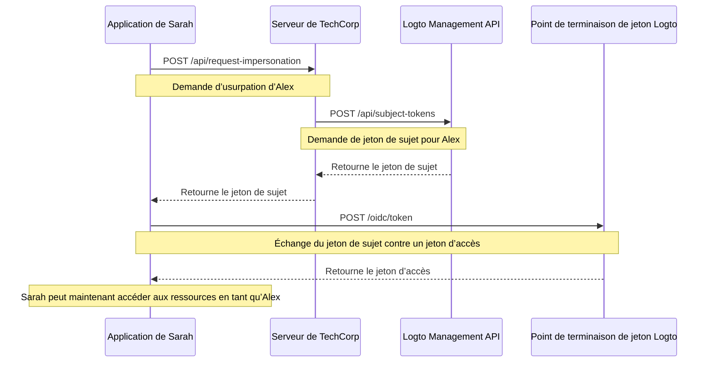

# Usurpation d’identité utilisateur

Imaginez Sarah, une ingénieure support chez TechCorp, qui reçoit un ticket urgent d’Alex, un client qui ne peut pas accéder à une ressource critique. Pour diagnostiquer et résoudre efficacement le problème, Sarah doit voir exactement ce qu’Alex voit dans le système. C’est là que la fonctionnalité d’usurpation d’identité utilisateur de Logto devient précieuse.

L’usurpation d’identité utilisateur permet à des utilisateurs autorisés comme Sarah d’agir temporairement au nom d’autres utilisateurs comme Alex dans le système. Cette fonctionnalité puissante est inestimable pour le dépannage, le support client et l’exécution de tâches administratives.

## Comment ça fonctionne ? \{#how-it-works}



Le processus d’usurpation implique trois étapes principales :

1. Sarah demande l’usurpation via le serveur backend de TechCorp
2. Le serveur de TechCorp obtient un jeton de sujet auprès du Management API de Logto
3. L’application de Sarah échange ce jeton de sujet contre un jeton d’accès

Voyons comment Sarah peut utiliser cette fonctionnalité pour aider Alex.

### Étape 1 : Demander l’usurpation \{#step-1-requesting-impersonation}

Tout d’abord, l’application de support de Sarah doit demander l’usurpation au serveur backend de TechCorp.

**Requête (application de Sarah vers le serveur de TechCorp)**

```bash
POST /api/request-impersonation HTTP/1.1
Host: api.techcorp.com
Authorization: Bearer <Sarah's_access_token>
Content-Type: application/json

{
  "userId": "alex123",
  "reason": "Investigating resource access issue",
  "ticketId": "TECH-1234"
}
```

Dans cette API, le backend doit effectuer des vérifications d’autorisation appropriées pour s’assurer que Sarah dispose des permissions nécessaires pour usurper Alex.

### Étape 2 : Obtenir un jeton de sujet \{#step-2-obtaining-a-subject-token}

Après avoir validé la demande de Sarah, le serveur de TechCorp appellera le [Management API](/integrate-logto/interact-with-management-api) de Logto pour obtenir un jeton de sujet.

**Requête (serveur de TechCorp vers le Management API de Logto)**

```bash
POST /api/subject-tokens HTTP/1.1
Host: techcorp.logto.app
Authorization: Bearer <TechCorp_m2m_access_token>
Content-Type: application/json

{
  "userId": "alex123",
  "context": {
    "ticketId": "TECH-1234",
    "reason": "Resource access issue",
    "supportEngineerId": "sarah789"
  }
}
```

**Réponse (Logto vers le serveur de TechCorp)**

```json
{
  "subjectToken": "sub_7h32jf8sK3j2",
  "expiresIn": 600
}
```

Le serveur de TechCorp doit ensuite retourner ce jeton de sujet à l’application de Sarah.

**Réponse (serveur de TechCorp vers l’application de Sarah)**

```json
{
  "subjectToken": "sub_7h32jf8sK3j2",
  "expiresIn": 600
}
```

### Étape 3 : Échanger le jeton de sujet contre un jeton d’accès \{#step-3-exchanging-the-subject-token-for-an-access-token}

L’application de Sarah échange maintenant ce jeton de sujet contre un jeton d’accès représentant Alex, en spécifiant la ressource où le jeton sera utilisé.

**Requête (application de Sarah vers le point de terminaison de jeton Logto)**

```bash
POST /oidc/token HTTP/1.1
Host: techcorp.logto.app
Content-Type: application/x-www-form-urlencoded

grant_type=urn:ietf:params:oauth:grant-type:token-exchange
&client_id=techcorp_support_app
&scope=resource:read
&subject_token=alx_7h32jf8sK3j2
&subject_token_type=urn:ietf:params:oauth:token-type:access_token
&resource=https://api.techcorp.com/customer-data
```

**Réponse (Logto vers l’application de Sarah)**

```json
{
  "access_token": "eyJhbG...<truncated>",
  "issued_token_type": "urn:ietf:params:oauth:token-type:access_token",
  "token_type": "Bearer",
  "expires_in": 3600,
  "scope": "resource:read"
}
```

Le `access_token` retourné sera lié à la ressource spécifiée, garantissant qu’il ne peut être utilisé qu’avec l’API de données clients de TechCorp.

**Remarque** : Pour les applications web traditionnelles, incluez `client_id` et `client_secret` dans l’en-tête de la requête de jeton pour éviter une erreur 401 invalid_client.

Voici un exemple Node.js :

```json
Authorization: `Basic ${Buffer.from(`${client_id}:${client_secret}`, 'utf8').toString('base64')}`
```

## Exemple d’utilisation \{#example-usage}

Voici comment Sarah pourrait utiliser cela dans une application de support Node.js :

```jsx
interface ImpersonationResponse {
  subjectToken: string;
  expiresIn: number;
}

interface TokenExchangeResponse {
  access_token: string;
  issued_token_type: string;
  token_type: string;
  expires_in: number;
  scope: string;
}

async function impersonateUser(
  userId: string,
  clientId: string,
  ticketId: string,
  resource: string
): Promise<string> {
  try {
    // Étapes 1 & 2 : Demander l’usurpation et obtenir le jeton de sujet
    const impersonationResponse = await fetch(
      'https://api.techcorp.com/api/request-impersonation',
      {
        method: 'POST',
        headers: {
          Authorization: "Bearer <Sarah's_access_token>",
          'Content-Type': 'application/json',
        },
        body: JSON.stringify({
          userId,
          reason: 'Investigating resource access issue',
          ticketId,
        }),
      }
    );

    if (!impersonationResponse.ok) {
      throw new Error(`HTTP error occurred. Status: ${impersonationResponse.status}`);
    }

    const { subjectToken } = (await impersonationResponse.json()) as ImpersonationResponse;

    // Étape 3 : Échanger le jeton de sujet contre un jeton d’accès
    const tokenExchangeBody = new URLSearchParams({
      grant_type: 'urn:ietf:params:oauth:grant-type:token-exchange',
      client_id: clientId,
      scope: 'openid profile resource.read',
      subject_token: subjectToken,
      subject_token_type: 'urn:ietf:params:oauth:token-type:access_token',
      resource: resource,
    });

    const tokenExchangeResponse = await fetch('https://techcorp.logto.app/oidc/token', {
      method: 'POST',
      headers: { 'Content-Type': 'application/x-www-form-urlencoded' },
      body: tokenExchangeBody,
    });

    if (!tokenExchangeResponse.ok) {
      throw new Error(`HTTP error! status: ${tokenExchangeResponse.status}`);
    }

    const tokenData = (await tokenExchangeResponse.json()) as TokenExchangeResponse;
    return tokenData.access_token;
  } catch (error) {
    console.error('Impersonation failed:', error);
    throw error;
  }
}

// Sarah utilise cette fonction pour usurper l’identité d’Alex
async function performImpersonation(): Promise<void> {
  try {
    const accessToken = await impersonateUser(
      'alex123',
      'techcorp_support_app',
      'TECH-1234',
      'https://api.techcorp.com/customer-data'
    );
    console.log('Impersonation access token for Alex:', accessToken);
  } catch (error) {
    console.error('Failed to perform impersonation:', error);
  }
}

// Exécuter l’usurpation
void performImpersonation()
```

:::note

1. Le jeton de sujet est de courte durée et à usage unique.
2. Le jeton d’accès d’usurpation ne s’accompagne pas d’un [jeton de rafraîchissement (Refresh token)](https://auth.wiki/refresh-token). Sarah devra répéter ce processus si le jeton expire avant qu’elle ne résolve le problème d’Alex.
3. Le serveur backend de TechCorp doit mettre en œuvre des vérifications d’autorisation appropriées pour s’assurer que seuls les membres du support autorisés comme Sarah peuvent demander une usurpation.

:::

## Revendication `act` \{#act-claim}

Lors de l’utilisation du flux d’échange de jetons pour l’usurpation, le jeton d’accès émis peut inclure une revendication supplémentaire `act` (acteur). Cette revendication représente l’identité de la "partie agissante" — dans notre exemple, Sarah, qui effectue l’usurpation.

Pour inclure la revendication `act`, l’application de Sarah doit fournir un `actor_token` dans la requête d’échange de jeton. Ce jeton doit être un jeton d’accès valide pour Sarah avec la portée `openid`. Voici comment l’inclure dans la requête d’échange de jeton :

```bash
POST /oidc/token HTTP/1.1
Host: techcorp.logto.app
Content-Type: application/x-www-form-urlencoded

grant_type=urn:ietf:params:oauth:grant-type:token-exchange
&client_id=techcorp_support_app
&scope=resource:read
&subject_token=alx_7h32jf8sK3j2
&subject_token_type=urn:ietf:params:oauth:token-type:access_token
&actor_token=sarah_access_token
&actor_token_type=urn:ietf:params:oauth:token-type:access_token
&resource=https://api.techcorp.com/customer-data
```

Si un `actor_token` est fourni, le jeton d’accès résultant contiendra une revendication `act` comme ceci :

```json
{
  "aud": "https://api.techcorp.com",
  "iss": "https://techcorp.logto.app",
  "exp": 1443904177,
  "sub": "alex123",
  "act": {
    "sub": "sarah789"
  }
}
```

Cette revendication `act` indique clairement que Sarah (sarah789) agit au nom d’Alex (alex123). La revendication `act` peut être utile pour l’audit et le suivi des actions d’usurpation.

## Personnalisation des revendications de jeton \{#customizing-token-claims}

Logto vous permet de [personnaliser les revendications de jeton](/developers/custom-token-claims) pour les jetons d’usurpation. Cela peut être utile pour ajouter du contexte ou des métadonnées supplémentaires au processus d’usurpation, comme la raison de l’usurpation ou le ticket de support associé.

Lorsque le serveur de TechCorp demande un jeton de sujet au Management API de Logto, il peut inclure un objet `context` :

```json
{
  "userId": "alex123",
  "context": {
    "ticketId": "TECH-1234",
    "reason": "Resource access issue",
    "supportEngineerId": "sarah789"
  }
}
```

Ce [contexte](/developers/custom-token-claims/create-script#context-only-available-for-user-access-token) peut ensuite être utilisé dans une fonction `getCustomJwtClaims()` pour ajouter des revendications spécifiques au jeton d’accès final. Voici un exemple d’implémentation :

```tsx
const getCustomJwtClaims = async ({ token, context, environmentVariables }) => {
  if (context.grant?.type === 'urn:ietf:params:oauth:grant-type:token-exchange') {
    const { ticketId, reason, supportEngineerId } = context.grant.subjectTokenContext;
    return {
      impersonation_context: {
        ticket_id: ticketId,
        reason: reason,
        support_engineer: supportEngineerId,
      },
    };
  }
  return {};
};
```

Le jeton d’accès résultant que Sarah reçoit pourrait ressembler à ceci :

```json
{
  "sub": "alex123",
  "aud": "https://api.techcorp.com/customer-data",
  "impersonation_context": {
    "ticket_id": "TECH-1234",
    "reason": "Resource access issue",
    "support_engineer": "sarah789"
  }
  // ... autres revendications standard
}
```

En personnalisant ainsi les revendications des jetons d’accès, TechCorp peut inclure des informations précieuses sur le contexte d’usurpation, ce qui facilite l’audit et la compréhension des activités d’usurpation dans leur système.

:::note
Soyez prudent lors de l’ajout de revendications personnalisées à vos jetons. Évitez d’inclure des informations sensibles qui pourraient présenter des risques de sécurité si le jeton est intercepté ou divulgué. Les JWT sont signés mais non chiffrés, donc les revendications sont visibles par toute personne ayant accès au jeton.
:::

## Ressources associées

<Url href="https://blog.logto.io/impersonation">
  Qu’est-ce que l’usurpation d’identité en cybersécurité et gestion des identités ? Comment les
  agents IA peuvent-ils l’utiliser ?
</Url>
