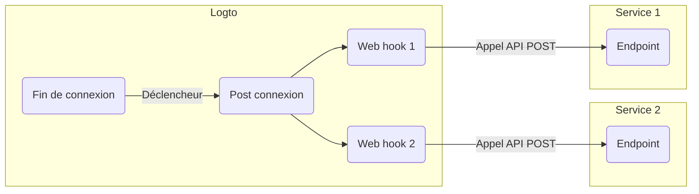

# Webhooks

Les [Webhooks](https://auth.wiki/webhook) de Logto fournissent des notifications en temps réel pour divers événements, y compris les modifications apportées au [compte utilisateur](/user-management/user-data), au [rôle](/authorization/role-based-access-control#roles), à la [permission](/authorization/role-based-access-control#permissionsscopes), à l'[organisation](/organizations/organization-data), au [rôle d'organisation](/authorization/organization-template#organization-role), à la [permission d'organisation](/authorization/organization-template#organization-permission), et à l'[interaction utilisateur](/end-user-flows).

Lorsqu'un événement est déclenché, Logto envoie une requête HTTP à l'URL de l'Endpoint que vous fournissez, contenant des informations détaillées sur l'événement, telles que l'ID utilisateur, le nom d'utilisateur, l'e-mail et d'autres détails pertinents (pour en savoir plus sur les données incluses dans la charge utile et l'en-tête, consultez [Requête Webhook](/developers/webhooks/webhooks-request)). Votre application peut traiter cette requête et prendre des actions personnalisées, comme envoyer un e-mail ou mettre à jour des données dans une base de données.

Nous ajoutons continuellement plus d'événements en fonction des besoins des utilisateurs. Si vous avez des exigences spécifiques pour votre entreprise, veuillez nous le faire savoir.

## Pourquoi utiliser les Webhooks ?

Les Webhooks offrent une communication en temps réel entre les applications, éliminant le besoin de sondage et permettant des mises à jour de données immédiates. Ils simplifient l'intégration des applications et l'automatisation des flux de travail sans code complexe ou API propriétaires.

Voici quelques exemples d'utilisations courantes des Webhooks pour le CIAM :

- **Envoyer des e-mails :** Configurez un Webhook pour envoyer un e-mail de bienvenue aux nouveaux utilisateurs lors de l'inscription ou pour notifier les administrateurs lorsqu'un utilisateur se connecte depuis un nouvel appareil ou emplacement.
- **Envoyer des notifications :** Configurez un Webhook pour déclencher un assistant virtuel avec votre système CRM pour fournir un support client en temps réel lorsque les utilisateurs s'inscrivent.
- **Effectuer des appels API supplémentaires :** Configurez un Webhook pour vérifier l'accès utilisateur en vérifiant leur domaine de messagerie ou adresse IP, puis utilisez le Management API de Logto pour attribuer les rôles appropriés avec des permissions de ressources.
- **Synchronisation des données :** Configurez un Webhook pour garder l'application à jour sur les changements tels que les suspensions ou suppressions de comptes utilisateurs.
- **Générer des rapports :** Configurez un Webhook pour recevoir des données d'activité de connexion utilisateur et les utiliser pour créer des rapports sur l'engagement ou les habitudes d'utilisation des utilisateurs.

## Termes

| Élément                                                                                                                                                                                                                            | Description                                                                                                                                                                                                                                                      |
| ---------------------------------------------------------------------------------------------------------------------------------------------------------------------------------------------------------------------------------- | ---------------------------------------------------------------------------------------------------------------------------------------------------------------------------------------------------------------------------------------------------------------- |
| Événement                                                                                                                                                                                                                          | Lorsqu'une action spécifique est effectuée, elle déclenchera un événement de hook avec un type spécifique. Par exemple, Logto émettra un événement de hook PostRegister lorsque l'utilisateur aura terminé le processus d'inscription et créé un nouveau compte. |
| Hook                                                                                                                                                                                                                               | Une ou plusieurs actions qui se connectent à un événement spécifique. L'action peut être un appel API, l'exécution de fragments de code, etc.                                                                                                                    |
| Webhook                                                                                                                                                                                                                            | Un sous-type de hook qui indique l'appel d'une API avec la charge utile de l'événement.                                                                                                                                                                          |
| Supposons qu'un développeur veuille envoyer une notification lorsqu'un utilisateur se connecte via un nouvel appareil, le développeur peut ajouter un webhook qui appelle son API de service de sécurité à l'événement PostSignIn. |

Voici un exemple d'activation de deux webhooks pour l'événement `PostSignIn` dans Logto :

## FAQs

### Logto prend-il en charge les webhooks synchronisés ?

Bien que les webhooks synchronisés rendraient le flux de connexion utilisateur plus fluide, nous ne les prenons pas encore en charge (nous le ferons à l'avenir). Par conséquent, les scénarios qui reposent sur des webhooks synchronisés nécessitent actuellement tous des solutions de contournement différentes. Si vous avez des questions, n'hésitez pas à nous contacter.

### Comment gérer le changement de permission utilisateur ?

Voir le guide [Gérer le changement de permission utilisateur](/authorization/role-based-access-control/protect-api-resources-with-rbac/#optional-handle-user-permission-change).

### Comment déboguer le délai d'attente du webhook ?

Pour l'endpoint recevant les Webhooks, il doit renvoyer une réponse 2xx aussi rapidement que possible pour indiquer à Logto que le Webhook a été reçu avec succès. Étant donné que différents utilisateurs ont des logiques de traitement très différentes pour les Webhooks, des tâches excessivement complexes peuvent prendre plusieurs secondes, provoquant le délai d'attente du Webhook de Logto. La meilleure pratique consiste à maintenir votre propre file d'attente d'événements ; lors de la réception du Webhook de Logto, insérez l'événement dans la file d'attente et renvoyez une réponse 2xx à Logto. Ensuite, laissez votre propre travailleur traiter les tâches dans la file d'attente étape par étape. Si le travailleur rencontre une erreur, gérez-la sur votre propre serveur.

### Puis-je obtenir l'adresse IP du client à partir des webhooks `PostSignIn` ?

Oui, vous pouvez obtenir l'adresse IP, les agents utilisateurs, etc., dans la charge utile du Webhook. Si vous avez besoin d'informations qui ne sont pas actuellement prises en charge, vous pouvez créer des demandes de fonctionnalités sur les issues GitHub, ou nous contacter.

## Ressources connexes

<Url href="https://blog.logto.io/webhooks-vs-polling">Webhooks vs. polling</Url>
