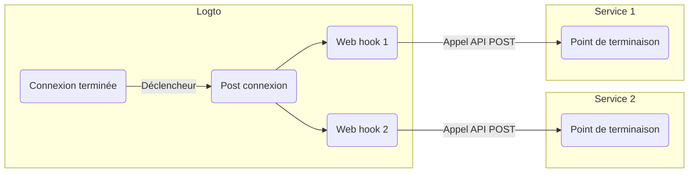

# Webhooks

Les [Webhooks](https://auth.wiki/webhook) Logto fournissent des notifications en temps réel pour divers événements, notamment les modifications des comptes utilisateurs, rôles, permissions, organisations, rôles d'organisation, permissions d'organisation, et [interactions utilisateur](/end-user-flows).

Lorsqu'un événement est déclenché, Logto envoie une requête HTTP à l'URL de point de terminaison que vous fournissez, contenant des informations détaillées sur l'événement, telles que l'ID utilisateur, le nom d'utilisateur, l'e-mail et d'autres détails pertinents (pour plus d'informations sur les données incluses dans la charge utile et l'en-tête, consultez [Requête Webhook](/developers/webhooks/webhooks-request)). Votre application peut traiter cette requête et effectuer des actions personnalisées, comme envoyer un e-mail ou mettre à jour des données dans une base de données.

Nous ajoutons continuellement de nouveaux événements en fonction des besoins des utilisateurs. Si vous avez des besoins spécifiques pour votre entreprise, n'hésitez pas à nous le faire savoir.

## Pourquoi utiliser un Webhook ? \{#why-use-webhook}

Les Webhooks offrent une communication en temps réel entre les applications, éliminant le besoin de scruter et permettant des mises à jour immédiates des données. Ils simplifient l'intégration des applications et l'automatisation des flux de travail sans code complexe ni API propriétaire.

Voici quelques exemples d'utilisations courantes des Webhooks pour le CIAM :

- **Envoyer des e-mails :** Configurez un Webhook pour envoyer un e-mail de bienvenue aux nouveaux utilisateurs lors de l'inscription ou pour notifier les administrateurs lorsqu'un utilisateur se connecte depuis un nouvel appareil ou une nouvelle localisation.
- **Envoyer des notifications :** Configurez un Webhook pour déclencher un assistant virtuel avec votre système CRM afin de fournir une assistance client en temps réel lors de l'inscription des utilisateurs.
- **Effectuer des appels API supplémentaires** : Configurez un Webhook pour vérifier l'accès utilisateur en contrôlant leur domaine e-mail ou adresse IP, puis utilisez la Management API Logto pour attribuer les rôles appropriés avec les permissions de ressources.
- **Synchronisation des données :** Configurez un Webhook pour tenir l'application informée des changements tels que la suspension ou la suppression de comptes utilisateurs.
- **Générer des rapports :** Configurez un Webhook pour recevoir les données d'activité de connexion des utilisateurs et les exploiter pour créer des rapports sur l'engagement ou les habitudes d'utilisation.

## Termes \{#terms}

| Élément                                                                                                                                                                         | Description                                                                                                                                                                                                 |
| ------------------------------------------------------------------------------------------------------------------------------------------------------------------------------ | ----------------------------------------------------------------------------------------------------------------------------------------------------------------------------------------------------------- |
| Événement (Event)                                                                                                                                                              | Lorsqu'une action spécifique est effectuée, elle déclenche un événement hook d'un type spécifique. Par exemple, Logto émettra un événement hook PostRegister lorsque l'utilisateur termine le processus d'inscription et crée un nouveau compte. |
| Hook                                                                                                                                                                           | Une ou plusieurs actions qui s'accrochent à un événement spécifique. L'action peut consister à appeler une API, exécuter des extraits de code, etc.                                                         |
| Webhook                                                                                                                                                                        | Un sous-type de hook qui consiste à appeler une API avec la charge utile de l'événement.                                                                                                                    |
| Supposons qu'un développeur souhaite envoyer une notification lorsqu'un utilisateur se connecte via un nouvel appareil, il peut ajouter un webhook qui appelle son API de service de sécurité à l'événement PostSignIn. |

Voici un exemple d'activation de deux webhooks pour l'événement `PostSignIn` dans Logto :

## FAQ \{#faqs}

### Logto prend-il en charge les webhooks synchrones ? \{#does-logto-support-synced-webhooks}

Bien que les webhooks synchrones rendraient le flux de connexion utilisateur plus fluide, nous ne les prenons pas encore en charge (cela viendra à l'avenir). Par conséquent, les scénarios qui reposent actuellement sur des webhooks synchrones nécessitent tous des solutions alternatives. Si vous avez des questions, n'hésitez pas à nous contacter.

### Comment gérer le changement de permission utilisateur ? \{#how-to-deal-with-user-permission-change}

Voir le guide [Gérer le changement de permission utilisateur](/authorization/global-api-resources/#optional-handle-user-permission-change).

### Comment déboguer un timeout de webhook ? \{#how-to-debug-webhook-timeout}

Pour le point de terminaison recevant les Webhooks, il doit retourner une réponse 2xx aussi rapidement que possible pour indiquer à Logto que le Webhook a bien été reçu. Comme chaque utilisateur a une logique de traitement très différente pour les Webhooks, des tâches trop complexes peuvent prendre plusieurs secondes, provoquant un timeout du Webhook Logto. La meilleure pratique consiste à maintenir votre propre file d'attente d'événements ; dès réception du Webhook Logto, insérez l'événement dans la file d'attente et retournez une réponse 2xx à Logto. Ensuite, laissez votre propre worker traiter les tâches dans la file d'attente étape par étape. Si le worker rencontre une erreur, gérez-la sur votre propre serveur.

### Puis-je obtenir l'adresse IP du client depuis les webhooks `PostSignIn` ? \{#can-i-get-the-client-ip-address-from-postsignin-webhooks}

Oui, vous pouvez obtenir l'adresse IP, les user agents, etc. dans la charge utile du Webhook. Si vous avez besoin d'informations qui ne sont pas encore prises en charge, vous pouvez créer une demande de fonctionnalité sur GitHub issues, ou nous contacter.

## Ressources associées \{#related-resources}

<Url href="https://blog.logto.io/webhooks-vs-polling">Webhooks vs. polling</Url>
