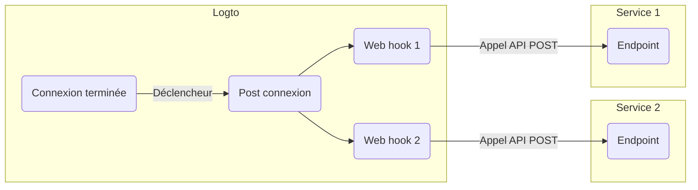

# Webhooks

Les [Webhooks](https://auth.wiki/webhook) Logto fournissent des notifications en temps réel pour divers événements, notamment les modifications des comptes utilisateurs, des rôles, des permissions, des organisations, des rôles d'organisation, des permissions d'organisation et des [interactions utilisateur](/end-user-flows).

Lorsqu'un événement est déclenché, Logto envoie de manière asynchrone une requête HTTP à l'URL de point de terminaison que vous fournissez. La requête contient des détails sur l'événement, tels que l'utilisateur, l'application et le contexte de la requête. Voir [Requête Webhook](/developers/webhooks/webhooks-request) pour la référence du payload et des en-têtes.

La livraison du Webhook a lieu en dehors de la requête d’authentification et ne peut pas modifier le résultat du flux en cours. Pour du code synchrone qui doit s’exécuter avant que la connexion ne se poursuive, utilisez les [Actions](/developers/actions).

Nous ajoutons continuellement de nouveaux événements en fonction des besoins des utilisateurs. Si vous avez des exigences spécifiques pour votre entreprise, n'hésitez pas à nous en faire part.

## Pourquoi utiliser un Webhook ? \{#why-use-webhook}

Les Webhooks offrent une communication en temps réel entre les applications, éliminant le besoin de polling et permettant des mises à jour immédiates des données. Ils simplifient l'intégration des applications et l'automatisation des workflows sans code complexe ni API propriétaire.

Voici quelques exemples d’utilisations courantes des Webhooks pour le CIAM :

- **Envoyer des e-mails :** Configurez un Webhook pour envoyer un e-mail de bienvenue aux nouveaux utilisateurs lors de l'inscription ou pour notifier les administrateurs lorsqu'un utilisateur se connecte depuis un nouvel appareil ou une nouvelle localisation.
- **Envoyer des notifications :** Configurez un Webhook pour déclencher un assistant virtuel avec votre système CRM afin de fournir une assistance client en temps réel lors de l'inscription des utilisateurs.
- **Effectuer des appels API supplémentaires :** Configurez un Webhook pour vérifier l'accès utilisateur en contrôlant leur domaine e-mail ou leur adresse IP, puis utilisez la Management API Logto pour attribuer les rôles appropriés avec les permissions de ressource.
- **Synchronisation des données :** Configurez un Webhook pour tenir l'application informée des changements tels que la suspension ou la suppression de comptes utilisateurs.
- **Générer des rapports :** Configurez un Webhook pour recevoir les données d'activité de connexion des utilisateurs et les exploiter pour créer des rapports sur l'engagement ou les habitudes d'utilisation.

## Termes \{#terms}

| Élément           | Description                                                                                              |
| ----------------- | -------------------------------------------------------------------------------------------------------- |
| Événement Webhook | Un type d'événement pris en charge que Logto peut transmettre, tel que `PostSignIn` ou `User.Created`.   |
| Webhook           | Une configuration qui s'abonne à un ou plusieurs événements et envoie leurs payloads à un endpoint HTTP. |

Par exemple, pour notifier un service de sécurité après la connexion d'un utilisateur, créez un Webhook qui s'abonne à `PostSignIn`.

Voici un exemple d'activation de deux Webhooks pour l'événement `PostSignIn` dans Logto :

```mermaid
graph LR
  subgraph Logto
    SF(Connexion terminée)
    PS(Post connexion)
    WH2(Web hook 2)
    WH1(Web hook 1)
  end

  subgraph Service 2
    E2(Endpoint)
  end

  subgraph Service 1
    E1(Endpoint)
  end

  SF -->|Déclencheur| PS
  PS --> WH1
  PS --> WH2
  WH1 --->|Appel API POST| E1
  WH2 --->|Appel API POST| E2

```

## FAQ \{#faqs}

### Les Webhooks peuvent-ils prendre une décision d’authentification synchrone ? \{#does-logto-support-synced-webhooks}

Non. Les Webhooks sont des notifications asynchrones, leur réponse ne peut donc pas autoriser, bloquer ou modifier le flux d’authentification en cours.

Utilisez les [Actions](/developers/actions) lorsque Logto doit exécuter du code personnalisé, appeler une API externe ou mettre à jour un utilisateur avant que la connexion ne se poursuive. Comme les Actions sont synchrones, veillez à ce que leurs dépendances externes soient rapides et fiables.

### Comment gérer un changement de permission utilisateur ? \{#how-to-deal-with-user-permission-change}

Voir le guide [Gérer le changement de permission utilisateur](/authorization/global-api-resources/#optional-handle-user-permission-change).

### Comment déboguer un timeout de Webhook ? \{#how-to-debug-webhook-timeout}

Pour le point de terminaison recevant les Webhooks, il doit retourner une réponse 2xx aussi rapidement que possible pour indiquer à Logto que le Webhook a bien été reçu. Comme chaque utilisateur a une logique de traitement des Webhooks très différente, des tâches trop complexes peuvent prendre plusieurs secondes, provoquant un timeout du Webhook Logto. La meilleure pratique consiste à maintenir votre propre file d’attente d’événements : à la réception du Webhook Logto, insérez l’événement dans la file d’attente et retournez une réponse 2xx à Logto. Ensuite, laissez votre propre worker traiter les tâches de la file d’attente étape par étape. Si le worker rencontre une erreur, gérez-la sur votre propre serveur.

### Puis-je obtenir l’adresse IP du client depuis les webhooks `PostSignIn` ? \{#can-i-get-the-client-ip-address-from-postsignin-webhooks}

Oui, vous pouvez obtenir l’adresse IP, les user agents, etc. dans le payload du Webhook. Si vous avez besoin d’informations qui ne sont pas encore prises en charge, vous pouvez créer une demande de fonctionnalité sur GitHub issues ou nous contacter.

## Ressources associées \{#related-resources}

<Url href="https://blog.logto.io/webhooks-vs-polling">Webhooks vs. polling</Url>
