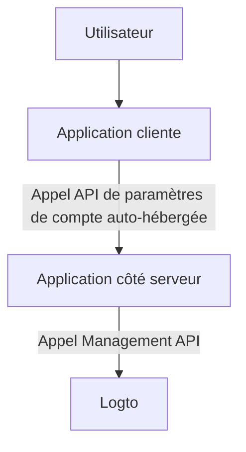
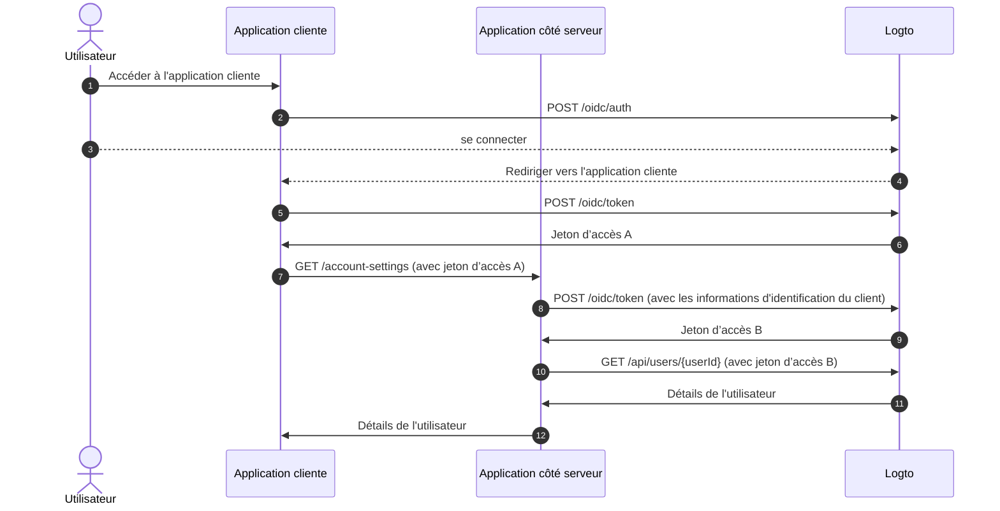
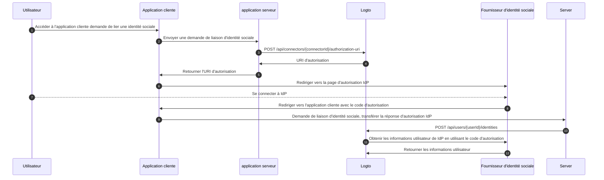

# Paramètres de compte via Management API

## Intégrations \{#integrations}

Logto fournit diverses Management API pour gérer les comptes utilisateurs. Vous pouvez utiliser ces API pour créer une page de paramètres de compte en libre-service pour les utilisateurs finaux.

### Architecture \{#architecture}

1. **Utilisateur** : Utilisateur authentifié qui doit accéder et gérer ses paramètres de compte.
2. **Application cliente** : Votre application cliente qui sert la page des paramètres de compte à l'utilisateur.
3. **Application côté serveur** : Application côté serveur qui fournit l'API des paramètres de compte au client. Interagit avec la Management API de Logto.
4. **Logto** : Logto en tant que service d'authentification et d'autorisation. Fournit la Management API pour gérer les comptes utilisateurs.

### Diagramme de séquence \{#sequence-diagram}

1. L'utilisateur accède à l'application cliente.
2. L'application cliente envoie la requête d’authentification à Logto et redirige l'utilisateur vers la page de connexion de Logto.
3. L'utilisateur se connecte à Logto.
4. L'utilisateur authentifié est redirigé vers l'application cliente avec le code d'autorisation.
5. L'application cliente demande le jeton d’accès à Logto pour l'accès à l'API des paramètres de compte auto-hébergée.
6. Logto accorde le jeton d’accès à l'application cliente.
7. L'application cliente envoie la requête des paramètres de compte à l'application côté serveur avec le jeton d’accès de l'utilisateur.
8. L'application côté serveur vérifie l'identité et la permission du demandeur à partir du jeton d’accès de l'utilisateur. Puis demande un jeton d’accès Management API à Logto.
9. Logto accorde le jeton d’accès Management API à l'application côté serveur.
10. L'application côté serveur demande les données de l'utilisateur à Logto en utilisant le jeton d’accès Management API.
11. Logto vérifie l'identité du serveur et la permission Management API et renvoie les données de l'utilisateur.
12. L'application côté serveur traite les données de l'utilisateur en fonction de la permission du demandeur et renvoie les détails du compte utilisateur à l'application cliente.

### Intégrer Management API à l'application côté serveur \{#integrate-management-api-to-server-side-application}

Consultez la section [Management API](/integrate-logto/interact-with-management-api/) pour apprendre comment intégrer les Management APIs avec les applications côté serveur.

## APIs de gestion des utilisateurs \{#user-management-apis}

### Schéma des données utilisateur \{#user-data-schema}

Consultez la section [données utilisateur et données personnalisées](/user-management/user-data/) pour en savoir plus sur le schéma utilisateur dans Logto.

### APIs de gestion des profils et identifiants utilisateur \{#user-profile-and-identifiers-management-apis}

Le profil et les identifiants d'un utilisateur sont essentiels pour la gestion des utilisateurs. Vous pouvez utiliser les APIs suivantes pour gérer les profils et identifiants utilisateur.

| méthode | chemin                                                                                                   | description                                                       |
| ------- | -------------------------------------------------------------------------------------------------------- | ----------------------------------------------------------------- |
| GET     | [/api/users/\{userId\}](https://openapi.logto.io/operation/operation-getuser)                            | Obtenir les détails de l'utilisateur par ID.                      |
| PATCH   | [/api/users/\{userId\}](https://openapi.logto.io/operation/operation-updateuser)                         | Mettre à jour les détails de l'utilisateur.                       |
| PATCH   | [/api/users/\{userId\}/profile](https://openapi.logto.io/operation/operation-updateuserprofile)          | Mettre à jour les champs du profil utilisateur par ID.            |
| GET     | [/api/users/\{userId\}/custom-data](https://openapi.logto.io/operation/operation-listusercustomdata)     | Obtenir les données personnalisées de l'utilisateur par ID.       |
| PATCH   | [/api/users/\{userId\}/custom-data](https://openapi.logto.io/operation/operation-updateusercustomdata)   | Mettre à jour les données personnalisées de l'utilisateur par ID. |
| PATCH   | [/api/users/\{userId\}/is-suspended](https://openapi.logto.io/operation/operation-updateuserissuspended) | Mettre à jour le statut de suspension de l'utilisateur par ID.    |

### Vérification des e-mails et des numéros de téléphone \{#email-and-phone-number-verification}

Dans le système Logto, les adresses e-mail et les numéros de téléphone peuvent servir d'identifiants utilisateur, rendant leur vérification essentielle. Pour cela, nous fournissons un ensemble d'APIs de code de vérification pour aider à vérifier l'e-mail ou le numéro de téléphone fourni.

:::note
Assurez-vous de vérifier l'e-mail ou le numéro de téléphone avant de mettre à jour le profil de l'utilisateur avec un nouvel e-mail ou numéro de téléphone.
:::

| méthode | chemin                                                                                                                           | description                                                           |
| ------- | -------------------------------------------------------------------------------------------------------------------------------- | --------------------------------------------------------------------- |
| POST    | [/api/verifications/verification-code](https://openapi.logto.io/operation/operation-createverificationbyverificationcode)        | Envoyer un code de vérification par e-mail ou numéro de téléphone.    |
| POST    | [/api/verifications/verification-code/verify](https://openapi.logto.io/operation/operation-verifyverificationbyverificationcode) | Vérifier l'e-mail ou le numéro de téléphone par code de vérification. |

### Gestion des mots de passe utilisateur \{#user-password-management}

| méthode | chemin                                                                                                   | description                                              |
| ------- | -------------------------------------------------------------------------------------------------------- | -------------------------------------------------------- |
| POST    | [/api/users/\{userId\}/password/verify](https://openapi.logto.io/operation/operation-verifyuserpassword) | Vérifier le mot de passe actuel de l'utilisateur par ID. |
| PATCH   | [/api/users/\{userId\}/password](https://openapi.logto.io/operation/operation-updateuserpassword)        | Mettre à jour le mot de passe de l'utilisateur par ID.   |
| GET     | [/api/users/\{userId\}/has-password](https://openapi.logto.io/operation/operation-getuserhaspassword)    | Vérifier si l'utilisateur a un mot de passe par ID.      |

:::note
Assurez-vous de vérifier le mot de passe actuel de l'utilisateur avant de mettre à jour le mot de passe de l'utilisateur.
:::

### Gestion des identités sociales utilisateur \{#user-social-identities-management}

| méthode | chemin                                                                                                                            | description                                                                                                                                   |
| ------- | --------------------------------------------------------------------------------------------------------------------------------- | --------------------------------------------------------------------------------------------------------------------------------------------- |
| GET     | [/api/users/\{userId\}](https://openapi.logto.io/operation/operation-getuser)                                                     | Obtenir les détails de l'utilisateur par ID. Les identités sociales peuvent être trouvées dans le champ `identities`.                         |
| POST    | [/api/users/\{userId\}/identities](https://openapi.logto.io/operation/operation-createuseridentity)                               | Lier une identité sociale authentifiée à l'utilisateur par ID.                                                                                |
| DELETE  | [/api/users/\{userId\}/identities](https://openapi.logto.io/operation/operation-deleteuseridentity)                               | Dissocier une identité sociale de l'utilisateur par ID.                                                                                       |
| PUT     | [/api/users/\{userId\}/identities](https://openapi.logto.io/operation/operation-replaceuseridentity)                              | Mettre à jour directement une identité sociale liée à l'utilisateur par ID.                                                                   |
| POST    | [/api/connectors/\{connectorId\}/authorization-uri](https://openapi.logto.io/operation/operation-createconnectorauthorizationuri) | Obtenir l'URI d'autorisation pour un fournisseur d'identité sociale. Utilisez cet URI pour initier une nouvelle connexion d'identité sociale. |

1. L'utilisateur accède à l'application cliente et demande de lier une identité sociale.
2. L'application cliente envoie une demande au serveur pour lier une identité sociale.
3. Le serveur envoie une demande à Logto pour obtenir l'URI d'autorisation pour le fournisseur d'identité sociale. Vous devez fournir votre propre paramètre `state` et `redirect_uri` dans la demande. Assurez-vous d'enregistrer le `redirect_uri` chez le fournisseur d'identité sociale.
4. Logto retourne l'URI d'autorisation au serveur.
5. Le serveur retourne l'URI d'autorisation à l'application cliente.
6. L'application cliente redirige l'utilisateur vers l'URI d'autorisation IdP.
7. L'utilisateur se connecte à l'IdP.
8. L'IdP redirige l'utilisateur vers l'application cliente en utilisant le `redirect_uri` avec le code d'autorisation.
9. L'application cliente valide le `state` et transfère la réponse d'autorisation IdP au serveur.
10. Le serveur envoie une demande à Logto pour lier l'identité sociale à l'utilisateur.
11. Logto obtient les informations utilisateur de l'IdP en utilisant le code d'autorisation.
12. L'IdP retourne les informations utilisateur à Logto et Logto lie l'identité sociale à l'utilisateur.

:::note
Il y a quelques limitations à prendre en compte lors de la liaison de nouvelles identités sociales à un utilisateur :

- Management API n'a pas de contexte de session, tout connecteur social nécessitant une session active pour maintenir en toute sécurité l'état d'authentification sociale ne peut pas être lié via Management API. Les connecteurs non pris en charge incluent apple, OIDC standard et connecteur OAuth 2.0 standard.
- Pour la même raison, Logto ne peut pas vérifier le paramètre `state` dans la réponse d'autorisation. Assurez-vous de stocker le paramètre `state` dans votre application cliente et de le valider lorsque la réponse d'autorisation est reçue.
- Vous devez enregistrer le `redirect_uri` chez le fournisseur d'identité sociale à l'avance. Sinon, l'IdP social ne redirigera pas l'utilisateur vers votre application cliente. Votre IdP social doit accepter plus d'un `redirect_uri` de rappel, un pour la connexion utilisateur, un pour votre propre page de liaison de profil.

:::

### Gestion des identités d'entreprise utilisateur \{#user-enterprise-identities-management}

| méthode | chemin                                                                                                  | description                                                                                                                                                                                                                                |
| ------- | ------------------------------------------------------------------------------------------------------- | ------------------------------------------------------------------------------------------------------------------------------------------------------------------------------------------------------------------------------------------ |
| GET     | [/api/users/\{userId\}?includeSsoIdentities=true](https://openapi.logto.io/operation/operation-getuser) | Obtenir les détails de l'utilisateur par ID. Les identités d'entreprise peuvent être trouvées dans le champ `ssoIdentities`. Ajoutez le paramètre de requête `includeSsoIdentities=true` à l'API des détails utilisateur pour les inclure. |

Actuellement, Management API ne prend pas en charge la liaison ou la dissociation des identités d'entreprise à un utilisateur. Vous pouvez uniquement afficher les identités d'entreprise liées à un utilisateur.

### Jeton d’accès personnel \{#personal-access-token}

| méthode | chemin                                                                                                                               | description                                                    |
| ------- | ------------------------------------------------------------------------------------------------------------------------------------ | -------------------------------------------------------------- |
| GET     | [/api/users/\{userId\}/personal-access-tokens](https://openapi.logto.io/operation/operation-listuserpersonalaccesstokens)            | Obtenir tous les jetons d’accès personnels pour l'utilisateur. |
| POST    | [/api/users/\{userId\}/personal-access-tokens](https://openapi.logto.io/operation/operation-createuserpersonalaccesstoken)           | Ajouter un nouveau jeton d’accès personnel pour l'utilisateur. |
| DELETE  | [/api/users/\{userId\}/personal-access-tokens/\{name\}](https://openapi.logto.io/operation/operation-deleteuserpersonalaccesstoken)  | Supprimer un jeton pour l'utilisateur par nom.                 |
| PATCH   | [/api/users/\{userId\s}/personal-access-tokens/\{name\}](https://openapi.logto.io/operation/operation-updateuserpersonalaccesstoken) | Mettre à jour un jeton pour l'utilisateur par nom.             |

Les jetons d’accès personnels fournissent un moyen sécurisé pour les utilisateurs de fournir un [jeton d’accès](https://auth.wiki/access-token) sans utiliser leurs identifiants et connexion interactive. En savoir plus sur [l'utilisation des jetons d’accès personnels](/user-management/personal-access-token).

### Gestion des paramètres MFA utilisateur \{#user-mfa-settings-management}

| méthode | chemin                                                                                                                               | description                                                |
| ------- | ------------------------------------------------------------------------------------------------------------------------------------ | ---------------------------------------------------------- |
| GET     | [/api/users/\{userId\}/mfa-verifications](https://openapi.logto.io/operation/operation-listusermfaverifications)                     | Obtenir les paramètres MFA de l'utilisateur par ID.        |
| POST    | [/api/users/\{userId\}/mfa-verifications](https://openapi.logto.io/operation/operation-createusermfaverification)                    | Configurer une vérification MFA pour l'utilisateur par ID. |
| DELETE  | [/api/users/\{userId\}/mfa-verifications/\{verificationId\}](https://openapi.logto.io/operation/operation-deleteusermfaverification) | Supprimer une vérification MFA de l'utilisateur par ID.    |

### Suppression de compte utilisateur \{#user-account-deletion}

| méthode | chemin                                                                           | description                      |
| ------- | -------------------------------------------------------------------------------- | -------------------------------- |
| DELETE  | [/api/users/\{userId\}](https://openapi.logto.io/operation/operation-deleteuser) | Supprimer un utilisateur par ID. |
