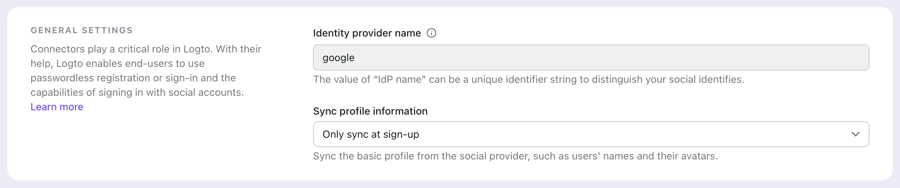

# Connexion directe

La connexion directe est un paramètre d'Authentification (Authentication) spécifique à Logto qui vous permet d'initier une connexion sociale ou un SSO d’entreprise directement, en contournant la page de connexion universelle par défaut de Logto.

Cette fonctionnalité est particulièrement utile si vous avez une page de connexion personnalisée ou un point d'entrée de connexion IdP intégré sur votre site web (voir les cas d'utilisation). En utilisant la connexion directe, vous pouvez rediriger les utilisateurs directement vers la page de connexion de l'IdP.


## Connexion sociale

Passez le paramètre `direct_sign_in` avec la valeur `social:<idp-name>` pour initier directement le processus de connexion sociale.

### Où trouver le nom du Connecteur IdP

1. Accédez à <CloudLink to="/connectors/social">Console > Connecteurs > Connecteurs sociaux</CloudLink>
2. Cliquez sur le connecteur que vous souhaitez utiliser.
3. Trouvez le nom du fournisseur d’identité en haut de la page des paramètres du connecteur.



### Exemple

Construisez votre propre URL de requête d’authentification avec le paramètre `direct_sign_in` :

```sh
curl --location \
  --request GET 'https://[tenant-id].logto.app/oidc/auth?client_id=1234567890&...&direct_sign_in=social:google'
```

Dans les SDK Logto pris en charge, vous pouvez définir le paramètre `directSignIn` lors de l'appel de la méthode `signIn` :

```javascript
const authResult = await logto.signIn({
  redirectUri: 'https://your-app.com/callback',
  directSignIn: 'social:google',
});
```

## SSO d’entreprise

Passez le paramètre `direct_sign_in` avec la valeur `sso:<connector-id>` pour initier directement le processus de connexion SSO d’entreprise.

### Où trouver l'ID du connecteur SSO d’entreprise

1. Accédez à <CloudLink to="/enterprise-sso">Console > SSO d’entreprise</CloudLink>
2. Cliquez sur le connecteur que vous souhaitez utiliser.
3. Trouvez l'ID du connecteur en haut de la page des paramètres du connecteur.


### Exemple

Construisez votre propre URL de requête d’authentification avec le paramètre `direct_sign_in` :

```sh
curl --location \
  --request GET 'https://[tenant-id].logto.app/oidc/auth?client_id=1234567890&...&direct_sign_in=sso:1234567890'
```

Dans les SDK Logto pris en charge, vous pouvez définir le paramètre `directSignIn` lors de l'appel de la méthode `signIn` :

```javascript
logtoClient.signIn({
  redirectUri: 'https://your-app.com/callback',
  directSignIn: 'sso:1234567890',
});
```

## Revenir à la page de connexion

Si le processus de connexion directe échoue, par exemple si le connecteur n'est pas trouvé ou activé, l'utilisateur sera redirigé vers la page de connexion standard.

:::note
Nous ajoutons progressivement la prise en charge du paramètre direct_sign_in à tous les SDK Logto. Si vous ne le voyez pas dans votre SDK, veuillez ouvrir un problème ou nous contacter.
:::

## FAQs

<details>
  <summary>La connexion directe est-elle la même que l'authentification API ?</summary>

Non, la connexion directe est un paramètre de flux utilisateur qui vous permet de passer la page de connexion par défaut de Logto et de rediriger les utilisateurs directement vers la page de connexion du fournisseur de SSO social ou d’entreprise. Contrairement à l'authentification basée sur l'API, l'utilisateur doit d'abord être redirigé vers le point de terminaison d'Authentification (Authentication) de Logto pour initier le processus de connexion.

</details>
