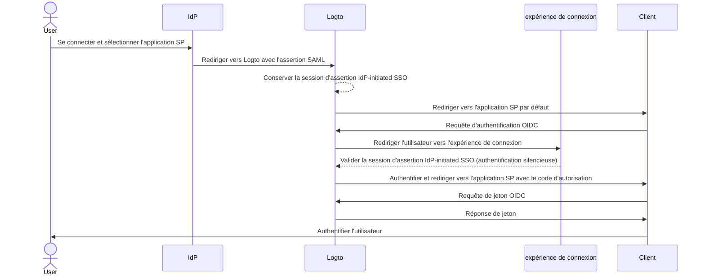
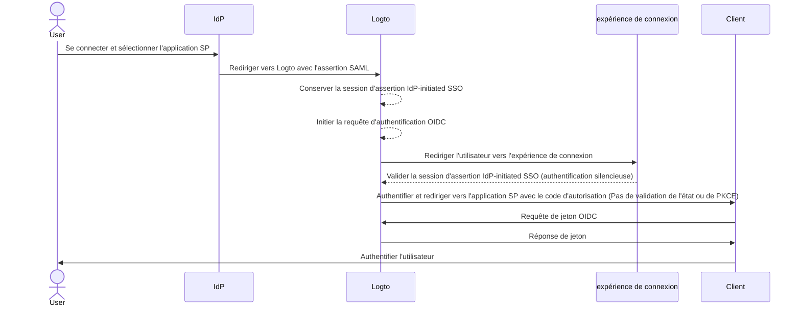

import Availability from '@components/Availability';
import idpInitiatedSsoPortalImage from '@site/docs/end-user-flows/enterprise-sso/assets/idp-initiated-sso-portal.png';
import idpInitiatedSsoRedirectImage from '@site/docs/end-user-flows/enterprise-sso/assets/idp-initiated-sso-redirect.png';
import idpInitiatedSsoSignInImage from '@site/docs/end-user-flows/enterprise-sso/assets/idp-initiated-sso-sign-in.png';

<Availability cloud="comingSoon" oss={false} />

# IdP-initiated SSO (SAML uniquement)

L'IdP-initiated SSO est un processus d'authentification unique où le fournisseur d'identité (IdP) contrôle principalement le flux d'authentification. Ce processus commence lorsqu'un utilisateur se connecte à la plateforme de l'IdP, telle qu'un portail d'entreprise ou un tableau de bord d'identité centralisé. Une fois authentifié, l'IdP génère une assertion SAML et dirige l'utilisateur vers le fournisseur de services (SP) pour accéder à l'application ou au service.


## Risques et considérations \{#risks-and-considerations}

L'IdP-initiated SSO peut introduire plusieurs vulnérabilités de sécurité dont les organisations doivent être conscientes. Étant donné que le processus d'authentification est initié par l'IdP sans demande directe de l'utilisateur, il peut être vulnérable à diverses attaques, y compris le [Cross-Site Request Forgery](https://blog.logto.io/csrf) (CSRF).

Cette absence d'authentification initiée par l'utilisateur peut conduire à un accès non autorisé si des mesures de protection appropriées ne sont pas en place. De plus, la dépendance à un point unique d'authentification augmente le risque de violation de sécurité, car compromettre l'IdP pourrait exposer toutes les applications connectées.

Il est donc fortement recommandé d'utiliser le SP-initiated SSO, qui offre un flux d'authentification plus sécurisé et contrôlé, garantissant que les utilisateurs demandent explicitement l'accès aux services.

## Connecter l'IdP-initiated SSO avec les applications Logto OIDC \{#connect-idp-initiated-sso-with-logto-oidc-applications}

Logto en tant que fournisseur OpenID Connect (OIDC) ne prend pas en charge l'IdP-initiated SSO. Cependant, vous pouvez configurer Logto en tant que SP pour prendre en charge l'IdP-initiated SSO avec votre IdP d'entreprise en utilisant SAML. Cette configuration vous permet de tirer parti des capacités d'authentification de Logto tout en maintenant le contrôle de l'IdP sur le flux d'authentification.

:::note
Par défaut, cette fonctionnalité n'est pas activée dans Logto. Si vous avez besoin que l'IdP-initiated SSO soit activé pour votre locataire, veuillez contacter notre [équipe de support](https://logto.io/contact?src=docs.sso).
:::

### Prérequis \{#prerequisites}

Avant de configurer l'IdP-initiated SSO, vous devez d'abord créer un connecteur SAML. Accédez à la <CloudLink to="/enterprise-sso">Console > Enterprise SSO</CloudLink> et suivez le guide étape par étape pour configurer un connecteur [SAML](/integrations/saml-sso/) avec votre IdP.

Une fois le connecteur SAML configuré, vous pouvez activer la méthode de connexion SSO dans la section <CloudLink to="/sign-in-experience">Expérience de connexion</CloudLink> et tester le flux SP-initiated SSO pour vous assurer que la configuration est correcte. Assurez-vous que le SP-initiated SSO fonctionne comme prévu avant de procéder avec l'IdP-initiated SSO.

### Activer l'IdP-initiated SSO \{#enable-idp-initiated-sso}

Une fois que la fonctionnalité IdP-initiated SSO est activée pour votre locataire, vous devriez voir un onglet supplémentaire dans la page des paramètres de votre connecteur SAML, appelé **IdP-initiated SSO**. Activez le basculeur **IdP-initiated SSO** pour activer la fonctionnalité pour le connecteur.

### Sélectionner l'application SP \{#select-the-sp-application}

Contrairement au SP-initiated SSO, où le flux d'authentification commence à partir du SP, l'IdP-initiated SSO nécessite une application SP côté client pour rediriger les utilisateurs après le processus d'authentification. Vous pouvez sélectionner l'application SP dans la liste des applications enregistrées dans le menu déroulant **Application par défaut**.

Seules les applications **Traditional Web App** et **Single Page App** sont prises en charge pour l'IdP-initiated SSO. Assurez-vous de sélectionner le type d'application approprié en fonction de votre cas d'utilisation.

:::note
Du côté de votre IdP, laissez le paramètre `RelayState` à **VIDE** pour que le flux IdP-initiated SSO fonctionne correctement. Logto gérera la redirection en fonction de l'application SP par défaut sélectionnée.
:::

## Configurer le flux d'authentification IdP-initiated \{#configure-idp-initiated-authentication-flow}

Afin de connecter l'IdP-initiated SAML SSO avec OIDC, Logto propose deux options de configuration pour gérer la requête d'authentification.

### Option A : Rediriger vers l'application SP par défaut (Recommandé) \{#option-a-redirect-to-the-default-sp-application-recommended}

Lorsque l'IdP initie le flux SSO et envoie l'assertion SAML à Logto, une session d'assertion IdP-initiated SSO sera créée. Logto redirigera l'utilisateur vers l'application SP par défaut pour initier une requête d'authentification OIDC standard côté client.



Pour configurer cette option, sélectionnez la carte **Rediriger vers le client pour l'authentification SP-initiated** dans l'onglet **IdP-initiated SSO** des paramètres du connecteur SAML.


1. Fournissez une **URL de redirection du client** pour rediriger l'utilisateur vers l'application SP par défaut après le flux IdP-initiated SSO. Logto redirigera l'utilisateur vers cette URL avec le paramètre de requête `?ssoConnectorId={connectorId}` ajouté à l'URL. L'application cliente doit gérer la redirection et initier la requête d'authentification OIDC. (Nous recommandons d'utiliser une route ou une page dédiée dans votre application cliente pour gérer la requête d'authentification IdP-initiated SSO.)

2. Gérez la requête d'authentification OIDC côté client en utilisant le paramètre de requête `ssoConnectorId` pour identifier le connecteur SAML qui a initié le flux d'authentification IdP-initiated SSO.

3. Passez le paramètre d'authentification [connexion directe](/end-user-flows/authentication-parameters/direct-sign-in/) dans la requête de connexion à Logto pour compléter le flux d'authentification SSO.

```typescript
// Exemple React
import { Prompt, useLogto } from '@logto/react';
import { useEffect } from 'react';
import { useNavigate, useSearchParams } from 'react-router-dom';

const SsoDirectSignIn = () => {
  const { signIn } = useLogto();
  const [searchParams] = useSearchParams();

  useEffect(() => {
    const ssoConnectorId = searchParams.get('ssoConnectorId');
    if (ssoConnectorId) {
      void signIn({
        redirectUri,
        prompt: Prompt.Login,
        directSignIn: {
          method: 'sso',
          target: ssoConnectorId,
        },
      });
    }
  }, [searchParams, signIn]);
};
```

- `redirectUri` : L'`redirect_uri` pour rediriger l'utilisateur après que le flux d'authentification OIDC soit terminé.
- `prompt=login` : Force l'utilisateur à se connecter en utilisant l'identité IdP-initiated SSO.
- `directSignIn=sso:{connectorId}` : Spécifie la méthode de connexion directe comme `sso` et l'ID du connecteur SAML cible. Ce paramètre déclenchera directement le flux d'authentification SSO sans afficher la page de connexion. L'utilisateur sera automatiquement authentifié en utilisant la session d'assertion IdP-initiated SSO préservée si l'ID du connecteur correspond et que la session est valide.

Cette méthode garantit que le flux d'authentification est sécurisé et suit le protocole OIDC standard, tout en maintenant le contrôle de l'IdP sur le processus d'authentification. L'application cliente peut tirer parti de la session d'assertion IdP-initiated SSO pour authentifier l'utilisateur sans étapes de connexion supplémentaires, tout en gardant le flux d'authentification sécurisé et contrôlé. L'application cliente peut toujours valider les paramètres `state` et `PKCE` pour s'assurer que la requête d'authentification est sécurisée.

:::note
Cette méthode est disponible pour les applications **Traditional Web App** et **Single Page App**. Et elle est recommandée pour tous les cas d'utilisation.
:::

### Option B : Authentifier directement l'utilisateur avec l'IdP-initiated SSO \{#option-b-directly-authenticate-the-user-with-idp-initiated-sso}

Dans certaines circonstances, le SP peut ne pas être en mesure de gérer le rappel IdP-initiated SSO et d'initier la requête d'authentification OIDC. Dans ce cas, Logto propose une option alternative pour authentifier directement l'utilisateur avec la session d'assertion IdP-initiated SSO.

Cette option est considérée comme moins sécurisée et n'est pas recommandée. Le flux d'authentification contourne le protocole OIDC standard. Étant donné que la requête d'authentification est initiée par l'IdP, l'application cliente peut ne pas être en mesure de valider la requête d'authentification de manière sécurisée. Par exemple, l'application cliente ne peut pas valider les paramètres `state` et `PKCE` pour s'assurer que la requête d'authentification est sécurisée.

:::warning
Cette méthode n'est pas disponible pour les applications **Single Page App**, car elle nécessite que l'application cliente gère la requête d'authentification de manière sécurisée en utilisant le paramètre `PKCE`. Si vous devez implémenter l'IdP-initiated SSO pour une application SPA, veuillez utiliser l'option ci-dessus à la place.
:::



Pour configurer cette option, sélectionnez l'option **Connexion directe en utilisant l'IdP-initiated SSO** dans l'onglet **IdP-initiated SSO** des paramètres du connecteur SAML.


1. Sélectionnez l'**URI de redirection après connexion** pour rediriger l'utilisateur vers l'application cliente après une authentification réussie. Cette URL sera utilisée comme `redirect_uri` dans la requête d'authentification OIDC. L'URI doit être l'un des URI de redirection autorisés enregistrés dans l'application cliente.

   :::note
   Il est fortement recommandé d'utiliser un **URI de redirection** dédié pour l'IdP-initiated SSO. Étant donné que la requête d'authentification est non sollicitée, l'application cliente doit gérer la réponse de manière indépendante, séparément du flux d'authentification standard SP-initiated.
   :::

2. Personnalisez les paramètres de requête d'autorisation si nécessaire en utilisant l'éditeur json **Paramètres d'authentification supplémentaires** (suivant le type `Map<string,string>`).

   Par exemple, par défaut, Logto ne demande que les portées `openid` et `profile`. Vous pouvez ajouter des portées ou des paramètres supplémentaires à la requête d'authentification.

   ```json
   {
     "scope": "email offline_access"
   }
   ```

   - ajouter une portée `email` supplémentaire pour demander l'adresse e-mail de l'utilisateur.
   - ajouter la portée `offline_access` pour demander le jeton de rafraîchissement.

   Nous vous recommandons également de fournir un paramètre `state` personnalisé pour valider la réponse d'authentification de manière sécurisée.

   ```json
   {
     "state": "custom-state-value"
   }
   ```

   L'application cliente doit valider le paramètre `state` dans la réponse du code d'autorisation pour s'assurer que la requête d'authentification est valide.
