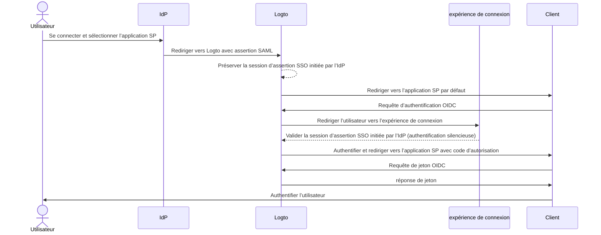
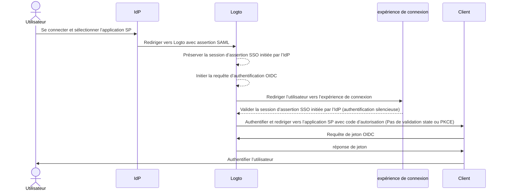

import Availability from '@components/Availability';

<Availability cloud="comingSoon" oss={false} />

# SSO initié par l’IdP (SAML uniquement)

Le SSO initié par l’IdP est un processus d’authentification unique où le Fournisseur d’Identité (IdP) contrôle principalement le flux d’authentification. Ce processus commence lorsqu’un utilisateur se connecte à la plateforme de l’IdP, comme un portail d’entreprise ou un tableau de bord d’identité centralisé. Une fois authentifié, l’IdP génère une assertion SAML et dirige l’utilisateur vers le Fournisseur de Service (SP) pour accéder à l’application ou au service.


## Risques et considérations \{#risks-and-considerations}

Le SSO initié par l’IdP peut introduire plusieurs vulnérabilités de sécurité dont les organisations doivent être conscientes. Puisque le processus d’authentification est initié par l’IdP sans requête directe de l’utilisateur, il peut être vulnérable à diverses attaques, y compris la [falsification de requête inter-sites (CSRF)](https://blog.logto.io/csrf).

Ce manque d’authentification initiée par l’utilisateur peut conduire à des accès non autorisés si des mesures de protection appropriées ne sont pas en place. De plus, la dépendance à un point d’authentification unique augmente le risque de faille de sécurité, car compromettre l’IdP pourrait exposer toutes les applications connectées.

Il est donc fortement recommandé d’utiliser le SSO initié par le SP, qui offre un flux d’authentification plus sécurisé et contrôlé, garantissant que les utilisateurs demandent explicitement l’accès aux services.

## Connecter le SSO initié par l’IdP avec les applications OIDC Logto \{#connect-idp-initiated-sso-with-logto-oidc-applications}

Logto, en tant que fournisseur OpenID Connect (OIDC), ne prend pas en charge le SSO initié par l’IdP. Cependant, vous pouvez configurer Logto en tant que SP pour prendre en charge le SSO initié par l’IdP avec votre IdP d’entreprise en utilisant SAML. Cette configuration vous permet de tirer parti des capacités d’authentification de Logto tout en maintenant le contrôle de l’IdP sur le flux d’authentification.

:::note
Par défaut, cette fonctionnalité n’est pas activée dans Logto. Si vous avez besoin d’activer le SSO initié par l’IdP pour votre tenant, veuillez contacter notre [équipe support](https://logto.io/contact?src=docs.sso).
:::

### Prérequis \{#prerequisites}

Avant de configurer le SSO initié par l’IdP, vous devez d’abord créer un connecteur SAML. Rendez-vous dans <CloudLink to="/enterprise-sso">Console > SSO d’entreprise</CloudLink> et suivez le guide étape par étape pour configurer un connecteur [SAML](/integrations/saml-sso/) avec votre IdP.

Une fois le connecteur SAML configuré, vous pouvez activer la méthode de connexion SSO dans la section <CloudLink to="/sign-in-experience/sign-up-and-sign-in">Connexion & compte > Inscription et connexion</CloudLink>, et tester le flux SSO initié par le SP pour vous assurer que la configuration est correcte. Assurez-vous que le SSO initié par le SP fonctionne comme prévu avant de poursuivre avec le SSO initié par l’IdP.

### Activer le SSO initié par l’IdP \{#enable-idp-initiated-sso}

Une fois la fonctionnalité SSO initié par l’IdP activée pour votre tenant, vous devriez voir un onglet supplémentaire dans la page de configuration de votre connecteur SAML, appelé **SSO initié par l’IdP**. Activez le bouton **SSO initié par l’IdP** pour activer la fonctionnalité pour ce connecteur.

### Sélectionner l’application SP \{#select-the-sp-application}

Contrairement au SSO initié par le SP, où le flux d’authentification commence depuis le SP, le SSO initié par l’IdP nécessite une application SP côté client pour rediriger les utilisateurs après le processus d’authentification. Vous pouvez sélectionner l’application SP dans la liste des applications enregistrées dans le menu déroulant **Application par défaut**.

Seules les applications **Web traditionnelle** et **Application monopage (SPA)** sont prises en charge pour le SSO initié par l’IdP. Veillez à sélectionner le type d’application approprié selon votre cas d’usage.

:::note
Côté IdP, laissez le paramètre `RelayState` **VIDE** pour que le flux SSO initié par l’IdP fonctionne correctement. Logto gérera la redirection en fonction de l’application SP par défaut sélectionnée.
:::

## Configurer le flux d’authentification initié par l’IdP \{#configure-idp-initiated-authentication-flow}

Afin de connecter le SSO SAML initié par l’IdP avec OIDC, Logto propose deux options de configuration pour gérer la requête d’authentification.

### Option A : Rediriger vers l’application SP par défaut (Recommandé) \{#option-a-redirect-to-the-default-sp-application-recommended}

Lorsque l’IdP initie le flux SSO et envoie l’assertion SAML à Logto, une session d’assertion SSO initiée par l’IdP sera créée. Logto redirigera l’utilisateur vers l’application SP par défaut pour initier une requête d’authentification OIDC standard côté client.


```mermaid
sequenceDiagram
    actor Utilisateur
    participant IdP as IdP
    participant Logto as Logto
    participant Experience as expérience de connexion
    participant SP as Client

    Utilisateur->>IdP: Se connecter et sélectionner l’application SP
    IdP->>Logto: Rediriger vers Logto avec assertion SAML
    Logto-->>Logto: Préserver la session d’assertion SSO initiée par l’IdP
    Logto->>SP: Rediriger vers l’application SP par défaut
    SP->>Logto: Requête d’authentification OIDC
    Logto->>Experience: Rediriger l’utilisateur vers l’expérience de connexion
    Experience-->>Logto: Valider la session d’assertion SSO initiée par l’IdP (authentification silencieuse)
    Logto->>SP: Authentifier et rediriger vers l’application SP avec code d’autorisation
    SP->>Logto: Requête de jeton OIDC
    Logto->>SP: réponse de jeton
    SP->>Utilisateur: Authentifier l’utilisateur
```

Pour configurer cette option, sélectionnez la carte **Rediriger vers le client pour une authentification initiée par le SP** dans l’onglet **SSO initié par l’IdP** des paramètres du connecteur SAML.


1. Fournissez une **URL de redirection client** pour rediriger l’utilisateur vers l’application SP par défaut après le flux SSO initié par l’IdP. Logto redirigera l’utilisateur vers cette URL avec le paramètre de requête `?ssoConnectorId={connectorId}` ajouté à l’URL. L’application cliente doit gérer la redirection et initier la requête d’authentification OIDC. (Nous recommandons d’utiliser une route ou une page dédiée dans votre application cliente pour gérer la requête d’authentification SSO initiée par l’IdP.)

2. Gérez la requête d’authentification OIDC côté client en utilisant le paramètre de requête `ssoConnectorId` pour identifier le connecteur SAML qui a initié le flux d’authentification SSO initié par l’IdP.

3. Passez le paramètre d’authentification [connexion directe](/end-user-flows/authentication-parameters/direct-sign-in/) dans la requête de connexion à Logto pour compléter le flux d’authentification SSO.

```typescript
// Exemple React
import { Prompt, useLogto } from '@logto/react';
import { useEffect } from 'react';
import { useNavigate, useSearchParams } from 'react-router-dom';

const SsoDirectSignIn = () => {
  const { signIn } = useLogto();
  const [searchParams] = useSearchParams();

  useEffect(() => {
    const ssoConnectorId = searchParams.get('ssoConnectorId');
    if (ssoConnectorId) {
      void signIn({
        redirectUri,
        prompt: Prompt.Login,
        directSignIn: {
          method: 'sso',
          target: ssoConnectorId,
        },
      });
    }
  }, [searchParams, signIn]);
};
```

- `redirectUri` : L’`redirect_uri` vers laquelle rediriger l’utilisateur après la fin du flux d’authentification OIDC.
- `prompt=login` : Force l’utilisateur à se connecter en utilisant l’identité SSO initiée par l’IdP.
- `directSignIn=sso:{connectorId}` : Spécifie la méthode de connexion directe comme `sso` et l’ID du connecteur SAML cible. Ce paramètre déclenchera directement le flux d’authentification SSO sans afficher la page de connexion. L’utilisateur sera automatiquement authentifié en utilisant la session d’assertion SSO initiée par l’IdP préservée si l’ID du connecteur correspond et que la session est valide.

Cette méthode garantit que le flux d’authentification est sécurisé et suit le protocole OIDC standard, tout en maintenant le contrôle de l’IdP sur le processus d’authentification. L’application cliente peut tirer parti de la session d’assertion SSO initiée par l’IdP pour authentifier l’utilisateur sans étapes de connexion supplémentaires, tout en gardant le flux d’authentification sécurisé et contrôlé. L’application cliente peut toujours valider les paramètres `state` et `PKCE` pour garantir la sécurité de la requête d’authentification.

:::note
Cette méthode est disponible pour les applications **Web traditionnelle** et **Application monopage (SPA)**. Elle est recommandée pour tous les cas d’usage.
:::

### Option B : Authentifier directement l’utilisateur avec le SSO initié par l’IdP \{#option-b-directly-authenticate-the-user-with-idp-initiated-sso}

Dans certaines circonstances, le SP peut ne pas être en mesure de gérer le callback SSO initié par l’IdP et d’initier la requête d’authentification OIDC. Dans ce cas, Logto propose une option alternative pour authentifier directement l’utilisateur avec la session d’assertion SSO initiée par l’IdP.

Cette option est considérée comme moins sécurisée et n’est pas recommandée. Le flux d’authentification contourne le protocole OIDC standard. Comme la requête d’authentification est initiée par l’IdP, l’application cliente peut ne pas être en mesure de valider la requête d’authentification de manière sécurisée. Par exemple, l’application cliente ne peut pas valider les paramètres `state` et `PKCE` pour garantir la sécurité de la requête d’authentification.

:::warning
Cette méthode n’est pas disponible pour les applications **Application monopage (SPA)**, car elle nécessite que l’application cliente gère la requête d’authentification de manière sécurisée en utilisant le paramètre `PKCE`. Si vous devez implémenter le SSO initié par l’IdP pour une application SPA, veuillez utiliser l’option ci-dessus.
:::


```mermaid
  sequenceDiagram

  actor Utilisateur
  participant IdP as IdP
  participant Logto as Logto
  participant Experience as expérience de connexion
  participant SP as Client

  Utilisateur->>IdP: Se connecter et sélectionner l’application SP
  IdP->>Logto: Rediriger vers Logto avec assertion SAML
  Logto-->>Logto: Préserver la session d’assertion SSO initiée par l’IdP
  Logto-->>Logto: Initier la requête d’authentification OIDC
  Logto->>Experience: Rediriger l’utilisateur vers l’expérience de connexion
  Experience-->>Logto: Valider la session d’assertion SSO initiée par l’IdP (authentification silencieuse)
  Logto->>SP: Authentifier et rediriger vers l’application SP avec code d’autorisation (Pas de validation state ou PKCE)
  SP->>Logto: Requête de jeton OIDC
  Logto->>SP: réponse de jeton
  SP->>Utilisateur: Authentifier l’utilisateur
```

Pour configurer cette option, sélectionnez l’option **Connexion directe via SSO initié par l’IdP** dans l’onglet **SSO initié par l’IdP** des paramètres du connecteur SAML.


1. Sélectionnez l’**URI de redirection post-connexion** pour rediriger l’utilisateur vers l’application cliente après une authentification réussie. Cette URL sera utilisée comme `redirect_uri` dans la requête d’authentification OIDC. L’URI doit être l’une des redirections autorisées enregistrées dans l’application cliente.

   :::note
   Il est fortement recommandé d’utiliser une **URI de redirection** dédiée pour le SSO initié par l’IdP. Étant donné que la requête d’authentification est non sollicitée, l’application cliente doit gérer la réponse de manière indépendante, séparément du flux d’authentification standard initié par le SP.
   :::

2. Personnalisez les paramètres de la requête d’autorisation si nécessaire en utilisant l’éditeur json **Paramètres d’authentification supplémentaires** (type `Map<string,string>`).

   Par exemple, par défaut Logto ne demande que les portées `openid` et `profile`. Vous pouvez ajouter des portées ou des paramètres supplémentaires à la requête d’authentification.

   ```json
   {
     "scope": "email offline_access"
   }
   ```

   - ajoutez la portée supplémentaire `email` pour demander l’adresse e-mail de l’utilisateur.
   - ajoutez la portée `offline_access` pour demander le jeton de rafraîchissement.

   Nous vous recommandons également de fournir un paramètre `state` personnalisé pour valider la réponse d’authentification de manière sécurisée.

   ```json
   {
     "state": "custom-state-value"
   }
   ```

   L’application cliente doit valider le paramètre `state` dans la réponse du code d’autorisation pour garantir la validité de la requête d’authentification.
