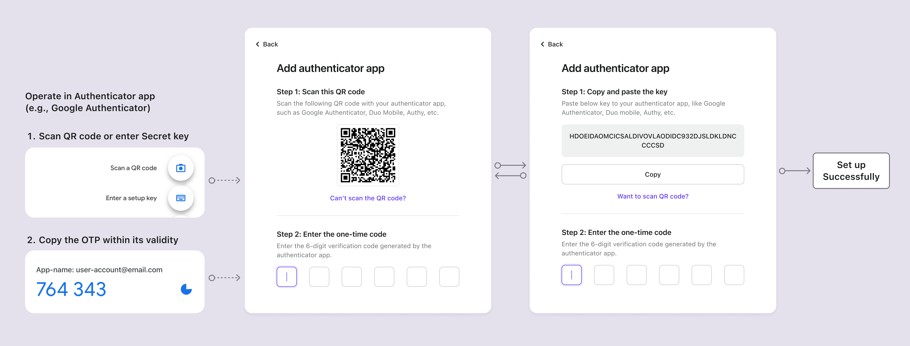

# OTP de l'application d'authentification

## Concepts

L'application d'authentification, également appelée Jeton logiciel, est l'une des méthodes [MFA](https://auth.wiki/mfa) les plus largement adoptées. Elle génère des [mots de passe à usage unique (OTP)](https://auth.wiki/otp) temporaires pour renforcer la sécurité de l'authentification des services en ligne. Contrairement aux jetons matériels physiques, les jetons logiciels sont généralement des applications ou des plugins que les utilisateurs installent sur leurs appareils, qu'il s'agisse d'un smartphone ou d'un navigateur d'ordinateur. Les jetons logiciels peuvent fonctionner localement sur un seul appareil ou se synchroniser sur divers appareils, en fonction des capacités de l'authentificateur et des paramètres individuels de l'utilisateur.

Des exemples populaires de jetons logiciels incluent Google Authenticator, Microsoft Authenticator, Duo, 1Password, Authy, et plus encore.

## Flux d'authentification

### Flux de configuration de l'OTP de l'application d'authentification

1. **QR Code ou Clé secrète** : Les utilisateurs reçoivent un QR code ou une clé secrète de votre service.
2. **Ajouter un compte** : En utilisant leur application d'authentification, les utilisateurs scannent le QR code ou saisissent manuellement la clé secrète pour ajouter leur compte.
3. **Mot de passe à usage unique dynamique** : L'application d'authentification affiche un code à six chiffres qui se rafraîchit toutes les 1-2 minutes pour le compte ajouté.
4. **Compléter la configuration MFA** : Les utilisateurs saisissent ce code dans sa validité sur la page de configuration MFA, complétant ainsi la configuration de l'OTP de l'application d'authentification pour MFA.

### Flux de vérification de l'OTP de l'application d'authentification

1. **Tentative de connexion** : Lors de la connexion, les utilisateurs sont invités à utiliser MFA.
2. **Récupérer l'OTP** : Ouvrez leur application d'authentification pour récupérer l'OTP pour le compte respectif.
3. **Saisir l'OTP** : Les utilisateurs saisissent l'OTP affiché dans l'application dans sa validité sur la page de vérification en deux étapes.
4. **Authentification** : Le système vérifie l'OTP, accordant l'accès après une validation réussie.

