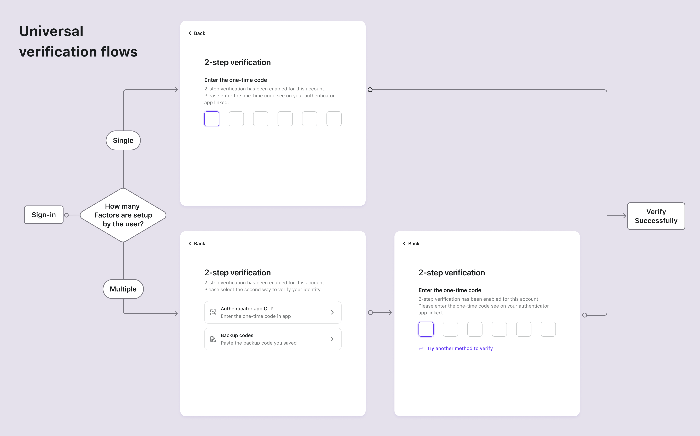

# Configurer MFA

## Configurer les paramètres MFA dans Logto \{#configure-mfa-settings-in-logto}

Suivez ces étapes pour activer les MFA dans le flux de connexion des utilisateurs de Logto :

1. Accédez à : <CloudLink to="/mfa">Console > Authentification multi-facteurs</CloudLink>.
2. Activez les facteurs de vérification pris en charge pour vos utilisateurs.
   1. Facteurs principaux :
      - [OTP de l'application d'authentification](/end-user-flows/mfa/authenticator-app-otp) : La méthode la plus courante et largement acceptée. Utilisez un mot de passe à usage unique basé sur le temps (TOTP) généré par une application d'authentification comme Google Authenticator ou Authy.
      - [Passkeys (WebAuthn)](/end-user-flows/mfa/webauthn) : Une option de haute sécurité adaptée aux produits web prenant en charge la biométrie des appareils ou les clés de sécurité, etc., assurant une protection robuste.
   2. Facteurs de secours :
      - [Codes de secours](/end-user-flows/mfa/backup-codes) : Cela sert d'option de secours lorsque les utilisateurs ne peuvent pas vérifier l'un des facteurs principaux mentionnés ci-dessus. Activer cette option réduit les frictions pour l'accès réussi des utilisateurs.
3. Sélectionnez les paramètres de politique MFA pour les utilisateurs :
   - **MFA contrôlé par l'utilisateur** : Les utilisateurs peuvent ignorer le processus de configuration MFA lors du flux d'inscription. Ils peuvent choisir de configurer le MFA plus tard via votre page de paramètres de compte en libre-service ou la page de paramètres de compte hébergée par Logto (bientôt disponible). [En savoir plus](/end-user-flows/account-settings/) sur la mise en œuvre d'une page de paramètres de compte utilisateur.
   - **MFA imposé par l'administrateur** : Vous pouvez imposer le MFA pour tous les utilisateurs. Les utilisateurs seront invités à configurer le MFA pendant le processus de connexion, ce qui ne peut pas être ignoré. Si l'utilisateur ne parvient pas à configurer le MFA ou supprime ses paramètres MFA, il sera verrouillé hors de son compte jusqu'à ce qu'il configure à nouveau le MFA.

## Flux utilisateur MFA \{#mfa-user-flow}

### Flux de configuration MFA \{#mfa-set-up-flow}

Une fois le MFA activé, les utilisateurs seront invités à configurer le MFA pendant le processus de connexion et d'inscription. Les utilisateurs peuvent choisir d'ignorer ce processus de configuration uniquement si la politique « MFA contrôlé par l'utilisateur » est activée.

1. **Visitez la page de connexion ou d'inscription** : L'utilisateur navigue vers la page de connexion ou d'inscription.
2. **Complète la connexion ou l'inscription** : L'utilisateur complète le processus de vérification d'identité dans le flux de connexion ou d'inscription.
3. **Configurer le facteur principal MFA** : L'utilisateur est invité à configurer son facteur principal MFA (soit OTP de l'application d'authentification, soit WebAuthn). Si plusieurs facteurs principaux sont activés, ils peuvent choisir leur option préférée. Si la politique « MFA contrôlé par l'utilisateur » est activée, ils peuvent également ignorer cette étape en sélectionnant le bouton "Ignorer".
4. **Configurer le facteur de secours MFA** : Si les **codes de secours** sont activés, l'utilisateur est invité à configurer les codes de secours après avoir configuré avec succès son facteur d'authentification principal. Les codes de secours générés automatiquement seront affichés à l'utilisateur, qu'il pourra télécharger et stocker en toute sécurité. L'utilisateur doit confirmer manuellement les codes de secours pour compléter le processus de configuration MFA.

### Flux de vérification MFA \{#mfa-verification-flow}

Les utilisateurs qui ont configuré le MFA seront invités à vérifier leur identité en utilisant leurs facteurs MFA configurés lors de la connexion. Le facteur de vérification dépendra de la configuration MFA dans Logto et des paramètres de l'utilisateur.

- Si un utilisateur a configuré un seul facteur, il le vérifiera directement.
- Si un utilisateur a configuré plusieurs facteurs en tant que 2FA, il devra en choisir un pour vérifier.
- Si tous les facteurs principaux activés ne sont pas disponibles pour l'utilisateur, et que le code de secours est activé, il peut utiliser le code de secours à usage unique pour vérifier son identité.

