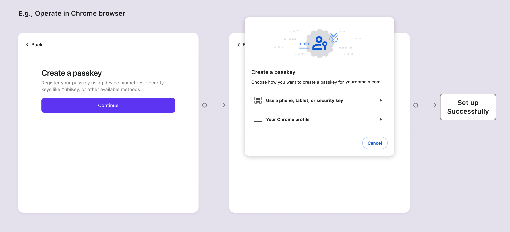

# WebAuthn (Passkeys)

WebAuthn offre une alternative plus sécurisée et conviviale aux mots de passe traditionnels. En utilisant la cryptographie à clé publique, WebAuthn améliore la sécurité en liant l'appareil de l'utilisateur, le domaine du service et l'identifiant de l'utilisateur, contrant efficacement le phishing et les attaques par mot de passe. Compatible avec divers appareils ou navigateurs, il permet aux utilisateurs d'employer des fonctionnalités de sécurité biométriques et matérielles pour une authentification pratique. Logto prend désormais en charge WebAuthn pour l' Authentification multi-facteurs (MFA).

## Concepts

Les clients connaissent toujours les Passkeys plutôt que WebAuthn, alors quelle est la relation entre eux et comment les utiliser ? Explorons ces concepts :

- **Passkeys** : Une passkey est un justificatif basé sur FIDO, résistant au phishing, pour remplacer les mots de passe. Elle utilise la cryptographie asymétrique à clé publique pour une sécurité renforcée. Elle peut être des jetons matériels ou des clés de sécurité, tels que des appareils USB ou Bluetooth. Étant donné que "Passkeys" est la méthode d' Authentification affichée aux utilisateurs, elle doit être utilisée dans le client de votre produit.
- **WebAuthn** : Il s'agit d'une API JavaScript développée par le W3C et la FIDO Alliance, qui permet l' Authentification des applications web avec les normes FIDO2. Passkeys est l'une des méthodes d' Authentification prises en charge par WebAuthn. Dans la Console Logto, nous nous référons professionnellement à cette intégration comme "WebAuthn".

WebAuthn offre divers authentificateurs parmi lesquels les utilisateurs peuvent choisir, disponibles en deux types pour une utilisation locale et cloud :

- **Authentificateur de plateforme (Authentificateur interne)** : Il est lié à un système d'exploitation d'appareil unique et spécifique, tel qu'un ordinateur, un ordinateur portable, un téléphone ou une tablette, avec lequel l'utilisateur se connecte. Il fonctionne exclusivement sur l'appareil pour l' Autorisation en utilisant des méthodes telles que la biométrie ou un code d'accès de l'appareil, ce qui en fait un moyen rapide d' Authentification. Par exemple, iCloud Keychain vérifié par Touch ID, Face ID ou code d'accès de l'appareil sur macOS ou iOS ; Windows Hello vérifié par reconnaissance faciale, empreinte digitale ou code PIN convivial.
- **Authentificateur itinérant (Authentificateur externe, Authentificateur multiplateforme)** : Il s'agit d'un appareil ou d'une application logicielle distincte et portable, tel qu'une clé de sécurité matérielle ou un smartphone. Il doit lier l'appareil en utilisant USB ou en gardant NFC ou Bluetooth activé. L'authentificateur itinérant n'est pas limité à un seul appareil ou navigateur, offrant une plus grande flexibilité.

Pour approfondir les principes et processus de WebAuthn, vous pouvez vous référer à nos articles de blog : [WebAuthn and Passkeys 101](https://blog.logto.io/web-authn-and-passkey-101/) et [Things you should know before integrating WebAuthn](https://blog.logto.io/webauthn-base-knowledge/).

## Faites attention aux limitations

Il est essentiel d'être conscient de certaines limitations lors de la mise en œuvre de WebAuthn :

1. **Limitation de la plateforme et du navigateur** : Il est important de noter que Logto n'offre actuellement pas de support WebAuthn pour les applications natives. De plus, la disponibilité des authentificateurs WebAuthn dépend des capacités du navigateur et de l'appareil ([Vérifiez la liste](https://caniuse.com/?search=webauthn)). Par conséquent, WebAuthn n'est toujours pas la seule option pour mettre en œuvre l' Authentification multi-facteurs (MFA), sinon, vous pouvez contrôler quels navigateurs et appareils peuvent accéder à votre produit.
2. **Limitation de domaine** : Changer de domaine peut entraver la vérification des utilisateurs via leurs comptes WebAuthn existants. Les Passkeys sont liées au domaine spécifique de la page web actuelle et ne peuvent pas être utilisées sur différents domaines.
3. **Limitation de l'appareil** : Perdre l'appareil peut entraîner une perte d'accès à leurs comptes, en particulier pour ceux qui dépendent des Authentificateurs de plateforme "Cet appareil". Pour améliorer l'accès à l' Authentification, il est conseillé de fournir aux utilisateurs plus d'un facteur d' Authentification.

## Flux d'authentification

La spécification des Passkeys exige que les utilisateurs cliquent activement sur le bouton de la page actuelle pour initier le composant d' Authentification. Cela signifie que dans les flux de configuration et de vérification, les utilisateurs doivent être redirigés vers la page d'accueil pour initier WebAuthn.

- **Flux de configuration**

- **Flux de vérification**

