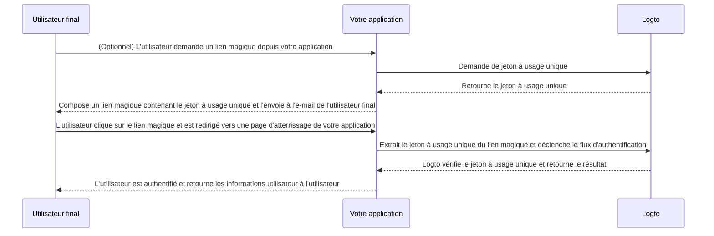

# Lien magique (Jeton à usage unique)

Similaire au mot de passe à usage unique (OTP), un jeton à usage unique est une autre méthode d'authentification sans mot de passe qui peut être utilisée pour vérifier l'identité d'un utilisateur.
Le jeton est valable pour une période limitée et associé à une adresse e-mail de l'utilisateur final.

Parfois, vous pouvez souhaiter inviter de nouveaux utilisateurs à votre application / organisation sans leur demander de créer un compte au préalable.
Ou bien, vous pouvez oublier votre mot de passe et vouloir vous connecter / réinitialiser votre mot de passe en vérifiant rapidement votre identité par e-mail.
Dans de tels cas, l'application peut envoyer un "lien magique" à votre adresse e-mail. Et vous serez authentifié immédiatement lorsque vous cliquerez sur le lien.

Les développeurs d'applications peuvent utiliser le jeton à usage unique pour composer un lien magique et l'envoyer à l'adresse e-mail de l'utilisateur final.

## Cas d'utilisation \{#use-cases}

Logto prend en charge les scénarios suivants avec les liens magiques :

- **Inscription sur invitation uniquement** : Pour les outils internes ou les produits IA en phase de test, vous pouvez désactiver l'inscription publique et inviter des utilisateurs spécifiques via des liens magiques.
- **Invitation de membres d'organisation** : Pour les produits SaaS, utilisez des liens magiques pour inviter de nouveaux membres à rejoindre une organisation, simplifiant ainsi le processus d'intégration.
- **Connexion / Inscription** : Envoyez un lien magique pour une connexion ou une inscription sans mot de passe par e-mail.

Par exemple, lorsque vous avez désactivé l'inscription publique, vous pouvez envoyer un lien magique avec un jeton à usage unique (ex. `https://yourapp.com/landing-page?token=YHwbXSXxQfL02IoxFqr1hGvkB13uTqcd&email=user@example.com`) à l'adresse e-mail de l'utilisateur pour l'inviter à finaliser la création de son compte. Vous pouvez personnaliser le modèle d'e-mail dans votre propre service d'envoi d'e-mails, tel que :


Actuellement non pris en charge :

- Réinitialisation du mot de passe avec un lien magique.
- Utilisation du numéro de téléphone ou du nom d'utilisateur comme identifiant.

## Flux du jeton à usage unique \{#one-time-token-flow}

Voici le diagramme de séquence du flux d'authentification utilisant un jeton à usage unique :



## Guide de mise en œuvre \{#implementation-guide}

Logto propose un ensemble d'APIs de gestion (Management APIs) et d'APIs d'expérience (Experience APIs) pour faciliter la mise en œuvre de votre lien magique.

Avant de commencer, assurez-vous de disposer d'une instance Logto prête, et d'avoir établi la connexion Machine-to-Machine entre votre serveur d'application
et le point de terminaison Logto (requis pour les Management APIs). En savoir plus sur [Logto Management API](/integrate-logto/interact-with-management-api).

### Étape 1 : Demander un jeton à usage unique \{#step-1-request-one-time-token}

Utilisez Logto Management API pour créer un jeton à usage unique.

```bash
POST /api/one-time-tokens
```

Exemple de corps de requête :

```json
{
  "email": "user@example.com",
  // Optionnel. Par défaut à 600 (10 min).
  "expiresIn": 3600,
  // Optionnel. L'utilisateur sera provisionné dans les organisations spécifiées après vérification réussie.
  "context": {
    "jitOrganizationIds": ["abcdefgh1234"]
  }
}
```

### Étape 2 : Composer votre lien magique \{#step-2-compose-your-magic-link}

Après avoir obtenu le jeton à usage unique, vous pouvez composer un lien magique et l'envoyer à l'adresse e-mail de l'utilisateur final.
Le lien magique doit au minimum contenir le jeton et l'e-mail de l'utilisateur en tant que paramètres, et doit rediriger vers une page d'atterrissage dans votre propre application.
Ex. `https://yourapp.com/landing-page`.

Voici un exemple simple de ce à quoi peut ressembler le lien magique :

```
https://yourapp.com/landing-page?token=YHwbXSXxQfL02IoxFqr1hGvkB13uTqcd&email=user@example.com
```

:::note

Les noms des paramètres dans le lien magique sont entièrement personnalisables.
Vous pouvez ajouter des informations supplémentaires au lien magique selon les besoins de votre application,
ainsi qu'encoder tous les paramètres d'URL.

:::

### Étape 3 : Déclencher le flux d'authentification via Logto SDK \{#step-3-trigger-the-authentication-flow-via-logto-sdk}

Après que l'utilisateur final a cliqué sur le lien magique et a été redirigé vers votre application, vous pouvez extraire les paramètres `token` et `email` de l'URL, puis appeler la fonction `signIn()` du SDK Logto pour déclencher le flux d'authentification.

```typescript title="TokenLandingPage.tsx"
// Exemple React
import { useLogto } from '@logto/react';
import { useEffect } from 'react';
import { useSearchParams } from 'react-router-dom';

const TokenLandingPage = () => {
  const { signIn } = useLogto();
  const [searchParams] = useSearchParams();

  useEffect(() => {
    // Extraire le jeton et l'e-mail du lien magique
    const oneTimeToken = searchParams.get('token');
    const email = searchParams.get('email');

    // Supposons que ceci est votre URI de redirection de connexion
    const redirectUri = 'https://yourapp.com/callback';

    if (oneTimeToken && email) {
      signIn({
        redirectUri,
        clearTokens: false, // Optionnel. Voir le message d'avertissement ci-dessous
        extraParams: {
          'one_time_token': oneTimeToken,
          'login_hint': email,
        },
      });
    }
  }, [searchParams, signIn]);

  return <>Veuillez patienter...</>;
};
```

:::warning

Si un utilisateur est déjà connecté, appeler la fonction `signIn()` du SDK effacera automatiquement tous les jetons mis en cache (jeton d’identifiant, jeton d’accès et jeton de rafraîchissement) du stockage client,
ce qui entraîne la perte du statut d'authentification de l'utilisateur actuel.

Par conséquent, vous devez spécifier un paramètre supplémentaire `clearTokens: false` lors de la connexion pour éviter d'effacer les jetons existants.
Si cela est spécifié, vous devrez également effacer manuellement les jetons dans la page de rappel de connexion.

Ignorez ceci si vos liens magiques ne sont pas conçus pour des utilisateurs déjà authentifiés.

:::

### Étape 4 : (Optionnel) Effacer les jetons mis en cache dans la page de rappel de connexion \{#step-4-clear-cached-tokens-in-sign-in-callback-page}

Si vous spécifiez `clearTokens: false` dans la fonction de connexion, vous devez effacer manuellement les jetons dans la page de rappel de connexion.

```typescript title="Callback.tsx"
// Exemple React
import { useHandleSignInCallback, useLogto } from '@logto/react';
import { useEffect } from 'react';

const Callback = () => {
  const { clearAllTokens } = useLogto();

  useEffect(() => {
    void clearAllTokens();
  }, [clearAllTokens]);

  useHandleSignInCallback(() => {
    // Redirigez vers votre page d'accueil
  });

  return <>Veuillez patienter...</>;
};
```

## FAQ \{#faqs}

<details>

<summary>

### Puis-je utiliser le lien magique pour inviter de nouveaux utilisateurs dans mes organisations ? \{#can-i-use-the-magic-link-to-invite-new-users-to-my-organizations}

</summary>

Oui, vous pouvez utiliser le lien magique pour inviter de nouveaux utilisateurs à votre application, ainsi qu'à des organisations.
Si vous souhaitez inviter de nouveaux utilisateurs dans votre organisation, il suffit de spécifier les `jitOrganizationIds` dans le corps de la requête.

L'utilisateur rejoindra automatiquement les organisations après vérification réussie, et les rôles d'organisation par défaut seront attribués.
Consultez la section "Approvisionnement Just-in-Time" dans la page de détails de votre organisation, et configurez les rôles par défaut pour vos organisations.

</details>

<details>

<summary>

### Puis-je attribuer des utilisateurs à des rôles spécifiques en utilisant le lien magique ? \{#can-i-assign-users-to-specific-roles-using-the-magic-link}

</summary>

Le flux d'authentification par lien magique ne prend pas en charge l'attribution de rôles aux utilisateurs. Mais vous pouvez toujours utiliser les [Webhooks](/developers/webhooks) et la [Management API](/user-management/manage-users#manage-roles-of-users) pour mettre à jour les rôles des utilisateurs après leur inscription.

</details>

<details>

<summary>

### Le jeton à usage unique expire-t-il ? \{#does-the-one-time-token-expire}

</summary>

Oui, le jeton à usage unique expirera après le temps `expiresIn` spécifié (en secondes). Le temps d'expiration par défaut est de 10 minutes.

</details>

<details>

<summary>

### Si je désactive l'inscription des utilisateurs dans "Expérience de connexion", puis-je toujours utiliser le lien magique pour inviter des utilisateurs ? \{#if-i-disable-user-registration-in-sign-in-experience-can-i-still-use-magic-link-to-invite-users}

</summary>

Oui, vous pouvez toujours utiliser le lien magique pour inviter des utilisateurs même si vous désactivez l'inscription des utilisateurs dans "Expérience de connexion".

</details>

<details>

<summary>

### Que se passe-t-il si un utilisateur est déjà connecté, puis clique sur un autre lien magique ? \{#what-will-happen-if-a-user-already-signed-in-and-then-click-another-magic-link}

</summary>

Plusieurs scénarios sont possibles :

1. L'utilisateur est déjà connecté, puis clique sur un lien magique associé au compte utilisateur actuel. Dans ce cas, Logto vérifiera toujours le jeton à usage unique et provisionnera l'utilisateur dans les organisations spécifiées si nécessaire.
2. L'utilisateur est déjà connecté, puis clique sur un lien magique associé à un autre compte. Dans ce cas, Logto invitera l'utilisateur à continuer avec le nouveau compte, ou à revenir à l'application avec le compte actuel.
   1. Si l'utilisateur choisit de continuer avec le nouveau compte, Logto basculera vers le nouveau compte après la vérification réussie du jeton.
   2. Si l'utilisateur choisit de rester sur le compte actuel, Logto ne vérifiera pas le jeton et retournera à l'application avec le compte actuel.
3. Si votre invite de connexion est définie sur "login" ou contient "login", Logto connectera automatiquement le compte associé au jeton à usage unique sans inviter à changer de compte. Cela s'explique par le fait que l'invite "login" indique une intention explicite de s'authentifier, ce qui prévaut sur la session en cours.

</details>
