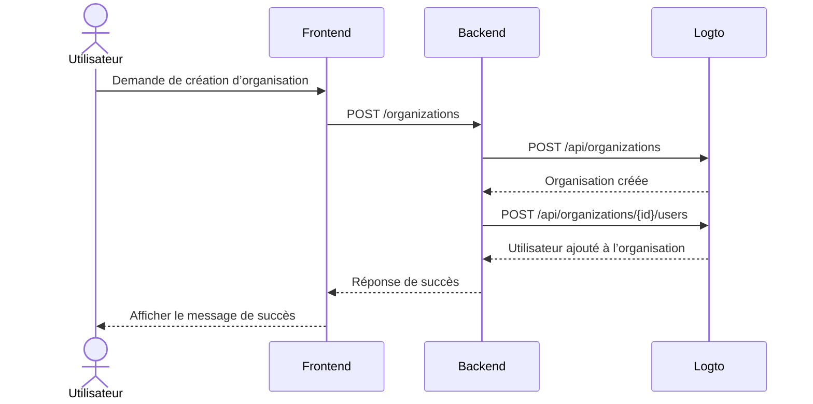

import GearIcon from '@site/src/assets/gear.svg';
import OrganizationIcon from '@site/src/assets/organization.svg';

# Expérience d’organisation

L’[expérience d’organisation](/organizations) correspond à l’ensemble des interfaces et des flux que vos clients professionnels et leurs employés utilisent — en particulier dans les [applications multi-locataires](https://auth.wiki/multi-tenancy). Ce guide montre comment l’intégrer à votre application à l’aide du Management API Logto.

Cette section vous aide à concevoir l’**expérience d’organisation** pour vos utilisateurs finaux — par exemple :

1. Les administrateurs peuvent créer leurs propres organisations.
2. Les administrateurs peuvent gérer les membres de l’organisation.
3. Les administrateurs peuvent inviter des membres à rejoindre leurs organisations.
4. et plus encore.

  

## Comprendre le flux d’authentification \{#understand-the-authentication-flow}

Pour intégrer le Management API Logto, commencez par comprendre le flux d’authentification de base. Il comporte deux exigences clés :

### Protégez votre API backend \{#protect-your-backend-api}

- Les appels du frontend à votre API backend nécessitent une authentification.
- Protégez les points de terminaison de l’API en validant le jeton d’accès Logto de l’utilisateur.
- Assurez-vous que seuls les utilisateurs authentifiés peuvent accéder à vos services.

### Accédez au Management API Logto \{#access-the-logto-management-api}

- Votre service backend appelle en toute sécurité le Management API Logto.
- Suivez le guide [Interagir avec Management API](/integrate-logto/interact-with-management-api) pour la configuration.
- Utilisez l’authentification machine à machine pour obtenir les identifiants d’accès.

Les prochains chapitres expliquent comment configurer le Management API Logto et présentent des cas d’usage courants pour construire votre expérience d’organisation.

## Fonctionnalités de l’expérience d’organisation \{#features-for-organization-experience}

<DocCardList
  items={[
    {
      type: 'link',
      label: 'Définir les fonctionnalités de gestion d’organisation',
      href: '/end-user-flows/organization-experience/organization-management',
      description:
        'Concevez votre propre application multi-locataire avec des rôles et des permissions d’organisation.',
      customProps: {
        icon: <OrganizationIcon />,
      },
    },
    {
      type: 'link',
      label: 'Configurer votre service applicatif avec le Management API Logto',
      href: '/end-user-flows/organization-experience/setup-app-service-with-management-api',
      description:
        'Connectez en toute sécurité votre backend au Management API Logto à l’aide de l’authentification machine à machine.',
      customProps: {
        icon: <GearIcon />,
      },
    },
    {
      type: 'link',
      label: 'Créer une organisation',
      href: '/end-user-flows/organization-experience/create-organization',
      description:
        'Utilisez le Management API Logto pour permettre aux utilisateurs finaux de créer eux-mêmes des organisations sur le produit.',
      customProps: {
        icon: <OrganizationIcon />,
      },
    },
    {
      type: 'link',
      label: 'Obtenir les informations utilisateur au sein d’une organisation',
      href: '/end-user-flows/organization-experience/get-user-info',
      description: 'Récupérez les informations utilisateur au sein d’une organisation.',
      customProps: {
        icon: <OrganizationIcon />,
      },
    },
    {
      type: 'link',
      label: 'Sélecteur d’organisation',
      href: '/end-user-flows/organization-experience/organization-switcher',
      description: 'Implémentez le changement d’organisation dans votre application.',
      customProps: {
        icon: <GearIcon />,
      },
    },
    {
      type: 'link',
      label: 'Inviter des membres d’organisation',
      href: '/end-user-flows/organization-experience/invite-organization-members',
      description:
        'Utilisez le Management API Logto pour implémenter les invitations d’organisation.',
      customProps: {
        icon: <GearIcon />,
      },
    },
    {
      type: 'link',
      label: 'Rejoindre l’organisation',
      href: '/end-user-flows/organization-experience/join-the-organization',
      description: 'Implémentez les flux de rejoindre une organisation dans votre application.',
      customProps: {
        icon: <GearIcon />,
      },
    },
    {
      type: 'link',
      label: 'Gestion des permissions et des ressources',
      href: '/end-user-flows/organization-experience/permission-and-resource-management',
      description: 'Gérez les permissions et les ressources au sein d’une organisation',
      customProps: {
        icon: <GearIcon />,
      },
    },
  ]}
/>

Pour une explication détaillée des définitions d’organisation, des concepts de membres et des modèles d’organisation, consultez [Comprendre le fonctionnement des organisations](/organizations/understand-how-organizations-work).

## Ressources associées \{#related-resources}

<Url href="https://blog.logto.io/build-multi-tenant-saas-application">
  Construire une application SaaS multi-locataire : Guide complet de la conception à la mise en
  œuvre
</Url>
