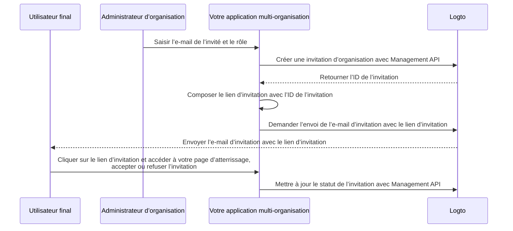

# Inviter des membres à une organisation

Dans les applications multi-organisations, il est courant de devoir inviter des membres dans une organisation. Ce guide détaille les étapes et les aspects techniques pour mettre en œuvre cette fonctionnalité.

## Vue d’ensemble du flux \{#flow-overview}

Le processus global est illustré dans le diagramme ci-dessous :



## Créer des rôles d’organisation \{#create-organization-roles}

Avant d’inviter des membres, créez des rôles d’organisation. Consultez le [modèle d’organisation](/authorization/organization-template) pour en savoir plus sur les rôles et les permissions (Permissions).

Dans ce guide, créons deux rôles d’organisation typiques : `admin` et `member`.

Le rôle `admin` a un accès complet à toutes les ressources de l’organisation, tandis que le rôle `member` a un accès limité. Par exemple :

- Rôle `admin` :
  - `read:data` - Accès en lecture à toutes les ressources de données de l’organisation.
  - `write:data` - Accès en écriture à toutes les ressources de données de l’organisation.
  - `delete:data` - Accès en suppression à toutes les ressources de données de l’organisation.
  - `invite:member` - Inviter des membres dans l’organisation.
  - `manage:member` - Gérer les membres dans l’organisation.
  - `delete:member` - Supprimer des membres de l’organisation.
- Rôle `member` :
  - `read:data` - Accès en lecture à toutes les ressources de données de l’organisation.
  - `write:data` - Accès en écriture à toutes les ressources de données de l’organisation.
  - `invite:member` - Inviter des membres dans l’organisation.

Cela peut être fait facilement dans la [Console Logto](https://cloud.logto.io/). Vous pouvez également utiliser la [Logto Management API](https://openapi.logto.io/operation/operation-createorganizationrole) pour créer des rôles d’organisation de manière programmatique.

## Configurer votre connecteur e-mail \{#configure-your-email-connector}

Puisque les invitations sont envoyées par e-mail, assurez-vous que votre [connecteur e-mail](/connectors/email-connectors) est correctement configuré. Pour envoyer des invitations, configurez un [modèle d’e-mail](/connectors/email-connectors/email-templates#email-template-types) avec le type d’utilisation `OrganizationInvitation`. Vous pouvez inclure des variables d’organisation (par exemple, nom, logo) et d’invitant (par exemple, e-mail, nom) [variables](/connectors/email-connectors/email-templates#email-template-variables) dans le contenu, et personnaliser les [modèles localisés](/connectors/email-connectors/email-templates#email-template-localization) selon vos besoins.

Un exemple de modèle d’e-mail pour le type d’utilisation `OrganizationInvitation` est présenté ci-dessous :

```json
{
  "subject": "Bienvenue dans mon organisation",
  "content": "<p>Rejoignez {{organization.name}} via ce <a href=\"{{link}}\" target=\"_blank\">lien</a>.</p>",
  "usageType": "OrganizationInvitation",
  "type": "text/html"
}
```

Le placeholder `{{link}}` dans le contenu de l’e-mail sera remplacé par le véritable lien d’invitation lors de l’envoi de l’e-mail.

:::note

Le “service e-mail Logto” intégré à Logto Cloud ne prend actuellement pas en charge le type d’utilisation `OrganizationInvitation`. Configurez votre propre connecteur e-mail (par exemple, SendGrid) et mettez en place le modèle `OrganizationInvitation` à la place.

:::

## Gérer les invitations avec Logto Management API \{#handle-invitations-with-logto-management-api}

:::note

Si vous n’avez pas encore configuré la Logto Management API, consultez [Interagir avec Management API](/integrate-logto/interact-with-management-api) pour plus de détails.

:::

### Créer une invitation d’organisation avec Logto Management API \{#create-an-organization-invitation-with-logto-management-api}

Il existe un ensemble d’API Management liées aux invitations dans la fonctionnalité organisations. Avec ces API, vous pouvez :

- `POST /api/organization-invitations` : Créer une invitation d’organisation avec un rôle d’organisation attribué.
- `POST /api/one-time-tokens` : Créer un jeton à usage unique pour que l’invité puisse s’authentifier lors de l’acceptation de l’invitation. [En savoir plus](/end-user-flows/one-time-token)
- `POST /api/organization-invitations/{id}/message` : Envoyer l’invitation d’organisation à l’invité par e-mail.
  Remarque : La charge utile prend en charge une propriété `link` afin que vous puissiez composer votre propre lien d’invitation basé sur l’ID de l’invitation. Par exemple :

  ```json
  {
    "link": "https://your-app.com/invitation/join?id=your-invitation-id&token=your-one-time-token&email=invitee-email"
  }
  ```
