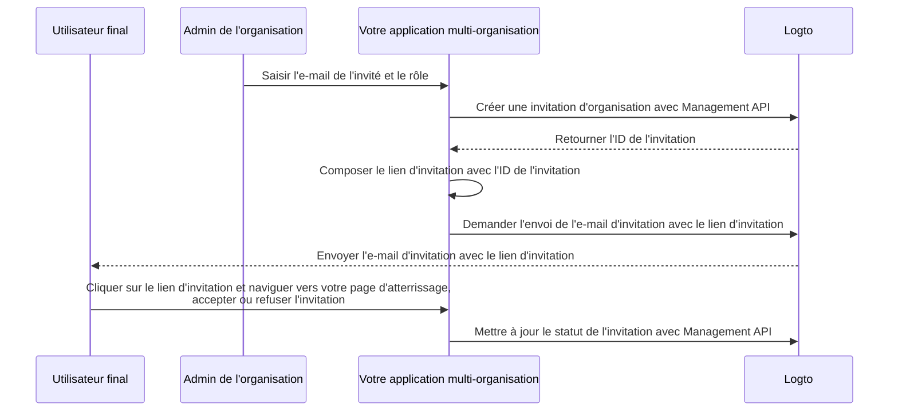

# Inviter des membres dans une organisation

En tant qu'application multi-organisation, un besoin courant est d'inviter des membres dans votre organisation. Dans ce guide, nous vous expliquons les étapes et les détails techniques pour implémenter cette fonctionnalité dans votre application.

## Vue d'ensemble du flux \{#flow-overview}

Le processus global est illustré dans le diagramme ci-dessous :



## Créer des rôles d'organisation \{#create-organization-roles}

Avant d'inviter des membres dans votre organisation, vous devez créer des rôles d'organisation. Consultez le [modèle d'organisation](/authorization/organization-template) pour en savoir plus sur les rôles et permissions d'organisation.

Dans ce guide, créons deux rôles d'organisation typiques : `admin` et `member`.

Le rôle `admin` a un accès complet à toutes les ressources de l'organisation, tandis que le rôle `member` a un accès limité. Par exemple, chaque rôle peut avoir un ensemble de permissions comme suit :

- Rôle `admin` :
  - `read:data` - Accès en lecture à toutes les ressources de données de l'organisation.
  - `write:data` - Accès en écriture à toutes les ressources de données de l'organisation.
  - `delete:data` - Accès en suppression à toutes les ressources de données de l'organisation.
  - `invite:member` - Inviter des membres dans l'organisation.
  - `manage:member` - Gérer les membres dans l'organisation.
  - `delete:member` - Supprimer des membres de l'organisation.
- Rôle `member` :
  - `read:data` - Accès en lecture à toutes les ressources de données de l'organisation.
  - `write:data` - Accès en écriture à toutes les ressources de données de l'organisation.
  - `invite:member` - Inviter des membres dans l'organisation.

Cela peut être fait facilement dans la [Console Logto](https://cloud.logto.io/). Vous pouvez également utiliser la [Logto Management API](https://openapi.logto.io/operation/operation-createorganizationrole) pour créer des rôles d'organisation de manière programmatique.

## Configurer votre connecteur e-mail \{#configure-your-email-connector}

Puisque les invitations sont envoyées par e-mail, assurez-vous que votre [connecteur e-mail](/connectors/email-connectors) est correctement configuré. Pour envoyer des invitations, vous devez configurer un type d'utilisation de [modèle d'e-mail](/connectors/email-connectors/email-templates#email-template-types) - `OrganizationInvitation`. Vous pouvez également inclure des [variables](/connectors/email-connectors/email-templates#email-template-variables) d'organisation (par exemple, nom de l'organisation, logo) et d'invitant (par exemple, e-mail de l'invitant, nom) dans le contenu, ou personnaliser des [modèles multilingues](/connectors/email-connectors/email-templates#email-template-localization) selon vos besoins.

Un exemple de modèle d'e-mail pour le type d'utilisation `OrganizationInvitation` est présenté ci-dessous :

```json
{
  "subject": "Bienvenue dans mon organisation",
  "content": "<p>Rejoignez {{organization.name}} via ce <a href=\"{{link}}\" target=\"_blank\">lien</a>.</p>",
  "usageType": "OrganizationInvitation",
  "type": "text/html"
}
```

Le placeholder `{{link}}` dans le contenu de l'e-mail sera remplacé par le lien d'invitation réel lors de l'envoi de l'e-mail. Dans ce guide, supposons qu'il s'agisse de `https://your-app.com/invitation/accept/{your-invitation-id}`.

:::note

Le "service e-mail Logto" intégré de Logto Cloud ne prend pas en charge le type d'utilisation `OrganizationInvitation` pour le moment. Vous devez donc configurer votre propre connecteur e-mail (par exemple, Sendgrid) et mettre en place le modèle `OrganizationInvitation`.

:::

## Gérer les invitations avec Logto Management API \{#handle-invitations-with-logto-management-api}

:::note

Si vous n'avez pas encore configuré la Logto Management API, consultez [Interagir avec Management API](/integrate-logto/interact-with-management-api) pour plus de détails.

:::

### Pour les utilisateurs Cloud et OSS v1.27.0+ \{#for-cloud-and-oss-v1-27-0-users}

Nous pouvons désormais utiliser la fonctionnalité [Lien magique (Jeton à usage unique)](/end-user-flows/one-time-token) pour gérer le flux d'invitation.

Il suffit d'appeler la Management API pour créer un jeton à usage unique, puis de composer un lien magique d'invitation avec le jeton et l'e-mail de l'invité.
Insérez le lien dans le placeholder `{{link}}` du modèle d'e-mail ci-dessus, puis envoyez l'e-mail à l'invité.
Vous pouvez composer un lien du type `https://your-app.com/landing-page?token={your-one-time-token}&email={invitee-email}` au lieu de celui contenant l'ID d'invitation.

C'est l'approche recommandée, car elle enregistrera automatiquement l'invité avec le lien magique s'il n'a pas encore de compte.

Consultez la page [Lien magique (Jeton à usage unique)](/end-user-flows/one-time-token) pour plus de détails.

### Pour les utilisateurs OSS v1.26.0 et antérieurs \{#for-oss-v1-26-0--users}

Nous avons fourni un ensemble d'API de gestion liées aux invitations dans la fonctionnalité organisations. Avec ces API, vous pouvez :

- `POST /api/organization-invitations` créer une invitation d'organisation avec un rôle d'organisation attribué.
- `POST /api/organization-invitations/{id}/message` envoyer l'invitation d'organisation à l'invité par e-mail.
  Remarque : Le payload de cette API prend en charge une propriété `link`, vous pouvez composer votre lien d'invitation en fonction de l'ID d'invitation. Par exemple :

  ```json
  {
    "link": "https://your-app.com/invitation/accept/{your-invitation-id}"
  }
  ```

  En conséquence, vous devez implémenter une page d'atterrissage lorsque votre invité navigue via le lien d'invitation vers votre application.

- `GET /api/organization-invitations` & `GET /api/organization-invitations/{id}` obtenir toutes vos invitations ou une invitation spécifique par ID.
  Sur votre page d'atterrissage, utilisez ces API pour lister toutes les invitations ou les détails d'une invitation reçue par un utilisateur.
- `PUT /api/organization-invitations/{id}/status` accepter ou refuser l'invitation en mettant à jour le statut de l'invitation.
  Utilisez cette API pour gérer la réponse de l'utilisateur à l'invitation.

## Utiliser le contrôle d’accès basé sur les rôles (RBAC) d’organisation pour gérer les permissions utilisateur \{#use-organization-role-based-access-control-rbac-to-manage-user-permissions}

Avec les configurations ci-dessus, vous pouvez désormais envoyer des invitations par e-mail, et les invités peuvent rejoindre l'organisation avec le rôle attribué.

Les utilisateurs avec différents rôles d'organisation auront différentes portées (permissions) dans leurs jetons d’organisation. Ainsi, votre application cliente et vos services backend doivent vérifier ces portées pour déterminer les fonctionnalités visibles et les actions autorisées.

## Gérer les mises à jour de portée dans les jetons d’organisation \{#handle-scope-updates-in-organization-tokens}

:::note
Cette section aborde des sujets avancés concernant la gestion du modèle d'organisation et les scénarios d'autorisation. Si vous n'êtes pas familier avec ces concepts, veuillez lire [Autorisation](/authorization) et [Modèle d'organisation](/authorization/organization-template) en premier.
:::

La gestion des mises à jour de portée dans les jetons d’organisation implique :

### Révoquer des portées existantes \{#revoking-existing-scopes}

Par exemple, rétrograder un admin en membre non-admin doit supprimer des portées de l'utilisateur. Dans ce cas, vous pouvez simplement vider le jeton d’organisation mis en cache et en récupérer un nouveau avec le jeton de rafraîchissement. Les portées réduites seront immédiatement reflétées dans le nouveau jeton d’organisation émis.

### Accorder de nouvelles portées \{#granting-new-scopes}

Cela peut être divisé en deux scénarios :

#### Accorder de nouvelles portées déjà définies dans votre système d’authentification \{#grant-new-scopes-that-already-defined-in-your-auth-system}

Comme pour la révocation de portées, si la nouvelle portée accordée est déjà enregistrée auprès du serveur d'authentification, vous pouvez simplement émettre un nouveau jeton d’organisation, et les nouvelles portées seront immédiatement reflétées.

#### Accorder de nouvelles portées nouvellement introduites dans votre système d’authentification \{#grant-new-scopes-that-are-newly-introduced-your-auth-system}

Dans ce cas, vous devez déclencher un processus de reconnexion ou de re-consentement pour mettre à jour le jeton d’organisation de l'utilisateur. Par exemple, en appelant la méthode `signIn` dans le SDK Logto.

### Implémenter une vérification des permissions en temps réel et mettre à jour le jeton d’organisation \{#implement-real-time-permission-check-and-update-organization-token}

Logto fournit la Management API pour récupérer en temps réel les permissions utilisateur dans l'organisation.

- `GET /api/organizations/{id}/users/{userId}/scopes` ([Références API](https://openapi.logto.io/operation/operation-listorganizationuserscopes))

Vous pouvez alors comparer les portées dans le jeton d’organisation de l'utilisateur avec les permissions en temps réel pour déterminer si l'utilisateur a été promu ou rétrogradé.

- Si rétrogradé, vous pouvez simplement vider le jeton d’organisation mis en cache et le SDK émettra automatiquement un nouveau jeton avec les portées mises à jour.

  ```ts
  const { clearAccessToken } = useLogto();

  ...
  // Si les portées récupérées en temps réel sont inférieures à celles du jeton d’organisation
  await clearAccessToken();
  ```

  Cela ne nécessite pas de reconnexion ou de re-consentement. De nouveaux jetons d’organisation seront émis automatiquement par le SDK Logto.

- Si une nouvelle portée est introduite dans votre système d’authentification, déclenchez un processus de reconnexion ou de re-consentement pour mettre à jour le jeton d’organisation de l'utilisateur. Prenons l'exemple du SDK React :

  ```ts
  const { clearAllTokens, signIn } = useLogto();

  ...
  // Si les portées récupérées en temps réel comportent de nouvelles portées par rapport au jeton d’organisation
  await clearAllTokens();
  signIn({
    redirectUri: '<your-sign-in-redirect-uri>',
    prompt: 'consent',
  });
  ```

  Le code ci-dessus déclenchera une navigation vers l'écran de consentement et un retour automatique vers votre application, avec les portées mises à jour dans le jeton d’organisation de l'utilisateur.

## Ressources associées \{#related-resources}

<Url href="https://blog.logto.io/implement-user-collaboration-in-your-app">
  Comment nous avons implémenté la collaboration utilisateur dans une application multi-locataire
</Url>
