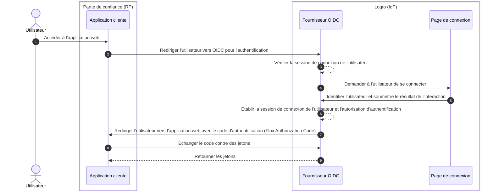

# Déconnexion

Le processus de déconnexion dans Logto (en tant que fournisseur d'identité basé sur OIDC) est un concept à multiples facettes en raison de l'implication à la fois de la session de connexion centralisée gérée par Logto et du statut d'authentification distribué géré par les applications clientes.

## Session de connexion \{#sign-in-session}

Pour mieux comprendre le processus de déconnexion, il est important de comprendre d'abord comment les sessions de connexion utilisateur et leur statut d'authentification sont gérés dans Logto.



1. L'utilisateur accède à l'application web (RP).
2. L'application cliente redirige l'utilisateur vers Logto (IdP) pour l'[authentification](https://auth.wiki/authentication).
3. Le fournisseur OIDC vérifie l'état de la session de connexion de l'utilisateur. Si aucune session n'existe ou si la session a expiré, l'utilisateur est invité à se connecter.
4. L'utilisateur interagit avec la page de connexion pour s'authentifier.
5. Après une connexion réussie, Logto crée une nouvelle session pour l'utilisateur et le redirige vers l'application cliente avec un code d'autorisation.
6. Le fournisseur OIDC crée une nouvelle session de connexion et une autorisation d'authentification pour l'utilisateur.
7. Le fournisseur OIDC redirige l'utilisateur vers le client avec un code d'authentification ([Flux Authorization Code](https://auth.wiki/authorization-code-flow)).
8. Le client reçoit le code d'authentification et l'échange contre des jetons pour accéder aux informations de l'utilisateur.
9. Accorder les jetons à l'application cliente.

## Composants \{#components}

### Session de connexion centralisée gérée par Logto \{#centralized-sign-in-session-managed-by-logto}

Dans le flux ci-dessus, la session de connexion centralisée est gérée par Logto. La session est créée lorsque l'utilisateur se connecte avec succès et est détruite lorsque l'utilisateur se déconnecte. La session est également détruite lorsque la session de l'utilisateur expire.

La session de connexion Logto est gérée à l'aide de cookies de session. Le cookie de session est défini lorsque l'utilisateur se connecte. Toutes les requêtes d'authentification sont validées par rapport au cookie de session. Si le cookie de session est présent et valide, l'utilisateur sera automatiquement authentifié et directement redirigé vers l'application cliente avec le code d'autorisation. Sinon, l'utilisateur sera invité à se connecter.

1. Cookie de session Logto partagé  
   Pour un utilisateur qui se connecte à plusieurs applications clientes depuis le même agent utilisateur (par exemple, navigateur), l'utilisateur aura un cookie de session partagé sous le domaine Logto. Cela signifie que l'utilisateur n'a besoin de se connecter qu'une seule fois et sera automatiquement authentifié pour les autres applications clientes.

   ```mermaid
    flowchart TD
    subgraph Utilisateur [Agent utilisateur A]
      U[Utilisateur]

      subgraph Layer1 [Domaine client A]
        A[Application cliente A]
      end

      subgraph Layer1 [Domaine client B]
        B[Application cliente B]
      end

      subgraph Layer2 [Domaine Logto]
          C{{Session de connexion Logto ?}}
          D[Page de connexion]
      end
    end

    U --> |Connexion| A
    A --> |Rediriger vers Logto| C
    U --> |Connexion| B
    B --> |Rediriger vers Logto| C
    C --> |Non| D
    D --> |Créer session| C
   ```

2. Cookie de session Logto isolé  
   Pour un utilisateur qui se connecte à différentes applications clientes depuis différents appareils ou navigateurs, l'utilisateur aura des cookies de session isolés sous le domaine Logto. Cela signifie que l'utilisateur doit se connecter séparément pour chaque application cliente.

   ```mermaid
    flowchart TD
    U[Utilisateur]

    subgraph DeviceA [Agent utilisateur A]
      subgraph Layer1 [Domaine client A]
        A[Application cliente A]
      end

      subgraph Layer2 [Domaine Logto]
          C{{Session de connexion Logto ?}}
          D[Page de connexion]
      end
    end

    subgraph DeviceB [Agent utilisateur B]
      subgraph Layer3 [Domaine client B]
        B[Application cliente B]
      end

      subgraph Layer4 [Domaine Logto]
          E{{Session de connexion Logto ?}}
          F[Page de connexion]
      end
    end

    U --> |Connexion| A
    A --> |Rediriger vers Logto| C
    U --> |Connexion| B
    B --> |Rediriger vers Logto| E
    C --> |Non| D
    E --> |Non| F
    D --> |Créer session| C
    F --> |Créer session| E
   ```

## Statut d'authentification distribué géré par les applications clientes \{#distributed-authentication-status-managed-by-the-client-applications}

Chaque application cliente maintient son propre statut d'authentification. Qu'il s'agisse d'une application Native, SPA ou Web, toutes ont leur propre manière de gérer le statut d'authentification de l'utilisateur.

Après une connexion réussie, l'application cliente peut recevoir un [jeton d’identifiant (ID token)](https://auth.wiki/id-token) et un [jeton d’accès (Access token)](https://auth.wiki/access-token). L'application cliente peut utiliser le jeton d’identifiant pour déterminer l'identité de l'utilisateur et le jeton d’accès pour accéder aux ressources de l'utilisateur. Le statut d'authentification de l'utilisateur est représenté par la date d'expiration du jeton d’accès.

- Applications Native et SPA :  
  L'application cliente doit stocker et gérer ces jetons de manière sécurisée afin de maintenir le statut d'authentification de l'utilisateur. Par exemple, stocker les jetons dans le stockage local ou le stockage de session, et effacer les jetons lorsque l'utilisateur se déconnecte.
- Applications Web :  
  Les applications web, comme celles construites avec des frameworks tels que Next.js, gèrent souvent leur propre session pour les utilisateurs connectés en plus des jetons émis par Logto. Une fois que l'utilisateur se connecte et que l'application web reçoit les jetons de Logto, elle peut stocker les jetons côté client comme les applications SPA, ou les stocker côté serveur et gérer la session à l'aide de cookies ou d'autres mécanismes.

## Mécanismes de déconnexion \{#sign-out-mechanisms}

### Effacer les jetons et la session locale côté client \{#clear-tokens-and-local-session-at-the-client-side}

Côté client, une déconnexion simple consiste à effacer la session locale et à supprimer les jetons (jeton d’identifiant, jeton d’accès, jeton de rafraîchissement) du stockage local ou du stockage de session. Cela aboutit à une déconnexion uniquement côté client, la session centralisée restant intacte. Les utilisateurs se déconnectant de cette manière peuvent toujours accéder à d'autres applications sous la même session du serveur d'autorisation jusqu'à ce que la session centralisée expire ou soit détruite activement.

### Effacer la session de connexion chez Logto \{#clear-sign-in-session-at-logto}

Pour déconnecter explicitement l'utilisateur et effacer la session chez Logto, l'application cliente doit rediriger l'utilisateur vers l'**endpoint de fin de session** de Logto.

Par exemple : `https://{your-logto-domain}/oidc/session/end`

L'**endpoint de fin de session** est un endpoint OIDC standard qui permet à l'application cliente de notifier le serveur d'autorisation que l'utilisateur s'est déconnecté. L'endpoint effacera la session de connexion centralisée chez Logto.

Une fois la session effacée, toute demande d'autorisation ultérieure nécessitera que l'utilisateur se connecte à nouveau.

Si un **post-logout redirect URI** est fourni, l'utilisateur sera redirigé vers l'URI spécifié après la suppression de la session. Sinon, l'utilisateur sera redirigé vers la page de post-déconnexion par défaut hébergée par Logto.

## Déconnexion fédérée : Back-channel logout \{#federated-sign-out-back-channel-logout}

Pour une gestion de la déconnexion plus cohérente, Logto prend en charge le [back-channel logout](https://openid.net/specs/openid-connect-backchannel-1_0-final.html). Le back-channel logout est un mécanisme qui permet à Logto de notifier toutes les applications clientes sous la même session de connexion lorsque l'utilisateur se déconnecte.

Ceci est particulièrement utile dans les scénarios où l'utilisateur se déconnecte d'une application cliente et s'attend à être déconnecté de toutes les autres applications clientes sous la même session de connexion Logto.

Pour activer le back-channel logout pour vos applications clientes, rendez-vous sur la page de détails de l'application dans le tableau de bord Logto et enregistrez un URI de back-channel logout. Logto enverra un jeton de déconnexion à tous les URI enregistrés lorsque l'utilisateur initie une demande de déconnexion depuis n'importe quelle application cliente.

Si votre application cliente nécessite que la session de connexion soit incluse dans le jeton de déconnexion, activez le paramètre `Is session required` dans la configuration du back-channel logout. Une revendication `sid` sera incluse dans le jeton de déconnexion pour identifier la session de connexion de l'utilisateur chez Logto.

1. L'utilisateur initie une demande de déconnexion depuis une application cliente.
2. Logto reçoit la demande de fin de session, génère un jeton de déconnexion et l'envoie à tous les URI de back-channel logout enregistrés.
3. Chaque application cliente reçoit le jeton de déconnexion et effectue les actions de déconnexion.

Actions de déconnexion pour chaque application cliente lors de la réception du jeton de déconnexion :

- Valider le jeton de déconnexion.
- Effacer la session locale et supprimer les jetons du stockage local ou du stockage de session.

## Méthodes de déconnexion dans les SDK Logto \{#sign-out-methods-in-logto-sdks}

Si vous intégrez Logto à votre application cliente à l'aide des SDK Logto :

- Pour les applications SPA et web, la méthode `client.signOut()` effacera le stockage local des jetons et redirigera l'utilisateur vers l'endpoint de fin de session de Logto. Vous pouvez spécifier un **post-logout redirect URI** pour rediriger l'utilisateur après la suppression de la session.
- Pour les applications natives (y compris les applications hybrides comme **React Native** et **Flutter**), seul le stockage local des jetons est effacé. En effet, dans les applications natives, nous utilisons le webview sans session pour gérer le processus de connexion. Aucun cookie de session n'est stocké dans le navigateur natif, il n'est donc pas nécessaire d'effacer la session de connexion chez Logto. Chaque demande d'authentification est une demande autonome qui ne transporte aucun cookie de session.

:::note
Pour les applications natives qui ne prennent pas en charge le webview sans session ou qui ne reconnaissent pas les paramètres `emphasized` (application Android utilisant le SDK **React Native** ou **Flutter**), vous pouvez forcer l'utilisateur à se reconnecter en passant le paramètre `prompt=login` dans la requête d'autorisation.
:::

## Imposer la ré-authentification à chaque accès \{#enforce-re-authentication-on-every-access}

Dans les scénarios à haute sécurité—comme la vérification de l'identité d'un utilisateur avant des actions sensibles—vous pouvez souhaiter exiger que l'utilisateur se ré-authentifie à chaque accès. Pour imposer ce comportement, incluez `prompt=login` dans votre requête d'authentification.

Définir `prompt=login` force Logto à toujours afficher la page de connexion, que l'utilisateur ait ou non une session active ou se soit récemment connecté. Cela contourne le comportement d'authentification unique (SSO) et garantit que l'utilisateur doit saisir ses identifiants à chaque fois.

Si votre application demande la portée offline_access (pour recevoir un jeton de rafraîchissement), la spécification OpenID Connect exige également d'inclure `prompt=consent`.  
Dans la plupart des cas, pour à la fois imposer la ré-authentification et garantir l'émission du jeton de rafraîchissement, définissez :

```
prompt=login consent
```

Cela garantit que l'utilisateur est ré-authentifié et consent explicitement à l'accès hors ligne.

## FAQ \{#faqs}

<details>
  <summary>

### Je ne reçois pas les notifications de back-channel logout. \{#im-not-receiving-the-back-channel-logout-notifications}

</summary>

- Assurez-vous que l'URI de back-channel logout est correctement enregistré dans le tableau de bord Logto.
- Assurez-vous que votre application cliente dispose d'une session de connexion active valide et qu'il s'agit de la même session que celle ayant initié la demande de déconnexion.

</details>

## Ressources associées \{#related-resources}

<Url href="https://blog.logto.io/oidc-back-channel-logout/">
  Comprendre le back-channel logout OIDC.
</Url>
