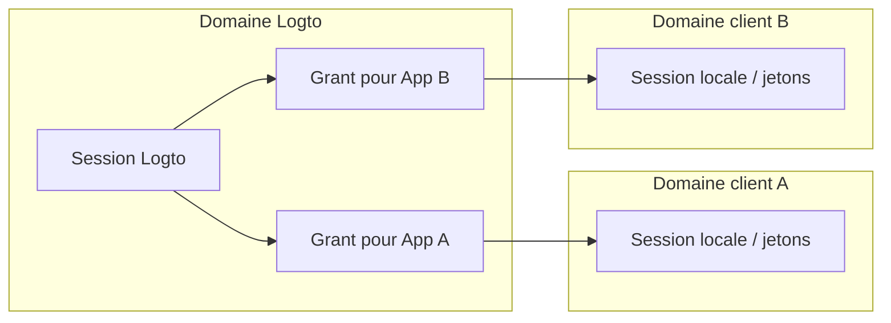
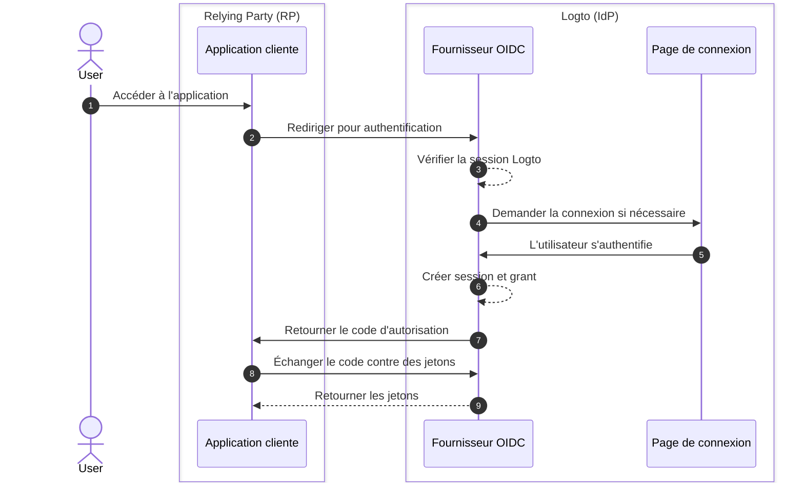
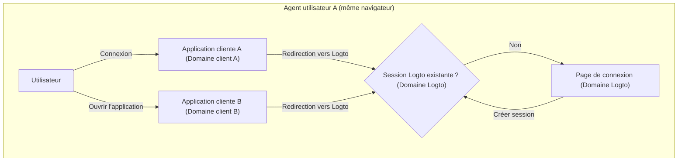
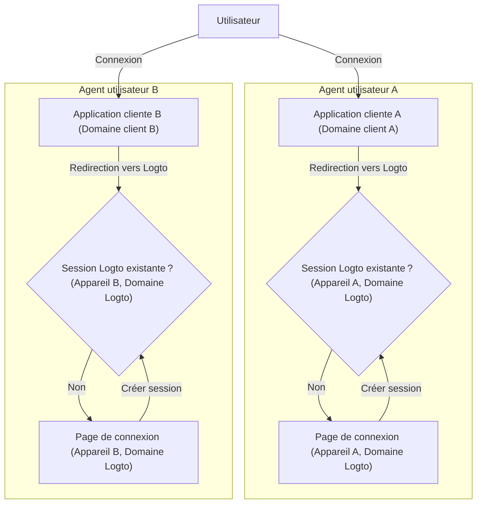
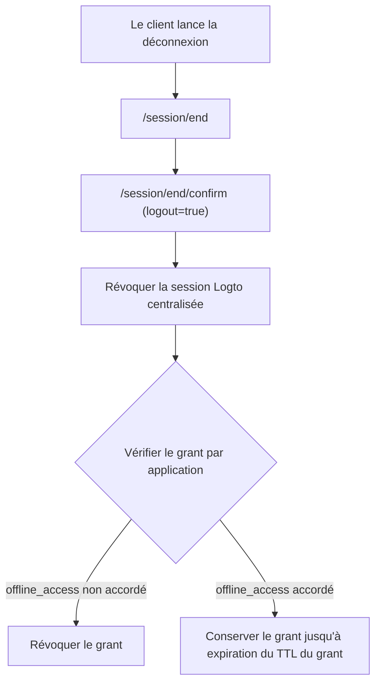

# Déconnexion

La déconnexion dans Logto (en tant que fournisseur d'identité OIDC) implique à la fois :

- Une **session Logto centralisée** (cookie de navigateur sous le domaine Logto), et
- **Un état d'authentification côté client distribué** (jetons et session locale de l'application dans chaque application).

Pour comprendre le comportement de la déconnexion, il est utile de séparer ces deux couches puis de voir comment les **grants** les relient.

## Concepts de base \{#core-concepts}

### Qu'est-ce qu'une session Logto ? \{#what-is-a-logto-session}

Une session Logto est l'état de connexion centralisé géré par Logto. Elle est créée après une authentification réussie et représentée par des cookies sous le domaine Logto.

Si le cookie de session est valide, l'utilisateur peut être authentifié silencieusement (SSO) sur plusieurs applications qui font confiance au même tenant Logto.

Si aucune session valide n'existe, Logto affiche la page de connexion.

### Qu'est-ce qu'un grant ? \{#what-are-grants}

Un **grant** représente l'état d'autorisation pour une combinaison utilisateur + application cliente spécifique.

- Une session Logto peut avoir des grants pour plusieurs applications clientes.
- Un grant est ce à quoi les jetons émis sont associés.
- Dans cette documentation, utilisez **grant** comme unité d'autorisation inter-applications.

### Comment la session, les grants et l'état d'authentification du client sont liés \{#how-session-grants-and-client-auth-status-relate}


```mermaid
flowchart LR
  subgraph Logto [Domaine Logto]
    S[Session Logto]
    G1[Grant pour App A]
    G2[Grant pour App B]
  end

  subgraph AppA [Domaine client A]
    A[Session locale / jetons]
  end

  subgraph AppB [Domaine client B]
    B[Session locale / jetons]
  end

  S --> G1
  S --> G2
  G1 --> A
  G2 --> B
```

- **Session Logto** contrôle l'expérience SSO centralisée.
- **Session locale / jetons du client** contrôlent si chaque application considère actuellement l'utilisateur comme connecté.
- **Grants** relient ces deux mondes en représentant l'état d'autorisation spécifique à l'application.

## Récapitulatif de la connexion (pourquoi la déconnexion est multi-couches) \{#sign-in-recap-why-sign-out-is-multi-layered}


```mermaid
sequenceDiagram
  autonumber
  actor User

  box Relying Party (RP)
    participant Client as Application cliente
  end

  box Logto (IdP)
    participant OIDC as Fournisseur OIDC
    participant SignIn as Page de connexion
  end

  User ->> Client: Accéder à l'application
  Client ->> OIDC: Rediriger pour authentification
  OIDC -->> OIDC: Vérifier la session Logto
  OIDC ->> SignIn: Demander la connexion si nécessaire
  SignIn ->> OIDC: L'utilisateur s'authentifie
  OIDC -->> OIDC: Créer session et grant
  OIDC ->> Client: Retourner le code d'autorisation
  Client ->> OIDC: Échanger le code contre des jetons
  OIDC -->> Client: Retourner les jetons
```

## Topologie des sessions entre applications / appareils \{#session-topology-across-apps-devices}

### Cookie de session partagé (même navigateur / agent utilisateur) \{#shared-session-cookie-same-browser-user-agent}

Si un utilisateur se connecte à plusieurs applications depuis le même navigateur, ces applications peuvent réutiliser le même cookie de session Logto et le comportement SSO s'applique.


```mermaid
flowchart TD
  U[Utilisateur]
  A["Application cliente A (Domaine client A)"]
  B["Application cliente B (Domaine client B)"]
  C{"Session Logto existante ? (Domaine Logto)"}
  D["Page de connexion (Domaine Logto)"]

  subgraph UA["Agent utilisateur A (même navigateur)"]
    U
    A
    B
    C
    D
  end

  U -->|Connexion| A
  A -->|Redirection vers Logto| C
  U -->|Ouvrir l'application| B
  B -->|Redirection vers Logto| C
  C -->|Non| D
  D -->|Créer session| C
```

### Cookies de session isolés (appareils / navigateurs différents) \{#isolated-session-cookies-different-devices-browsers}

Des navigateurs / appareils différents détiennent des cookies Logto différents, donc l'état de session de connexion est isolé.


```mermaid
flowchart TD
  U[Utilisateur]
  A["Application cliente A (Domaine client A)"]
  C{"Session Logto existante ? (Appareil A, Domaine Logto)"}
  D["Page de connexion (Appareil A, Domaine Logto)"]

  subgraph DeviceA["Agent utilisateur A"]
    A
    C
    D
  end

  B["Application cliente B (Domaine client B)"]
  E{"Session Logto existante ? (Appareil B, Domaine Logto)"}
  F["Page de connexion (Appareil B, Domaine Logto)"]

  subgraph DeviceB["Agent utilisateur B"]
    B
    E
    F
  end

  U -->|Connexion| A
  A -->|Redirection vers Logto| C
  U -->|Connexion| B
  B -->|Redirection vers Logto| E
  C -->|Non| D
  E -->|Non| F
  D -->|Créer session| C
  F -->|Créer session| E
```

## Mécanismes de déconnexion \{#sign-out-mechanisms}

### 1) Déconnexion côté client uniquement \{#1-client-side-only-sign-out}

L'application cliente efface sa propre session locale et ses jetons (jetons d’identifiant / d’accès / de rafraîchissement). Cela déconnecte l'utilisateur uniquement de l'état local de cette application.

- La session Logto peut toujours être active.
- D'autres applications sous la même session Logto peuvent toujours utiliser le SSO.

### 2) Fin de session sur Logto (déconnexion globale dans l'implémentation Logto actuelle) \{#2-end-session-at-logto-global-sign-out-in-current-logto-implementation}

Pour effacer la session Logto centralisée, l'application redirige l'utilisateur vers l'endpoint de fin de session, par exemple :

`https://{your-logto-domain}/oidc/session/end`

Dans le comportement actuel du SDK Logto :

1. `signOut()` redirige vers `/session/end`.
2. Puis cela va vers `/session/end/confirm`.
3. Le formulaire de confirmation par défaut envoie automatiquement `logout=true`.

En conséquence, la déconnexion via le SDK est traitée comme une **déconnexion globale**.

### Que se passe-t-il lors d'une déconnexion globale \{#what-happens-during-global-sign-out}


```mermaid
flowchart TD
  A["Le client lance la déconnexion"] --> B["/session/end"]
  B --> C["/session/end/confirm (logout=true)"]
  C --> D["Révoquer la session Logto centralisée"]
  D --> E{"Vérifier le grant par application"}
  E -->|"offline_access non accordé"| F["Révoquer le grant"]
  E -->|"offline_access accordé"| G["Conserver le grant jusqu'à expiration du TTL du grant"]
```

Lors d'une déconnexion globale :

- La session Logto centralisée est révoquée.
- Les grants associés aux applications sont traités selon l'état d'autorisation de chaque application :
  - Si `offline_access` **n'est pas** accordé, les grants associés sont révoqués.
  - Si `offline_access` **est** accordé, les grants ne sont pas révoqués par la fin de session.
- Pour les cas `offline_access`, les jetons de rafraîchissement et les grants restent valides jusqu'à expiration du grant.

## Durée de vie du grant et impact de `offline_access` \{#grant-lifetime-and-offline-access-impact}

- Le TTL par défaut d'un grant Logto est de **180 jours**.
- Si `offline_access` est accordé, la fin de session ne révoque pas ce grant d'application par défaut.
- La chaîne de jetons de rafraîchissement associée à ce grant peut continuer jusqu'à expiration du grant (ou révocation explicite).

## Déconnexion fédérée : back-channel logout \{#federated-sign-out-back-channel-logout}

Pour la cohérence inter-applications, Logto prend en charge le [back-channel logout](https://openid.net/specs/openid-connect-backchannel-1_0-final.html).

Lorsqu'un utilisateur se déconnecte d'une application, Logto peut notifier toutes les applications participant à la même session en envoyant un jeton de déconnexion à chaque URI de back-channel logout enregistré.

Si `Is session required` est activé dans les paramètres de back-channel de l'application, le jeton de déconnexion inclut `sid` pour identifier la session Logto.

Flux typique :

1. L'utilisateur initie la déconnexion depuis une application.
2. Logto traite la fin de session et envoie le(s) jeton(s) de déconnexion à l'(aux) URI(s) de back-channel logout enregistrée(s).
3. Chaque application valide le jeton de déconnexion et efface sa propre session locale / ses jetons.

## Méthodes de déconnexion dans les SDK Logto \{#sign-out-methods-in-logto-sdks}

- **SPA et web** : `client.signOut()` efface le stockage local des jetons et redirige vers l'endpoint de fin de session Logto. Vous pouvez fournir une URI de redirection post-déconnexion.
- **Natif (y compris React Native / Flutter)** : efface généralement uniquement le stockage local des jetons. Le webview sans session signifie qu'il n'y a pas de cookie Logto persistant à effacer.

:::note
Pour les applications natives qui ne prennent pas en charge le webview sans session ou ne reconnaissent pas les paramètres `emphasized` (application Android utilisant le SDK **React Native** ou **Flutter**), vous pouvez forcer l'utilisateur à saisir à nouveau ses identifiants en passant le paramètre `prompt=login` dans la requête d'autorisation.
:::

## Imposer la ré-authentification à chaque accès \{#enforce-re-authentication-on-every-access}

Pour les actions à haute sécurité, incluez `prompt=login` dans les requêtes d'authentification pour contourner le SSO et forcer la saisie des identifiants à chaque fois.

Si vous demandez `offline_access` (pour recevoir des jetons de rafraîchissement), incluez également `consent`, `prompt=login consent`.

Paramètre combiné typique :

```txt
prompt=login consent
```

## FAQ \{#faqs}

<details>
  <summary>

### Je ne reçois pas les notifications de back-channel logout. \{#im-not-receiving-the-back-channel-logout-notifications}

</summary>

- Vérifiez que l'URI de back-channel logout est correctement enregistrée dans le tableau de bord Logto.
- Vérifiez que votre application a un état de connexion actif pour le même utilisateur / contexte de session.

</details>

## Ressources associées \{#related-resources}

<Url href="https://blog.logto.io/oidc-back-channel-logout/">
  Comprendre le back-channel logout OIDC.
</Url>
