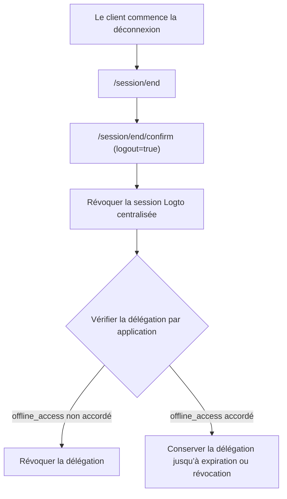

# Déconnexion

La déconnexion dans Logto implique deux niveaux :

- **Déconnexion de session Logto** : Met fin à la session de connexion centralisée sous le domaine Logto.
- **Déconnexion de l’application** : Efface l’état de session local et les jetons dans votre application cliente.

Pour mieux comprendre comment fonctionnent les sessions dans Logto, consultez [Sessions](/sessions).

## Mécanismes de déconnexion \{#sign-out-mechanisms}

### 1) Déconnexion côté client uniquement \{#1-client-side-only-sign-out}

L’application cliente efface sa propre session locale et ses jetons (jetons d’identifiant / d’accès / de rafraîchissement). Cela déconnecte l’utilisateur uniquement de l’état local de cette application.

- La session Logto peut toujours être active.
- D’autres applications sous la même session Logto peuvent toujours utiliser l’authentification unique (SSO).

### 2) Fin de session chez Logto (déconnexion globale dans l’implémentation actuelle de Logto) \{#2-end-session-at-logto-global-sign-out-in-current-logto-implementation}

Pour effacer la session Logto centralisée, l’application redirige l’utilisateur vers l’endpoint de fin de session, par exemple :

`https://{your-logto-domain}/oidc/session/end`

Dans le comportement actuel du SDK Logto :

1. `signOut()` redirige vers `/session/end`.
2. Ensuite, cela va vers `/session/end/confirm`.
3. Le formulaire de confirmation par défaut envoie automatiquement `logout=true`.

En conséquence, la déconnexion via le SDK est traitée comme une **déconnexion globale**.

:::note

- **Déconnexion globale** : Révoque la session Logto centralisée.

:::

### Que se passe-t-il lors d’une déconnexion globale \{#what-happens-during-global-sign-out}


```mermaid
flowchart TD
  A["Le client commence la déconnexion"] --> B["/session/end"]
  B --> C["/session/end/confirm (logout=true)"]
  C --> D["Révoquer la session Logto centralisée"]
  D --> E{"Vérifier la délégation par application"}
  E -->|"offline_access non accordé"| F["Révoquer la délégation"]
  E -->|"offline_access accordé"| G["Conserver la délégation jusqu’à expiration ou révocation"]
```

Lors d’une déconnexion globale :

- La session Logto centralisée est révoquée.
- Les délégations d’application associées sont gérées selon l’état d’autorisation de chaque application :
  - Si `offline_access` **n’est pas** accordé, les délégations associées sont révoquées.
  - Si `offline_access` **est** accordé, les délégations ne sont pas révoquées par la fin de session.
- Pour les cas `offline_access`, les jetons de rafraîchissement et les délégations restent valides jusqu’à la première des échéances suivantes : expiration de la délégation, expiration du jeton de rafraîchissement ou révocation explicite.

## Durée de vie de la délégation et impact de `offline_access` \{#grant-lifetime-and-offline-access-impact}

- La durée de vie par défaut d’une délégation Logto est de **180 jours**.
- Si `offline_access` est accordé, la fin de session ne révoque pas cette délégation d’application par défaut.
- Les chaînes de jetons de rafraîchissement associées à cette délégation peuvent continuer jusqu’à l’expiration de la délégation, l’expiration du jeton de rafraîchissement ou la révocation explicite de la délégation.
- Pour les applications monopage (SPA), la rotation du jeton de rafraîchissement n’étend pas la durée de vie du jeton de rafraîchissement, donc le jeton de rafraîchissement peut expirer avant la délégation.

## Déconnexion fédérée : déconnexion back-channel \{#federated-sign-out-back-channel-logout}

Pour la cohérence inter-applications, Logto prend en charge la [déconnexion back-channel](https://openid.net/specs/openid-connect-backchannel-1_0-final.html).

Lorsqu’un utilisateur se déconnecte d’une application, Logto peut notifier toutes les applications participant à la même session en envoyant un jeton de déconnexion à chaque URI de déconnexion back-channel enregistrée.

Si `Is session required` est activé dans les paramètres back-channel de l’application, le jeton de déconnexion inclut `sid` pour identifier la session Logto.

Flux typique :

1. L’utilisateur initie la déconnexion depuis une application.
2. Logto traite la fin de session et envoie le(s) jeton(s) de déconnexion aux URI de déconnexion back-channel enregistrées.
3. Chaque application valide le jeton de déconnexion et efface sa propre session / ses jetons locaux.

## Méthodes de déconnexion dans les SDK Logto \{#sign-out-methods-in-logto-sdks}

- **SPA et web** : `client.signOut()` efface le stockage local des jetons et redirige vers l’endpoint de fin de session Logto. Vous pouvez fournir une URI de redirection après déconnexion.
- **Natif (y compris React Native / Flutter)** : efface généralement uniquement le stockage local des jetons. Le webview sans session signifie qu’il n’y a pas de cookie navigateur Logto persistant à effacer.

:::note
Pour les applications natives qui ne prennent pas en charge le webview sans session ou qui ne reconnaissent pas les paramètres `emphasized` (application Android utilisant le SDK **React Native** ou **Flutter**), vous pouvez forcer l’invite de connexion à nouveau en passant le paramètre `prompt=login` dans la requête d’autorisation.
:::

## Imposer la ré-authentification à chaque accès \{#enforce-re-authentication-on-every-access}

Pour les actions à haute sécurité, incluez `prompt=login` dans les requêtes d’authentification pour contourner l’authentification unique (SSO) et forcer la saisie des identifiants à chaque fois.

Si vous demandez `offline_access` (pour recevoir des jetons de rafraîchissement), incluez également `consent`, `prompt=login consent`.

Paramètre combiné typique :

```txt
prompt=login consent
```

## FAQ \{#faqs}

<details>
  <summary>

### Je ne reçois pas les notifications de déconnexion back-channel. \{#im-not-receiving-the-back-channel-logout-notifications}

</summary>

- Vérifiez que l’URI de déconnexion back-channel est correctement enregistrée dans le tableau de bord Logto.
- Vérifiez que votre application a un état de connexion actif pour le même utilisateur / contexte de session.

</details>

## Ressources associées \{#related-resources}

<Url href="https://blog.logto.io/oidc-back-channel-logout/">
  Comprendre la déconnexion back-channel OIDC.
</Url>
