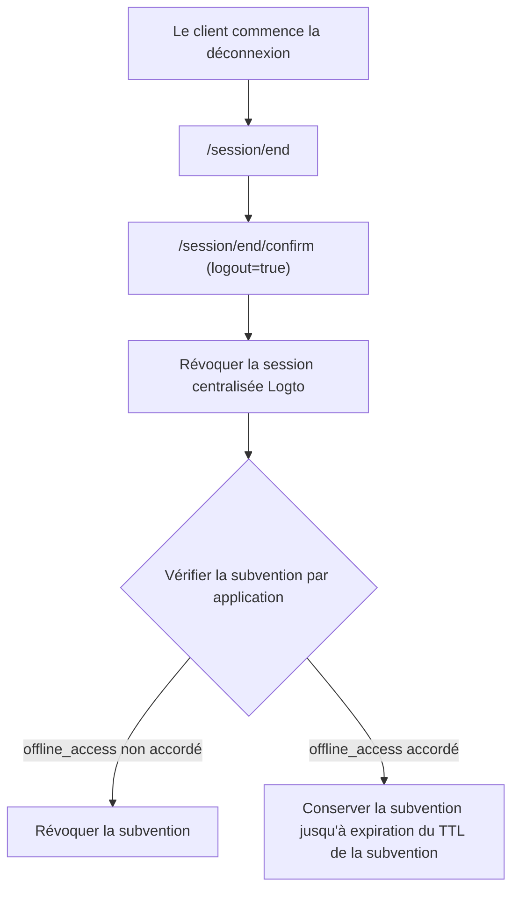

# Déconnexion

La déconnexion dans Logto implique deux couches :

- **Déconnexion de session Logto** : Termine la session de connexion centralisée sous le domaine Logto.
- **Déconnexion de l'application** : Efface l'état de session local et les jetons dans votre application cliente.

Pour mieux comprendre comment fonctionnent les sessions dans Logto, voir [Sessions](/sessions).

## Mécanismes de déconnexion \{#sign-out-mechanisms}

### 1) Déconnexion côté client uniquement \{#1-client-side-only-sign-out}

L'application cliente efface sa propre session locale et ses jetons (jetons d’identifiant / d’accès / de rafraîchissement). Cela déconnecte l'utilisateur uniquement de l'état local de cette application.

- La session Logto peut toujours être active.
- D'autres applications sous la même session Logto peuvent toujours utiliser l'authentification unique (SSO).

### 2) Fin de session chez Logto (déconnexion globale dans l'implémentation actuelle de Logto) \{#2-end-session-at-logto-global-sign-out-in-current-logto-implementation}

Pour effacer la session centralisée Logto, l'application redirige l'utilisateur vers le point de terminaison de fin de session, par exemple :

`https://{your-logto-domain}/oidc/session/end`

Dans le comportement actuel du SDK Logto :

1. `signOut()` redirige vers `/session/end`.
2. Puis il va à `/session/end/confirm`.
3. Le formulaire de confirmation par défaut envoie automatiquement `logout=true`.

En conséquence, la déconnexion actuelle du SDK est traitée comme une **déconnexion globale**.

:::note

- **Déconnexion globale** : Révoque la session centralisée Logto.

:::

### Que se passe-t-il lors de la déconnexion globale \{#what-happens-during-global-sign-out}


```mermaid
flowchart TD
  A["Le client commence la déconnexion"] --> B["/session/end"]
  B --> C["/session/end/confirm (logout=true)"]
  C --> D["Révoquer la session centralisée Logto"]
  D --> E{"Vérifier la subvention par application"}
  E -->|"offline_access non accordé"| F["Révoquer la subvention"]
  E -->|"offline_access accordé"| G["Conserver la subvention jusqu'à expiration du TTL de la subvention"]
```

Lors de la déconnexion globale :

- La session centralisée Logto est révoquée.
- Les subventions d'application associées sont gérées selon l'état d'autorisation de chaque application :
  - Si `offline_access` n'est **pas** accordé, les subventions associées sont révoquées.
  - Si `offline_access` est accordé, les subventions ne sont pas révoquées par la fin de session.
- Pour les cas `offline_access`, les jetons de rafraîchissement et les subventions restent valides jusqu'à l'expiration de la subvention.

## Durée de vie de la subvention et impact de `offline_access` \{#grant-lifetime-and-offline-access-impact}

- Le TTL de subvention par défaut de Logto est de **180 jours**.
- Si `offline_access` est accordé, la fin de session ne révoque pas cette subvention d'application par défaut.
- La chaîne de jetons de rafraîchissement associée à cette subvention peut continuer jusqu'à l'expiration de la subvention (ou jusqu'à ce qu'elle soit explicitement révoquée).

## Déconnexion fédérée : déconnexion par canal arrière \{#federated-sign-out-back-channel-logout}

Pour une cohérence inter-applications, Logto prend en charge la [déconnexion par canal arrière](https://openid.net/specs/openid-connect-backchannel-1_0-final.html).

Lorsqu'un utilisateur se déconnecte d'une application, Logto peut notifier toutes les applications participant à la même session en envoyant un jeton de déconnexion à l'URI de déconnexion par canal arrière enregistrée de chaque application.

Si `Is session required` est activé dans les paramètres de canal arrière de l'application, le jeton de déconnexion inclut `sid` pour identifier la session Logto.

Flux typique :

1. L'utilisateur initie la déconnexion d'une application.
2. Logto traite la fin de session et envoie le(s) jeton(s) de déconnexion à l'URI de déconnexion par canal arrière enregistrée.
3. Chaque application valide le jeton de déconnexion et efface sa propre session locale / ses jetons.

## Méthodes de déconnexion dans les SDK Logto \{#sign-out-methods-in-logto-sdks}

- **SPA et web** : `client.signOut()` efface le stockage local des jetons et redirige vers le point de terminaison de fin de session Logto. Vous pouvez fournir une URI de redirection post-déconnexion.
- **Natif (y compris React Native / Flutter)** : efface généralement uniquement le stockage local des jetons. Webview sans session signifie qu'il n'y a pas de cookie de navigateur Logto persistant à effacer.

:::note
Pour les applications natives qui ne prennent pas en charge le webview sans session ou ne reconnaissent pas les paramètres `emphasized` (application Android utilisant le SDK **React Native** ou **Flutter**), vous pouvez forcer l'utilisateur à se reconnecter en passant le paramètre `prompt=login` dans la requête d'autorisation.
:::

## Imposer une ré-authentification à chaque accès \{#enforce-re-authentication-on-every-access}

Pour les actions à haute sécurité, incluez `prompt=login` dans les requêtes d'authentification pour contourner le SSO et forcer l'entrée des identifiants à chaque fois.

Si vous demandez `offline_access` (pour recevoir des jetons de rafraîchissement), incluez également `consent`, `prompt=login consent`.

Paramètre combiné typique :

```txt
prompt=login consent
```

## FAQs \{#faqs}

<details>
  <summary>

### Je ne reçois pas les notifications de déconnexion par canal arrière. \{#im-not-receiving-the-back-channel-logout-notifications}

</summary>

- Assurez-vous que l'URI de déconnexion par canal arrière est correctement enregistrée dans le tableau de bord Logto.
- Assurez-vous que votre application a un état de connexion actif pour le même utilisateur / contexte de session.

</details>

## Ressources associées \{#related-resources}

<Url href="https://blog.logto.io/oidc-back-channel-logout/">
  Comprendre la déconnexion par canal arrière OIDC.
</Url>
