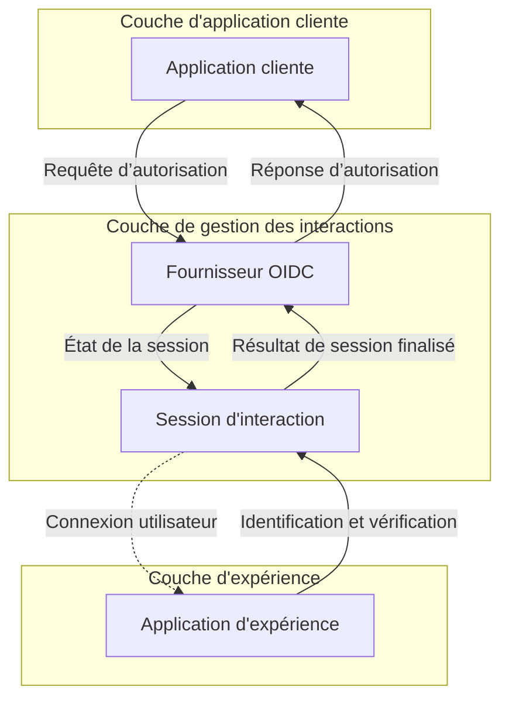

# Inscription et connexion

L'inscription et la connexion sont le processus d'interaction principal pour les utilisateurs finaux afin d'effectuer l'Authentification (Authentication) et l'Autorisation (Authorization) d'accès aux applications clientes. En tant que plateforme CIAM centralisée basée sur OIDC, Logto offre une Expérience de connexion universelle pour les utilisateurs à travers plusieurs applications et plateformes clientes.

## Flux utilisateur

Dans un flux d'Authentification (Authentication) OIDC typique, l'utilisateur commence par ouvrir l'application cliente. L'application cliente envoie une Requête d’autorisation au fournisseur OIDC de Logto. Si l'utilisateur n'a pas de session active, Logto redirigera l'utilisateur vers la page d'Expérience de connexion hébergée par Logto. L'utilisateur interagit avec la page d'Expérience de Logto et s'authentifie en fournissant les informations d'identification nécessaires. Une fois que l'utilisateur est authentifié avec succès, Logto redirige l'utilisateur vers l'application cliente avec le code d'autorisation. L'application cliente envoie ensuite une Requête de jeton au fournisseur OIDC de Logto avec le code d'autorisation pour obtenir les jetons.

## Interaction utilisateur

Une **session d'interaction** est créée pour chaque interaction utilisateur lorsqu'une application cliente initie une Requête d’autorisation. Cette session centralise le statut de l'interaction utilisateur à travers plusieurs applications clientes, permettant à Logto de fournir une Expérience de connexion cohérente. Lorsque les utilisateurs passent d'une application cliente à une autre, la session d'interaction reste cohérente, maintenant le statut d'Authentification (Authentication) de l'utilisateur et réduisant le besoin de connexions répétées à travers les plateformes. Une fois la **session d'interaction** établie, l'utilisateur est invité à se connecter à Logto.

L'**application d'expérience** dans Logto est une application dédiée et hébergée qui facilite l'Expérience de connexion. Lorsque les utilisateurs ont besoin de s'authentifier, ils sont dirigés vers l'**application d'expérience**, où ils complètent leur connexion et interagissent avec Logto. L'**application d'expérience** utilise la session d'interaction active pour suivre et soutenir la progression de l'interaction de l'utilisateur.

Pour soutenir et contrôler ce parcours utilisateur, Logto présente un ensemble d'**Experience APIs** basées sur les sessions. Ces APIs permettent à l'**application d'expérience** de gérer une large gamme de méthodes d'identification et de vérification des utilisateurs en mettant à jour et en accédant au statut de la session d'interaction en temps réel.

Une fois que l'utilisateur répond à toutes les exigences de validation et de vérification, la session d'interaction se termine par une soumission de résultat au fournisseur OIDC, où l'utilisateur est entièrement authentifié et a donné son consentement, finalisant ainsi le processus de connexion sécurisé.

## Personnalisation de l'expérience de connexion

Logto offre une Expérience utilisateur flexible et personnalisable pour répondre à divers besoins commerciaux. Cela inclut la personnalisation de la marque, de l'interface utilisateur et des flux d'interaction utilisateur. L'**application d'expérience** peut être adaptée pour répondre aux exigences de marque et de sécurité de l'application cliente.

Continuez à en savoir plus sur la configuration de l'Expérience de connexion [setup](/end-user-flows/sign-up-and-sign-in/sign-up) et la [personnalisation](/customization) dans Logto.

## FAQs

  
Méthode ou marque de l'expérience de connexion par application

Pour les applications qui nécessitent des Expériences (expériences) de connexion ou un branding différents, Logto prend également en charge la personnalisation par application. Consultez les [paramètres de l'application](/customization/match-your-brand/#app-specific-branding) pour plus de détails.

  
Limiter le domaine de l'email / l'adresse IP / la région

Pour le contrôle d'accès basé sur les attributs, par exemple, limiter la connexion en fonction du domaine de l'email, de l'adresse IP ou de la région, vous pouvez utiliser la fonctionnalité [Revendications de jeton personnalisées](/developers/custom-token-claims/) dans Logto pour rejeter ou autoriser les Requêtes d’autorisation (requêtes d’autorisation) en fonction des attributs de l'utilisateur.

  
API sans interface pour la connexion et l'inscription

Actuellement, Logto ne fournit pas d'API sans interface pour la connexion et l'inscription. Cependant, vous pouvez apporter votre propre interface de connexion en utilisant la fonctionnalité [Apportez votre propre interface](/customization/bring-your-ui/) pour personnaliser l'Expérience de connexion et d'inscription.

