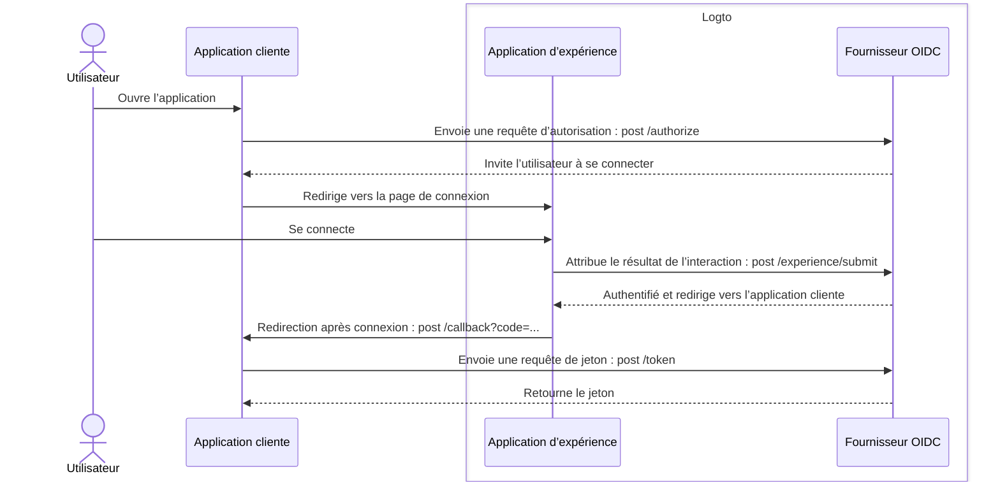
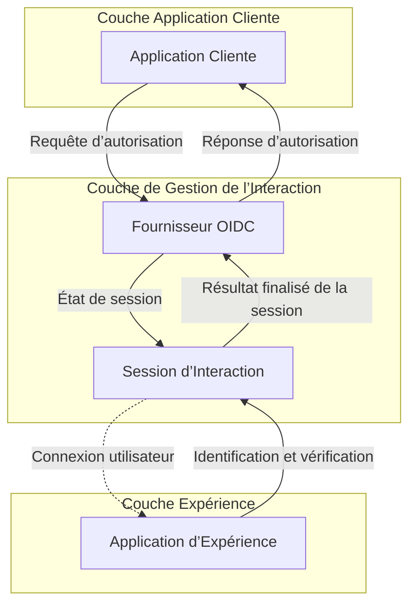

# Inscription et connexion

L’inscription et la connexion constituent le processus d’interaction principal permettant aux utilisateurs finaux de s’authentifier et d’autoriser l’accès aux applications clientes. En tant que plateforme [CIAM](https://auth.wiki/iam) centralisée basée sur OIDC, Logto offre une expérience de connexion universelle pour les utilisateurs à travers plusieurs applications clientes et plateformes.

## Parcours utilisateur \{#user-flow}

Dans un flux d’authentification [OIDC](https://auth.wiki/openid-connect) typique, l’utilisateur commence par ouvrir l’application cliente. L’application cliente envoie une [requête d’autorisation](https://auth.wiki/authorization-request) au fournisseur OIDC Logto. Si l’utilisateur n’a pas de session active, Logto invite l’utilisateur à la page d’expérience de connexion hébergée par Logto. L’utilisateur interagit avec la page d’expérience Logto et s’authentifie en fournissant les identifiants nécessaires. Une fois l’utilisateur authentifié avec succès, Logto le redirige vers l’application cliente avec le [code d’autorisation](https://auth.wiki/authorization-code-flow#how-does-authorization-code-flow-work). L’application cliente envoie alors une [requête de jeton](https://auth.wiki/token-request) au fournisseur OIDC Logto avec le code d’autorisation pour obtenir les jetons.

```mermaid
sequenceDiagram
  actor user as Utilisateur
  participant client as Application cliente

  box Logto
    participant experience as Application d’expérience
    participant oidc as Fournisseur OIDC
  end

  user ->> client: Ouvre l’application
  client ->> oidc: Envoie une requête d’autorisation : post /authorize
  oidc -->> client: Invite l’utilisateur à se connecter
  client ->> experience: Redirige vers la page de connexion
  user ->> experience: Se connecte
  experience ->> oidc: Attribue le résultat de l’interaction : post /experience/submit
  oidc -->> experience: Authentifié et redirige vers l’application cliente
  experience ->> client: Redirection après connexion : post /callback?code=...
  client ->> oidc: Envoie une requête de jeton : post /token
  oidc -->> client: Retourne le jeton
```

## Interaction utilisateur \{#user-interaction}

Une **session d’interaction** est créée pour chaque interaction utilisateur lorsqu’une application cliente initie une requête d’autorisation. Cette session centralise l’état d’interaction utilisateur à travers plusieurs applications clientes, permettant à Logto d’offrir une expérience de connexion cohérente. Lorsque les utilisateurs passent d’une application cliente à une autre, la session d’interaction reste cohérente, maintenant l’état d’authentification de l’utilisateur et réduisant la nécessité de se reconnecter sur différentes plateformes. Une fois la **session d’interaction** établie, l’utilisateur est invité à se connecter à Logto.

L’**application d’expérience** dans Logto est une application hébergée dédiée qui facilite l’expérience de connexion. Lorsque les utilisateurs doivent s’authentifier, ils sont dirigés vers l’**application d’expérience**, où ils complètent leur connexion et interagissent avec Logto. L’**application d’expérience** utilise la session d’interaction active pour suivre et soutenir la progression de l’interaction utilisateur.

Pour soutenir et contrôler ce parcours utilisateur, Logto propose un ensemble d’**Experience APIs** basées sur les sessions. Ces APIs permettent à l’**application d’expérience** de gérer un large éventail de méthodes d’identification et de vérification des utilisateurs en mettant à jour et en accédant à l’état de la session d’interaction en temps réel.

Une fois que l’utilisateur satisfait à toutes les exigences de validation et de vérification, la session d’interaction se termine par la soumission du résultat au fournisseur OIDC, où l’utilisateur est entièrement authentifié et a donné son consentement, finalisant ainsi le processus de connexion sécurisé.

```mermaid
flowchart TD
  %% Couches
  subgraph Layer1 [Couche Application Cliente]
      A[Application Cliente]
  end

  subgraph Layer2 [Couche de Gestion de l’Interaction]
      B[Fournisseur OIDC]
      C[Session d’Interaction]
  end

  subgraph Layer3 [Couche Expérience]
      D[Application d’Expérience]
  end

  %% Connexions
  A --> |Requête d’autorisation| B
  B --> |État de session| C
  C -.-> |Connexion utilisateur| D
  D --> |Identification et vérification| C
  C --> |Résultat finalisé de la session| B
  B --> |Réponse d’autorisation| A
```

:::note
Les pages d’expérience sont conçues pour être accessibles uniquement via le flux d’authentification. Pour empêcher les moteurs de recherche d’indexer ces pages et éviter l’accès direct, Logto ajoute automatiquement `<meta name="robots" content="noindex, nofollow" />` à la page HTML de l’expérience.
:::

## Personnalisation de l’expérience de connexion \{#sign-in-experience-customization}

Logto offre une expérience utilisateur flexible et personnalisable pour répondre à divers besoins métiers. Cela inclut la personnalisation de la marque, de l’interface utilisateur et des parcours d’interaction utilisateur. L’**application d’expérience** peut être adaptée pour répondre aux exigences de marque et de sécurité de l’application cliente.

Continuez à en apprendre davantage sur la [configuration](/end-user-flows/sign-up-and-sign-in/sign-up) et la [personnalisation](/customization) de l’expérience de connexion dans Logto.

## FAQ \{#faqs}

  

### Méthode ou personnalisation de l’expérience de connexion par application \{#per-app-sign-in-experience-method-or-branding}

Pour les applications ou organisations nécessitant des **interfaces de connexion** distinctes, Logto prend en charge la [personnalisation spécifique à l’application](/customization/match-your-brand#app-specific-branding) et la [personnalisation spécifique à l’organisation](/customization/match-your-brand#organization-specific-branding).

Si vous devez proposer différentes **méthodes de connexion** selon le type d’utilisateur ou le site, utilisez simplement les [paramètres d’authentification](/end-user-flows/authentication-parameters) (par exemple, `first_screen` et `direct_sign_in`) pour orienter les utilisateurs vers une page adaptée avec des options de connexion personnalisées.

  

### Limiter le domaine e-mail / adresse IP / région \{#limit-email-domain--ip-address--region}

Pour le contrôle d’accès basé sur les attributs, par exemple limiter la connexion selon le domaine e-mail, l’adresse IP ou la région, vous pouvez utiliser la fonctionnalité [Revendications de jeton personnalisées](/developers/custom-token-claims/) dans Logto pour rejeter ou autoriser les requêtes d’autorisation en fonction des attributs de l’utilisateur.

  

### API sans interface pour la connexion et l’inscription \{#headless-api-for-sign-in-and-sign-up}

Actuellement, Logto ne propose pas d’API sans interface pour la connexion et l’inscription. Cependant, vous pouvez utiliser votre propre interface de connexion via la fonctionnalité [Apportez votre propre interface](/customization/bring-your-ui/) pour personnaliser l’expérience de connexion et d’inscription.

## Ressources associées \{#related-resources}

<Url href="https://blog.logto.io/deprecated-ropc-grant-type">
  Pourquoi vous devriez déprécier le type de flux Resource Owner Password Credentials (ROPC)
</Url>

<Url href="https://blog.logto.io/implicit-flow-is-dead">
  Pourquoi utiliser le flux de code d’autorisation plutôt que le flux implicite ?
</Url>

<Url href="https://blog.logto.io/token-based-authentication-vs-session-based-authentication">
  Comparaison entre l’authentification basée sur les jetons et l’authentification basée sur les
  sessions
</Url>
