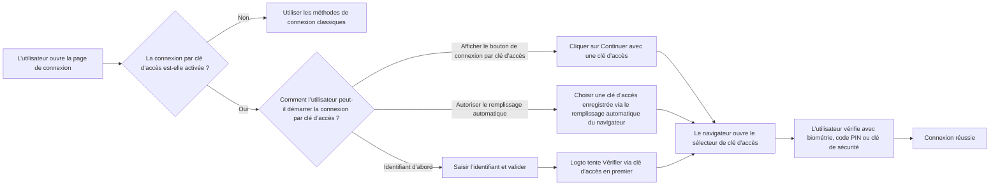
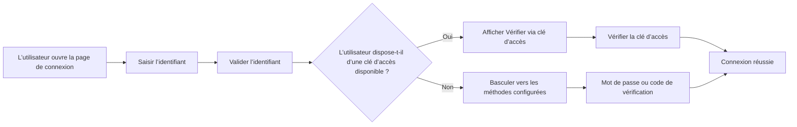
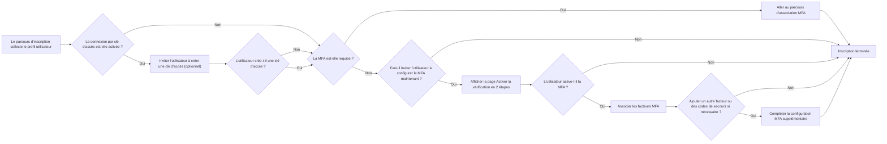

# Connexion par clé d’accès

La connexion par clé d’accès permet aux utilisateurs de s’authentifier avec une authentification WebAuthn directement lors de la connexion, sans avoir à saisir un mot de passe ou un code de vérification au préalable. Dans Logto, la clé utilisée pour la connexion par clé d’accès est le même modèle d’authentification WebAuthn utilisé par l’authentification multi-facteurs (MFA), de sorte que les expériences de connexion et de MFA sont étroitement liées.

Ce document explique comment fonctionne la connexion par clé d’accès dans l’expérience de connexion intégrée de Logto, à quoi ressemblent les différents parcours d’entrée pour les utilisateurs finaux, et comment cela interagit avec la MFA.

## Fonctionnement de la connexion par clé d’accès \{#how-passkey-sign-in-works}

Pour utiliser la connexion par clé d’accès, vous devez d’abord l’activer dans la configuration de l’<CloudLink to="/sign-in-experience/sign-up-and-sign-in">expérience de connexion</CloudLink>. Une fois activée, Logto peut proposer la connexion par clé d’accès de trois manières sur la page de connexion :

- Un bouton dédié `Continuer avec une clé d’accès` sur l’écran de connexion initial.
- Un parcours "identifiant d’abord" qui tente `Vérifier via clé d’accès` après que l’utilisateur a saisi son e-mail, numéro de téléphone ou nom d’utilisateur.
- Le remplissage automatique du navigateur sur le champ identifiant, afin que le navigateur puisse suggérer directement les clés d’accès disponibles depuis l’appareil actuel.

Globalement, l’expérience ressemble à ceci :

## Trois parcours de connexion par clé d’accès \{#three-passkey-sign-in-paths}

### 1. Affichage du bouton "Continuer avec une clé d’accès" activé \{#1-show-continue-with-passkey-button-enabled}

Lorsque l’option `Afficher le bouton "Continuer avec une clé d’accès"` est activée, la page de connexion affiche un bouton `Continuer avec une clé d’accès` en bas du premier écran.

Le parcours utilisateur est le suivant :

1. Ouvrir la page de connexion.
2. Cliquer sur `Continuer avec une clé d’accès`.
3. Sélectionner une clé d’accès via l’invite du navigateur ou du système d’exploitation.
4. Effectuer la vérification biométrique, par code PIN ou clé matérielle.
5. Connexion réussie.

C’est le parcours le plus direct. Il est idéal pour les utilisateurs qui savent déjà qu’ils disposent d’une clé d’accès enregistrée et souhaitent une expérience de connexion en une étape.

### 2. Affichage du bouton "Continuer avec une clé d’accès" désactivé \{#2-show-continue-with-passkey-button-disabled}

Lorsque l’option `Afficher le bouton "Continuer avec une clé d’accès"` est désactivée, Logto passe à une expérience "identifiant d’abord" sur le premier écran. La page demande d’abord uniquement l’identifiant de l’utilisateur.

Après la soumission de l’identifiant :

1. Logto vérifie si la connexion par clé d’accès est activée et si l’utilisateur identifié possède une clé d’accès utilisable.
2. Si une clé d’accès est disponible, Logto lance d’abord le parcours "Vérifier via clé d’accès".
3. L’utilisateur peut alors effectuer la vérification par clé d’accès et se connecter immédiatement.
4. Si aucune clé d’accès n’est disponible, ou si l’utilisateur préfère une autre méthode, Logto bascule vers les autres méthodes de vérification configurées.

Les méthodes de secours disponibles dépendent de la configuration de l’expérience de connexion du locataire actuel. Par exemple, l’utilisateur peut passer au mot de passe, au code de vérification par e-mail ou par téléphone, selon les facteurs activés pour cet identifiant.

### 3. Autoriser l’invite et le remplissage automatique \{#3-allow-prompting-and-autofill}

Lorsque l’option `Autoriser l’invite et le remplissage automatique` est activée, les navigateurs compatibles peuvent afficher les clés d’accès préenregistrées directement depuis le champ d’identifiant.

Le parcours utilisateur est le suivant :

1. Placer le focus sur le champ identifiant de la page de connexion.
2. Le navigateur suggère les clés d’accès enregistrées pour l’origine actuelle.
3. L’utilisateur sélectionne une clé d’accès dans la liste de remplissage automatique.
4. Le navigateur demande à l’utilisateur de vérifier via biométrie, code PIN ou clé matérielle.
5. Connexion réussie.

Ce parcours est particulièrement utile sur les appareils où les clés d’accès sont déjà synchronisées par la plateforme, car les utilisateurs peuvent se connecter sans passer manuellement à une seconde page ou cliquer sur un bouton dédié.

## Parcours d’inscription et d’association de clé d’accès \{#sign-up-and-passkey-binding-flow}

La connexion par clé d’accès n’est pas seulement un point d’entrée pour la connexion. Elle influence également ce qui se passe après l’inscription, car la même authentification WebAuthn peut ensuite être réutilisée à la fois pour la connexion et la MFA.

Après que l’utilisateur a terminé les étapes classiques d’inscription, Logto peut inviter l’utilisateur à créer une clé d’accès. Cette invitation est optionnelle pour l’utilisateur final, mais une fois la clé créée, l’étape suivante dépend de la politique MFA du locataire et du statut MFA de l’utilisateur.

La logique principale est la suivante :

## Relation entre la connexion par clé d’accès et la MFA \{#relationship-between-passkey-sign-in-and-mfa}

### La connexion par clé d’accès saute automatiquement la vérification MFA \{#passkey-sign-in-automatically-skips-mfa-verification}

Une clé d’accès utilisée pour la connexion par clé d’accès repose sur une authentification WebAuthn, et cette authentification est également considérée comme un facteur MFA WebAuthn. De ce fait, la connexion par clé d’accès et la MFA WebAuthn sont effectivement équivalentes du point de vue de l’authentification.

Cela entraîne deux comportements importants :

- Si l’utilisateur se connecte avec une clé d’accès, Logto saute l’étape de vérification MFA séparée.
- Si l’utilisateur avait déjà associé WebAuthn comme facteur MFA avant l’activation de la connexion par clé d’accès, cette authentification existante peut être réutilisée comme clé d’accès pour la connexion. L’utilisateur n’a pas besoin de l’associer à nouveau.

En d’autres termes, une connexion par clé d’accès réussie satisfait déjà la vérification d’identité basée sur WebAuthn qui serait autrement requise lors de la MFA.

### Associer une clé d’accès n’active pas automatiquement la MFA pour les locataires contrôlés par l’utilisateur \{#binding-a-passkey-does-not-automatically-force-mfa-for-user-controlled-tenants}

Pour les utilisateurs dans des locataires où la MFA n’est pas obligatoire, associer une clé d’accès lors de l’inscription ou de la configuration du compte n’active pas automatiquement la MFA pour le compte.

Après la création de la clé d’accès, Logto affiche une page de confirmation intitulée "Activer la vérification en 2 étapes".

Sur cette page, l’utilisateur peut :

- Cliquer sur le bouton "Activer la vérification en 2 étapes" pour activer explicitement la MFA et poursuivre les étapes d’association suivantes.
- Ignorer l’invitation et terminer le parcours actuel sans activer la MFA.

Si l’utilisateur choisit d’activer la MFA, Logto poursuit alors le parcours classique de configuration MFA et peut demander à l’utilisateur d’associer des facteurs supplémentaires, selon la configuration MFA du locataire. Par exemple, si d’autres facteurs MFA sont activés pour le locataire, Logto peut poursuivre avec l’association d’un autre facteur ou de codes de secours.

### Que se passe-t-il si la connexion par clé d’accès est désactivée ultérieurement \{#what-happens-when-passkey-sign-in-is-disabled-later}

Si la connexion par clé d’accès est désactivée ultérieurement, la clé d’accès précédemment associée reste une authentification WebAuthn. Cela signifie qu’elle peut continuer à fonctionner comme facteur MFA tant que la MFA WebAuthn reste disponible pour le locataire.

Désactiver la connexion par clé d’accès retire la clé d’accès comme point d’entrée direct pour la connexion, mais n’invalide pas l’authentification MFA WebAuthn sous-jacente.

## Limitations et compatibilité \{#limitations-and-compatibility}

- La connexion par clé d’accès n’est pas disponible pour les utilisateurs SSO d’entreprise.
- La connexion par clé d’accès dépend du support WebAuthn du navigateur et de la plateforme.
- "Autoriser l’invite et le remplissage automatique" ne fonctionne que dans les navigateurs et environnements prenant en charge le remplissage automatique / l’UI conditionnelle des clés d’accès.
- Les clés d’accès sont liées à l’origine. Une clé d’accès enregistrée pour un domaine ne peut pas être utilisée sur un autre domaine.

## Questions / Réponses \{#q-a}

  

### La connexion par clé d’accès nécessite-t-elle encore une vérification MFA ? \{#does-passkey-sign-in-still-require-mfa-verification}

  

Non. Une connexion par clé d’accès réussie satisfait déjà l’exigence de vérification basée sur WebAuthn, donc Logto saute l’étape de vérification MFA séparée.

  

### Une clé d’accès associée pour la connexion peut-elle toujours être utilisée comme facteur MFA après la désactivation de la connexion par clé d’accès ? \{#can-a-passkey-bound-for-passkey-sign-in-still-be-used-as-an-mfa-factor-after-passkey-sign-in-is-disabled}

  

Oui. La connexion par clé d’accès et la MFA WebAuthn reposent sur le même modèle d’authentification sous-jacent. Si la connexion par clé d’accès est désactivée ultérieurement, la clé d’accès associée peut toujours être utilisée comme facteur MFA WebAuthn.

  

### Les utilisateurs SSO d’entreprise peuvent-ils utiliser la connexion par clé d’accès ? \{#can-enterprise-sso-users-use-passkey-sign-in}

  

Non. Les utilisateurs SSO d’entreprise ne sont pas éligibles à la connexion par clé d’accès.

  

### La connexion par clé d’accès nécessite-t-elle encore un CAPTCHA ? \{#does-passkey-sign-in-still-require-captcha}

  

Non. La connexion par clé d’accès elle-même ne nécessite pas d’étape CAPTCHA supplémentaire. Un CAPTCHA peut toujours s’appliquer à d’autres actions de connexion sur la page, telles que la soumission par mot de passe ou code de vérification, mais pas au parcours de vérification par clé d’accès lui-même.

