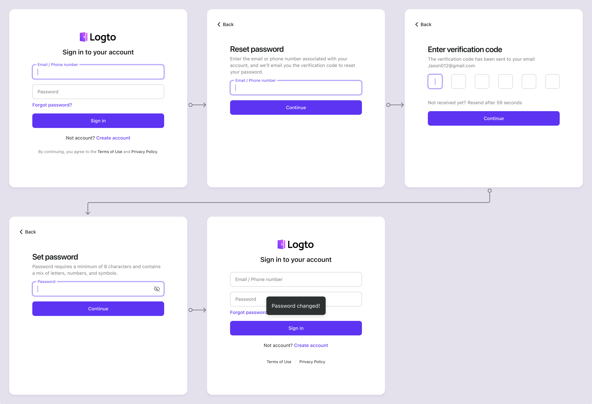

# Réinitialiser le mot de passe

La fonctionnalité de récupération de mot de passe sera automatiquement activée pour vous lorsque vous aurez configuré un [Email connector](/connectors/email-connectors) ou un [SMS connector](/connectors/sms-connectors) valide. L'utilisateur peut réinitialiser son mot de passe en fournissant son adresse e-mail ou son numéro de téléphone enregistré.

## Flux de réinitialisation du mot de passe

Une fois la fonctionnalité de réinitialisation du mot de passe activée, un bouton de lien "Mot de passe oublié" sera affiché sous le formulaire de connexion. Les utilisateurs peuvent cliquer sur le lien "Mot de passe oublié" pour initier un processus de réinitialisation du mot de passe.

:::note
Vous ne voyez pas le lien "Mot de passe oublié" ? Assurez-vous d'avoir configuré un **Email** ou un **SMS** connector valide.
:::

1. **Visiter la page de connexion** : L'utilisateur visite la page de connexion.
2. **Cliquer sur le lien Mot de passe oublié** : L'utilisateur clique sur le lien "Mot de passe oublié".
3. **Entrer l'e-mail / le téléphone** : Après avoir cliqué sur le lien "Mot de passe oublié", l'utilisateur sera redirigé vers une nouvelle page où il pourra entrer son adresse e-mail ou son numéro de téléphone enregistré.
4. **Envoyer le code de vérification** : Logto enverra un code de vérification à l'adresse e-mail ou au numéro de téléphone fourni par l'utilisateur et redirigera vers la page de vérification du code.
5. **Entrer le code de vérification** : L'utilisateur entre le code de vérification reçu dans son e-mail ou son téléphone. Logto vérifiera le code et l'identité de l'utilisateur associé à l'adresse e-mail ou au numéro de téléphone.
6. **Entrer un nouveau mot de passe** : L'utilisateur sera invité à entrer un nouveau mot de passe une fois le code de vérification vérifié avec succès.
7. **Réinitialisation du mot de passe réussie :** Si le mot de passe fourni répond aux exigences de la politique de mot de passe, le mot de passe sera mis à jour avec succès.
8. **Redirection vers la page de connexion** : L'utilisateur sera redirigé vers la page de connexion pour se connecter avec le nouveau mot de passe.

## Mettre à jour le mot de passe pour les utilisateurs authentifiés

Pour les utilisateurs authentifiés, ils peuvent mettre à jour leur mot de passe en visitant la page des paramètres du compte. Consultez les [paramètres du compte](/end-user-flows/account-settings/) pour en savoir plus sur la mise en œuvre d'une page de paramètres de compte utilisateur.

## Configurer la politique de mot de passe

Pour les nouveaux utilisateurs ou les utilisateurs qui mettent à jour leur mot de passe, vous pouvez définir une politique de mot de passe pour appliquer des exigences de force de mot de passe. Visitez le <CloudLink to="/sign-in-experience/password-policy"> Console > Expérience de connexion > Politique de mot de passe</CloudLink> pour configurer les paramètres de la politique de mot de passe.

1. **Longueur minimale du mot de passe** : Définissez le nombre minimum de caractères requis pour le mot de passe. (NIST suggère d'utiliser au moins 8 [caractères](https://pages.nist.gov/800-63-3/sp800-63b.html#sec5))
2. **Types de caractères requis minimum** : Définissez le nombre minimum de types de caractères requis pour le mot de passe. Les types de caractères disponibles sont :
   1. Lettres majuscules : `(A-Z)`
   2. Lettres minuscules : `(a-z)`
   3. Nombres : `(0-9)`
   4. Caractères spéciaux : ``(!"#$%&'()\*+,-./:;<>=?@[]^\_`|{}~ )``
3. **Vérification de l'historique des violations** : Activez ce paramètre pour rejeter les mots de passe qui ont été précédemment exposés lors de violations de données. (Propulsé par [Have I Been Pwned](https://haveibeenpwned.com/Passwords))
4. **Vérification de la répétition** : Activez ce paramètre pour rejeter les mots de passe contenant des caractères répétitifs. (par exemple, "11111111" ou "password123")
5. **Vérification des informations utilisateur** : Activez ce paramètre pour rejeter les mots de passe contenant des informations utilisateur telles que le nom d'utilisateur, l'adresse e-mail ou le numéro de téléphone.
6. **Mots personnalisés** : Fournissez une liste de mots personnalisés (insensibles à la casse) que vous souhaitez rejeter dans le mot de passe.

## FAQs

  
 Comment déconnecter un utilisateur après une réinitialisation de mot de passe réussie ?

Abonnez-vous à l'événement `PostResetPassword` [webhook event](/developers/webhooks/webhooks-events#user-interaction-hook-events) pour recevoir une notification lorsqu'un utilisateur réinitialise avec succès son mot de passe. Vous pouvez ensuite déclencher une action de [déconnexion](/end-user-flows/sign-out) pour invalider la session actuelle de l'utilisateur et le rediriger vers la page de connexion.

  
 Comment implémenter le flux de réinitialisation du mot de passe sur mon interface utilisateur personnalisée ?

Vous pouvez implémenter votre propre flux de réinitialisation de mot de passe en utilisant le **Management API** et le **Account API** de Logto. Consultez les [paramètres du compte](/end-user-flows/account-settings/) pour plus de détails.

  
 Comment puis-je envoyer un lien de réinitialisation de mot de passe à l'e-mail de l'utilisateur ?

Vous pouvez créer un point de terminaison de réinitialisation de mot de passe auto-hébergé et utiliser le SDK de Logto pour initier une requête de connexion avec [`first_screen`](/end-user-flows/authentication-parameters/first-screen) défini sur `reset-password`. Cela redirigera automatiquement l'utilisateur vers la page de réinitialisation du mot de passe.

