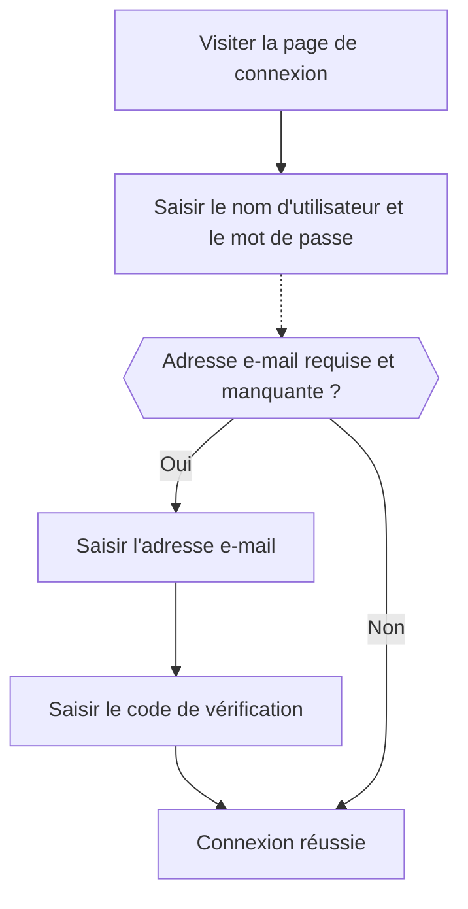

# Connexion par e-mail / téléphone / nom d'utilisateur

## Configurer le flux de connexion par identifiant \{#configure-the-identifier-sign-in-flow}

Comme indiqué précédemment, différents types d'identifiants peuvent être collectés auprès des utilisateurs tout au long du [flux d'inscription](/end-user-flows/sign-up-and-sign-in/sign-up) ou lors de la [création directe de compte dans Logto](/user-management/manage-users#add-users). De plus, les utilisateurs peuvent saisir et compléter des informations supplémentaires au fur et à mesure qu'ils explorent et utilisent le produit. Ces identifiants peuvent être utilisés pour identifier de manière unique les utilisateurs dans le système de Logto et leur permettre d'être authentifiés et de se connecter aux applications intégrées à Logto.

Que vous choisissiez d'utiliser la page de connexion pré-construite hébergée par Logto ou que vous prévoyiez de [créer votre propre interface de connexion personnalisée](/customization#custom-ui), vous devrez configurer les méthodes de connexion disponibles et les paramètres de vérification pour vos utilisateurs finaux.

## Définir les paramètres d'identifiant et d'authentification \{#set-up-the-identifier-and-authentication-settings}

### 1. Définir les identifiants de connexion pris en charge \{#1-set-the-supported-sign-in-identifiers}

Vous pouvez ajouter plusieurs identifiants pris en charge à partir de la liste déroulante comme méthodes de connexion activées pour les utilisateurs finaux. Les options disponibles sont :

- **Nom d'utilisateur**
- **Adresse e-mail**
- **Numéro de téléphone**

Le réordonnancement des identifiants modifiera l'ordre dans lequel ils sont affichés sur la page de connexion. Le premier identifiant sera la méthode de connexion principale pour les utilisateurs.

### 2. Définir les paramètres d'authentification \{#2-set-the-authentication-settings}

Pour chaque identifiant de connexion, vous devrez configurer au moins un facteur de vérification efficace pour vérifier l'identité de l'utilisateur. Deux facteurs sont disponibles :

- **Mot de passe** : Disponible pour tous les types d'identifiants de connexion. Une fois activé, les utilisateurs doivent fournir un mot de passe pour terminer le processus de connexion.
- **Code de vérification** : Disponible uniquement pour les identifiants **Adresse e-mail** et **Numéro de téléphone**. Une fois activé, les utilisateurs doivent saisir un code de vérification envoyé à leur adresse e-mail ou à leur numéro de téléphone pour terminer le processus de connexion.

Si les deux facteurs sont activés, les utilisateurs peuvent choisir l'une ou l'autre méthode pour terminer le processus de connexion. Vous pouvez également réorganiser les facteurs pour modifier l'ordre dans lequel ils sont affichés sur la page de connexion. Le premier facteur sera utilisé comme méthode de vérification principale pour les utilisateurs et le second sera affiché comme lien alternatif.

## Expérience utilisateur du flux de connexion par identifiant \{#identifier-sign-in-flow-user-experience}

L'expérience de connexion s'adapte en fonction de l'identifiant choisi et des facteurs d'authentification disponibles.

- **Saisie intelligente pour plusieurs identifiants :**
  Si plus d'une méthode de connexion par identifiant est activée, la page de connexion intégrée de Logto détectera automatiquement le type d'identifiant saisi par l'utilisateur et affichera les options de vérification correspondantes. Par exemple, si **Adresse e-mail** et **Numéro de téléphone** sont toutes deux activées, la page de connexion détectera automatiquement le type d'identifiant saisi par l'utilisateur et affichera les options de vérification correspondantes. Elle bascule vers un format de numéro de téléphone avec indicatif régional si des chiffres sont saisis consécutivement ou vers un format e-mail lorsqu'un symbole "@" est utilisé.
  - L'indicatif pays du numéro de téléphone est défini par défaut selon la langue du navigateur de l'utilisateur ; les utilisateurs peuvent le modifier manuellement. Vous pouvez utiliser le paramètre [`ui_locales`](/end-user-flows/authentication-parameters/ui-locales) pour définir un indicatif pays par défaut spécifique. Voir [Langues localisées](/customization/localized-languages#how-can-i-set-a-default-phone-number-country-code-for-the-sign-in-experience) pour plus de détails.
- **Facteurs de vérification activés :**
  - **Mot de passe uniquement :** Les champs identifiant et mot de passe seront affichés sur le premier écran.
  - **Code de vérification uniquement :** Le champ identifiant apparaît sur le premier écran, suivi du champ code de vérification sur le second écran.
  - **Mot de passe et code de vérification :** Le champ identifiant est saisi initialement sur le premier écran, suivi des étapes pour saisir le mot de passe ou le code de vérification sur le second écran selon l'ordre de vérification. Un lien de bascule est proposé pour permettre aux utilisateurs de passer d'une méthode de vérification à l'autre.

### Exemples \{#examples}

  

### Exemple 1 : Adresse e-mail avec vérification par mot de passe \{#example-1-email-address-with-password-verification}

Ajoutez **Adresse e-mail** comme identifiant de connexion et activez le facteur **Mot de passe** pour la vérification.

  

### Exemple 2 : E-mail / Téléphone avec mot de passe (principal) et code de vérification (alternatif) activés \{#example-2-emailphone-with-passwordprimary-and-verification-code-alternative-verification-enabled}

Ajoutez à la fois **Adresse e-mail** et **Numéro de téléphone** comme identifiants de connexion.
Activez les facteurs **Mot de passe** et **Code de vérification** pour les deux identifiants.

## Collecter des informations supplémentaires sur le profil utilisateur lors de la connexion \{#collect-additional-user-profile-on-sign-in}

Dans le flux de connexion de Logto, un processus de complétion du profil peut être déclenché si les paramètres d'identifiant d'inscription sont mis à jour. Cela garantit que tous les utilisateurs, y compris les existants, fournissent les nouveaux identifiants requis.

Lorsqu'un développeur ajoute un nouvel identifiant (comme une adresse e-mail), il devient obligatoire pour tous les utilisateurs. Si un utilisateur existant se connecte avec un identifiant existant (comme un nom d'utilisateur), il sera invité à fournir et à vérifier le nouvel identifiant s'il manque à son profil. Ce n'est qu'après avoir terminé cette étape qu'il pourra accéder à l'application, assurant ainsi une transition fluide et cohérente vers les nouvelles exigences.

Décomposition du processus :

1. **Nom d'utilisateur** était précédemment défini comme identifiant d'inscription avec le paramètre **Créer votre mot de passe** activé automatiquement.
2. **Adresse e-mail** est ensuite définie comme identifiant d'inscription. L'identifiant **Adresse e-mail** est automatiquement ajouté comme option de connexion activée.
3. Un utilisateur existant se connecte avec son nom d'utilisateur et son mot de passe.
4. L'utilisateur est invité à fournir et à vérifier une adresse e-mail après sa première étape de connexion.

Le même processus s'applique également aux paramètres d'inscription **Créer votre mot de passe**. Si les paramètres **Créer votre mot de passe** sont nouvellement activés dans le flux d'inscription, le facteur **Mot de passe** sera automatiquement activé pour tous les identifiants de connexion que vous choisissez. Tous les utilisateurs existants sans mot de passe seront invités à en créer un lors du processus de connexion.

:::note
Remarque : Pour des flux de connexion personnalisés, reportez-vous à la fonctionnalité [Apportez votre interface](/customization/bring-your-ui/).
:::

## FAQ \{#faqs}

  

### Expérience de connexion auto-hébergée (connexion intégrée) \{#self-hosted-sign-in-experience-embedded-sign-in}

Logto ne prend actuellement pas en charge l'API headless pour la connexion et l'inscription. Cependant, vous pouvez utiliser notre fonctionnalité [Apportez votre interface](/customization/bring-your-ui/) pour téléverser votre formulaire de connexion personnalisé dans Logto. Nous prenons également en charge plusieurs paramètres de connexion que vous pouvez utiliser pour pré-remplir le formulaire de connexion avec l'identifiant utilisateur collecté depuis votre application ou pour vous connecter directement avec un fournisseur social ou SSO d’entreprise tiers. En savoir plus sur [Paramètres d’authentification](/end-user-flows/authentication-parameters/).

## Ressources associées \{#related-resources}

<Url href="https://www.youtube.com/watch?v=64rBXpWbScc">
  Expérience d'inscription et de connexion par e-mail
</Url>

<Url href="https://www.youtube.com/watch?v=chQxCJX6e6w">
  Expérience d'inscription et de connexion par nom d'utilisateur
</Url>
