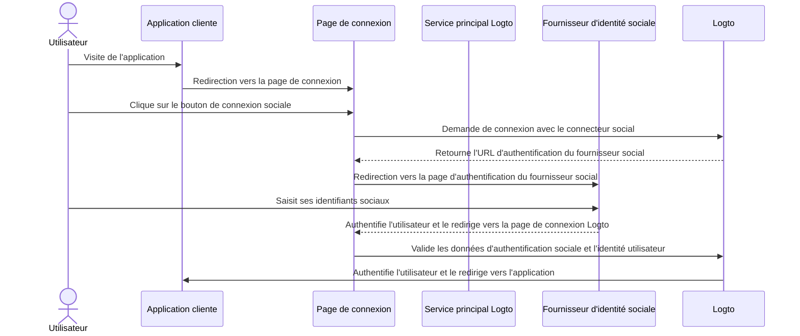
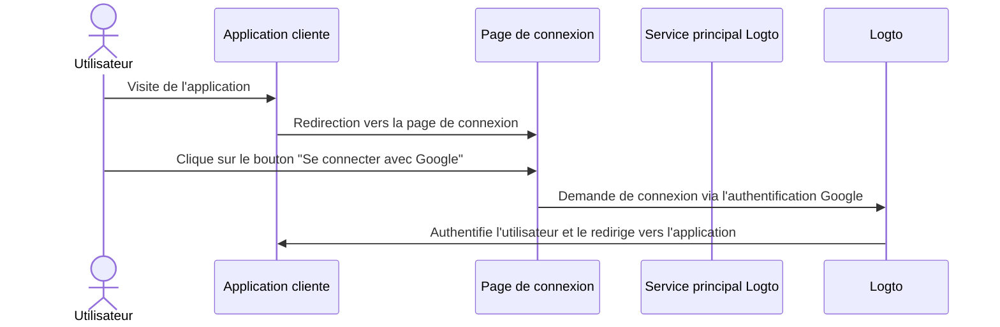

# Connexion sociale

La connexion sociale est une méthode d'authentification largement utilisée qui permet aux utilisateurs de se connecter et de s'inscrire en utilisant leurs comptes de réseaux sociaux existants, tels que Google, Facebook, Twitter et LinkedIn.

Avantages de la connexion sociale :

- **Processus d'intégration simplifié** : La connexion sociale permet aux utilisateurs de s'inscrire ou de se connecter en un seul clic, sans avoir à créer un nouveau compte ou à mémoriser un mot de passe supplémentaire. Cela réduit les frictions et augmente l'engagement des utilisateurs.
- **Confiance et sécurité accrues** : En s'appuyant sur des plateformes établies et fiables comme Google ou Facebook, les utilisateurs se sentent plus en confiance dans votre application.
- **Enrichissement des données utilisateur** : La connexion sociale vous permet de collecter des informations de profil supplémentaires depuis la plateforme sociale, telles que le nom, l'adresse e-mail, la photo de profil, etc.

## Mettre en place la connexion sociale \{#implement-social-sign-in}

1. **Configurer vos connecteurs sociaux** :<br/>
   Rendez-vous sur <CloudLink to="/connectors/social">Console > Connecteurs > Connecteurs sociaux</CloudLink>. Cliquez sur le bouton “Ajouter un connecteur social” et sélectionnez le connecteur social que vous souhaitez ajouter (par exemple Google ou Github). Consultez [connecteur social](/connectors/social-connectors/) pour des instructions détaillées.
2. **Ajouter des boutons de connexion sociale** :<br/>
   Par défaut, votre connecteur social nouvellement ajouté ne sera pas visible sur la page de connexion utilisateur final. Pour ajouter des boutons de connexion sociale à la page de connexion, vous devez activer le connecteur social dans les paramètres de l'expérience de connexion.

   Rendez-vous sur <CloudLink to="/sign-in-experience/sign-up-and-sign-in">Console > Expérience de connexion > Inscription et connexion</CloudLink>. Cliquez sur le bouton “Ajouter un connecteur social” pour intégrer les boutons de connexion sociale sur vos pages d'inscription et de connexion. Utilisez le glisser-déposer pour organiser leur ordre dans l'interface.

3. **Définir les options de liaison de compte** :<br/>
   Pour les nouveaux utilisateurs s'inscrivant avec des [identités sociales](/user-management/user-data#social-identities), Logto permet de lier leur compte social à un compte e-mail ou numéro de téléphone existant dans le système Logto. Par défaut, une page de [liaison de compte](#account-linking) correspondante est affichée aux utilisateurs lors de l'inscription sociale, leur permettant de lier leur compte social à un compte existant ou d'en créer un nouveau.

   Pour simplifier ce processus, vous pouvez activer l'option **Liaison automatique de compte** dans les paramètres de l'expérience de connexion. Cela liera automatiquement le compte social à un compte existant si l'e-mail ou le numéro de téléphone correspond.

4. **Enregistrer les modifications** :<br/>
   Vérifiez attentivement vos modifications et enregistrez-les pour appliquer la configuration.

## Expérience utilisateur de la connexion sociale \{#user-experience-of-social-sign-in}

Avec la connexion sociale, les processus d'inscription et de connexion dans Logto sont simplifiés pour les utilisateurs.



1. **Connexion avec un compte social** : L'utilisateur clique sur le bouton de connexion sociale affiché sur la page de connexion.
2. **Redirection** : L'utilisateur est redirigé vers la page d'authentification du fournisseur d'identité sociale.
3. **Authentification sociale** : L'utilisateur saisit ses identifiants sociaux et s'authentifie auprès du fournisseur social. Si l'utilisateur est déjà connecté au fournisseur social, il peut être authentifié automatiquement. Si plusieurs sessions de connexion sont détectées, l'utilisateur peut être invité à choisir le bon compte (par exemple, plusieurs comptes Google).
   :::note
   Les paramètres “prompt” de Google peuvent être définis dans le connecteur Google, vous permettant de personnaliser l'expérience utilisateur de sélection de compte et d'écran de consentement pour la connexion Google.
   :::
4. **Retour à Logto** : Après une authentification réussie, le fournisseur social redirige l'utilisateur vers la page de connexion Logto avec les données d'authentification.
5. **Validation de l'identité sociale** : Logto valide les données d'authentification sociale et l'identité utilisateur. Si aucun compte utilisateur associé à l'identité sociale n'existe, un nouveau compte sera créé.
6. **Authentification utilisateur** : Logto authentifie l'utilisateur et le redirige vers l'application cliente pour finaliser le processus d'authentification.

## Liaison de compte \{#account-linking}

Comme mentionné ci-dessus, Logto permet aux utilisateurs de lier leurs comptes sociaux à des comptes e-mail ou numéro de téléphone existants dans le système Logto. Ce processus est essentiel pour maintenir un compte utilisateur unifié à travers différentes méthodes d'authentification et fournisseurs d'identité.

- **Création d'un nouveau compte** :
  Lorsqu'un utilisateur se connecte avec une [identité sociale](/user-management/user-data#social-identities) qui n'existe pas dans le système Logto, et que l'e-mail ou le numéro de téléphone fourni ne correspond à aucun compte utilisateur existant, un nouveau compte sera créé directement dans Logto.
- **Liaison à un compte existant** :
  Si l'e-mail ou le numéro de téléphone fourni par l'identité sociale est déjà associé à un compte existant dans Logto, nous proposons un processus de liaison de compte flexible.

  - **Liaison automatique de compte :** Si l'option “Liaison automatique de compte” est activée dans vos paramètres <CloudLink to="/sign-in-experience/sign-up-and-sign-in">Expérience de connexion</CloudLink>, Logto liera automatiquement le compte social au compte existant sur la base d'un e-mail ou numéro de téléphone correspondant. Les utilisateurs ne seront pas invités à lier les comptes et seront instantanément connectés à leur compte existant. Le compte social sera lié, permettant à l'utilisateur de se connecter à l'avenir avec l'une ou l'autre méthode.
  - **Liaison manuelle de compte** : Si l'option “Liaison automatique de compte” est désactivée, les utilisateurs seront invités à lier leur compte social au compte existant lors du processus de connexion. Ils peuvent choisir de lier les comptes ou d'en créer un nouveau.

    

    ```mermaid
    flowchart TD
    A[Authentification avec une identité sociale] --> B{{L'identité sociale existe-t-elle dans Logto ?}}
    B -- Oui --> C[Connecté avec le compte existant]
    B -- Non --> D{{E-mail / téléphone correspond à un compte existant ?}}
    D -- Oui --> E{{Liaison automatique de compte activée ?}}
    E -- Oui --> G[Lier l'identité sociale au compte existant]
    G --> C
    D -- Non --> H[Créer un nouveau compte et se connecter]
    E -- Non --> I{{Lier le compte social ?}}
    I -- Oui --> G
    I -- Non --> H
    ```

:::note
Si un compte correspondant est trouvé lors du processus d'inscription sociale avec un e-mail ou numéro de téléphone correspondant à un compte existant, et que l'utilisateur choisit de ne pas lier les comptes, l'e-mail ou le numéro de téléphone ne sera pas synchronisé avec le nouveau compte dans Logto. Cela garantit que l'e-mail et le numéro de téléphone restent uniques pour tous les comptes utilisateurs.

Si l'e-mail ou le numéro de téléphone est un identifiant d'inscription obligatoire, l'utilisateur sera invité à fournir un autre e-mail ou numéro de téléphone lors du processus d'inscription. Voir [Collecter des informations de profil utilisateur supplémentaires](#collect-additional-user-profile-data) pour plus de détails.
:::

## Collecter des informations de profil utilisateur supplémentaires \{#collect-additional-user-profile-data}

### Collecter les identifiants d'inscription \{#collect-sign-up-identifiers}

Lors du processus d'inscription sociale, selon les identifiants d'inscription obligatoires (**adresse e-mail**, **numéro de téléphone** et **nom d'utilisateur**) que vous avez configurés, les utilisateurs peuvent être invités à fournir des informations vérifiées supplémentaires pour compléter l'inscription ou le processus de connexion après authentification auprès du fournisseur social.

Par exemple, **Adresse e-mail** et **Nom d'utilisateur** ont été définis comme identifiants d'inscription obligatoires :

1. **Inscription avec une identité sociale qui fournit une adresse e-mail vérifiée**

   Si une adresse e-mail vérifiée est fournie par l'identité sociale, l'adresse e-mail sera synchronisée avec le profil utilisateur et l'utilisateur sera invité à fournir un nom d'utilisateur pour finaliser l'inscription.

   ```mermaid
   flowchart TD
      A[Authentification avec une identité sociale] --> B{{Contient une adresse e-mail vérifiée ?}}
      B -- Oui --> C[Saisir le nom d'utilisateur]
      C --> D[Inscription réussie]
   ```

2. **Inscription avec une identité sociale qui ne fournit pas d'adresse e-mail vérifiée**

   Si l'identité sociale ne fournit pas d'adresse e-mail vérifiée, l'utilisateur sera invité à fournir une adresse e-mail lors du processus d'inscription. L'utilisateur devra vérifier l'adresse e-mail en saisissant un code de vérification envoyé à l'adresse fournie.

   ```mermaid
   flowchart TD
      A[Authentification avec une identité sociale] --> B{{Contient une adresse e-mail vérifiée ?}}
      B -- Non --> C[Saisir l'adresse e-mail]
      C --> D[Saisir le code de vérification]
      D --> E[Saisir le nom d'utilisateur]
      E --> F[Inscription réussie]
   ```

3. **Inscription avec une identité sociale qui fournit une adresse e-mail déjà enregistrée**

   Si l'identité sociale fournit une adresse e-mail déjà enregistrée dans le système Logto, l'utilisateur sera invité à lier le compte social au compte existant ou à créer un nouveau compte. Si l'utilisateur choisit de créer un nouveau compte, il devra fournir une nouvelle adresse e-mail et la vérifier.

   ```mermaid
      flowchart TD
       A[Authentification avec une identité sociale] --> B{{L'adresse e-mail correspond-elle à un compte existant ?}}
       B -- Oui --> C{{Lier le compte social ?}}
       C -- Oui --> D[Lier l'identité sociale au compte existant]
       D --> E[Connexion réussie]
       C -- Non --> F[Saisir une nouvelle adresse e-mail]
       F --> G[Saisir le code de vérification]
       G --> H[Saisir le nom d'utilisateur]
       H --> I[Inscription réussie]
       B -- Non --> H
   ```

### Collecter d'autres informations de profil utilisateur \{#collect-other-user-profile}

En plus des identifiants d'inscription obligatoires, vous pouvez également collecter d'autres informations de profil lors du processus d'inscription sociale. Cela peut inclure des champs comme le nom complet, la date de naissance ou tout autre champ personnalisé que vous souhaitez recueillir.

**Option 1 : Collecter le profil utilisateur**

Ajoutez directement l'étape préconstruite "Parlez-nous de vous" de Logto dans le flux d'inscription. Les utilisateurs doivent remplir tous les champs obligatoires avant que l'inscription ne soit considérée comme terminée. Cette approche offre une solution sans code et prête à l'emploi.

Configurez la collecte de profil via <CloudLink to="/sign-in-experience/collect-user-profile">Console > Expérience de connexion > Collecter le profil utilisateur</CloudLink> pour choisir parmi les champs de données de base préconfigurés ou créer des champs personnalisés avec une validation flexible. En savoir plus : [Collecter le profil utilisateur](/end-user-flows/collect-user-profile)

:::note

La collecte des identifiants d'inscription (e-mail, téléphone, nom d'utilisateur) diffère de la collecte d'autres données de profil utilisateur lors de la connexion sociale :

- **Identifiants d'inscription** : Requis pour les nouveaux et les anciens utilisateurs car ils sont essentiels pour l'identification et les notifications.
- **Autres données de profil** (par exemple, nom complet, date de naissance) : Collectées uniquement lors de l'inscription d'un nouvel utilisateur, car ces informations ne sont pas critiques pour l'identification et peuvent être recueillies ultérieurement via l'Account API.

:::

**Option 2 : Parcours d'intégration auto-hébergés**

Redirigez les utilisateurs vers votre propre parcours d'intégration personnalisé après une inscription réussie pour une collecte de données entièrement personnalisable. Cette approche vous donne un contrôle total sur l'expérience utilisateur et permet des processus d'intégration complexes et multi-étapes.

Utilisez l'[Account API](/end-user-flows/account-settings/by-account-api) pour gérer les données de profil utilisateur de manière programmatique.

## Google One-tap \{#google-one-tap}

Logto prend également en charge la méthode de connexion [Google One-tap](https://developers.google.com/identity/gsi/web/guides/features) pour le connecteur Google, permettant aux utilisateurs de se connecter en un seul clic. Cette fonctionnalité simplifie encore davantage le processus de connexion en supprimant la nécessité pour les utilisateurs d'être redirigés vers la page d'authentification Google.

Pour activer la connexion Google One-tap, suivez les instructions dans les paramètres du [connecteur Google](/integrations/google). Une fois activée, les utilisateurs verront une fenêtre contextuelle "Se connecter avec Google" lorsqu'ils arriveront sur la page de connexion. Lorsqu'ils cliqueront dessus, ils seront automatiquement authentifiés avec leur compte Google et redirigés vers l'application.




## Lier ou délier des comptes sociaux \{#link-or-unlink-social-accounts}

Après une première connexion sociale, les utilisateurs peuvent gérer leurs comptes sociaux connectés via les paramètres de leur compte. Cela leur permet de lier des comptes sociaux supplémentaires à leur profil existant ou de supprimer des connexions sociales qu'ils ne souhaitent plus utiliser.

Les utilisateurs peuvent accéder à ces fonctionnalités via un centre de compte en libre-service, ce qui leur offre la flexibilité de :

- **Lier de nouveaux comptes sociaux** : Connecter d'autres fournisseurs sociaux au même profil utilisateur
- **Délier des comptes sociaux existants** : Supprimer des connexions sociales tout en conservant l'accès par d'autres méthodes
- **Voir les comptes connectés** : Afficher toutes les identités sociales actuellement liées

En savoir plus sur la mise en œuvre des fonctionnalités de gestion de compte dans la documentation [paramètres du compte](/end-user-flows/account-settings).

## Stocker des jetons et appeler des API tierces \{#store-tokens-and-call-third-party-apis}

Vous pouvez activer en option le stockage de jetons tiers pour les connecteurs sociaux pris en charge afin qu'après qu'un utilisateur se soit authentifié et ait accordé des permissions, les jetons d’accès (Access token) et de rafraîchissement (Refresh token) émis par le fournisseur soient stockés en toute sécurité dans le coffre-fort secret de Logto. Votre application (via l'Account API) pourra ensuite les récupérer et les utiliser pour appeler les API du fournisseur (par exemple, permettre à votre application d'ajouter des événements à Google Agenda) au nom de l'utilisateur sans imposer une nouvelle authentification sociale. Voir [stockage de jetons tiers](/secret-vault/federated-token-set) pour les détails de configuration.

## FAQ \{#faqs}

<details>
  <summary>

### Comment ajouter des boutons de connexion sociale et se connecter directement avec un compte social sur mon site web ? \{#how-to-add-social-login-buttons-and-directly-sign-in-with-social-on-my-website}

</summary>

Logto vous permet d'ajouter des boutons de connexion sociale à votre site web et de lancer directement le processus de connexion sociale sans afficher le formulaire de connexion par défaut. Consultez notre guide [Connexion directe](/end-user-flows/authentication-parameters/direct-sign-in/) pour des instructions détaillées.

</details>

<details>
  <summary>

### Pourquoi mes e-mails ou numéros de téléphone ne sont-ils pas renseignés après une inscription sociale ? \{#why-my-emails-or-phone-numbers-are-not-populated-after-signing-up-with-social}

</summary>

Dans Logto, l'adresse e-mail et le numéro de téléphone peuvent être utilisés comme identifiants de connexion pour identifier de manière unique les utilisateurs. Seules les adresses e-mail et numéros de téléphone vérifiés sont acceptés comme identifiants. Si l'identité sociale ne fournit pas la revendication `email_verified` ou `phone_number_verified`, l'adresse e-mail ou le numéro de téléphone ne sera pas synchronisé avec le profil utilisateur. Vous pouvez néanmoins les retrouver dans les données d'identités sociales du profil utilisateur.

La prise en charge des e-mails ou numéros de téléphone non vérifiés comme profil utilisateur sera bientôt disponible.

</details>

## Ressources associées \{#related-resources}

<Url href="https://www.youtube.com/watch?v=sv60N9eW8Ew">Expérience de connexion sociale</Url>

<Url href="https://blog.logto.io/maximize-google-sign-in-conversions">
  Maximiser les conversions Google login avec 6 configurations
</Url>
