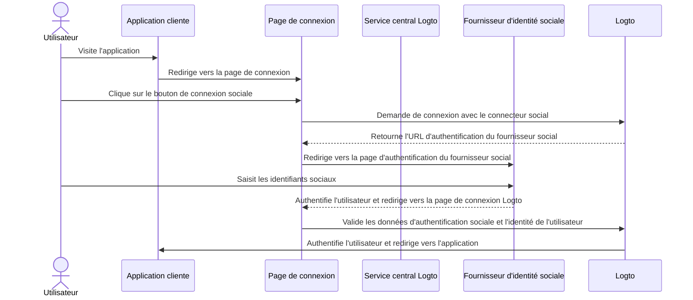
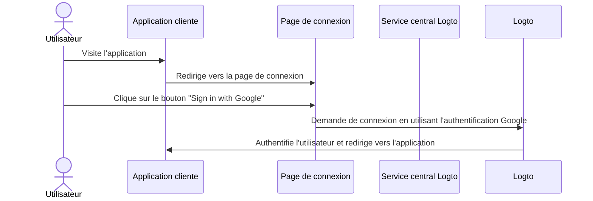

# Connexion sociale

La connexion sociale est une méthode d'authentification largement utilisée qui permet aux utilisateurs de se connecter et de s'inscrire en utilisant leurs comptes de réseaux sociaux existants, tels que Google, Facebook, Twitter et LinkedIn.

Avantages de la connexion sociale :

- **Processus d'intégration simplifié** : La connexion sociale permet aux utilisateurs de s'inscrire ou de se connecter en un seul clic, sans avoir besoin de créer un nouveau compte ou de se souvenir d'un autre mot de passe. Cela réduit les frictions et augmente l'engagement des utilisateurs.
- **Confiance et sécurité accrues** : En s'appuyant sur des plateformes établies et de confiance comme Google ou Facebook, les utilisateurs se sentent plus confiants dans votre application.
- **Enrichissement des données utilisateur** : La connexion sociale vous permet de recueillir des informations de profil supplémentaires à partir de la plateforme sociale, telles que le nom, l'adresse e-mail, la photo de profil, et plus encore.

## Mettre en œuvre la connexion sociale \{#implement-social-sign-in}

1. **Configurer vos connecteurs sociaux** :<br/>
   Accédez à <CloudLink to="/connectors/social">Console > Connectors > Social connectors</CloudLink>. Cliquez sur le bouton “Add Social Connector” et localisez le connecteur social que vous souhaitez ajouter (par exemple, Google ou Github). Consultez notre documentation pour des instructions détaillées sur l'ajout d'un [connecteur social](/connectors/social-connectors/).
2. **Ajouter des boutons de connexion sociale** :<br/>
   Par défaut, votre connecteur social nouvellement ajouté ne sera pas visible sur la page de connexion de l'utilisateur final. Pour ajouter des boutons de connexion sociale à la page de connexion, vous devez activer le connecteur social dans les paramètres de l'expérience de connexion.

   Accédez à <CloudLink to="/sign-in-experience/sign-up-and-sign-in">Console > Sign-in experience > Sign-up and sign-in</CloudLink>. Cliquez sur le bouton “Add social connector” pour intégrer des boutons de connexion sociale sur vos pages d'inscription et de connexion. Utilisez le glisser-déposer pour organiser leur ordre sur l'interface utilisateur.

3. **Définir les options de liaison de compte** :<br/>
   Pour les nouveaux utilisateurs s'inscrivant avec des [identités sociales](/user-management/user-data#social-identities), Logto permet de lier leur compte social à un compte e-mail ou numéro de téléphone existant dans le système Logto. Par défaut, une page de [liaison de compte](#account-linking) associée est affichée aux utilisateurs lors de l'inscription sociale, leur permettant de lier leur compte social à un compte existant ou d'en créer un nouveau.

   Pour simplifier ce processus, vous pouvez activer l'option **Automatic account linking** dans les paramètres de l'expérience de connexion. Cela liera automatiquement le compte social à un compte existant si l'e-mail ou le numéro de téléphone correspond.

4. **Enregistrer les modifications** : <br/>
   Examinez attentivement vos modifications et enregistrez-les pour appliquer la configuration.

## Expérience utilisateur de la connexion sociale \{#user-experience-of-social-sign-in}

Avec la connexion sociale, les processus d'inscription et de connexion dans Logto sont simplifiés pour les utilisateurs.



1. **Connexion avec le social** : L'utilisateur clique sur le bouton de connexion sociale affiché sur la page de connexion.
2. **Redirection** : L'utilisateur est redirigé vers la page d'authentification du fournisseur d'identité sociale.
3. **Authentification sociale** : L'utilisateur saisit ses identifiants sociaux et s'authentifie auprès du fournisseur social. Si l'utilisateur est déjà connecté au fournisseur social, il peut être automatiquement authentifié. Si plusieurs sessions de connexion sont détectées, l'utilisateur peut être invité à choisir le bon compte (par exemple, plusieurs comptes Google).
   :::note
   Les paramètres "prompt" de Google peuvent être définis dans le connecteur Google, vous permettant de personnaliser l'expérience utilisateur de sélection de compte et l'écran de consentement pour la connexion Google.
   :::
4. **Retour à Logto** : Après une authentification réussie, le fournisseur social redirige l'utilisateur vers la page de connexion Logto avec les données d'authentification.
5. **Validation de l'identité sociale** : Logto valide les données d'authentification sociale et l'identité de l'utilisateur. Si aucun compte utilisateur associé à l'identité sociale n'existe, un nouveau compte sera créé.
6. **Authentification de l'utilisateur** : Logto authentifie l'utilisateur et le redirige vers l'application cliente pour terminer le processus d'authentification.

### Google One-tap \{#google-one-tap}

Logto prend également en charge la méthode de connexion [Google One-tap](https://developers.google.com/identity/gsi/web/guides/features) pour le connecteur Google, permettant aux utilisateurs de se connecter en un seul clic. Cette fonctionnalité simplifie encore le processus de connexion en supprimant la nécessité pour les utilisateurs d'être redirigés vers la page d'authentification Google.

Pour activer la connexion Google One-tap, suivez les instructions dans les paramètres du [connecteur Google](/integrations/google). Une fois activée, les utilisateurs verront une fenêtre contextuelle "Sign in with Google" lorsqu'ils arrivent sur la page de connexion. Lorsqu'ils cliquent dessus, ils seront automatiquement authentifiés avec leur compte Google et redirigés vers l'application.




## Liaison de compte \{#account-linking}

Comme mentionné ci-dessus, Logto permet aux utilisateurs de lier leurs comptes sociaux à des comptes e-mail ou numéro de téléphone existants dans le système Logto. Ce processus est essentiel pour maintenir un compte utilisateur unifié à travers différentes méthodes d'authentification et fournisseurs d'identité.

- **Création de nouveau compte** :
  Lorsqu'un utilisateur se connecte avec une [identité sociale](/user-management/user-data#social-identities) qui n'existe pas dans le système Logto, et que l'e-mail ou le numéro de téléphone fourni ne correspond à aucun compte utilisateur existant, un nouveau compte sera créé directement dans Logto.
- **Liaison de compte existant** :
  Si l'e-mail ou le numéro de téléphone fourni par l'identité sociale est déjà associé à un compte existant dans Logto, nous offrons un processus de liaison de compte flexible.

  - **Liaison de compte automatique :** Si l'option “Automatic account linking” est activée dans vos paramètres de <CloudLink to="/sign-in-experience/sign-up-and-sign-in">Sign-in experience</CloudLink>, Logto liera automatiquement le compte social au compte existant basé sur un e-mail ou un numéro de téléphone correspondant. Les utilisateurs ne seront pas invités à lier les comptes et seront instantanément connectés à leur compte existant. Le compte social sera lié, permettant à l'utilisateur de se connecter en utilisant l'une ou l'autre méthode à l'avenir.
  - **Liaison de compte manuelle** : Si l'option “Automatic account linking“ est désactivée, les utilisateurs seront invités à lier leur compte social au compte existant lors du processus de connexion. Ils peuvent choisir de lier les comptes ou d'en créer un nouveau.

    

    ```mermaid
    flowchart TD
    A[Authentification avec identité sociale] --> B{{L'identité sociale existe-t-elle dans Logto ?}}
    B -- Oui --> C[Connecté avec le compte existant]
    B -- Non --> D{{E-mail / téléphone correspond à un compte existant ?}}
    D -- Oui --> E{{Liaison de compte automatique activée ?}}
    E -- Oui --> G[Lier l'identité sociale au compte existant]
    G --> C
    D -- Non --> H[Créer un nouveau compte et se connecter]
    E -- Non --> I{{Lier le compte social ?}}
    I -- Oui --> G
    I -- Non --> H
    ```

:::note
Si un compte associé est localisé lors du processus d'inscription sociale avec un e-mail ou un numéro de téléphone qui correspond à un compte existant, et que l'utilisateur choisit de ne pas lier les comptes, l'e-mail ou le numéro de téléphone ne sera pas synchronisé avec le nouveau compte dans Logto. Cela garantit que l'e-mail et le numéro de téléphone restent uniques à travers tous les comptes utilisateurs.

Si l'e-mail ou le numéro de téléphone est un identifiant d'inscription requis, l'utilisateur sera invité à fournir un autre e-mail ou numéro de téléphone lors du processus d'inscription. Voir [Collecter des informations de profil utilisateur supplémentaires](#collect-additional-user-profile-data) pour plus de détails.
:::

## Collecter des informations de profil utilisateur supplémentaires \{#collect-additional-user-profile-data}

Lors du processus d'inscription sociale, en fonction des paramètres d'identifiant d'inscription obligatoire (**adresse e-mail**, **numéro de téléphone** et **nom d'utilisateur**) que vous avez configurés, les utilisateurs peuvent être invités à fournir des informations vérifiées supplémentaires pour compléter le processus d'inscription ou de connexion après avoir été authentifiés avec le fournisseur social.

Par exemple, **l'adresse e-mail** a été définie comme identifiant d'inscription :

1. **Inscription avec une identité sociale qui fournit une adresse e-mail vérifiée**

   Si une adresse e-mail vérifiée est fournie par l'identité sociale, l'utilisateur sera automatiquement inscrit avec l'identité sociale et l'adresse e-mail sera synchronisée avec le profil utilisateur.

2. **Inscription avec une identité sociale qui ne fournit pas d'adresse e-mail vérifiée**

   Si l'identité sociale ne fournit pas d'adresse e-mail vérifiée, l'utilisateur sera invité à fournir une adresse e-mail lors du processus d'inscription. L'utilisateur doit vérifier l'adresse e-mail en entrant un code de vérification envoyé à l'adresse e-mail fournie.

   ```mermaid
   flowchart TD
      A[Authentification avec identité sociale] --> B{{Adresse e-mail requise et manquante ?}}
      B -- Oui --> C[Saisir l'adresse e-mail]
      C --> D[Saisir le code de vérification]
      D --> E[Inscription réussie]
      B -- Non --> E
   ```

3. **Inscription avec une identité sociale qui fournit une adresse e-mail enregistrée**

   Si l'identité sociale fournit une adresse e-mail déjà enregistrée dans le système Logto, l'utilisateur sera invité à lier le compte social au compte existant ou à créer un nouveau compte. Si l'utilisateur choisit de créer un nouveau compte, il sera invité à fournir une nouvelle adresse e-mail et à la vérifier.

   ```mermaid
      flowchart TD
       A[Authentification avec identité sociale] --> B{{Adresse e-mail correspond à un compte existant ?}}
       B -- Oui --> C{{Lier le compte social ?}}
       C -- Oui --> D[Lier l'identité sociale au compte existant]
       D --> E[Connexion réussie]
       C -- Non --> F[Saisir une nouvelle adresse e-mail]
       F --> G[Saisir le code de vérification]
       G --> E
       B -- Non --> E
   ```

## FAQs \{#faqs}

<details>
  <summary>

### Comment ajouter des boutons de connexion sociale et se connecter directement avec le social sur mon site web ? \{#how-to-add-social-login-buttons-and-directly-sign-in-with-social-on-my-website}

</summary>

Logto vous permet d'ajouter des boutons de connexion sociale à votre site web et de lancer directement le processus de connexion sociale sans afficher le formulaire de connexion par défaut. Consultez notre guide [Connexion directe](/end-user-flows/authentication-parameters/direct-sign-in/) pour des instructions détaillées.

</details>

<details>
  <summary>

### Pourquoi mes e-mails ou numéros de téléphone ne sont-ils pas renseignés après l'inscription avec le social ? \{#why-my-emails-or-phone-numbers-are-not-populated-after-signing-up-with-social}

</summary>

Dans Logto, l'adresse e-mail et le numéro de téléphone peuvent être utilisés comme identifiant de connexion pour identifier de manière unique les utilisateurs. Seules les adresses e-mail et les numéros de téléphone vérifiés sont acceptés comme identifiants. Si l'identité sociale ne fournit pas la revendication `email_verified` ou `phone_number_verified`, l'adresse e-mail ou le numéro de téléphone ne sera pas synchronisé avec le profil utilisateur. Vous pouvez toujours les trouver sous les données d'identités sociales dans le profil utilisateur.

La prise en charge de l'e-mail ou du numéro de téléphone non vérifié en tant que profil utilisateur sera bientôt disponible.

</details>

## Ressources associées \{#related-resources}

<Url href="https://www.youtube.com/watch?v=sv60N9eW8Ew">Expérience de connexion sociale</Url>

<Url href="https://blog.logto.io/maximize-google-sign-in-conversions">
  Maximiser les conversions de connexion Google avec 6 configurations
</Url>
