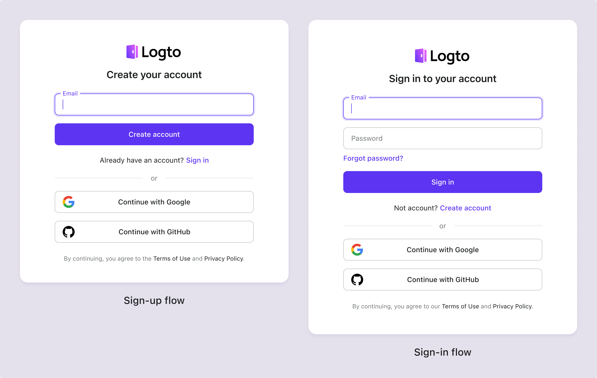

# Conditions et confidentialité

Pour garantir que votre produit reste ouvert et transparent, ajoutez des liens vers vos Conditions d'utilisation et votre Politique de confidentialité sur les pages de connexion et d'inscription. Cela vous permet de répondre aux exigences de conformité spécifiques à votre secteur.

## Configurer les conditions & la confidentialité \{#configure-terms--privacy}

1. Accédez à <CloudLink to="/sign-in-experience/content">Console > Expérience de connexion > Contenu</CloudLink>.
2. Ajoutez les liens externes pour vos "Conditions d'utilisation" et votre "Politique de confidentialité".
3. Définissez la politique pour "Accepter les conditions" en fonction de vos besoins de conformité pour des régions ou des secteurs spécifiques.

:::note
Si la valeur est vide, vous n'avez pas besoin de gérer les accords de conditions et de confidentialité dans les flux de connexion de Logto. Vous pouvez traiter ces questions après que l'utilisateur se soit connecté à votre application.
:::

## Expérience utilisateur pour l'acceptation des conditions \{#user-experience-for-agreeing-to-terms}

Logto propose plusieurs flux préconstruits pour gérer l'expérience utilisateur concernant l'acceptation des conditions en fonction de vos différentes exigences de conformité :

### Option 1 : Accepter les conditions automatiquement lors de la poursuite de la connexion / inscription \{#option-1-agree-to-terms-automatically-on-continue-sign-insign-up}

Cette politique offre l'expérience utilisateur la plus fluide en acceptant automatiquement les conditions lorsque l'utilisateur poursuit le processus de connexion ou d'inscription.
L'utilisateur ne sera pas invité à accepter explicitement les conditions.

### Option 2 : Accepter les conditions uniquement lors de l'inscription \{#opetion-2-agree-to-terms-on-sign-up-only}

Cette politique exige que les nouveaux utilisateurs acceptent manuellement les **Conditions et Politiques de Confidentialité**. En vertu du [RGPD](https://gdpr-info.eu/art-4-gdpr/) de l'UE et du [CCPA](https://oag.ca.gov/privacy/ccpa) de Californie, les entreprises doivent obtenir le consentement éclairé des utilisateurs avant de collecter des informations personnelles.

Lorsque les utilisateurs utilisent pour la première fois l'inscription sociale (par exemple, Google ou GitHub), une fenêtre contextuelle leur demandera de consentir aux **Conditions et Politiques de Confidentialité** après avoir été redirigés vers Logto. Ce consentement n'est pas requis pour les connexions sociales ultérieures.

### Option 3 : Accepter les conditions lors de la connexion et de l'inscription \{#option-3-agree-to-terms-on-sign-in-and-sign-up}

Cette politique exige que les utilisateurs acceptent les **Conditions et Politiques de Confidentialité** chaque fois qu'ils se connectent ou s'inscrivent. Cette politique convient aux applications qui nécessitent que les utilisateurs acceptent les conditions à chaque connexion. Les utilisateurs doivent cocher la case pour accepter les conditions avant de continuer. Cette approche est conforme à la PIPL chinoise et à la LGPD du Brésil.

