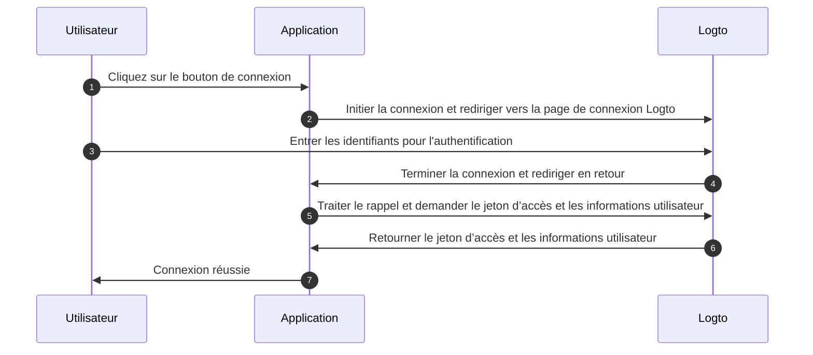
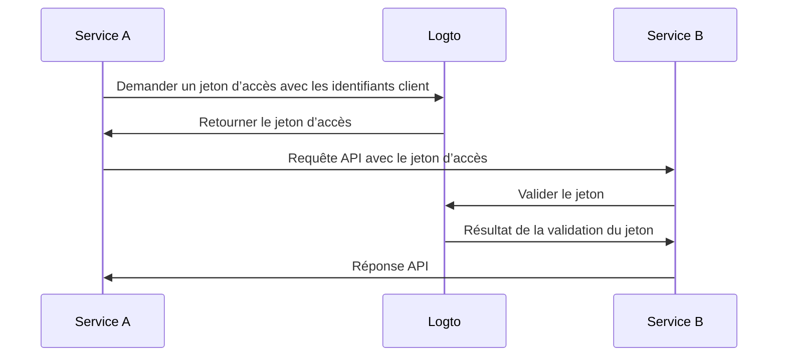

# Comprendre le flux d'authentification

Logto est basé sur les standards OAuth 2.0 et OpenID Connect (OIDC). Comprendre ces standards d'authentification rendra le processus d'intégration plus fluide et plus simple.

### Flux d'authentification utilisateur

Voici ce qui se passe lorsqu'un utilisateur se connecte avec Logto :

Dans ce flux, plusieurs concepts clés sont essentiels pour le processus d'intégration :

- `Application` : Cela représente votre application dans Logto. Vous créerez une configuration d'application dans la Console Logto pour établir une connexion entre votre application réelle et les services Logto. En savoir plus sur [Application](/integrate-logto/application-data-structure/#introduction).
- `Redirect URI` : Après que les utilisateurs aient terminé l'authentification sur la page de connexion Logto, Logto les redirige vers votre application via cet URI. Vous devrez configurer l'URI de redirection dans les paramètres de votre Application. Pour plus de détails, voir [Redirect URIs](/integrate-logto/application-data-structure/#redirect-uris).
- `Handle sign-in callback` : Lorsque Logto redirige les utilisateurs vers votre application, votre application doit traiter les données d'authentification et demander des jetons d’accès et des informations utilisateur. Ne vous inquiétez pas - le SDK Logto gère cela automatiquement.

Cette vue d'ensemble couvre l'essentiel pour une intégration rapide. Pour une compréhension plus approfondie, consultez notre guide [Sign-in experience explained](/concepts/sign-in-experience/).

### Flux d'authentification machine à machine

Logto fournit un type d'application machine à machine (M2M) pour permettre une authentification directe entre services, basée sur le flux OAuth 2.0 Client Credentials :

Ce flux d'authentification machine à machine (M2M) est conçu pour les applications qui doivent communiquer directement avec des ressources sans interaction utilisateur (donc sans interface utilisateur), comme un service API mettant à jour les données utilisateur dans Logto ou un service de statistiques récupérant les commandes quotidiennes.

Dans ce flux, les services s'authentifient en utilisant des identifiants client - une combinaison de [Application ID](/integrate-logto/application-data-structure/#application-id) et [Application Secret](/integrate-logto/application-data-structure/#application-secret) qui identifie et authentifie de manière unique le service. Ces identifiants servent d'identité au service lors de la demande de jetons d’accès auprès de Logto.
