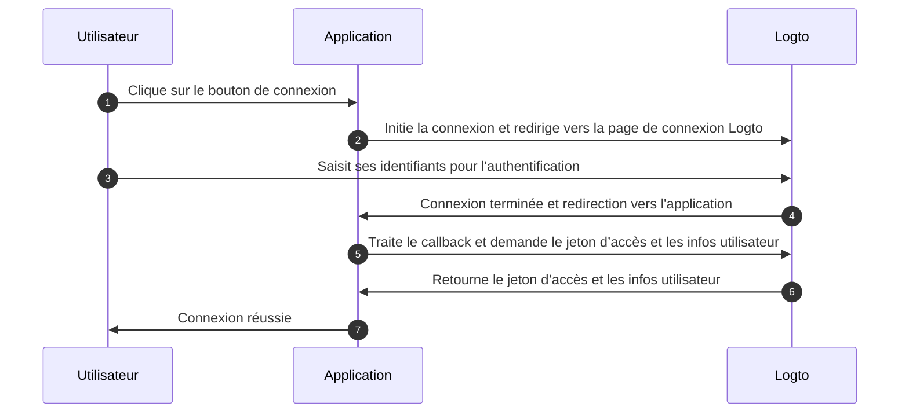
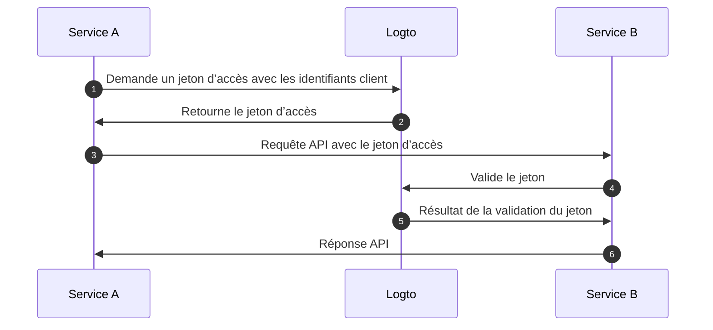
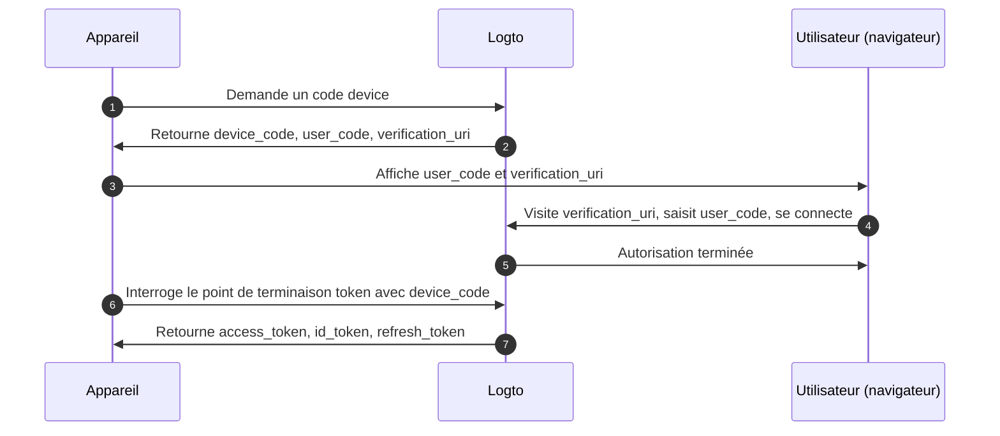
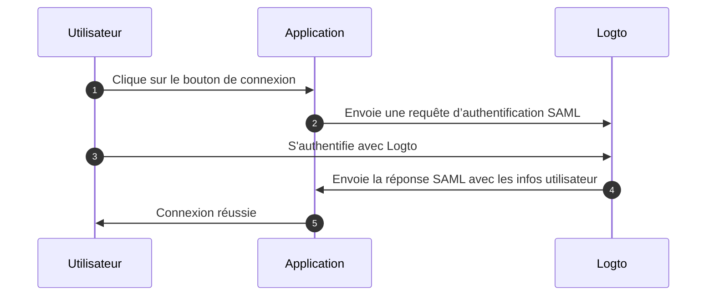

# Comprendre le flux d'authentification OIDC

Logto est construit sur les standards [OAuth 2.0](https://auth.wiki/oauth-2-0) et [OpenID Connect (OIDC)](https://auth.wiki/openid-connect). Comprendre ces standards d'authentification facilitera et simplifiera le processus d'intégration.

### Flux d'authentification utilisateur \{#user-authentication-flow}

Voici ce qui se passe lorsqu'un utilisateur se connecte avec Logto :

```mermaid
sequenceDiagram
    autonumber
    participant Utilisateur
    participant Application
    participant Logto

    Utilisateur->>Application: Clique sur le bouton de connexion
    Application->>Logto: Initie la connexion et redirige vers la page de connexion Logto
    Utilisateur->>Logto: Saisit ses identifiants pour l'authentification
    Logto->>Application: Connexion terminée et redirection vers l'application
    Application->>Logto: Traite le callback et demande le jeton d’accès et les infos utilisateur
    Logto->>Application: Retourne le jeton d’accès et les infos utilisateur
    Application->>Utilisateur: Connexion réussie
```

Dans ce flux, plusieurs concepts clés sont essentiels pour le processus d'intégration :

- `Application` : Cela représente votre application dans Logto. Vous créerez une configuration d'application dans la Console Logto pour établir une connexion entre votre application réelle et les services Logto. En savoir plus sur [Application](/integrate-logto/application-data-structure/#introduction).
- `Redirect URI` : Après que les utilisateurs aient terminé l'authentification sur la page de connexion Logto, Logto les redirige vers votre application via cette URI. Vous devrez configurer l'URI de redirection dans les paramètres de votre Application. Pour plus de détails, voir [Redirect URIs](/integrate-logto/application-data-structure/#redirect-uris).
- `Gérer le callback de connexion` : Lorsque Logto redirige les utilisateurs vers votre application, votre application doit traiter les données d'authentification et demander les jetons d’accès et les informations utilisateur. Pas d'inquiétude — le SDK Logto gère cela automatiquement.

Cette vue d'ensemble couvre l'essentiel pour une intégration rapide. Pour une compréhension approfondie, consultez notre guide [Expérience de connexion expliquée](/concepts/sign-in-experience/).

### Flux d'authentification machine à machine \{#machine-to-machine-authentication-flow}

Logto propose le type [application machine à machine (M2M)](/quick-starts/m2m) pour permettre l'authentification directe entre services, basée sur le [flux OAuth 2.0 Client Credentials](https://auth.wiki/client-credentials-flow) :

```mermaid
sequenceDiagram
    autonumber
    participant Service A
    participant Logto
    participant Service B

    Service A->>Logto: Demande un jeton d’accès avec les identifiants client
    Logto->>Service A: Retourne le jeton d’accès
    Service A->>Service B: Requête API avec le jeton d’accès
    Service B->>Logto: Valide le jeton
    Logto->>Service B: Résultat de la validation du jeton
    Service B->>Service A: Réponse API
```

Ce flux d'authentification machine à machine (M2M) est conçu pour les applications qui doivent communiquer directement avec des ressources sans interaction utilisateur (donc sans interface graphique), comme un service API mettant à jour des données utilisateur dans Logto ou un service de statistiques récupérant les commandes quotidiennes.

Dans ce flux, les services s'authentifient à l'aide d'identifiants client — une combinaison d'[ID d'application](/integrate-logto/application-data-structure/#application-id) et de [Secret d'application](/integrate-logto/application-data-structure/#application-secret) qui identifient et authentifient de manière unique le service. Ces identifiants servent d'identité au service lors de la demande de [jetons d’accès](https://auth.wiki/access-token) auprès de Logto.

### Flux device (appareils à saisie limitée) \{#device-flow}

Pour les appareils avec des capacités de saisie limitées (par exemple, smart TV, consoles de jeux, outils CLI, objets connectés), Logto prend en charge le [Device Authorization Grant OAuth 2.0](https://auth.wiki/device-flow). L'appareil affiche un code et une URL, tandis que l'utilisateur termine l'authentification sur un autre appareil doté d'un navigateur :

```mermaid
sequenceDiagram
    autonumber
    participant Appareil
    participant Logto
    participant Utilisateur as Utilisateur (navigateur)

    Appareil->>Logto: Demande un code device
    Logto->>Appareil: Retourne device_code, user_code, verification_uri
    Appareil->>Utilisateur: Affiche user_code et verification_uri
    Utilisateur->>Logto: Visite verification_uri, saisit user_code, se connecte
    Logto->>Utilisateur: Autorisation terminée
    Appareil->>Logto: Interroge le point de terminaison token avec device_code
    Logto->>Appareil: Retourne access_token, id_token, refresh_token
```

Dans ce flux :

- L'appareil demande un code device à Logto, recevant un court `user_code` et une `verification_uri`.
- L'utilisateur visite l'URL de vérification sur un autre appareil (téléphone, ordinateur portable), saisit le code et se connecte.
- L'appareil interroge le point de terminaison token jusqu'à ce que l'utilisateur termine l'autorisation, puis reçoit les jetons.

Contrairement au flux utilisateur standard, le flux device ne nécessite pas d'URI de redirection ni de capacités navigateur sur l'appareil lui-même. En savoir plus dans le [Guide de démarrage rapide du flux device](/quick-starts/device-flow).

### Flux d'authentification SAML \{#saml-authentication-flow}

En plus d'OAuth 2.0 et OIDC, Logto prend également en charge l'authentification SAML (Security Assertion Markup Language), agissant en tant que Fournisseur d'identité (IdP) pour permettre l'intégration avec des applications d'entreprise. Actuellement, Logto prend en charge le flux d'authentification initié par le SP :

#### Flux initié par le SP \{#saml-authentication-flow-sp-init}

Dans le flux initié par le SP, le processus d'authentification commence depuis le Service Provider (votre application) :

```mermaid
sequenceDiagram
    autonumber
    participant Utilisateur
    participant Application
    participant Logto

    Utilisateur->>Application: Clique sur le bouton de connexion
    Application->>Logto: Envoie une requête d’authentification SAML
    Utilisateur->>Logto: S'authentifie avec Logto
    Logto->>Application: Envoie la réponse SAML avec les infos utilisateur
    Application->>Utilisateur: Connexion réussie
```

Dans ce flux :

- L'utilisateur démarre le processus d'authentification depuis votre application (Service Provider)
- Votre application génère une requête SAML et redirige l'utilisateur vers Logto (Fournisseur d'identité)
- Après une authentification réussie sur Logto, une réponse SAML est renvoyée à votre application
- Votre application traite la réponse SAML et termine l'authentification

#### Flux initié par l'IdP \{#saml-authentication-flow-idp-init}

Logto prendra en charge le flux initié par l'IdP dans de futures versions, permettant aux utilisateurs de démarrer le processus d'authentification directement depuis le portail Logto. Restez à l'écoute pour les mises à jour concernant cette fonctionnalité.

Cette intégration SAML permet aux applications d'entreprise de s'appuyer sur Logto comme fournisseur d'identité, prenant en charge à la fois les fournisseurs de services modernes et ceux basés sur SAML plus anciens.

## Ressources associées \{#related-resources}

<Url href="https://blog.logto.io/secure-cloud-apps-with-oauth-and-openid-connect">
  Blog : Sécuriser les applications cloud avec OAuth 2.0 et OpenID Connect
</Url>

<Url href="https://blog.logto.io/sso-is-better">
  Pourquoi l’authentification unique (SSO) pour plusieurs applications est préférable
</Url>

<Url href="https://blog.logto.io/centralized-identity-system">
  Pourquoi vous avez besoin d’un système d’identité centralisé pour une entreprise
  multi-applications
</Url>
