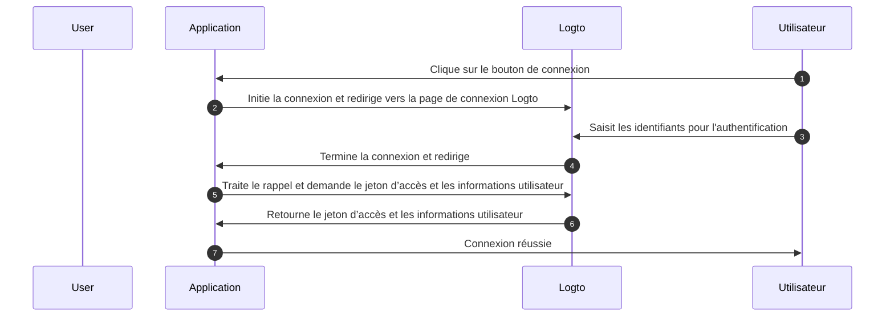
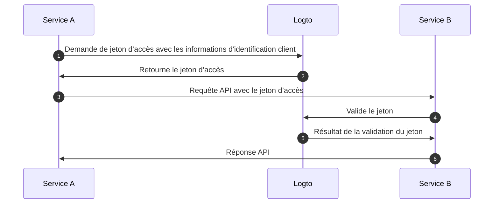
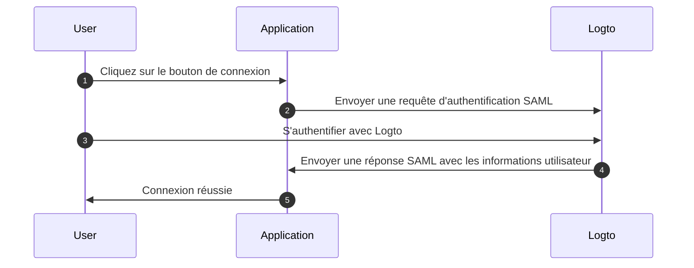

# Comprendre le flux d'authentification OIDC

Logto est basé sur les normes [OAuth 2.0](https://auth.wiki/oauth-2.0) et [OpenID Connect (OIDC)](https://auth.wiki/openid-connect). Comprendre ces normes d'authentification rendra le processus d'intégration plus fluide et plus simple.

### Flux d'authentification utilisateur \{#user-authentication-flow}

Voici ce qui se passe lorsqu'un utilisateur se connecte avec Logto :

Dans ce flux, plusieurs concepts clés sont essentiels pour le processus d'intégration :

- `Application` : Cela représente votre application dans Logto. Vous créerez une configuration d'application dans la Console Logto pour établir une connexion entre votre application réelle et les services Logto. En savoir plus sur [Application](/integrate-logto/application-data-structure/#introduction).
- `Redirect URI` : Après que les utilisateurs aient terminé l'authentification sur la page de connexion Logto, Logto les redirige vers votre application via cet URI. Vous devrez configurer l'URI de redirection dans les paramètres de votre application. Pour plus de détails, voir [Redirect URIs](/integrate-logto/application-data-structure/#redirect-uris).
- `Handle sign-in callback` : Lorsque Logto redirige les utilisateurs vers votre application, votre application doit traiter les données d'authentification et demander des jetons d’accès et des informations utilisateur. Ne vous inquiétez pas - le SDK Logto gère cela automatiquement.

Cette vue d'ensemble couvre l'essentiel pour une intégration rapide. Pour une compréhension plus approfondie, consultez notre guide [Expérience de connexion expliquée](/concepts/sign-in-experience/).

### Flux d'authentification machine à machine \{#machine-to-machine-authentication-flow}

Logto fournit un type d'[application machine à machine (M2M)](/quick-starts/m2m) pour permettre une authentification directe entre services, basée sur le [flux des informations d'identification client OAuth 2.0](https://auth.wiki/client-credentials-flow) :

Ce flux d'authentification machine à machine (M2M) est conçu pour les applications qui doivent communiquer directement avec des ressources sans interaction utilisateur (donc sans interface utilisateur), comme un service API mettant à jour des données utilisateur dans Logto ou un service de statistiques récupérant les commandes quotidiennes.

Dans ce flux, les services s'authentifient en utilisant des informations d'identification client - une combinaison d'[ID d'application](/integrate-logto/application-data-structure/#application-id) et de [Secret d'application](/integrate-logto/application-data-structure/#application-secret) qui identifie et authentifie de manière unique le service. Ces informations d'identification servent d'identité du service lors de la demande de [jetons d’accès](https://auth.wiki/access-token) auprès de Logto.

### Flux d'authentification SAML \{#saml-authentication-flow}

En plus de OAuth 2.0 et OIDC, Logto prend également en charge l'authentification SAML (Security Assertion Markup Language), agissant en tant que Fournisseur d'Identité (IdP) pour permettre l'intégration avec des applications d'entreprise. Actuellement, Logto prend en charge le flux d'authentification initié par le SP :

#### Flux initié par le SP \{#saml-authentication-flow-sp-init}

Dans le flux initié par le SP, le processus d'authentification commence à partir du Fournisseur de Services (votre application) :

Dans ce flux :

- L'utilisateur commence le processus d'authentification depuis votre application (Fournisseur de Services)
- Votre application génère une requête SAML et redirige l'utilisateur vers Logto (Fournisseur d'Identité)
- Après une authentification réussie chez Logto, une réponse SAML est renvoyée à votre application
- Votre application traite la réponse SAML et complète l'authentification

#### Flux initié par l'IdP \{#saml-authentication-flow-idp-init}

Logto prendra en charge le flux initié par l'IdP dans les futures versions, permettant aux utilisateurs de commencer le processus d'authentification directement depuis le portail de Logto. Restez à l'écoute pour les mises à jour sur cette fonctionnalité.

Cette intégration SAML permet aux applications d'entreprise de tirer parti de Logto en tant que fournisseur d'identité, prenant en charge à la fois les fournisseurs de services modernes et basés sur SAML hérités.

## Ressources associées \{#related-resources}

<Url href="https://blog.logto.io/secure-cloud-apps-with-oauth-and-openid-connect">
  Blog : Sécuriser les applications basées sur le cloud avec OAuth 2.0 et OpenID Connect
</Url>

<Url href="https://blog.logto.io/sso-is-better">
  Pourquoi l'authentification unique (SSO) pour plusieurs applications est meilleure
</Url>

<Url href="https://blog.logto.io/centralized-identity-system">
  Pourquoi vous avez besoin d'un système d'identité centralisé pour une entreprise
  multi-applications
</Url>
