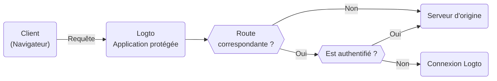

# Application protégée

L'Application protégée est conçue pour éliminer la complexité des [intégrations SDK](/quick-starts) en séparant la couche [d'authentification](https://auth.wiki/authentication) de votre application. Nous gérons l'authentification, vous permettant de vous concentrer sur votre fonctionnalité principale. Une fois qu'un utilisateur est authentifié, l'Application protégée sert le contenu de votre serveur.

## Comment fonctionne l'Application protégée \{#how-protected-app-works}

L'Application protégée, propulsée par Cloudflare, fonctionne globalement sur des réseaux de périphérie, garantissant une faible latence et une haute disponibilité pour votre application.

L'Application protégée maintient l'état de la session et les informations de l'utilisateur. Si un utilisateur n'est pas authentifié, l'Application protégée le redirige vers la page de connexion. Une fois authentifié, l'Application protégée enveloppe la requête de l'utilisateur avec l'authentification et les informations de l'utilisateur, puis la transmet au serveur d'origine.

Ce processus est visualisé dans le diagramme de flux suivant :



## Protéger votre serveur d'origine \{#protect-your-origin-server}

Le serveur d'origine, qui peut être un dispositif physique ou virtuel non possédé par l'Application protégée de Logto, est l'endroit où réside le contenu de votre application. Semblable à un serveur de réseau de diffusion de contenu (CDN), l'Application protégée gère les processus d'authentification et récupère le contenu de votre serveur d'origine. Par conséquent, si les utilisateurs accèdent directement à votre serveur d'origine, ils peuvent contourner l'authentification et votre application n'est plus protégée.

Il est donc important de sécuriser les connexions d'origine, cela empêche les attaquants de découvrir et d'accéder à votre serveur d'origine sans authentification. Il existe plusieurs façons de le faire :

1. Validation des en-têtes HTTP
2. Validation des JSON Web Tokens (JWT)

### Validation des en-têtes HTTP \{#http-header-validation}

Sécuriser votre serveur d'origine peut être réalisé en utilisant [l'authentification de base HTTP](https://developer.mozilla.org/en-US/docs/Web/HTTP/Authentication#basic_authentication_scheme) pour sécuriser votre serveur d'origine.

Chaque requête de l'Application protégée inclut l'en-tête suivant :

```
Authorization: Basic base64(appId:appSecret)
```

En validant cet en-tête, vous pouvez confirmer que la requête provient de l'Application protégée et refuser toute requête qui n'inclut pas cet en-tête.

Si vous utilisez Nginx ou Apache, vous pouvez vous référer aux guides suivants pour implémenter l'authentification de base HTTP sur votre serveur d'origine :

1. Nginx : [Configurer l'authentification de base HTTP](https://docs.nginx.com/nginx/admin-guide/security-controls/configuring-http-basic-authentication/)
2. Apache : [Authentification et autorisation](https://httpd.apache.org/docs/2.4/howto/auth.html)

Pour vérifier les en-têtes dans votre application, consultez l'[exemple d'authentification de base HTTP](https://developers.cloudflare.com/workers/examples/basic-auth/) fourni par Cloudflare pour apprendre à restreindre l'accès en utilisant le schéma d'authentification de base HTTP.

### Validation des JSON Web Tokens (JWT) \{#json-web-tokens-jwt-validation}

Une autre façon de sécuriser votre serveur d'origine est d'utiliser les JSON Web Tokens (JWT).

Chaque requête authentifiée de l'Application protégée inclut l'en-tête suivant :

```
Logto-ID-Token: <JWT>
```

Le JWT est appelé [Jeton d’identifiant (ID Token)](https://auth.wiki/id-token) qui est signé par Logto et contient des informations sur l'utilisateur. En validant ce JWT, vous pouvez confirmer que la requête provient de l'Application protégée et refuser toute requête qui n'inclut pas cet en-tête.

Le jeton est crypté et signé en tant que jeton [JWS](https://auth.wiki/jws).

Les étapes de validation :

1. [Validation d'un JWT](https://datatracker.ietf.org/doc/html/rfc7519#section-7.2)
2. [Validation de la signature JWS](https://datatracker.ietf.org/doc/html/rfc7515#section-5.2)
3. L'émetteur du jeton est `https://<your-logto-domain>/oidc` (émis par votre serveur d'authentification Logto)

```js
const express = require('express');
const jwksClient = require('jwks-rsa');
const jwt = require('jsonwebtoken');

const ISSUER = 'https://<your-logto-domain>/oidc';
const CERTS_URL = 'https://<your-logto-domain>/oidc/jwks';

const client = jwksClient({
  jwksUri: CERTS_URL,
});

const getKey = (header, callback) => {
  client.getSigningKey(header.kid, function (err, key) {
    callback(err, key?.getPublicKey());
  });
};

const verifyToken = (req, res, next) => {
  const token = req.headers['Logto-ID-Token'];

  // Assurez-vous que la requête entrante a notre en-tête de jeton
  if (!token) {
    return res
      .status(403)
      .send({ status: false, message: 'en-tête Logto-ID-Token requis manquant' });
  }

  jwt.verify(token, getKey, { issuer: ISSUER }, (err, decoded) => {
    if (err) {
      return res.status(403).send({ status: false, message: 'jeton d’identifiant invalide' });
    }

    req.user = decoded;
    next();
  });
};

const app = express();

app.use(verifyToken);

app.get('/', (req, res) => {
  res.send('Bonjour le monde !');
});

app.listen(3000);
```

## Obtenir l'état d'authentification et les informations de l'utilisateur \{#get-authentication-state-and-user-information}

Si vous avez besoin d'obtenir l'authentification et les informations de l'utilisateur pour votre application, vous pouvez également utiliser l'en-tête `Logto-ID-Token`.

Si vous souhaitez uniquement décoder le jeton, vous pouvez utiliser le code suivant :

```js
const express = require('express');

const decodeIdToken = (req, res, next) => {
  const token = req.headers['Logto-ID-Token'];

  if (!token) {
    return res.status(403).send({
      status: false,
      message: 'en-tête Logto-ID-Token requis manquant',
    });
  }

  const parts = token.split('.');
  if (parts.length !== 3) {
    throw new Error('Jeton d’identifiant invalide');
  }

  const payload = parts[1];
  const decodedPayload = atob(payload.replace(/-/g, '+').replace(/_/g, '/'));
  const claims = JSON.parse(decodedPayload);

  req.user = claims;
  next();
};

const app = express();

app.use(decodeIdToken);

app.get('/', (req, res) => {
  res.json(req.user);
});

app.listen(3000);
```

## Obtenir l'hôte d'origine \{#get-the-original-host}

Si vous avez besoin d'obtenir l'hôte d'origine demandé par le client, vous pouvez utiliser l'en-tête `Logto-Host` ou `x-forwarded-host`.

## Personnaliser les règles d'authentification \{#customize-authentication-rules}

Par défaut, l'Application protégée protégera toutes les routes. Si vous avez besoin de personnaliser les règles d'authentification, vous pouvez définir le champ "Règles d'authentification personnalisées" dans la Console.

Il prend en charge les expressions régulières, voici deux scénarios de cas :

1. Pour ne protéger que les routes `/admin` et `/privacy` avec authentification : `^/(admin|privacy)/.*`
2. Pour exclure les images JPG de l'authentification : `^(?!.*\.jpg$).*$`

## Développement local \{#local-development}

L'Application protégée est conçue pour fonctionner avec votre serveur d'origine. Cependant, si votre serveur d'origine n'est pas accessible publiquement, vous pouvez utiliser un outil comme [ngrok](https://ngrok.com/) ou [Cloudflare Tunnels](https://developers.cloudflare.com/pages/how-to/preview-with-cloudflare-tunnel/) pour exposer votre serveur local à Internet.

## Transition vers l'intégration SDK \{#transition-to-sdk-integration}

L'Application protégée est conçue pour simplifier le processus d'authentification. Cependant, si vous décidez de passer à l'intégration SDK pour un meilleur contrôle et une personnalisation, vous pouvez [créer une nouvelle application](/integrate-logto/integrate-logto-into-your-application) dans Logto et configurer l'[intégration SDK](/quick-starts). Et pour une transition en douceur, vous pouvez réutiliser les configurations d'application de l'Application protégée. L'Application protégée est en fait une "Application Web traditionnelle" dans Logto, vous pouvez trouver l'["AppId](/integrate-logto/application-data-structure#application-id)" et l'["AppSecret](/integrate-logto/application-data-structure#application-secret)" dans les paramètres de l'application. Une fois la transition terminée, vous pouvez supprimer l'Application protégée de votre application.

## Ressources connexes \{#related-resources}

<Url href="https://www.youtube.com/watch?v=ZBrXW3iZyKY">
  Application protégée : Construisez l'authentification de votre application en quelques clics.
  Aucun code requis.
</Url>

<Url href="https://blog.logto.io/protected-app">La motivation derrière l'Application protégée</Url>

<Url href="https://blog.logto.io/fastest-way-to-build-auth-system">
  La façon la plus rapide de construire un système d'authentification
</Url>
