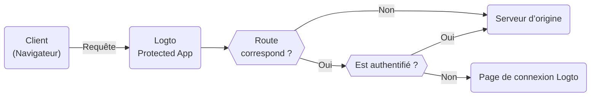

# Protected App — Intégration d’authentification sans SDK

Le Protected App est conçu pour éliminer la complexité des [intégrations SDK](/quick-starts) en séparant la couche d’[authentification](https://auth.wiki/authentication) de votre application. Nous gérons l’authentification, vous permettant de vous concentrer sur votre fonctionnalité principale. Une fois qu’un utilisateur est authentifié, le Protected App sert le contenu depuis votre serveur.

## Fonctionnement du Protected App \{#how-protected-app-works}

Le Protected App, propulsé par Cloudflare, fonctionne globalement sur des réseaux edge, garantissant une faible latence et une haute disponibilité pour votre application.

Le Protected App maintient l’état de session et les informations utilisateur. Si un utilisateur n’est pas authentifié, le Protected App le redirige vers la page de connexion. Une fois authentifié, le Protected App encapsule la requête de l’utilisateur avec les informations d’authentification et d’utilisateur, puis la transmet au serveur d’origine.

Pour restreindre quels utilisateurs authentifiés peuvent accéder à un Protected App, configurez le [contrôle d’accès au niveau de l’application](/authorization/app-level-access-control) dans l’onglet **Règles** de l’application.

Ce processus est visualisé dans le diagramme de flux suivant :


```mermaid
graph LR
  A("Client<br/>(Navigateur)") -->|Requête| B(Logto<br/>Protected App)
  B --> Condition{{Route<br/>correspond ?}}
  Condition -->|Oui| Matched{{Est authentifié ?}}
  Matched -->|Oui| C(Serveur d’origine)
  Matched -->|Non| D(Page de connexion Logto)
  Condition -->|Non| C
```

## Protéger votre serveur d’origine \{#protect-your-origin-server}

Le serveur d’origine, qui peut être un appareil physique ou virtuel n’appartenant pas au Protected App de Logto, est l’endroit où réside le contenu de votre application. À l’instar d’un serveur de Content Delivery Network (CDN), le Protected App gère les processus d’authentification et récupère le contenu depuis votre serveur d’origine. Par conséquent, si des utilisateurs accèdent directement à votre serveur d’origine, ils peuvent contourner l’authentification et votre application n’est plus protégée.

Il est donc important de sécuriser les connexions à l’origine, cela empêche les attaquants de découvrir et d’accéder à votre serveur d’origine sans authentification. Il existe plusieurs façons de le faire :

1. Validation d’en-tête HTTP
2. Validation de JSON Web Tokens (JWT)

### Validation d’en-tête HTTP \{#http-header-validation}

Sécuriser votre serveur d’origine peut être réalisé en utilisant [l’authentification HTTP Basic](https://developer.mozilla.org/en-US/docs/Web/HTTP/Authentication#basic_authentication_scheme).

Chaque requête provenant du Protected App inclut l’en-tête suivant :

```
Authorization: Basic base64(appId:appSecret)
```

En validant cet en-tête, vous pouvez confirmer que la requête provient du Protected App et refuser toute requête qui n’inclut pas cet en-tête.

Si vous utilisez Nginx ou Apache, vous pouvez consulter les guides suivants pour mettre en place l’authentification HTTP Basic sur votre serveur d’origine :

1. Nginx : [Configurer l’authentification HTTP Basic](https://docs.nginx.com/nginx/admin-guide/security-controls/configuring-http-basic-authentication/)
2. Apache : [Authentification et Autorisation](https://httpd.apache.org/docs/2.4/howto/auth.html)

Pour vérifier les en-têtes dans votre application, consultez l’[exemple d’authentification HTTP Basic](https://developers.cloudflare.com/workers/examples/basic-auth/) fourni par Cloudflare pour apprendre à restreindre l’accès en utilisant le schéma HTTP Basic.

### Validation de JSON Web Tokens (JWT) \{#json-web-tokens-jwt-validation}

Une autre façon de sécuriser votre serveur d’origine est d’utiliser des JSON Web Tokens (JWT).

Chaque requête authentifiée provenant du Protected App inclut l’en-tête suivant :

```
Logto-ID-Token: <JWT>
```

Le JWT est appelé [Jeton d’identifiant (ID Token)](https://auth.wiki/id-token) qui est signé par Logto et contient des informations utilisateur. En validant ce JWT, vous pouvez confirmer que la requête provient du Protected App et refuser toute requête qui n’inclut pas cet en-tête.

Le jeton est chiffré et signé en tant que jeton [JWS](https://auth.wiki/jws).

Les étapes de validation :

1. [Valider un JWT](https://datatracker.ietf.org/doc/html/rfc7519#section-7.2)
2. [Valider la signature JWS](https://datatracker.ietf.org/doc/html/rfc7515#section-5.2)
3. L’émetteur du jeton est `https://<your-logto-domain>/oidc` (émis par votre serveur d’authentification Logto)

```js
const express = require('express');
const jwksClient = require('jwks-rsa');
const jwt = require('jsonwebtoken');

const ISSUER = 'https://<your-logto-domain>/oidc';
const CERTS_URL = 'https://<your-logto-domain>/oidc/jwks';

const client = jwksClient({
  jwksUri: CERTS_URL,
});

const getKey = (header, callback) => {
  client.getSigningKey(header.kid, function (err, key) {
    callback(err, key?.getPublicKey());
  });
};

const verifyToken = (req, res, next) => {
  const token = req.headers['Logto-ID-Token'];

  // Assurez-vous que la requête entrante possède notre en-tête de jeton
  if (!token) {
    return res
      .status(403)
      .send({ status: false, message: 'en-tête Logto-ID-Token requis manquant' });
  }

  jwt.verify(token, getKey, { issuer: ISSUER }, (err, decoded) => {
    if (err) {
      return res.status(403).send({ status: false, message: 'jeton d’identifiant invalide' });
    }

    req.user = decoded;
    next();
  });
};

const app = express();

app.use(verifyToken);

app.get('/', (req, res) => {
  res.send('Hello World!');
});

app.listen(3000);
```

## Obtenir l’état d’authentification et les informations utilisateur \{#get-authentication-state-and-user-information}

Si vous avez besoin d’obtenir l’état d’authentification et les informations utilisateur pour votre application, vous pouvez également utiliser l’en-tête `Logto-ID-Token`.

Si vous souhaitez simplement décoder le jeton, vous pouvez utiliser le code suivant :

```js
const express = require('express');

const decodeIdToken = (req, res, next) => {
  const token = req.headers['Logto-ID-Token'];

  if (!token) {
    return res.status(403).send({
      status: false,
      message: 'en-tête Logto-ID-Token requis manquant',
    });
  }

  const parts = token.split('.');
  if (parts.length !== 3) {
    throw new Error('Jeton d’identifiant invalide');
  }

  const payload = parts[1];
  const decodedPayload = atob(payload.replace(/-/g, '+').replace(/_/g, '/'));
  const claims = JSON.parse(decodedPayload);

  req.user = claims;
  next();
};

const app = express();

app.use(decodeIdToken);

app.get('/', (req, res) => {
  res.json(req.user);
});

app.listen(3000);
```

## Personnaliser les revendications du jeton d’identifiant \{#customize-id-token-claims}

Par défaut, l’en-tête `Logto-ID-Token` inclut les revendications OIDC standard (par exemple `sub`, `name` et `email`). Pour inclure des [revendications étendues](/developers/custom-id-token#extended-claims) telles que les rôles ou les données d’organisation, les deux éléments suivants doivent être configurés :

1. **Bascule du locataire** : Activez la revendication dans <CloudLink to="/customize-jwt">Console > Custom JWT > ID token</CloudLink>.
2. **Scopes du Protected App** : Dans les paramètres de votre Protected App, sélectionnez le scope correspondant sous **ID token claims** > **Additional scopes**.

Les revendications étendues sont incluses dans le jeton d’identifiant transmis uniquement lorsque la revendication est activée dans Custom JWT et que le scope correspondant est sélectionné pour le Protected App. Voir [Jeton d’identifiant personnalisé](/developers/custom-id-token) pour la liste complète des scopes et revendications étendus.

| Portée (Scope)                       | Revendications (Claims)              |
| ------------------------------------ | ------------------------------------ |
| `custom_data`                        | `custom_data`                        |
| `identities`                         | `identities`, `sso_identities`       |
| `roles`                              | `roles`                              |
| `urn:logto:scope:organizations`      | `organizations`, `organization_data` |
| `urn:logto:scope:organization_roles` | `organization_roles`                 |

## Obtenir l’hôte d’origine \{#get-the-original-host}

Si vous avez besoin d’obtenir l’hôte d’origine demandé par le client, vous pouvez utiliser l’en-tête `Logto-Host` ou `x-forwarded-host`.

## Personnaliser les règles d’authentification \{#customize-authentication-rules}

Par défaut, le Protected App protège toutes les routes. Si vous souhaitez personnaliser les règles d’authentification, vous pouvez définir le champ "Règles d’authentification personnalisées" dans la Console.

Il prend en charge les expressions régulières, voici deux scénarios d’utilisation :

1. Pour ne protéger que les routes `/admin` et `/privacy` avec authentification : `^/(admin|privacy)/.*`
2. Pour exclure les images JPG de l’authentification : `^(?!.*\.jpg$).*$`

## Développement local \{#local-development}

Le Protected App est conçu pour fonctionner avec votre serveur d’origine. Cependant, si votre serveur d’origine n’est pas accessible publiquement, vous pouvez utiliser un outil comme [ngrok](https://ngrok.com/) ou [Cloudflare Tunnels](https://developers.cloudflare.com/pages/how-to/preview-with-cloudflare-tunnel/) pour exposer votre serveur local à Internet.

## Transition vers une intégration SDK \{#transition-to-sdk-integration}

Le Protected App est conçu pour simplifier le processus d’authentification. Cependant, si vous décidez de passer à une intégration SDK pour un meilleur contrôle et une personnalisation accrue, vous pouvez [créer une nouvelle application](/integrate-logto/integrate-logto-into-your-application) dans Logto et configurer l’[intégration SDK](/quick-starts). Pour une transition en douceur, vous pouvez réutiliser les configurations d’application du Protected App. Le Protected App est en réalité une "Application Web Traditionnelle" dans Logto, vous pouvez trouver l’"[AppId](/integrate-logto/application-data-structure#application-id)" et l’"[AppSecret](/integrate-logto/application-data-structure#application-secret)" dans les paramètres de l’application. Une fois la transition terminée, vous pouvez retirer le Protected App de votre application.

## Ressources associées \{#related-resources}

<Url href="https://www.youtube.com/watch?v=ZBrXW3iZyKY">
  Protected App : construisez l’authentification de votre application en quelques clics. Aucun code
  requis.
</Url>

<Url href="https://blog.logto.io/protected-app">La motivation derrière Protected App</Url>

<Url href="https://blog.logto.io/fastest-way-to-build-auth-system">
  La manière la plus rapide de construire un système d’authentification
</Url>
