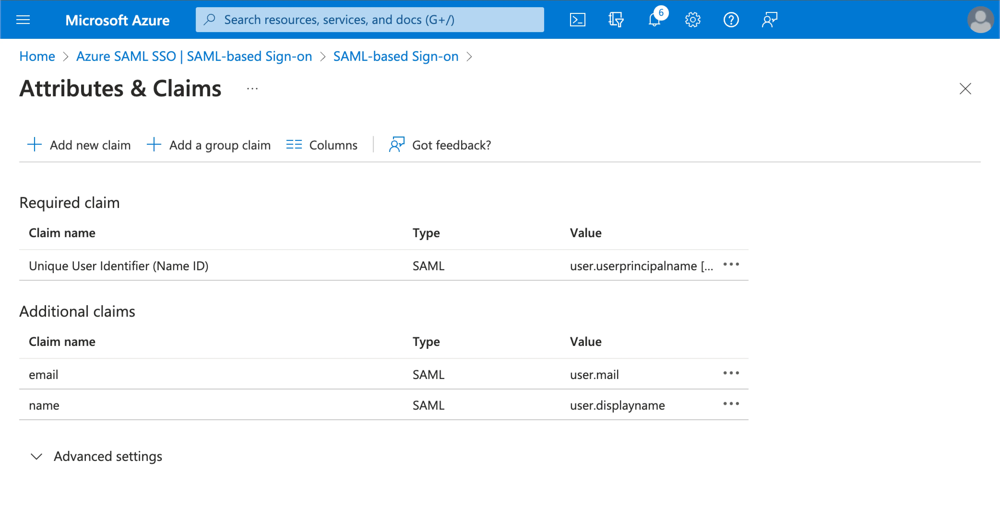

import GuideTip from '../../fragments/_sso_guide_tip.mdx';

# Configurer l'authentification unique avec Microsoft Entra ID (SAML)

Avec un minimum d'efforts de configuration, ce connecteur permet l'intégration avec Microsoft Entra ID (anciennement Azure AD) pour le SSO d'entreprise.

<GuideTip />

## Étape 1 : Créer une application SSO Azure AD \{#step-1-create-an-azure-ad-sso-application}

Initiez l'intégration SSO Azure AD en créant une application SSO du côté Azure AD.

1. Allez sur le [portail Azure](https://portal.azure.com/) et connectez-vous en tant qu'administrateur.
2. Sélectionnez le service `Microsoft Entra ID`.
3. Naviguez vers les `Applications d'entreprise` à l'aide du menu latéral. Cliquez sur `Nouvelle application`, et sélectionnez `Créer votre propre application`.

1. Entrez le nom de l'application et sélectionnez `Intégrer toute autre application que vous ne trouvez pas dans la galerie (Non-galerie)`.
2. Sélectionnez `Configurer l'authentification unique` > `SAML`.

1. Suivez les instructions, comme première étape, vous devrez remplir la configuration SAML de base en utilisant les informations suivantes fournies par Logto.

- **URI d'audience (ID d'entité SP)** : Il représente un identifiant globalement unique pour votre service Logto, fonctionnant comme l'EntityId pour SP lors des requêtes d’authentification vers le fournisseur d’identité (IdP). Cet identifiant est essentiel pour l'échange sécurisé des assertions SAML et d'autres données liées à l'authentification entre l'IdP et Logto.
- **URL ACS** : L'URL du service consommateur d'assertions (ACS) est l'emplacement où l'assertion SAML est envoyée avec une requête POST. Cette URL est utilisée par l'IdP pour envoyer l'assertion SAML à Logto. Elle agit comme une URL de rappel où Logto s'attend à recevoir et consommer la réponse SAML contenant les informations d'identité de l'utilisateur.

Cliquez sur `Enregistrer` pour continuer.

## Étape 2 : Configurer le SSO SAML chez Logto \{#step-2-configure-saml-sso-at-logto}

Pour que l'intégration SSO SAML fonctionne, vous devrez fournir les métadonnées de l'IdP à Logto. Revenons du côté de Logto et naviguons vers l'onglet `Connexion` de votre connecteur SSO Azure AD.

Logto propose trois manières différentes de configurer les métadonnées de l'IdP. La manière la plus simple est de fournir l'`URL des métadonnées` de l'application SSO Azure AD.

Copiez l'`URL des métadonnées de fédération de l'application` de la section `Certificats SAML` de votre application SSO Azure AD et collez-la dans le champ `URL des métadonnées` dans Logto.

Logto récupérera les métadonnées à partir de l'URL et configurera automatiquement l'intégration SSO SAML.

## Étape 3 : Configurer le mapping des attributs utilisateur \{#step-3-configure-user-attributes-mapping}

Logto offre un moyen flexible de mapper les attributs utilisateur renvoyés par l'IdP aux attributs utilisateur dans Logto. Logto synchronisera par défaut les attributs utilisateur suivants de l'IdP :

- id : L'identifiant unique de l'utilisateur. Logto lira la revendication `nameID` de la réponse SAML comme identifiant d'identité SSO de l'utilisateur.
- email : L'adresse e-mail de l'utilisateur. Logto lira la revendication `email` de la réponse SAML comme e-mail principal de l'utilisateur par défaut.
- name : Le nom de l'utilisateur.

Vous pouvez gérer la logique de mapping des attributs utilisateur soit du côté Azure AD, soit du côté Logto.

1. Mapper les attributs utilisateur AzureAD aux attributs utilisateur Logto du côté Logto.

   Visitez la section `Attributs et revendications` de votre application SSO Azure AD.

   Copiez les noms d'attributs suivants (avec le préfixe de l'espace de noms) et collez-les dans les champs correspondants dans Logto.

   - `http://schemas.xmlsoap.org/ws/2005/05/identity/claims/emailaddress`
   - `http://schemas.xmlsoap.org/ws/2005/05/identity/claims/name` (Recommandation : mettez à jour cette carte de valeur d'attribut à `user.displayname` pour une meilleure expérience utilisateur)

1. Mapper les attributs utilisateur AzureAD aux attributs utilisateur Logto du côté AzureAD.

   Visitez la section `Attributs et revendications` de votre application SSO Azure AD.

   Cliquez sur `Modifier`, et mettez à jour les champs `Revendiquer des revendications supplémentaires` en fonction des paramètres des attributs utilisateur Logto :

   - mettez à jour la valeur du nom de revendication en fonction des paramètres des attributs utilisateur Logto.
   - supprimez le préfixe de l'espace de noms.
   - cliquez sur `Enregistrer` pour continuer.

   Vous devriez finir avec les paramètres suivants :

Vous pouvez également spécifier des attributs utilisateur supplémentaires du côté Azure AD. Logto conservera un enregistrement des attributs utilisateur originaux renvoyés par l'IdP sous le champ `sso_identity` de l'utilisateur.

## Étape 4 : Assigner des utilisateurs à l'application SSO Azure AD \{#step-4-assign-users-to-the-azure-ad-sso-application}

Visitez la section `Utilisateurs et groupes` de votre application SSO Azure AD. Cliquez sur `Ajouter un utilisateur/groupe` pour assigner des utilisateurs à l'application SSO Azure AD. Seuls les utilisateurs assignés à votre application SSO Azure AD pourront s'authentifier via le connecteur SSO Azure AD.

## Étape 5 : Définir les domaines de messagerie et activer le connecteur SSO \{#step-5-set-email-domains-and-enable-the-sso-connector}

Fournissez les `domaines de messagerie` de votre organisation dans l'onglet `Expérience SSO` du connecteur Logto. Cela activera le connecteur SSO comme méthode d'authentification pour ces utilisateurs.

Les utilisateurs avec des adresses e-mail dans les domaines spécifiés seront redirigés pour utiliser le connecteur SSO SAML comme seule méthode d'authentification.

Veuillez consulter la [documentation](https://learn.microsoft.com/en-us/entra/identity/enterprise-apps/add-application-portal-setup-sso) officielle d'Azure AD pour plus de détails sur l'intégration SSO Azure AD.
